# Skill 介绍合集（根目录全部 MD 合并）

共合并 79 个 MD 文件：README, XHS_Business_Idea_Validator, amazon-analyse, amazon-listing-alexa-optimizer, amazon-listing-builder, amazon-skill, apiz-use, apiz, boardgame-io, brickMosaic, brightdata-research, category-selection, claude-agent-sdk, claude-data-analysis, course-site-skill, deep-research-agent, deepseek-v4-flash-vision-rag, deepseek-v4-flash-vision-video-rag, directing-xiaohei-videos, ecom-details-image, ecom-video-seedance-prompt, edu-analytic-geometry, edu-chem-reaction, edu-chem-tutorial, edu-physics-3d, edu-physics, edu-plane-geometry, edu-sci-viz, edu-solid-geometry, exa-company-research, exa-foreign-trade-research, facebook-ads-analyzer, fastmoss-rpa, flue-framework, game-gameability, geo-content-optimizer, geo-optimizer, geolook, geometry-math-proof-remotion, glm-5.3-flash-vision-rag, glm-5.3-flash-vision-video-rag, glm-ecom-video-seedance-prompt, hyperframes-video-spec-builder, i18n-helper-skills, ian-xiaohei-illustrations, keyword-research, liurun-bookwriter, luozhenyu-bookwriter, make-prompt-seedance2, market-insight, math-concept-film, mathigon-skill, paper-cutout-remotion, pindou-pattern, podcast-shorts-remotion, product-research, reddit-business-idea-validator, resume-matcher, review-analysis, seedance2-storyboard, sellersprite-amazon-research, sellersprite-rpa, sif-amazon-research, simple-review-analyzer, sorftime-rpa, sprite-gen, staticshield, stem-illustration, stock-deep-research, story-handdrawn-remotion, story-handdrawn-video, talking-head-remotion, tikhub-api-helper, wechat-article-remotion, wechat-writer, weekend-city-trip, whiteboard-explainer, xhs-business-validator, xiyou-insight

---

<!-- 来源: README.md -->

# 项目集合 · 通俗易懂介绍索引

本目录收录了 `E:\all-skill-t0` 这个 AI 技能项目集合中 **78 个项目** 的入门介绍，每篇都用大白话讲清楚"它能帮人解决什么问题、怎么用、谁适合用、以及它的边界在哪"。

> 说明：这批文章是面向"不懂技术的普通人"写的，刻意避免了术语堆砌。凡是"给做 AI 工具的人用的技能（skill）"，文中都明确标注了它不是双击打开的 App。

> **配图状态**：全部 78 篇文章均已配齐「小黑手绘」风格插图（共 156 张），图片存放在 `assets/<项目名>/01.png`、`02.png`，严格遵循 `ian-xiaohei-illustrations` 技能的视觉 DNA（纯白背景、黑色手绘线稿、小黑 IP 作为动作主体、少量红/橙/蓝批注）。

> **完整分类索引**：见 [index.html](index.html)。本文件是该索引的文本镜像，由 `build_site.py` 自动同步生成，请勿手改目录部分。

---

## 一、电商与广告类（20 篇）

- [你的亚马逊商品，AI 导购看得懂吗？](amazon-listing-alexa-optimizer.md) — amazon-listing-alexa-optimizer
- [想在亚马逊上卖好货？这一整套 AI 选品运营助手能帮上忙](amazon-skill.md) — amazon-skill
- [想摸清亚马逊竞品底细？用 AI 一键出竞品情报报告](amazon-analyse.md) — amazon-analyse
- [想写出能打的亚马逊 Listing？让 AI 按新算法帮你打造](amazon-listing-builder.md) — amazon-listing-builder
- [这个类目值不值得进？用五维模型让 AI 帮你算清楚](category-selection.md) — category-selection
- [2000+ 关键词不会理？让 AI 帮你分类成能打的词库](keyword-research.md) — keyword-research
- [想选品却看不懂数据？让 AI 当你的选品分析师](product-research.md) — product-research
- [买家到底在骂什么？让 AI 从评论里挖出产品痛点](review-analysis.md) — review-analysis
- [想用卖家精灵做全链路调研？让 AI 替你调 43 个数据工具](sellersprite-amazon-research.md) — sellersprite-amazon-research
- [流量掉了查不出原因？让 AI 用 Sif 数据给你做根因诊断](sif-amazon-research.md) — sif-amazon-research
- [想透视竞品广告和流量？让 AI 用西柚洞察帮你拆](xiyou-insight.md) — xiyou-insight
- [想用几百种 AI 模型画图、做视频、配音，又不想一个个去注册？](apiz.md) — apiz
- [不懂代码也能让 AI 帮你做电商图、短视频和角色设计](apiz-use.md) — apiz-use
- [投了 Facebook 广告却看不懂数据？它帮你一眼分清好坏](facebook-ads-analyzer.md) — facebook-ads-analyzer
- [做 TikTok 电商想抄爆款、盯达人？它把榜单数据一键搬下来](fastmoss-rpa.md) — fastmoss-rpa
- [想挖亚马逊选品数据、查竞品，又嫌手动点太累？它一条命令全搞定](sellersprite-rpa.md) — sellersprite-rpa
- [想用 Sorftime 挖亚马逊数据，又不想一页页手抄？它一个入口抓 11 类](sorftime-rpa.md) — sorftime-rpa
- [刷到一条带货爆款视频，想让 AI 照着再来一条？](ecom-video-seedance-prompt.md) — ecom-video-seedance-prompt
- [同款带货爆款，换个引擎拆会更准吗？](glm-ecom-video-seedance-prompt.md) — glm-ecom-video-seedance-prompt
- [电商主图详情页，一套 Prompt 全搞定？](ecom-details-image.md) — ecom-details-image

## 二、市场与选题调研类（8 篇）

- [想摸清一家公司底细？让它去全网帮你挖](exa-company-research.md) — exa-company-research
- [想出海卖货？先让它帮你摸透目标国市场](exa-foreign-trade-research.md) — exa-foreign-trade-research
- [搞不清用户到底要啥？让它十分钟帮你把人看透](market-insight.md) — market-insight
- [想做个生意但怕没人买单？让 Reddit 上的真人帮你投票](reddit-business-idea-validator.md) — reddit-business-idea-validator
- [有个生意点子？先丢到小红书里看看大家买不买账](xhs-business-validator.md) — xhs-business-validator
- [那个最早的小红书生意验证器原版](XHS_Business_Idea_Validator.md) — XHS_Business_Idea_Validator
- [一堆电商差评好评看不过来？让它秒变读懂用户的产品参谋](simple-review-analyzer.md) — simple-review-analyzer
- [想让 AI 帮你抓全网数据做深度调研？](brightdata-research.md) — brightdata-research

## 三、教育科普与数学类（11 篇）

- [一道解析几何题，怎么变成能动手拖的网页](edu-analytic-geometry.md) — edu-analytic-geometry
- [化学反应到底怎么断键成键，让它变成能转着看的 3D 动画](edu-chem-reaction.md) — edu-chem-reaction
- [一节复杂的化学课，怎么变成能一步步播放的互动网页](edu-chem-tutorial.md) — edu-chem-tutorial
- [物理题里那些&quot;动起来&quot;的过程，怎么变成能拖滑块看的网页](edu-physics.md) — edu-physics
- [那些必须转着看的物理现象，怎么变成能旋转的 3D 网页](edu-physics-3d.md) — edu-physics-3d
- [三角形、四边形这些平面几何，怎么变成能拖着玩的网页](edu-plane-geometry.md) — edu-plane-geometry
- [一个科学现象，怎么变成手机电脑都能玩的单页互动实验](edu-sci-viz.md) — edu-sci-viz
- [立体几何题里那些角和距离，怎么变成能旋转的 3D 模型](edu-solid-geometry.md) — edu-solid-geometry
- [想动手做一套会互动的数学课本，该怎么上手](mathigon-skill.md) — mathigon-skill
- [一张科研/教学示意图，怎么让 AI 帮你画出来](stem-illustration.md) — stem-illustration
- [想讲清楚一个数学概念，能不能让 AI 直接拍部短片？](math-concept-film.md) — math-concept-film

## 四、视频与动画类（12 篇）

- [把数学证明做成动画视频，让公式自己&quot;长&quot;出来](geometry-math-proof-remotion.md) — geometry-math-proof-remotion
- [拍视频前脑袋一团乱？它帮你把想法聊成一份能直接开拍的方案](hyperframes-video-spec-builder.md) — hyperframes-video-spec-builder
- [想用 AI 生成短视频，但不会写提示词？它帮你写出能用的分镜](make-prompt-seedance2.md) — make-prompt-seedance2
- [想做有层次感的剪纸动画，又不会画画？它帮你把故事拆成会动的四层](paper-cutout-remotion.md) — paper-cutout-remotion
- [有一段播客音频，想快速变成竖屏短视频？它帮你秒出字幕版](podcast-shorts-remotion.md) — podcast-shorts-remotion
- [有段故事想变成手绘风视频？它让每句话被&quot;画&quot;三次](story-handdrawn-remotion.md) — story-handdrawn-remotion
- [想做会动的手绘蜡笔风短视频？它每段直接生成一段动画](story-handdrawn-video.md) — story-handdrawn-video
- [要做口播视频，又不想从零搭工程？它给你一套现成的模板](talking-head-remotion.md) — talking-head-remotion
- [有一篇公众号文章想变成视频？丢个链接就行](wechat-article-remotion.md) — wechat-article-remotion
- [想让 AI 画出「讲到哪画到哪」的白板讲解视频？](whiteboard-explainer.md) — whiteboard-explainer
- [想把小说做成多集 AI 短剧？](seedance2-storyboard.md) — seedance2-storyboard
- [想让一个黑色小家伙帮你把文章拍成短视频？](directing-xiaohei-videos.md) — directing-xiaohei-videos

## 五、写作与课程类（6 篇）

- [想写出&quot;刘润式&quot;有洞察的商业长文？让这个助手替你搭好骨架](liurun-bookwriter.md) — liurun-bookwriter
- [想写出&quot;罗振宇式&quot;有启发的好文章？这个助手帮你把金句和故事安排明白](luozhenyu-bookwriter.md) — luozhenyu-bookwriter
- [攒了一堆课程笔记却没地方展示？把它一键变成能看的课程网站](course-site-skill.md) — course-site-skill
- [想把网站或代码做成多语言？这两个助手一个管网页、一个管源码](i18n-helper-skills.md) — i18n-helper-skills
- [想认真运营公众号却卡在&quot;写+配图&quot;？这个助手从选题一路帮你写到出图](wechat-writer.md) — wechat-writer
- [文章写好了却愁配图？让&quot;小黑&quot;把你的观点画成清爽怪诞的手绘图](ian-xiaohei-illustrations.md) — ian-xiaohei-illustrations

## 六、研究与智能体框架类（10 篇）

- [丢个主题进去，自动给你吐出一份带引用的完整研究报告](deep-research-agent.md) — deep-research-agent
- [说一句&quot;帮我研究下茅台&quot;，它像投研团队一样给你出尽调报告](stock-deep-research.md) — stock-deep-research
- [想自己做个会&quot;动手干活&quot;的 AI 应用？这个工具包把底层都铺好了](claude-agent-sdk.md) — claude-agent-sdk
- [用 TypeScript 规规矩矩搭一个 AI 智能体，这套框架把套路都定好了](flue-framework.md) — flue-framework
- [你的&quot;游戏创意&quot;真的该做成游戏吗？这个守门员先帮你挡一道](game-gameability.md) — game-gameability
- [有一份几百页的 PDF，想随口提问？它让 AI 一页页&quot;看&quot;完再回答你](deepseek-v4-flash-vision-rag.md) — deepseek-v4-flash-vision-rag
- [一段视频里的事，想问 AI&quot;第几秒发生的&quot;？它让 AI 把视频看完再回答你](deepseek-v4-flash-vision-video-rag.md) — deepseek-v4-flash-vision-video-rag
- [让 AI 读完一本几百页的 PDF，还能告诉你答案在第几页？](glm-5.3-flash-vision-rag.md) — glm-5.3-flash-vision-rag
- [想问视频"这段动作到底怎么发生的"？让 AI 按秒给你答案](glm-5.3-flash-vision-video-rag.md) — glm-5.3-flash-vision-video-rag
- [拿到一堆订单数据不知道从哪下手？](claude-data-analysis.md) — claude-data-analysis

## 七、工具与杂项类（11 篇）

- [想把照片变成乐高像素画？交给它出拼搭说明书和零件清单](brickMosaic.md) — brickMosaic
- [想自己做一款棋牌或桌游？它帮你把规则写成能跑的游戏](boardgame-io.md) — boardgame-io
- [想抓抖音、小红书、TikTok 的数据？它帮你查接口、调接口](tikhub-api-helper.md) — tikhub-api-helper
- [想让 AI 搜索（ChatGPT、豆包等）推荐你的品牌？它帮你按&quot;AI 口味&quot;改内容](geo-optimizer.md) — geo-optimizer
- [给一个网址，它告诉你这页内容怎么改才容易被 AI 推荐](geo-content-optimizer.md) — geo-content-optimizer
- [做 GEO（让 AI 推荐你的产品）从诊断到交付，它一条龙包了](geolook.md) — geolook
- [不知道简历行不行、跟岗位匹不匹配？它像一个严格的 HR 帮你挑刺重写](resume-matcher.md) — resume-matcher
- [想给游戏做个会动的小角色？说一句话它帮你生成精灵图动画](sprite-gen.md) — sprite-gen
- [想给网页加个密码锁、只有知道密码的人能看？它把 HTML 加密成自解密页面](staticshield.md) — staticshield
- [下周末去哪个城市玩？它把一周末的活动、演出、美食、地铁全查齐](weekend-city-trip.md) — weekend-city-trip
- [把任意图片变成&quot;照着拼&quot;的拼豆图纸](pindou-pattern.md) — pindou-pattern

---

<!-- 来源: XHS_Business_Idea_Validator.md -->

# 那个最早的小红书生意验证器原版 —— XHS_Business_Idea_Validator 介绍

你有个生意点子，比如"在深圳卖陈皮"，想知道小红书上的人买不买账。前面那篇 xhs-business-validator 其实是从一个更早的"原版"项目改出来的技能版。这个 XHS_Business_Idea_Validator 就是那个原版——一个独立的小红书商业创意验证器。

**XHS_Business_Idea_Validator 就是来解决这件事的。** 你给它一个生意想法，它去小红书里搜相关笔记和评论，分析用户痛点和市场信号，最后给你一份带评分的验证报告，告诉你这个点子值不值得做。

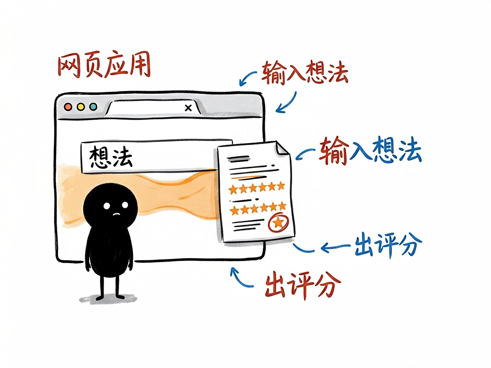

## 它到底能做什么

- 搜小红书笔记和评论：围绕你的想法，拉取相关的笔记内容和用户评论。
- 分析用户痛点：从大家的讨论里提炼真实需求、抱怨和没被满足的空档。
- 给市场信号打分：综合讨论热度、反馈和竞争情况，打出 0–100 的评估分。
- 生成验证报告：输出关键痛点、现有解决方案、市场机会和行动建议。
- 支持不同模式：轻量快速看和较完整的深度分析两套节奏可选。

## 怎么用

你不需要记任何命令。在 codex / workbuddy 等 agent 装好 XHS_Business_Idea_Validator 技能后，直接对 AI 说话就行：

**场景 1：验证一个点子**
你：帮我验证一下在深圳卖陈皮这个想法。
AI：它去小红书里拉相关笔记和评论，分析用户痛点和市场信号，最后给你一份带 0–100 评分的验证报告——关键痛点、现有方案、市场机会和行动建议都写清楚。

**场景 2：给品类找方向**
你：我想做针对宝妈的收纳内容，先看看小红书上有没有人需要。
AI：它搜一圈相关讨论，把真实需求和没被满足的空档挖出来，再打个分，帮你判断这个方向值不值得投入。

**场景 3：快速看个大概**
你：我有个小想法，先随手看看热度。
AI：它用轻量模式快速扫一遍，给你一个大致分数和几条关键讨论，帮你低成本试水温。

## 谁适合用

- 想在国内（小红书受众）试水小生意的人：先验证需求再投入。
- 做选品、账号定位、内容创作的人：看品类声量和真实痛点。
- 品牌方：快速摸清楚某个方向在小红书上的反馈。

## 一点说明

XHS_Business_Idea_Validator 是更早的网页应用原版，而 xhs-business-validator 是把同一套思路做成、能直接在 AI 助手对话里调用的"技能版"，两者高度同源。注意它只覆盖小红书这一个平台的数据，评分是方向性判断，不代表真实成交结果。

## 闲鱼接单文案

> 以下服务展示在闲鱼 / 淘宝服务市场发布，用于承接本 skill 的定制开发订单。

**标题：小红书商业创意验证器 skill软件开发**

**描述：**

专注 AI Agent 技能（skill）定制开发，已做出小红书商业创意验证器（网页应用原版），现成作品可先看演示再下单。围绕你的生意想法自动搜小红书笔记和评论，提炼真实需求、抱怨和没被满足的空档，综合讨论热度与竞争情况打出 0–100 评估分，输出关键痛点、现有方案、市场机会和行动建议，轻量 / 深度两套节奏可选。支持按你的品类做个性化定制，全部源码交付、支持二次开发。

**服务内容：**

- 1、需求沟通梳理：先聊清楚你的创意点子、验证深度（轻量快扫 / 深度分析）和数据来源配置，列明功能清单后再动手
- 2、skill交付内容和格式：0–100 市场信号评分、关键痛点、现有解决方案、市场机会与行动建议（验证报告，轻量 / 深度两档）
- 3、项目功能/系统开发：按你的品类定制分析框架与报告样式，可做成网页应用或改造为能在 AI 助手里直接调用的技能版
- 4、skill源码交付：SKILL.md 技能说明 + 提示词 / 脚本 / 模板 / 报告样例组成的完整技能工程，兼容 codex / workbuddy 等 agent。全部源码 + 安装部署说明 + 使用演示，交付后可自行修改维护

---

<!-- 来源: amazon-analyse.md -->

# 想摸清亚马逊竞品底细？用 AI 一键出竞品情报报告 —— amazon-analyse 介绍

做亚马逊，最怕"闭着眼睛跟对手打"——你不知道对手标题怎么埋词、评论里买家到底在骂什么、价格趋势往哪走。以前要天天盯榜单、翻评论、人工总结，费时又费脑。amazon-analyse 就是干这件事的：你丢一个 ASIN（商品编号）进去，它从价格、评分、关键词布局到评论情感，自动拉数据、做穿透分析，给你一份带结论的竞品情报报告。

## 它到底能做什么

- 产品基础分析：价格、评分、排名、销量等核心指标一眼看清。
- 关键词布局：对手的流量词、自然曝光、埋词逻辑全拆开。
- 评论情感分析：优势聚类、痛点挖掘、改进建议 Top 3。
- 市场动态：销量趋势、季节性波动、竞争格局扫描。
- 战略建议：关键词策略、定价建议、Listing 优化方向。
- 自动存档：分析完直接保存成 Markdown 报告，方便长期对比。

## 怎么用

你不需要记命令。装好技能后直接对 AI 说就行：

**场景 1：想摸清一个竞品**
你：帮我分析一下美国站这个商品（报上 ASIN），看看价格、评分、关键词和评论到底怎么样。
AI：它自动拉数据，生成一份竞品情报报告，把对手强项和软肋讲清楚，让你知道该跟还是该避。

**场景 2：多站点对比**
你：同一款产品，美国站、德国站、日本站分别表现如何？
AI：分别出三份报告，你一眼看出哪个站点更值得投入。

**场景 3：定期追踪**
你：每个月帮我复盘一次核心竞品。
AI：生成带日期的报告，你用 diff 就能看出对手这月的策略变化。

## 谁适合用

- 亚马逊卖家、运营、品牌战略官。
- 做竞品调研、代运营的分析团队。
- 想用数据而不是拍脑袋做决策的创业者。

## 一点说明

amazon-analyse 依赖第三方数据服务 Sorftime 的接口或登录态，没配上账号，分析就跑不起来。具体怎么配数据，以该技能目录下的 SKILL.md / README.md 为准。

## 闲鱼接单文案

> 以下服务展示在闲鱼 / 淘宝服务市场发布，用于承接本 skill 的定制开发订单。

**标题：亚马逊竞品穿透分析 skill软件开发**

**描述：**

专注 AI Agent 技能（skill）定制开发，已做出亚马逊竞品情报分析技能，现成作品可先看演示再下单。丢一个 ASIN（商品编号）进去，自动完成价格、评分、排名、关键词布局、评论情感、市场动态的穿透分析，输出带战略建议的竞品情报报告并自动存档。支持按你的站点和类目做个性化定制，交付后装进 codex / workbuddy 等 AI 助手即可使用，全部源码交付、支持二次开发。

**服务内容：**

- 1、需求沟通梳理：先聊清楚你要分析的竞品（ASIN 清单）和关注维度（价格 / 关键词 / 评论 / 趋势），确认 Sorftime 数据账号可用，列明功能清单后再动手
- 2、skill交付内容和格式：产品基础指标、关键词布局、评论情感与痛点、市场动态、关键词与定价战略建议等竞品情报成果（Markdown 报告，自动存档可长期对比）
- 3、项目功能/系统开发：按你的类目定制分析维度与报告模板，可扩展多站点对比、定期追踪复盘等功能的开发与联调
- 4、skill源码交付：SKILL.md 技能说明 + 提示词 / 脚本 / 模板 / 报告样例组成的完整技能工程，兼容 codex / workbuddy 等 agent。全部源码 + 安装部署说明 + 使用演示，交付后可自行修改维护

---

<!-- 来源: amazon-listing-alexa-optimizer.md -->

# 你的亚马逊商品，AI 导购看得懂吗？—— amazon-listing-alexa-optimizer 介绍

你在亚马逊上卖东西，买家现在可能不再自己翻页找货了——他们直接开口问语音助手："给我推荐一款适合欧洲旅行用的转换插头"。亚马逊在 2026 年正式上线了"Alexa for Shopping"（把 AI 购物助手整合进语音购物），也就是大家说的"AI 导购"。如果 AI 看不懂你的商品页，它就根本不会把你放进推荐里。更麻烦的是，2026 年亚马逊还改了规则：美国站标题被砍到最多 75 个字符，还新增了一个叫 Item Highlights 的字段。

**amazon-listing-alexa-optimizer 就是来解决这件事的。**

你给它一份亚马逊商品页（标题、五点描述、图片文案、后台属性等），它还你一份"体检报告"加"改写方案"——告诉你哪里 AI 看不懂、怎么改才容易被推荐。

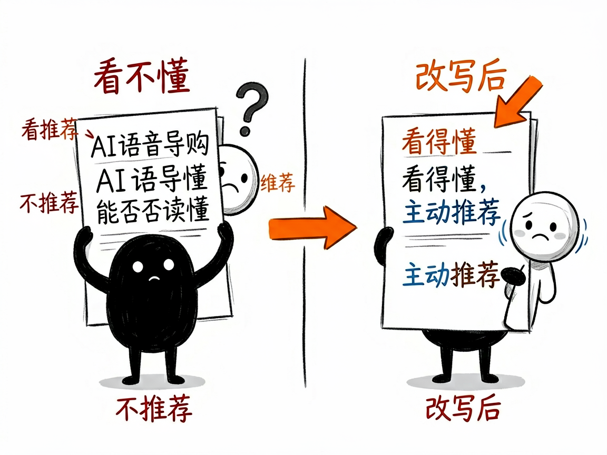

## 它到底能做什么

- 帮你做全面体检：从 8 个维度给商品页打分，包括标题、五点描述、新字段 Item Highlights、图片页（A+）、问答和评论、后台结构化属性、关键词布局等。
- 站在 AI 视角挑毛病：它会检查"AI 看完你的页，能不能回答四个问题——你到底是什么、适合谁和什么场景、解决什么具体问题、凭什么值得推荐"。回答不清，就难被推荐。
- 帮你写得更像"人话"：不再让你堆关键词，而是把卖点改成"回答问题"的写法，比如清楚写"支持哪些国家、带几个插孔、是否支持电压转换"。
- 给你新旧对照的改写示例：标题、Item Highlights、五点描述都给出改前改后，连字符数都帮你算好。
- 顺手排查五大常见误区：比如"拿到 Amazon's Choice 就一定被推荐""标题越短流量一定掉"这些想当然的坑。
- 给出一份 7 天落地清单：按轻重缓急告诉你先改什么、后改什么。

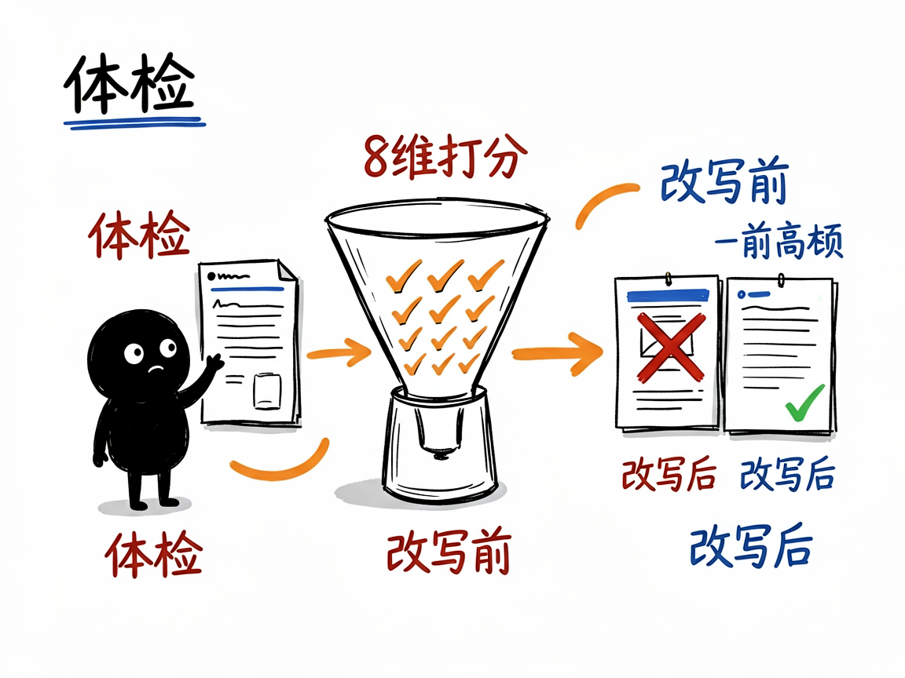

## 怎么用

你不需要记任何命令。在 codex / workbuddy 等 agent 装好 amazon-listing-alexa-optimizer 技能后，直接对 AI 说话就行：

**场景 1：刚上架一款转换插头**
你：帮我看看这个新品的亚马逊商品页，AI 导购能不能看懂、会不会把我推荐出去？
AI：它会从标题、五点、新字段等 8 个维度给商品页打分，指出 AI 看不懂的地方，并给你改前改后的写法，比如把"支持多国使用"改成清楚列出支持哪些国家、带几个插孔。

**场景 2：标题被新规砍短了不知道怎么改**
你：亚马逊说美国站标题最多 75 个字符，我原来的标题太长了，帮我重写得既能说清卖点又不超字数。
AI：它会帮你重写标题和 Item Highlights 字段，给出新旧对照，连字符数都算好，还顺手列出几个常见误区，避免你踩坑。

**场景 3：想按计划一步步优化**
你：我店里还有十几个老 Listing，给我一个先改哪个后改哪个的顺序。
AI：它会排出一份 7 天落地清单，按轻重缓急告诉你先改什么、后改什么，让你不用每天纠结从哪下手。

## 谁适合用

- 亚马逊美国站（及其他站点）的卖家、运营、Listing 优化师。
- 负责产品上架、商品页文案的跨境电商团队。
- 想提前适配"AI 购物"新规则的品牌方。
- 帮卖家做代运营、代写 Listing 的服务商。

## 一点说明

这个技能明确不承诺"改完一定被 Alexa 推荐"，因为亚马逊没有公开推荐算法的具体公式。所有建议都基于已经确认的变化（标题 75 字符新规、Item Highlights 字段、AI 广告入口等）。

另外，它不是一个普通人直接双击打开的 App，而是一个给 AI 助手（如 codex / workbuddy）用的"技能包"。你只要在 agent 里装好它，用自然语言把商品页内容交给它，它就会帮你做体检和改写。具体能力和最新规则以项目里的 SKILL.md 和 references 文档为准。

## 闲鱼接单文案

> 以下服务展示在闲鱼 / 淘宝服务市场发布，用于承接本 skill 的定制开发订单。

**标题：亚马逊Listing AI导购优化 skill软件开发**

**描述：**

专注 AI Agent 技能（skill）定制开发，已做出适配亚马逊 2026 新规（标题 75 字符上限、Item Highlights 新字段、Alexa AI 导购）的 Listing 优化技能，现成作品可先看演示再下单。从 8 个维度给商品页体检打分，输出改前改后的对照文案和 7 天落地清单。支持按你的品类和站点做个性化定制，交付后装进 codex / workbuddy 等 AI 助手即可使用，全部源码交付、支持二次开发。

**服务内容：**

- 1、需求沟通梳理：先聊清楚你的商品品类、目标站点和优化目标（体检、重写还是排期落地），确认商品页素材齐全，列明功能清单后再动手
- 2、skill交付内容和格式：8 维度体检评分报告、AI 视角问题诊断、标题 / Item Highlights / 五点描述的新旧对照改写文案、常见误区排查、7 天落地优先级清单（Markdown 文档）
- 3、项目功能/系统开发：按你的品类和站点定制评分维度与改写规则，可扩展批量体检、多 Listing 排期管理等功能的开发与联调
- 4、skill源码交付：SKILL.md 技能说明 + 提示词 / 脚本 / 模板 / 报告样例组成的完整技能工程，兼容 codex / workbuddy 等 agent。全部源码 + 安装部署说明 + 使用演示，交付后可自行修改维护

---

<!-- 来源: amazon-listing-builder.md -->

# 想写出能打的亚马逊 Listing？让 AI 按新算法帮你打造 —— amazon-listing-builder 介绍

做亚马逊，"堆关键词"的老办法正在失效。现在系统看的是语义、买家看的是答案、AI 助手看的是匹配度——你标题埋大词、五点写功能，转化反而上不去。amazon-listing-builder 就是来解决这个的：它按 Cosmo 语义算法和 Alexa/Rufus 对话式购物的新逻辑，用"先分析、再生成、最后校验"的工程化流程，把你的 Listing 从"关键词堆砌"升级成"语义覆盖 + 需求证据 + 答案型内容"。

## 它到底能做什么

- 八步工作流：关键词分层词库 → 用户问题库 → 卖点证据库 → 标题 → 五点 → 描述/A+ → Search Terms → QA。
- 多版本草稿：标题、五点、A+、QA 至少出 3 版可对比，不再一笔定稿。
- 四维校验：合规、关键词覆盖、语义覆盖、转化逻辑，四项报告把关。
- 真实案例内置：抗 UV 户外仿真植物、down filled pillows QA 等可直接借鉴。
- 五大误区检查：常见 Listing 踩坑点自动排雷。

## 怎么用

你不用背流程。装好技能后直接说需求：

**场景 1：上一款新品要写全套文案**
你：我要上一款瑜伽垫，把标题、五点、A+ 和问答都写出来。
AI：它先分析类目和痛点，再生成多版草稿，最后做一遍校验，产出的内容适配新的语义搜索，你拿去就能用。

**场景 2：老 Listing 改造**
你：这条老 Listing 转化差，帮我按新算法重做。
AI：重新做词库和证据库，输出升级版标题五点，告诉你改了什么、为什么。

## 谁适合用

- 亚马逊美国站等站点的运营、Listing 优化师。
- 产品开发、跨境营销人员。
- 想蹭上 Cosmo / Alexa / Rufus 新算法红利的卖家。

## 一点说明

本技能核心数据走卖家精灵 MCP（如关键词量、竞品详情），浏览器仅作补充。具体配置以 SKILL.md 为准；没配卖家精灵账号，部分数据拉不到。

## 闲鱼接单文案

> 以下服务展示在闲鱼 / 淘宝服务市场发布，用于承接本 skill 的定制开发订单。

**标题：亚马逊爆款Listing打造 skill软件开发**

**描述：**

专注 AI Agent 技能（skill）定制开发，已做出按 Cosmo 语义算法和 Alexa / Rufus 对话式购物新逻辑打造 Listing 的技能，现成作品可先看演示再下单。八步工作流（关键词库 → 问题库 → 证据库 → 标题 → 五点 → A+ → Search Terms → QA），标题五点至少 3 版草稿可对比，合规、关键词覆盖、语义覆盖、转化逻辑四维校验把关。支持按你的品类做个性化定制，交付后装进 codex / workbuddy 等 AI 助手即可使用，全部源码交付、支持二次开发。

**服务内容：**

- 1、需求沟通梳理：先聊清楚你的产品卖点、目标站点和现状（新品全套文案还是老 Listing 改造），确认卖家精灵账号可用，列明功能清单后再动手
- 2、skill交付内容和格式：分层关键词词库、用户问题库、卖点证据库、标题 / 五点 / 描述 A+ / Search Terms / QA 的多版本草稿、四维校验报告、五大误区排雷清单（Markdown 文档）
- 3、项目功能/系统开发：按你的品类定制词库构建与文案生成规则，可扩展批量改造、多语言版本等功能的开发与联调
- 4、skill源码交付：SKILL.md 技能说明 + 提示词 / 脚本 / 模板 / 文案样例组成的完整技能工程，兼容 codex / workbuddy 等 agent。全部源码 + 安装部署说明 + 使用演示，交付后可自行修改维护

---

<!-- 来源: amazon-skill.md -->

# 想在亚马逊上卖好货？这一整套 AI 选品运营助手能帮上忙 —— amazon-skill 介绍

做亚马逊跨境电商，最头疼的往往是几件事连在一起：选什么品有前途、怎么把商品页写好让人愿意下单、竞品最近在偷偷做什么、评论里买家到底在骂什么。这些活儿以前得天天盯数据、翻榜单、人工总结，费时又费脑。amazon-skill 不是单个工具，而是一整套亚马逊运营 AI 技能的集合，把选品、写 Listing、分析评论、盯竞品这些环节分别打包成好用的"助手"。

**amazon-skill 就是来解决这件事的。**

你给它一个需求（比如"帮我分析这个类目""帮我写一条 Listing""看看这个 ASIN 的评论痛点"），它还你一份带数据、带结论的分析或文案产出。

## 它到底能做什么

这一套里包含了 8 个各有专长的子技能：

- 亚马逊竞品穿透分析（amazon-analyse）：丢一个商品编号（ASIN）进去，它从价格、评分、关键词布局到评论情感，做出一份竞品情报报告。
- 爆款 Listing 打造（amazon-listing-builder）：按"先分析、再生成、最后校验"的流程，帮你写标题、五点、A+ 页面、问答，适配新的语义搜索和 AI 购物趋势。
- 品类选品分析（category-selection）：用五维评分模型对一个品类做市场调研，帮你判断这个类目值不值得进。
- 关键词调研（keyword-research）：采集上千个关键词，按品牌词、材质词、场景词等 8 类智能分类，产出词库和看板。
- 选品分析（product-research）：基于数据做多维度选品调研，从属性标注到竞品反馈、壁垒评估，给出决策建议。
- 评论深度分析（review-analysis）：自动识别产品痛点、退货原因，顺手生成改进建议和客服回复模板。
- 卖家精灵调研（sellersprite-amazon-research）：通过卖家精灵的数据接口，做选品、竞品、广告、流量、定价等全链路分析（覆盖 43 个数据工具）。
- Sif / 西柚洞察调研（sif-amazon-research、xiyou-insight）：借助第三方数据平台，做竞品拆解、流量诊断、广告策略分析。

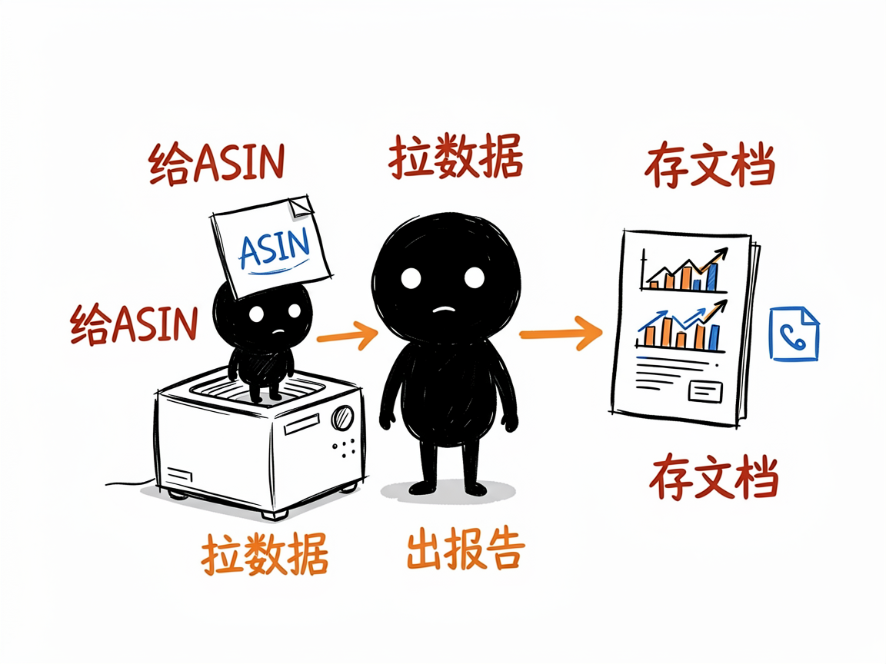

## 怎么用

你不需要记任何命令。在 codex / workbuddy 等 agent 装好 amazon-skill 技能后，直接对 AI 说话就行：

**场景 1：想摸清一个竞品**
你：帮我分析一下美国站这个商品（报上它的 ASIN 编号），看看价格、评分、关键词和评论到底怎么样。
AI：它会自动拉数据，生成一份竞品情报报告，把对手的强项和软肋讲清楚，让你知道该跟还是该避。

**场景 2：想写一条能打的 Listing**
你：我要上一款瑜伽垫，帮我把标题、五点、A+ 页面和问答都写出来。
AI：它会先分析这个类目，再生成文案，最后做一遍校验，产出的内容适配新的语义搜索和 AI 购物趋势，你拿去就能用。

**场景 3：想看看买家在骂什么**
你：把这款产品最近的评论都看看，买家最不爽的点是什么？
AI：它会自动识别产品痛点和退货原因，给你一份改进建议，还顺手写好客服回复模板，省得你逐条想词。

## 谁适合用

- 亚马逊卖家、运营、产品开发、Listing 优化师。
- 做跨境电商代运营、代分析的团队。
- 想用数据而不是拍脑袋做选品决策的创业者。
- 需要快速产出竞品情报、广告策略的研究人员。

## 一点说明

这套技能不是一个给普通人双击打开的 App，而是给 AI 助手（如 codex / workbuddy）用的"技能包"合集，在 agent 里装好就能用。更重要的一点是：其中不少子技能依赖第三方数据服务（卖家精灵、Sorftime、Sif、西柚洞察等）的接口或登录态，没配上这些账号，对应的分析就跑不起来。具体每个子技能能做什么、怎么配数据，以各自目录下的 SKILL.md / README.md 为准。

## 闲鱼接单文案

> 以下服务展示在闲鱼 / 淘宝服务市场发布，用于承接本 skill 的定制开发订单。

**标题：亚马逊运营AI技能（skill）软件开发**

**描述：**

专注 AI Agent 技能（skill）定制开发，本篇介绍的技能包就是现成作品，可先看演示再下单。覆盖亚马逊运营全流程：品类选品、关键词调研、选品分析、Listing 打造、竞品穿透、评论挖掘、广告流量诊断。支持按你的类目和已有的数据账号（卖家精灵 / Sorftime / Sif / 西柚洞察）做个性化定制，交付后装进 codex / workbuddy 等 AI 助手即可使用，全部源码交付、支持二次开发。

**服务内容：**

- 1、需求沟通梳理：先聊清楚你的运营痛点（选品、写 Listing、盯竞品还是挖评论），确认数据来源与可行性，列明功能清单后再动手
- 2、skill交付内容和格式：品类选品、关键词调研、选品分析、Listing 打造、竞品穿透、评论挖掘、广告流量诊断等具体报告和数据采集成果（Markdown 报告 / 词库看板 / Listing 文案）
- 3、项目功能/系统开发：按你的类目和需求定制开发各功能模块，含第三方数据接口（卖家精灵 / Sorftime / Sif / 西柚洞察）对接与联调测试
- 4、skill源码交付：SKILL.md 技能说明 + 提示词 / 脚本 / 模板 / 报告样例组成的完整技能工程，兼容 codex / workbuddy 等 agent。全部源码 + 安装部署说明 + 使用演示，交付后可自行修改维护

---

<!-- 来源: apiz-use.md -->

# 不懂代码也能让 AI 帮你做电商图、短视频和角色设计 —— apiz-use 介绍

你是淘宝、抖音或跨境电商的卖家，想批量做商品主图、宣传海报、竖版短视频，或者设计一套原创角色形象，可一看到要挑模型、调参数就头大，更别说去记那些技术操作了。apiz-use 本身不生成内容，它是一份给 AI 助手看的"实战手册"：装好之后，你直接用大白话提需求，AI 就知道怎么调用 apiz（上面那个模型网关）把活儿干对，还帮你提前避开各种容易翻车的坑。

**apiz-use 就是来解决这件事的。**

你给它一句人话需求（比如"帮我做一套 6 张淘宝主图"），它还你一套排好版、调好参数的生成方案，并自动驱动 AI 把图或视频做出来。

---

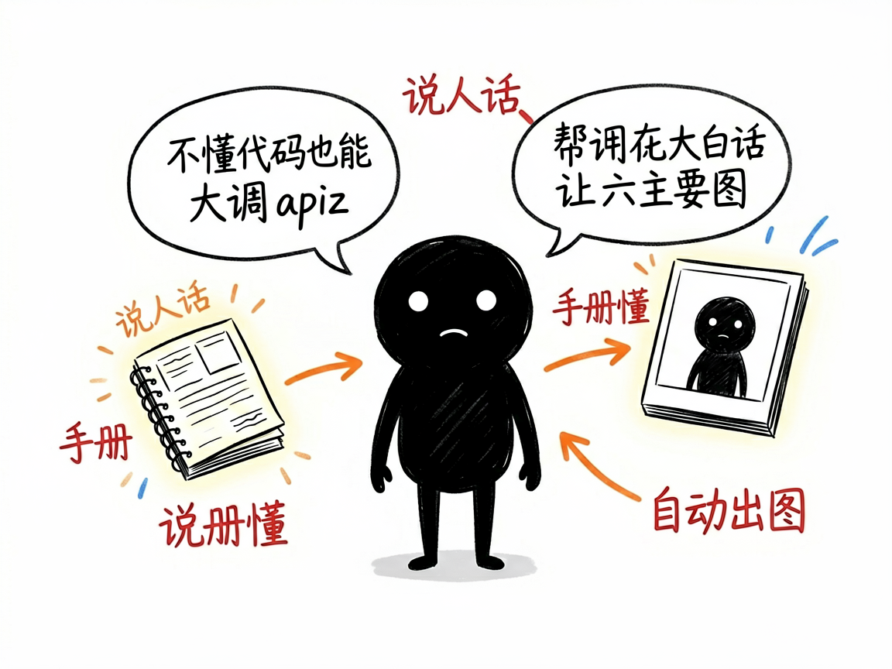

## 它到底能做什么
- 电商作图：淘宝/天猫主图、产品九宫格宣传图、照片转手绘风海报，一条龙出图。
- 视频生成：产品宣传视频、分镜短剧、带原生对白的短视频，还能控制镜头和节奏。
- 角色设计：原创角色人设、保持同一张脸的一致性、做开心/生气等不同微表情。
- 图片本地化：把中文海报翻译成英文/日文/韩文，并把模特换成当地面孔，产品外观不变。
- 批量下载素材：把淘宝/天猫商品的主图、详情图、SKU 图一键下载打包。
- 避坑指南：内置一堆"铁律"，比如重要图先出 1 张样图确认再批量、本地图片要先上传、视频提示词必须加"不要水印不要字幕"等约束。

## 怎么用
你不需要记任何命令。在 codex / workbuddy 等 agent 装好 apiz-use 技能（并连好 apiz）后，直接对 AI 说话就行：
**场景 1：做一套淘宝主图**
你：帮我做一套 6 张淘宝主图，产品是钨钢划线笔，参考图在桌面 product.jpg。第一张突出"工业级超硬"，第二张展示合金刀头……风格现代简约电商风，白底浅灰背景。先做第一张给我确认，没问题再做剩下的。
AI：它自己查手册、调 apiz 生成图片，先出 1 张样图让你确认，按你的反馈微调后再批量产出剩下的 5 张。
**场景 2：做一条带货短视频**
你：用这张挡风被产品图做一条 15 秒抖音竖版宣传视频，0-3 秒产品亮相……风格明亮干净，不要文字不要水印。
AI：它按分镜要求生成竖版视频，自动避开水印和字幕等常见坑，把成片交给你。
**场景 3：做一套原创角色**
你：帮我设计一个原创 IP 角色，要能保持同一张脸，再给我做开心、生气两套微表情。
AI：它产出角色人设与多套一致表情图，保证同一张脸不串味，方便你做表情包或周边。

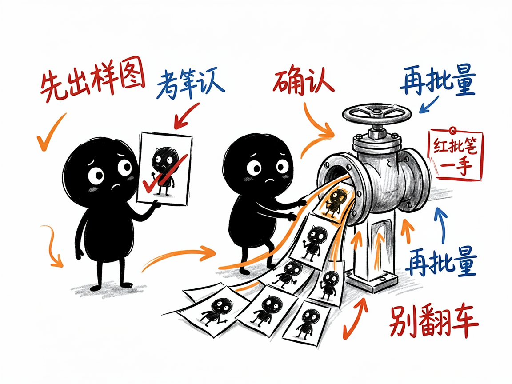

## 谁适合用
- 淘宝、天猫、抖音、拼多多等平台的电商卖家和运营。
- 做短视频、短剧、带货内容的内容创作者。
- 需要把同一张图做多语言版本、换本地模特的跨境卖家。
- 想设计原创 IP 角色、做表情包的个人或团队。

## 一点说明
apiz-use 不是独立软件，它是配合 apiz（模型网关）使用的一份"技能手册"——在 codex / workbuddy 等 agent 装好 apiz 和这份手册技能后就能用，前提是你那边已经装好 apiz、登录了账号。它本质是帮 AI 把你的中文需求翻译成正确的操作步骤，所以你依然要自己准备好产品参考图、想清楚的文案。具体支持的模型和价格以 apiz 官方为准。

## 闲鱼接单文案

> 以下服务展示在闲鱼 / 淘宝服务市场发布，用于承接本 skill 的定制开发订单。

**标题：电商AI作图/短视频/角色设计 skill软件开发**

**描述：**

专注 AI Agent 技能（skill）定制开发，已做出不懂代码也能用的电商 AIGC 实战技能，现成作品可先看演示再下单。覆盖淘宝主图、九宫格宣传图、竖版带货视频、原创 IP 角色设计、海报多语言本地化，内置"先出样图再批量"等避坑规则。支持按你的平台和产品做个性化定制，交付后装进 codex / workbuddy 等 AI 助手即可使用，全部源码交付、支持二次开发。

**服务内容：**

- 1、需求沟通梳理：先聊清楚你的平台（淘宝 / 抖音 / 跨境）、要做的内容类型和风格要求，准备好产品参考图与文案，列明功能清单后再动手
- 2、skill交付内容和格式：电商主图套图、九宫格宣传图、产品短视频、原创角色人设与一致性表情、多语言换脸海报等生成成果（图片 / 视频文件 + 人设文档）
- 3、项目功能/系统开发：按你的产品和平台定制提示词模板、样图确认与批量生成流程，含与 apiz 模型网关的对接联调
- 4、skill源码交付：SKILL.md 技能说明 + 提示词 / 脚本 / 模板 / 作品样例组成的完整技能工程，兼容 codex / workbuddy 等 agent。全部源码 + 安装部署说明 + 使用演示，交付后可自行修改维护

---

<!-- 来源: apiz.md -->

# 想用几百种 AI 模型画图、做视频、配音，又不想一个个去注册？—— apiz 介绍

你想让 AI 帮你画一张图、做一段视频、给视频配上自然的人声、甚至克隆一个声音？现在市面上的 AI 模型一大堆：OpenAI 的、Google 的、快手的、各种开源的，每个都要单独注册、单独配密钥、单独看文档，光是记住各家怎么用就够劝退了。apiz 做的事很简单：它把这些模型全部接到一个入口，你在装好它的 AI 助手里说话，就能调用几百种模型。

**apiz 就是来解决这件事的。**

你给它一句提示词（比如"一只橘猫坐在窗台"）加上想用的模型名，它还你一张图、一段视频、一段语音或一个任务结果。

---

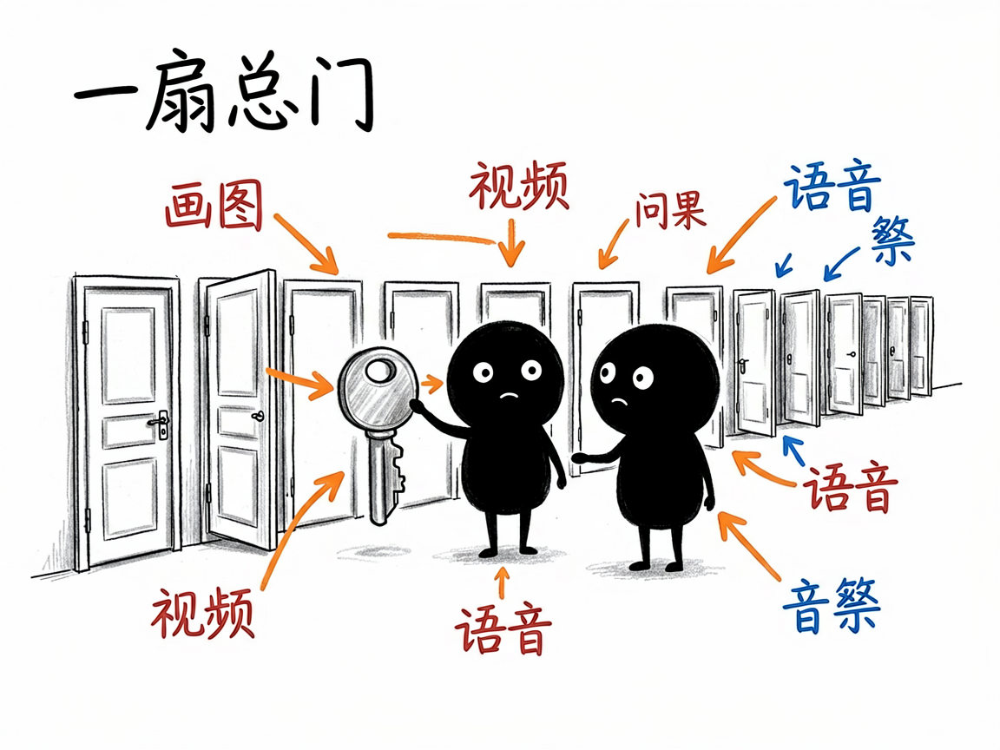

## 它到底能做什么
- 文生图 / 图生图：用文字描述生成图片，或给一张图让它改成别的风格、换背景。
- 文生视频 / 图生视频：用文字或图片生成短视频，支持多款主流视频模型（如可灵、Seedance、Sora、Veo 等）。
- 语音合成：把文字变成语音，可选不同音色、语速。
- 声音克隆：给一段样本音频，克隆出相似的声音。
- 字幕打轴 / 语音识别：给音频或歌词，自动对齐出带时间戳的字幕；也能把录音转成文字。
- 音乐生成：描述风格，直接生成一段背景音乐。
- 视频解析与镜像：解析抖音等分享链接拿到无水印下载地址；把外部链接转存到它自己的存储。
- 查余额、每日签到：账号是积分制，可以查余额，每天还能免费签到领积分。

## 怎么用
你不需要记任何命令。在 codex / workbuddy 等 agent 装好 apiz 技能后，直接对 AI 说话就行：
**场景 1：一句话出张图**
你：用 image4.0 这个模型帮我画一张"一只可爱的橘猫坐在窗台"。
AI：它调用对应的模型生成图片，把成图直接发还给你。
**场景 2：图生视频**
你：拿这张产品图，用可灵帮我把场景动起来，生成一段短视频。
AI：它用你指定的视频模型，把静态图变成一段会动的视频返回给你。
**场景 3：文字变语音**
你：把"你好，欢迎使用 AI 语音合成"这段词，用自然点的女声念出来，给我一段语音。
AI：它调用语音合成，生成一段对应音色的音频交给你。

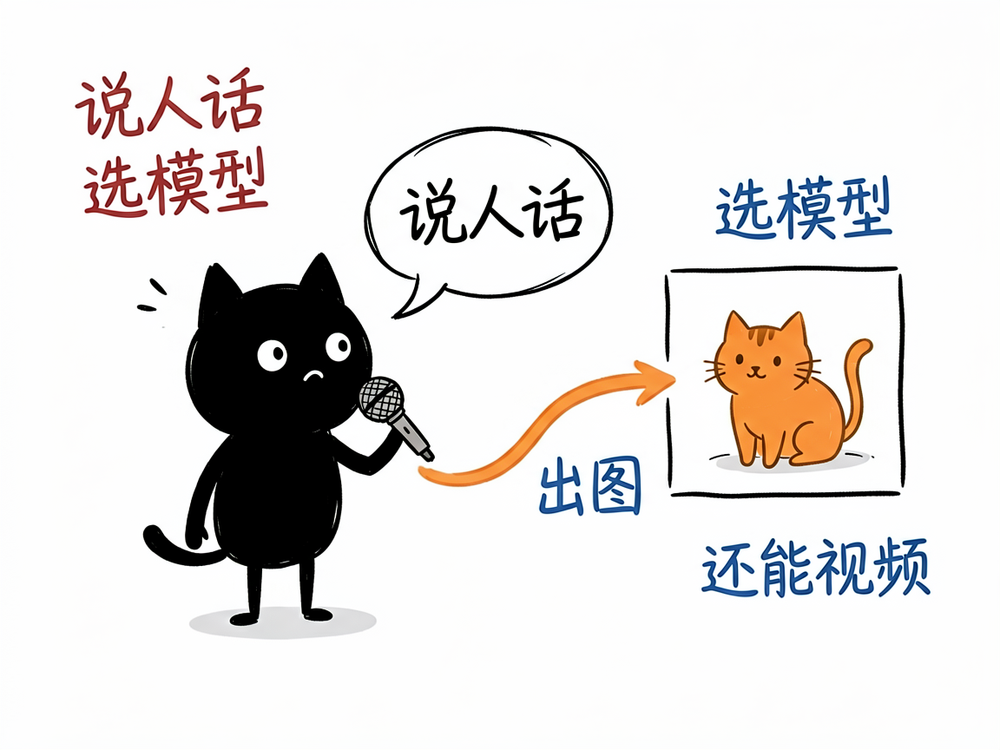

## 谁适合用
- 想省去分别注册各家 AI 平台、统一管理模型的人。
- 在搭建 AI 应用、需要稳定调用多种生成模型的团队。
- 做内容创作、想把"画图 / 视频 / 配音"一条龙自动化的人。

## 一点说明
apiz 是一套 AI 技能（也是一个模型网关），你装好后直接在 AI 助手对话框里说话就能调用几百种模型，不用自己去各家平台分别注册、配密钥。它是个"统一入口"，本身按积分收费，具体模型清单、价格和能力以官方文档为准。

## 闲鱼接单文案

> 以下服务展示在闲鱼 / 淘宝服务市场发布，用于承接本 skill 的定制开发订单。

**标题：AI模型聚合调用（画图/视频/配音）skill软件开发**

**描述：**

专注 AI Agent 技能（skill）定制开发，已做出统一接入数百种 AI 模型的网关技能，现成作品可先看演示再下单。一个入口调用文生图、图生视频、语音合成、声音克隆、字幕打轴、音乐生成等能力，覆盖可灵、Seedance、Sora、Veo 等主流模型。支持按你的业务场景做个性化定制，交付后装进 codex / workbuddy 等 AI 助手即可使用，全部源码交付、支持二次开发。

**服务内容：**

- 1、需求沟通梳理：先聊清楚你要用哪些模型能力（画图、视频、配音、声音克隆等）和使用场景，确认 apiz 账号与积分额度，列明功能清单后再动手
- 2、skill交付内容和格式：文生图 / 图生图、文生视频 / 图生视频、语音合成、声音克隆、字幕打轴、音乐生成、视频解析等模型调用成果（图片 / 视频 / 音频文件 + 任务结果）
- 3、项目功能/系统开发：按你的业务定制模型选型、参数模板、批量生成与结果回收等流程的开发与联调
- 4、skill源码交付：SKILL.md 技能说明 + 提示词 / 脚本 / 模板 / 生成样例组成的完整技能工程，兼容 codex / workbuddy 等 agent。全部源码 + 安装部署说明 + 使用演示，交付后可自行修改维护

---

<!-- 来源: boardgame-io.md -->

# 想自己做一款棋牌或桌游？它帮你把规则写成能跑的游戏 —— boardgame-io 介绍

你脑子里有个游戏点子：一个三子棋变种、一副卡牌对战、或者带骰子的桌游。你不会写复杂的游戏引擎，但想让它真的能两个人玩、能联网、还能让电脑当对手。

**boardgame-io 就是来解决这件事的。** 它是一个专门做"回合制游戏"（棋类、卡牌、骰子、策略游戏）的开发框架（可以理解为一套现成的工作方法）。你告诉它游戏的规则和点子，它还你一个真正能玩、能联机、能测试的游戏。你不用从零写服务器和状态同步那套麻烦事，框架都替你管好了。

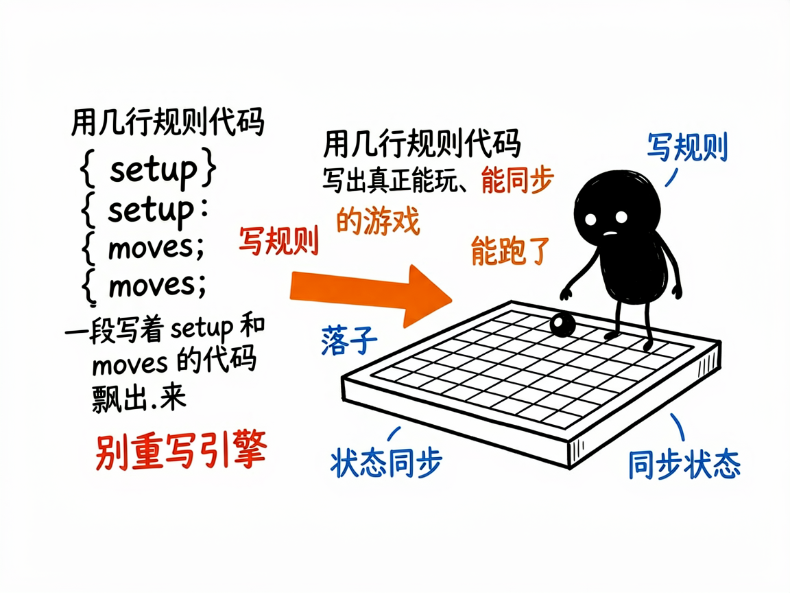

---

## 它到底能做什么

- 帮你把游戏规则讲清楚：你描述"棋盘长啥样、玩家每步能干什么、怎么算赢"，它负责在两端同步状态、支持悔棋和电脑托管。
- 自动联网对战：想和朋友在线玩，它自带服务端方案，不用你自己造轮子。
- 做单人 vs AI：内置"脚本机器人"机制，可以让电脑按你写的套路出招当对手。
- 出游戏界面：配合网页界面技术（React，一种做网页界面的工具）就能画出棋盘、手牌，点一下就走一步。
- 带现成模板：备好"极简棋类"和"卡牌对战"两套可直接改的骨架，换皮就能用。
- 写测试：游戏逻辑能脱离界面单独跑，保证规则改了不出 bug。

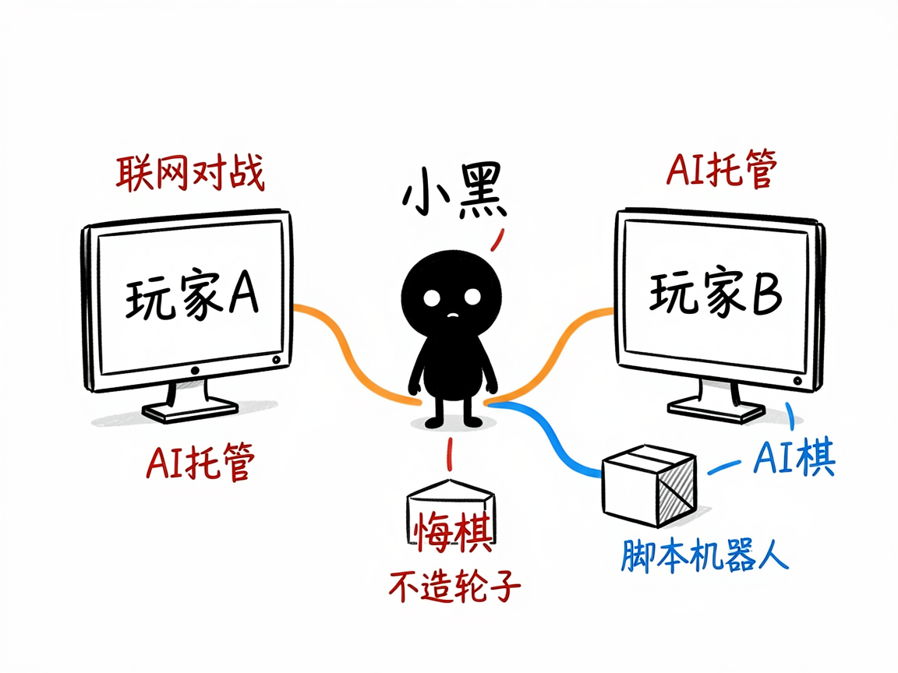

## 怎么用

你不需要记任何命令。在 codex / workbuddy 等 agent 装好 boardgame-io 技能后，直接对 AI 说话就行：

**场景 1：你想做一个三子棋变种**
你：帮我做一个三子棋变种，9 格棋盘，两个玩家轮流落子，先连成一线就赢
AI：它把规则写成游戏逻辑，自动帮你管状态同步、悔棋和电脑托管，再配上网页棋盘界面，你点一下就走一步。

**场景 2：你想和朋友在线对战**
你：给我做一个能联机的卡牌对战游戏，最好电脑也能当对手
AI：它用自带的服务端方案帮你接上联网对战，并用脚本机器人让电脑按套路出招，不用你自己写服务器。

**场景 3：你想快速出原型**
你：我想先拿现成模板改一个骰子的桌游，换换皮就行
AI：它直接套用"卡牌对战"或"极简棋类"骨架给你改主题，比从零写引擎省事，还能单独跑测试保证规则不出 bug。

## 谁适合用

- 想做一款自己的桌游 / 棋牌小游戏来练手或上线的人（让 AI 按这框架帮你搭）。
- 想给现有网站加个能玩的小游戏的人。
- 做 AI 工具、需要按"棋盘 / 回合制"思路搭原型的构建者。

## 一点说明

它是装在 codex / workbuddy 这类 AI 助手里的技能，不是普通人双击就能打开的 App。最实用的玩法是让 AI 直接复制它给的现成模板改主题，而不是从头重写引擎——文档里反复强调"复制比重写靠谱"。如果你自己不会写代码，可以把它交给会编程的人，或装在带这个技能的 AI 助手上让它帮你搭。具体能力以项目文档为准。

## 闲鱼接单文案

> 以下服务展示在闲鱼 / 淘宝服务市场发布，用于承接本 skill 的定制开发订单。

**标题：棋牌桌游网页游戏开发 skill软件开发**

**描述：**

专注 AI Agent 技能（skill）定制开发，已做出基于 boardgame.io 的回合制游戏开发技能，现成作品可先看演示再下单。你描述"棋盘长啥样、每步能干什么、怎么算赢"，它还你一个真正能玩的游戏：状态同步、悔棋、电脑托管自动管好，联网对战自带服务端方案，脚本机器人让电脑按套路当对手，配 React 网页界面，附极简棋类和卡牌对战两套可直接换皮的模板，游戏逻辑还能脱离界面单独跑测试。可按你的规则定制，全部源码交付、支持二次开发。

**服务内容：**

- 1、需求沟通梳理：先聊清楚游戏规则（棋盘 / 手牌 / 胜负判定）、玩法形态（本地双人 / 联网对战 / 人机对战）和界面要求，列明功能清单后再动手
- 2、skill交付内容和格式：能玩的游戏成品：网页棋盘 / 手牌界面、规则逻辑、联网对战或 AI 机器人对手的可运行工程
- 3、项目功能/系统开发：按你的规则做模板改造、界面主题定制与机器人策略，含规则逻辑测试联调
- 4、skill源码交付：SKILL.md 技能说明 + 提示词 / 脚本 / 模板 / 工程样例组成的完整技能工程，兼容 codex / workbuddy 等 agent。全部源码 + 安装部署说明 + 使用演示，交付后可自行修改维护

---

<!-- 来源: brickMosaic.md -->

# 想把照片变成乐高像素画？交给它出拼搭说明书和零件清单 —— brickMosaic 介绍

你手里有一张喜欢的照片，也许是自家娃的笑脸、偶像的头像，或者一张风景图。你突发奇想：能不能用乐高积木把它拼出来？自己数格子、配颜色、列清单，想想就头大。

**brickMosaic 就是来解决这件事的。**

它帮你把任意一张图片，转换成用乐高官方"Art 套装"配色拼出来的马赛克像素画，并且不只给你一张图——还会顺手把拼搭说明书（A4 格式的拼搭图）和每块零件要买多少的采购清单一起准备好。你给它一张照片，它还你一套能照着动手拼的完整物料。

---

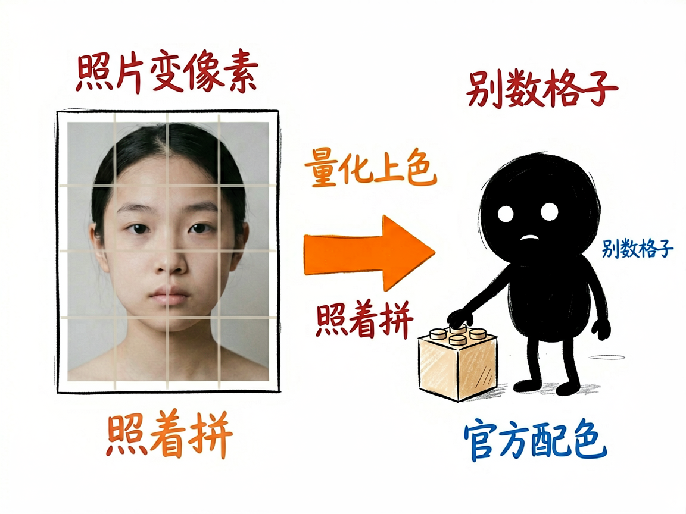

## 它到底能做什么
- 把图片"量化"成乐高积木配色：它会自动把照片像素对应到乐高官方套装里真实存在的颜色颗粒，保证拼出来是真的能买到的那种。
- 生成马赛克预览图：每颗都画成带凸点的小方块，拼之前就能看到成品大概长什么样。
- 出拼搭说明书：在浏览器里打开就能看，也能直接打印成 PDF；一页总览加很多张 16×16 的编号网格，照着一格一格拼就行。
- 列零件清单：每种颜色用多少颗、对应的零件编号（Element ID）、来自哪个套装，都给成文档，方便照着去采购。
- 支持"抠背景/只留主体"：比如只想要人物的头像，可以把背景裁掉，省颗粒也更干净。
- 觉得效果不好还能 AI 优化：主体太糊、颜色跑偏时，可以先用 AI 把源图风格化再生成。

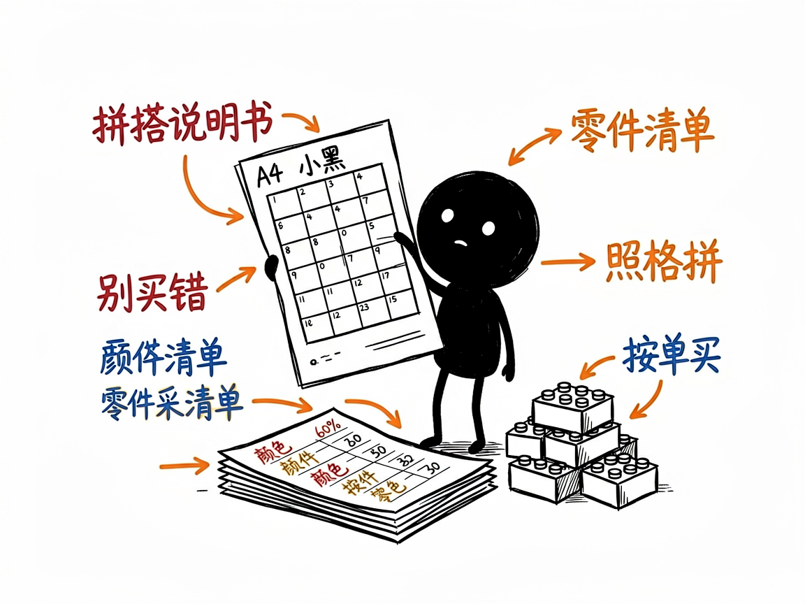

## 怎么用
你不需要记任何命令。在 codex / workbuddy 等 agent 装好 brickMosaic 技能后，直接对 AI 说话就行：
**场景 1：把娃的照片变成乐高画**
你：帮我把这张娃的笑脸照片变成乐高像素画，用 48×48 的格子，配色用披头士那套。
AI：它把照片量化成乐高官方配色，生成马赛克预览图、一份 A4 拼搭说明书，以及每种颗粒要买多少的采购清单。
**场景 2：只拼头像、省颗粒**
你：背景我不要，只留人物头像，帮我把背景裁掉再出图。
AI：它把背景裁掉只留主体，重新生成图纸和清单，既干净又省颗粒。
**场景 3：效果不满意重来**
你：这版颜色有点跑偏，你先用 AI 把原图风格化一下，再给我出一版。
AI：它先用 AI 把源图处理得更适合像素化，再重新量化生成图纸和清单，效果会干净很多。

## 谁适合用
- 想亲手拼一幅乐高像素画当礼物或装饰的爱好者。
- 拿到孩子/朋友照片想做成积木画的普通人。
- 手头有乐高 Art 套装、想拿自己的图来拼的人。

## 一点说明
它是一套 AI 技能：你通常是在带这个技能的 AI 助手对话框里发一张图，它帮你出图、看预览、调参数。图片长宽比和正方形套装差太多时它会自动裁中心，避免人脸被压扁——如果你想保留完整画面记得告诉它去掉这个裁剪。具体能力以项目文档为准。

## 闲鱼接单文案

> 以下服务展示在闲鱼 / 淘宝服务市场发布，用于承接本 skill 的定制开发订单。

**标题：照片转乐高马赛克拼搭图纸 skill软件开发**

**描述：**

专注 AI Agent 技能（skill）定制开发，已做出乐高像素画图纸技能，现成作品可先看演示再下单。把任意照片量化成乐高官方 Art 套装的真实配色，一次给你三样东西：带凸点的马赛克预览图、A4 格式可打印的拼搭说明书（16×16 编号网格）、每种颗粒要买多少的采购清单（含零件编号和来源套装），拼出来真的能买到料。支持抠背景只留主体、AI 优化源图。可按你的套装定制，全部源码交付、支持二次开发。

**服务内容：**

- 1、需求沟通梳理：先聊清楚照片用途、格子尺寸（如 48×48）、想用的配色套装、要不要抠背景只留主体，列明功能清单后再动手
- 2、skill交付内容和格式：马赛克预览图 + A4 拼搭说明书（总览页 + 编号网格，可打印 PDF）+ 零件采购清单（颜色 / 数量 / Element ID / 来源套装）
- 3、项目功能/系统开发：按你手头的套装和尺寸定制量化配色方案，可扩展多图批量出图纸等功能的开发与联调
- 4、skill源码交付：SKILL.md 技能说明 + 提示词 / 脚本 / 模板 / 图纸样例组成的完整技能工程，兼容 codex / workbuddy 等 agent。全部源码 + 安装部署说明 + 使用演示，交付后可自行修改维护

---

<!-- 来源: brightdata-research.md -->

# 想让 AI 帮你抓全网数据做深度调研？—— brightdata-research 介绍

做市场调研最累的是什么？不是分析，是采集。想看看竞品在卖什么、价格怎么定、评论怎么说，结果打开网站就是验证码和反爬墙，一个个手动复制粘贴，一天下来数据没多少，眼睛先瞎了。brightdata-research 就是干这个的：基于 Bright Data MCP，让 AI 带着反爬保护去抓全网数据，你只要说清楚要什么。配图之后你就明白它的工作方式了。

## 它到底能做什么

- **搜索引擎结果抓取**：关键词搜索结果批量采集，做选品调研、舆情收集都行。
- **网页内容提取**：整页正文、表格、评论，直接变成结构化数据。
- **浏览器自动化**：JS 重渲染的动态页面也能抓（很多反爬就挡在这）。
- **反爬虫保护**：Bright Data 的代理网络兜底，被墙了自动换路。
- **调研报告直出**：抓完让 AI 聚合成市场报告（仓库里自带 3D 打印机市场调研样例）。

## 怎么用

**场景 1：竞品价格监控**
你：帮我盯一下 Amazon 上这几款 3D 打印机的价格和评分变化。
AI：逐个抓商品页，整理成表，标出最近涨跌。

**场景 2：市场调研报告**
你：调研一下便携储能电源这个品类，主要品牌、价位段、卖点。
AI：搜索+抓取+聚合，输出一份带数据表的市场报告。

## 谁适合用

- 做选品和市场调研的跨境卖家。
- 需要竞品情报、价格监控的运营。
- 想做数据采集但被反爬墙劝退过的人。

## 一点说明

本技能依赖 Bright Data MCP（需配置 API token）。抓取遵守目标网站条款，商用数据请确认授权。自带 3D 打印机调研报告和便携储能数据集两个完整样例可参考。

## 闲鱼接单文案

> 以下服务展示在闲鱼 / 淘宝服务市场发布，用于承接本 skill 的定制开发订单。

**标题：全网数据抓取调研（Bright Data 反爬）skill 软件开发**

**描述：**

专注 AI Agent 技能（skill）定制开发，已做出基于 Bright Data MCP 的全网数据调研技能，现成作品可先看演示再下单。搜索引擎结果批量抓取、网页正文表格评论结构化提取、动态页面浏览器自动化，自带反爬虫保护，市场调研、竞品分析、价格监控、舆情采集一站搞定，抓完自动聚合成带数据表的调研报告。支持按你的调研需求定制抓取字段与报告模板，交付后装进 codex / workbuddy 等 AI 助手即可使用，全部源码交付、支持二次开发。

**服务内容：**

- 1、需求沟通梳理：先聊清楚你的调研目标（竞品监控、品类调研还是舆情收集）、目标网站清单和数据字段，确认 Bright Data 账号可用，列明功能清单后再动手
- 2、skill交付内容和格式：结构化数据表（CSV/JSON）+ 聚合分析报告样例（含 3D 打印机市场调研完整示范）
- 3、项目功能/系统开发：按你的业务定制抓取字段、监控频率与报告模板，可扩展定时监控、变更预警等功能的开发与联调
- 4、skill源码交付：SKILL.md 技能说明 + 抓取工作流脚本 / 报告模板 / 样例数据组成的完整技能工程，兼容 codex / workbuddy 等 agent。全部源码 + 安装部署说明 + 使用演示，交付后可自行修改维护

---

<!-- 来源: category-selection.md -->

# 这个类目值不值得进？用五维模型让 AI 帮你算清楚 —— category-selection 介绍

选品最难的不是"找产品"，是"选类目"。一个类目看起来热闹，可能早已红海；看着冷清，也许藏着蓝海。靠感觉进，往往进去就亏。category-selection 就是干这个的：它用一套五维评分模型，对一个亚马逊品类做深度市场调研，直接告诉你"进还是不进、怎么进"。

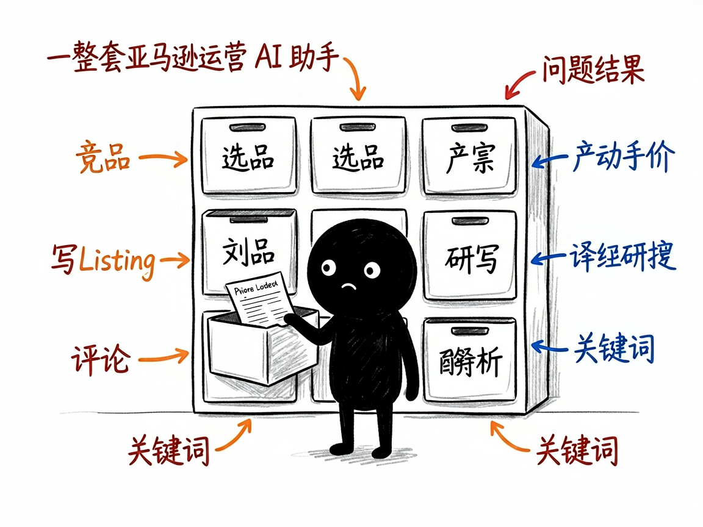

## 它到底能做什么

- 五维打分：市场规模、增长潜力、竞争烈度、进入壁垒、利润空间，五个维度量化评分。
- 综合评级：80+ 强烈推荐、70+ 可以考虑、50+ 谨慎、50 以下不建议。
- Top 产品扫描：默认拉取类目 Top20 产品，分析价格、品牌、评论分布。
- 趋势洞察：25 个月历史趋势，看清季节性和生命周期。
- 自动报告：调研完直接生成 Markdown 分析报告，决策有依据。

## 怎么用

**场景 1：想进一个新类目**
你：帮我分析美国站的 Sofas 品类，值不值得进？
AI：它跑五维模型，给你评分和"强烈推荐 / 谨慎进入"的结论，附上依据。

**场景 2：多个类目对比**
你：Kitchen 和 Garden 哪个更适合新手？
AI：分别出报告，你横向一比就知道该把资源押在哪。

## 谁适合用

- 做跨境电商选品、新品开发的卖家。
- 代运营、选品调研团队。
- 不想靠拍脑袋、要用数据决定"进不进"的创业者。

## 一点说明

本技能依赖 Sorftime 接口获取类目数据，需配置对应账号。分析数量、站点都可调，默认 Top20。具体以 SKILL.md 为准。

## 闲鱼接单文案

> 以下服务展示在闲鱼 / 淘宝服务市场发布，用于承接本 skill 的定制开发订单。

**标题：亚马逊类目选品分析 skill软件开发**

**描述：**

专注 AI Agent 技能（skill）定制开发，已做出品类五维评分选品技能，现成作品可先看演示再下单。用市场规模、增长潜力、竞争烈度、进入壁垒、利润空间五个维度量化打分，直接给出"强烈推荐 / 可以考虑 / 谨慎 / 不建议"的进类目结论，附 Top 产品扫描和 25 个月趋势洞察。支持按你的站点和类目做个性化定制，交付后装进 codex / workbuddy 等 AI 助手即可使用，全部源码交付、支持二次开发。

**服务内容：**

- 1、需求沟通梳理：先聊清楚你想进的类目、站点和分析深度（Top 数量、对比几个类目），确认 Sorftime 账号可用，列明功能清单后再动手
- 2、skill交付内容和格式：五维评分与综合评级、Top20 产品价格 / 品牌 / 评论分布、25 个月历史趋势与季节性洞察、进不进的结论与依据（Markdown 分析报告）
- 3、项目功能/系统开发：按你的选品标准调整维度权重，可扩展多类目横向对比、更多站点与产品数量等功能的开发与联调
- 4、skill源码交付：SKILL.md 技能说明 + 提示词 / 脚本 / 模板 / 报告样例组成的完整技能工程，兼容 codex / workbuddy 等 agent。全部源码 + 安装部署说明 + 使用演示，交付后可自行修改维护

---

<!-- 来源: claude-agent-sdk.md -->

# 想做一个会自己干活的 AI 应用？这个技能把底层都铺好了 —— claude-agent-sdk 介绍

很多人想做一个 AI 应用：不只是聊天，而是能自己读写文件、上网搜资料、调用你的接口、把活干完。但一上手就发现，光是"让 AI 在程序里跑起来、还能中途插话、管理多轮对话、控制它能用哪些工具"这些事，就够折腾好几天。

**claude-agent-sdk 就是来解决这件事的。** 你告诉它想要什么样的 AI 应用，它还你一个能自主干活的 AI 智能体（可以理解为被你程序驱动、会自己调用工具的 AI 助手）。它把"怎么运行 Claude、怎么流式返回结果、怎么管会话、怎么加自定义工具"这些脏活累活全封装好了。

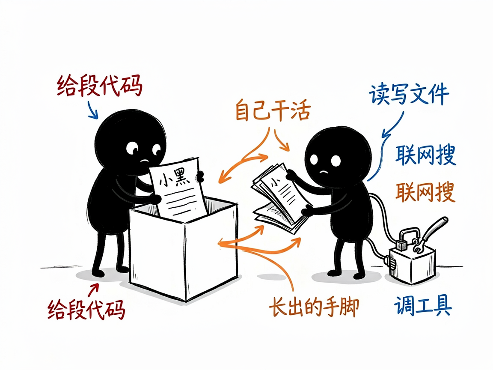

---

## 它到底能做什么

- 在你的程序里启动一个 AI 智能体，直接复用 Claude 的能力：读写文件、联网搜索、调用你的接口、把活自主干完。
- 支持流式返回：AI 思考到哪、调了什么工具、产出什么，都能实时推给你的前端，方便做打字机效果或进度展示。
- 管理多轮对话和会话：能续上之前的聊天（靠会话编号恢复上下文），也支持交互式多轮问答。
- 让你接上自定义工具（用 MCP 协议，可以理解为"给 AI 连上你自己的功能"，比如查天气、读数据库），AI 需要时就自己调用。
- 支持子智能体：让一个主 AI 把任务派给多个专门的 AI 分头做，比如一个负责搜索、一个负责写报告。
- 提供权限控制、钩子（在 AI 调工具前后做拦截校验）、结构化输出（强制返回固定格式）等，方便做生产级应用。

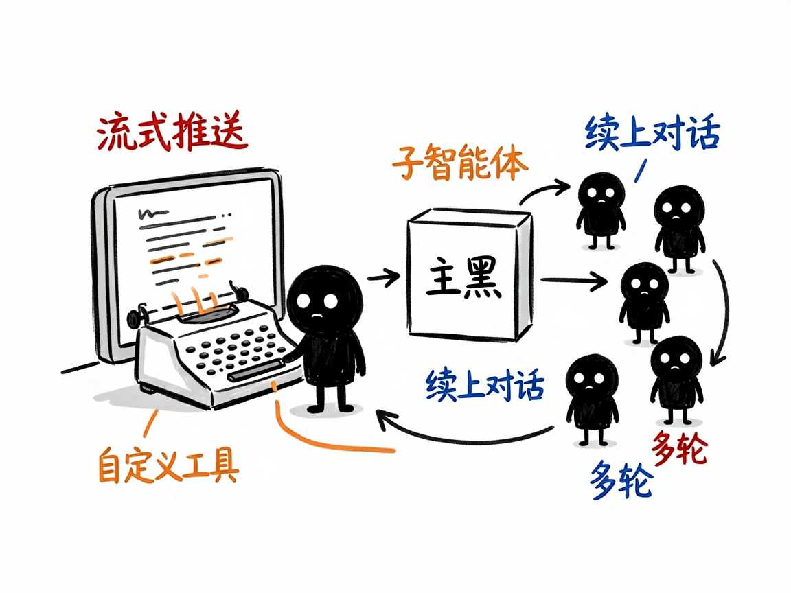

## 怎么用

你不需要记任何命令。在 codex / workbuddy 等 agent 装好 claude-agent-sdk 技能后，直接对 AI 说话就行：

**场景 1：你想做个能读代码库的助手**
你：帮我用 Claude 做一个 AI 应用，能读取我项目里 src 目录的代码、分析一下结构
AI：它借助这套能力启动一个会干活的 AI 智能体，复用 Claude 的能力读写文件，自主把分析跑完，并把进度实时推给你看。

**场景 2：你想要一个能查资料的客服**
你：给我做一个客服机器人，能连上我们的数据库查订单、还能调天气接口
AI：它用 MCP 协议帮你接上自定义工具，AI 需要查订单或天气时自己调用，并支持多轮对话和会话续接。

**场景 3：你想要多 AI 协作**
你：我想让一个主 AI 分派任务，一个去搜索、一个去写报告
AI：它用子智能体机制帮你搭好协作结构，主 AI 派活、专门的 AI 分头完成，再汇总给你。

## 谁适合用

- 想用 Claude 的能力搭建自己的 AI 产品、内部工具或自动化流程的人（让 AI 按这套能力帮你搭）。
- 做聊天机器人、客服系统、研究助手等需要"AI 真去干活"的团队。
- 需要多智能体协作、自定义工具集成、流式交互体验的应用构建者。

## 一点说明

它是装在 codex / workbuddy 这类 AI 助手里的技能，不是普通人双击打开的 App——你得先有能加载技能、连得上模型的 AI 环境，它才帮得上忙。它的定位是"底层能力包"：文档很全（含官方文档全文和二十多条常见坑），但真正把它变成某个产品，还得你把业务逻辑说清楚、让 AI 帮你写。具体 API 与能力以项目引用文档为准。

## 闲鱼接单文案

> 以下服务展示在闲鱼 / 淘宝服务市场发布，用于承接本 skill 的定制开发订单。

**标题：Claude AI智能体应用开发 skill软件开发**

**描述：**

专注 AI Agent 技能（skill）定制开发，已做出基于 Claude Agent SDK 的智能体开发技能，现成作品可先看演示再下单。在你的程序里启动一个会自主干活的 AI 智能体：读写文件、联网搜索、调你的接口；流式返回方便做打字机和进度展示，多轮会话可续接，用 MCP 协议接自定义工具，支持子智能体分头干活，权限控制和钩子方便上生产。文档含官方文档全文和二十多条常见坑。可按你的业务定制，全部源码交付、支持二次开发。

**服务内容：**

- 1、需求沟通梳理：先聊清楚想要的应用形态（读代码助手 / 查数据客服 / 多 AI 协作）、要接入的工具和数据源，列明功能清单后再动手
- 2、skill交付内容和格式：能自主干活的 AI 智能体应用：流式交互、会话管理、自定义工具（MCP）接入、子智能体编排的可运行工程代码
- 3、项目功能/系统开发：按你的业务逻辑定制工具集成、权限钩子、结构化输出与部署方案，含联调测试
- 4、skill源码交付：SKILL.md 技能说明 + 提示词 / 脚本 / 模板 / 代码样例组成的完整技能工程，兼容 codex / workbuddy 等 agent。全部源码 + 安装部署说明 + 使用演示，交付后可自行修改维护

---

<!-- 来源: claude-data-analysis.md -->

# 拿到一堆订单数据不知道从哪下手？—— claude-data-analysis 介绍

老板丢来一坨 CSV：三个月订单、用户信息、评论打分，让你"分析一下"。Excel 拉半天透视表，写了一堆 VLOOKUP，最后憋出三张图，老板问"所以结论呢"？claude-data-analysis 就是解决这个的：它是互联网数据分析技能集，7 大专业模块加一套通用六阶段流程，把数据从"质量检查"一路带到"结论报告"。

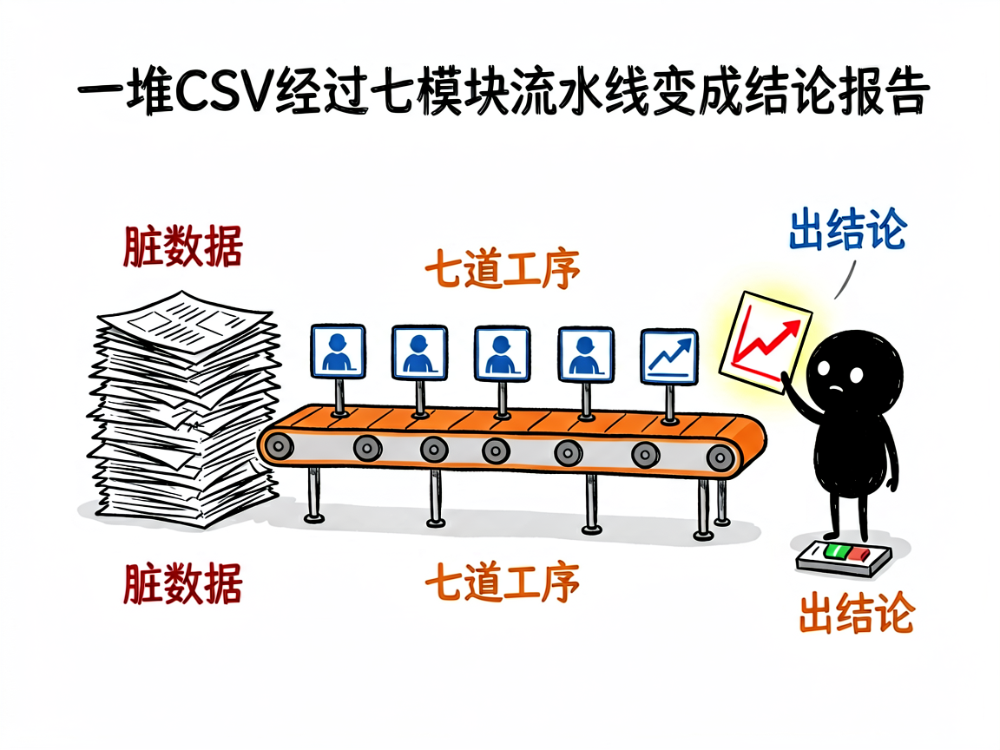

## 它到底能做什么

- **7 大专业模块**：AB 测试、渠道归因、内容情感分析、转化漏斗、增长模型、LTV 预测、探索性可视化。
- **通用 6 阶段流程**：数据质量 → 探索性分析 → 假设生成 → 可视化 → 代码生成 → 综合报告，任何数据集都能套。
- **入口技能统筹**：一句话说明你要什么，它自动路由到对应分析模块。
- **Pandas 优化**：大数据集不卡死，聚合规则正确，不犯"平均数平均"的低级错。

## 怎么用

**场景 1：电商全量分析**
你：对这份 olist 电商数据做个全面分析。
AI：走六阶段流程——先查数据质量，再探索销售趋势，假设验证后输出带图表的分析报告。

**场景 2：单点深挖**
你：帮我分析用户评论的情感倾向。
AI：直接调内容分析模块，分词、打分、聚合出正负面主题。

## 谁适合用

- 电商/互联网运营，手里有数据但不会写代码的人。
- 数据分析师想加速日常取数和报告产出。
- 产品经理要做留存、漏斗、AB 结论的快速验证。

## 一点说明

本技能是入口型集合（互联网分析 7 模块 + 通用 6 阶段），深度分析能力依赖各子技能配合。数据集放入 data_storage 目录即可开始，自带 olist 电商样例数据可试跑。

## 闲鱼接单文案

> 以下服务展示在闲鱼 / 淘宝服务市场发布，用于承接本 skill 的定制开发订单。

**标题：电商订单数据分析（漏斗/留存/LTV）skill 软件开发**

**描述：**

专注 AI Agent 技能（skill）定制开发，已做出互联网数据分析技能集，现成作品可先看演示再下单。7 大专业模块：AB 测试、渠道归因、内容情感、转化漏斗、增长模型、LTV 预测、探索性可视化，外加通用六阶段分析流程，从数据质量检查一路到结论报告，订单、评论、用户行为数据丢进来就能出带图表的分析结论。支持按你的业务指标定制分析模型与报告模板，交付后装进 codex / workbuddy 等 AI 助手即可使用，全部源码交付、支持二次开发。

**服务内容：**

- 1、需求沟通梳理：先聊清楚你的数据类型（订单流水、用户行为还是评论内容）、关心指标（GMV、留存、转化、复购）和报告形式，列明功能清单后再动手
- 2、skill交付内容和格式：完整分析报告样例（数据质量体检 + 趋势图表 + 结论建议）+ 可复跑的分析工程
- 3、项目功能/系统开发：按你的业务定制漏斗节点、留存口径、LTV 模型与报告模板，可扩展定期自动分析等功能的开发与联调
- 4、skill源码交付：SKILL.md 技能说明 + 分析工作流脚本 / 可视化模板 / 样例数据组成的完整技能工程，兼容 codex / workbuddy 等 agent。全部源码 + 安装部署说明 + 使用演示，交付后可自行修改维护

---

<!-- 来源: course-site-skill.md -->

# 攒了一堆课程笔记却没地方展示？把它一键变成能看的课程网站 —— course-site-skill 介绍

你是不是手里有一堆 Markdown 格式的教程、笔记、课程素材，散在一个文件夹里，想分享给别人却只能发文件？别人打开是一堆 .md，根本不像个"网站"，没有目录、没有进度、没有测验，更别提手机上看了。

**course-site-skill 就是来解决这件事的。** 你给它一个装 .md 文件的文件夹，它还你一个完整、能直接用的静态课程网站：有阶段和课程目录、每节课有学习目标和小结、还带测验题和进度追踪，整体是那种清爽的"蓝图风"设计。最关键的是，它不只是搬文件——AI 会把你那些杂乱的原始笔记，逐节"课程化"成规范的中文专业课。

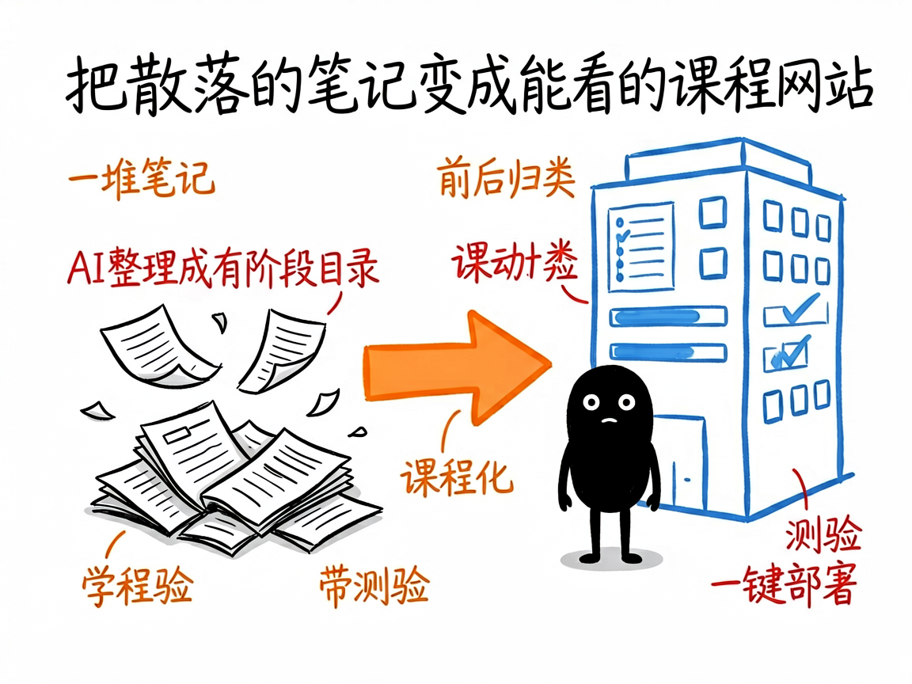

## 它到底能做什么

- 自动理清你的笔记结构：哪些是"阶段"、哪些是"课"，帮你把散文件排成清晰的目录（专业说法叫"结构分析"和"自动归类"）。
- **核心能力是"课程化"**：AI 把抓来的博客式、随笔式原始内容，重写成规范课程格式——标题、学习目标、分章节正文、小结，而不是原样堆上去。
- 给每节课自动生成 6 道真实测验题（1 道预习 + 3 道理解 + 2 道总结），不依赖外部付费接口。
- 提炼全站术语表和"先修关系图"，让读者知道知识点之间的前后依赖。
- 支持换全站视觉风格：你跟 AI 说想要什么配色、标题、logo，全站一次换好。
- 一键构建静态网站、本地预览，并发布到 EdgeOne / Pages / Vercel / GitHub Pages 等任意静态空间。

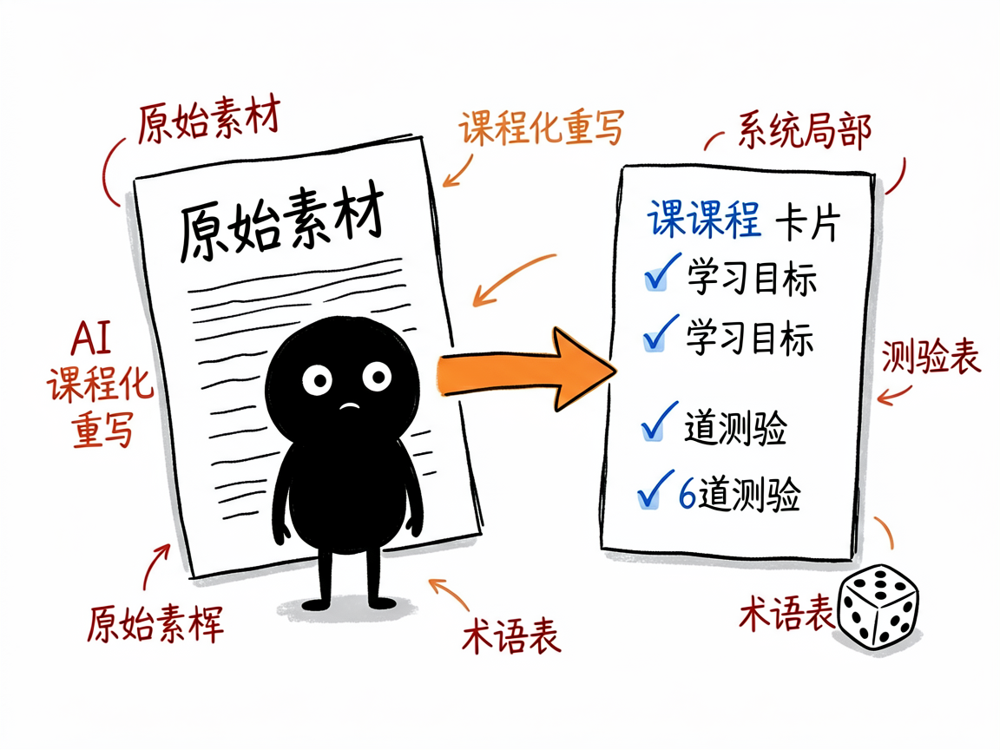

## 怎么用

你不需要记任何命令。在 codex / workbuddy 等 agent 装好 course-site-skill 技能后，直接对 AI 说话就行：

**场景 1：把一沓笔记变成正经课程站**
你：我电脑里有个文件夹装着我半年来写的机器学习笔记，都是 Markdown，帮我做成一个能看的课程网站。
AI：它会扫描整个文件夹、理清阶段和课的层级，把每篇随笔重写成带学习目标和小结的规范课程，附上测验题，最后给你一个能直接打开的网站和预览地址。

**场景 2：想换个品牌风格**
你：这个课程站整体不错，但配色和 logo 想换成我们公司的，标题也改一下。
AI：它按你说的品牌要求，一次把全站的配色、标题、logo 都换掉，不用你逐个文件改。

**场景 3：发布上线**
你：网站做好了，帮我发到网上让大家能访问。
AI：它构建出静态文件，并帮你发布到 EdgeOne / Pages 等静态空间，给你一个可分享的链接。

## 谁适合用

- 做课、写教程、整理学习资料的人，想有个正经网站展示内容。
- 团队/社区想把内部知识库变成可浏览的课程门户。
- 知识博主，把公众号/博客长文整理成体系化课程。
- 开发者，直接复用它的模板和流程搭课程站。

## 一点说明

它做的是"静态网站"——没有登录、没有评论、没有后台，进度只存在浏览器本地。它**不做多语言切换**，课程统一生成中文（这点要特别注意）。另外，课程质量取决于你给的原始素材，AI 会重写但不凭空编造知识点；它是装在 AI agent 里的一个技能（不是双击即用的傻瓜软件），装好后你直接在对话框里用就行。具体能力以项目说明文档为准。

## 闲鱼接单文案

> 以下服务展示在闲鱼 / 淘宝服务市场发布，用于承接本 skill 的定制开发订单。

**标题：课程网站搭建（笔记课程化）skill软件开发**

**描述：**

专注 AI Agent 技能（skill）定制开发，已做出笔记转课程网站技能，现成作品可先看演示再下单。给它一个装 Markdown 笔记的文件夹，自动理清阶段和课程层级，把随笔式笔记逐节重写成带学习目标、小结的规范课程，每节课自动生成 6 道测验题，附术语表和先修关系图，一键构建静态网站并发布到 EdgeOne / Vercel / GitHub Pages，全站视觉可按你的品牌一次换好。全部源码交付、支持二次开发。

**服务内容：**

- 1、需求沟通梳理：先聊清楚笔记素材的规模和主题、课程定位和发布平台（EdgeOne / Vercel / GitHub Pages 等），列明功能清单后再动手
- 2、skill交付内容和格式：完整静态课程网站：阶段与课程目录、课程化重写的正文（学习目标 / 分章节 / 小结）、每课 6 道测验题、术语表与先修关系图、进度追踪 + 可访问的网站链接
- 3、项目功能/系统开发：按你的品牌定制全站配色、标题、logo 与章节结构，可扩展更多互动题型等功能的开发与联调
- 4、skill源码交付：SKILL.md 技能说明 + 提示词 / 脚本 / 模板 / 网站样例组成的完整技能工程，兼容 codex / workbuddy 等 agent。全部源码 + 安装部署说明 + 使用演示，交付后可自行修改维护

---

<!-- 来源: deep-research-agent.md -->

# 丢个主题进去，自动给你吐出一份带引用的完整研究报告 —— deep-research-agent 介绍

你有没有过这种经历：老板甩来一句"研究一下 AI 在医疗行业的现状"，你打开浏览器，搜了三个小时，收藏夹里塞满标签页，最后拼拼凑凑写出来的东西自己都心里没底——到底哪个数据是真的、哪个来源靠谱，全混在一起。

**deep-research-agent 就是来解决这件事的。** 你给它一个研究主题，它还你一份结构化的、带完整引用的深度研究报告。它不像普通聊天机器人那样凭印象答你几句，而是真去网上搜、多方比对、再把结论整理成可以交差的文档。

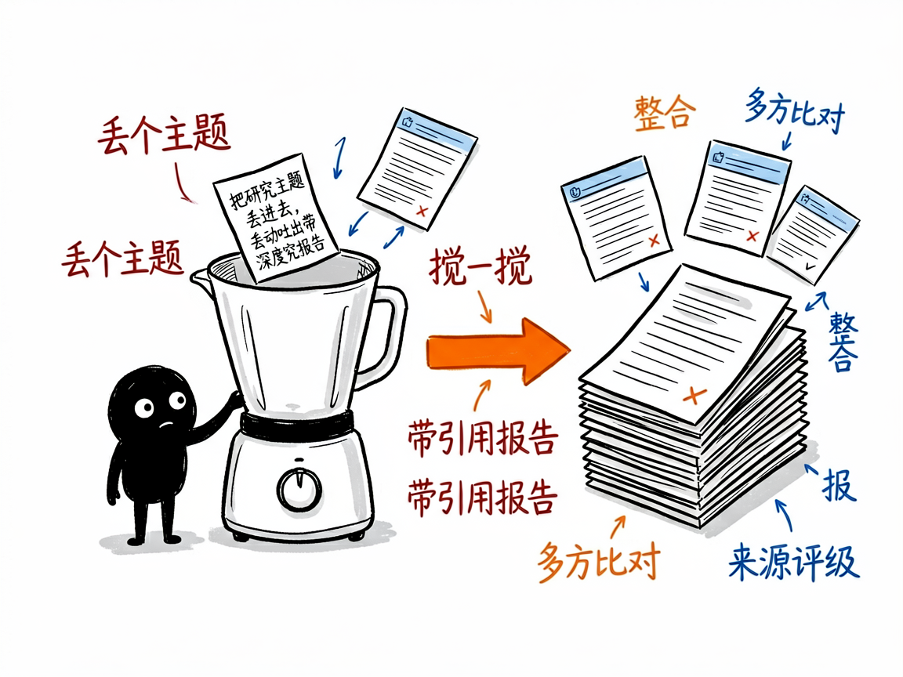

---

## 它到底能做什么

- 先问清楚你要什么：它会主动确认研究范围、想要什么格式、关注哪段时间、对来源有什么要求，而不是一上来就瞎搜。
- 同时派出多个"研究员"（可以理解为被派出去分头查资料的 AI 助手）并行搜索，比一个人慢慢翻快得多。
- 对复杂话题会用"图式思考"（一种让 AI 像下棋一样规划研究路径、给每条线索打分的策略）来安排先查什么、深挖什么。
- 把所有来源的发现整合成一篇报告，遇到不同来源说法矛盾时，会去分析谁更可信、把共识和分歧都摆出来。
- 每个数据都标出来源，并按权威度做 A 到 E 的评级（A 是年报、政府文件这类一手资料，E 是论坛传闻这类不可靠内容），还会检测有没有编造数据。
- 最后生成一个完整文件夹：执行摘要、全文报告、关键数据、参考文献清单、来源质量表、引用验证报告，拿来就能用。

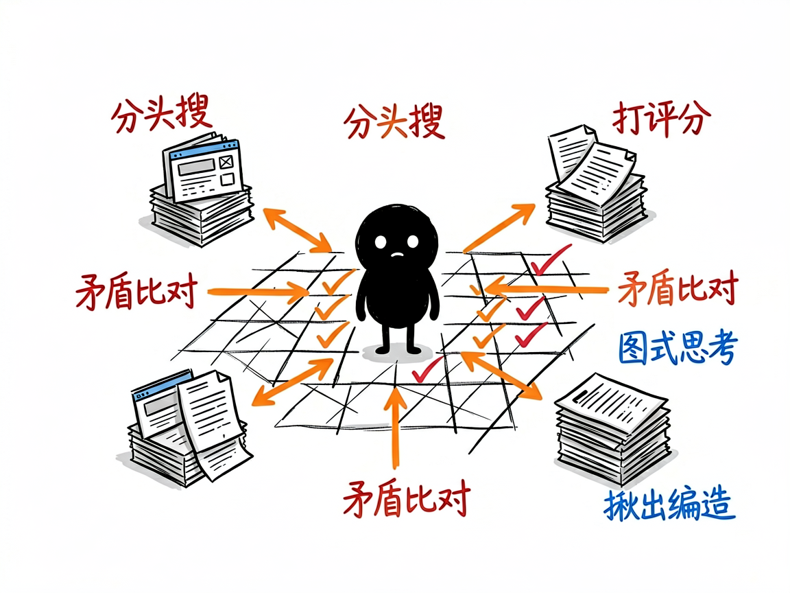

## 怎么用

你不需要记任何命令。在 codex / workbuddy 等 agent 装好 deep-research-agent 技能后，直接对 AI 说话就行：

**场景 1：老板甩来一个宽泛的研究题**
你：帮我深度研究一下 2025 年 AI Agent 的产业趋势
AI：它先跟你确认研究范围、想要什么格式、关注哪段时间，然后派出多个研究员分头上网搜、交叉比对，最后给你一份带完整引用的深度报告，放进一个研究报告文件夹里。

**场景 2：你想精确一点、不想被追问**
你：研究一下量子计算的产业现状，输出中文报告，30 页左右，重点关注 IBM 和 Google 的技术路线
AI：它跳过提问环节直接开干，按你给的要求搜资料、整理成报告，每个数据都标了来源和权威度评级。

**场景 3：研究完了想复查出处**
你：帮我看看这份报告里的引用靠不靠谱
AI：它逐条核验来源，揪出可能编造的数据，并告诉你哪些来源更可信。

## 谁适合用

- 需要做行业调研、竞品分析、政策研究的职场人。
- 写论文或综述、需要多来源扎实引用的学生和研究员。
- 做商业分析、想快速拿到一份带出处报告的产品或战略团队。

## 一点说明

它是装在 codex / workbuddy 这类 AI 助手里的技能，不是单独打开的 App——你得先有一个能加载技能的 AI 环境，它才会自动工作。研究越具体，效果越好：与其说"研究 AI"，不如说"研究 2025 年 AI 在医疗影像诊断里的应用现状和市场前景"。复杂主题一般要跑 5 到 20 分钟，中途也可以打断、调整方向。具体能力以项目文档为准。

## 闲鱼接单文案

> 以下服务展示在闲鱼 / 淘宝服务市场发布，用于承接本 skill 的定制开发订单。

**标题：深度研究报告生成 skill软件开发**

**描述：**

专注 AI Agent 技能（skill）定制开发，已做出多研究员深度调研技能，现成作品可先看演示再下单。丢一个研究主题进来，先确认范围和格式，再派多个 AI 研究员并行搜索、交叉比对，来源按 A 到 E 权威度评级并做编造数据检测，最后产出一个完整报告文件夹：执行摘要、全文、关键数据、参考文献、来源质量表、引用验证报告，拿来就能交差。可按你的行业定制研究框架，全部源码交付、支持二次开发。

**服务内容：**

- 1、需求沟通梳理：先聊清楚研究主题、范围边界、输出格式、时间范围和来源要求，列明功能清单后再动手
- 2、skill交付内容和格式：研究报告文件夹：执行摘要、全文报告、关键数据、参考文献清单、来源质量表（A–E 评级）、引用验证报告
- 3、项目功能/系统开发：按你的行业定制研究框架、评级标准与报告模板，可扩展定期跟踪等功能的开发与联调
- 4、skill源码交付：SKILL.md 技能说明 + 提示词 / 脚本 / 模板 / 报告样例组成的完整技能工程，兼容 codex / workbuddy 等 agent。全部源码 + 安装部署说明 + 使用演示，交付后可自行修改维护

---

<!-- 来源: deepseek-v4-flash-vision-rag.md -->

# 有一份几百页的 PDF，想随口提问？它让 AI 一页页"看"完再回答你—— deepseek-v4-flash-vision-rag 介绍

你手上是不是也有这样的 PDF：几百页的产品手册、合同、财报、论文、说明书。想找某个参数在哪一页，用阅读器的搜索框搜半天，搜出来的要么不是你要的，要么扫描版根本搜不出来；图表里的数字、表格里的条款，普通搜索更是完全无能为力。你真正想要的是：像问一个读过整份文件的人那样，随口一问，对方告诉你答案在第几页，还把那一页原图翻给你看。

**deepseek-v4-flash-vision-rag 就是来解决这件事的。**

它用 DeepSeek 的视觉大模型，把 PDF 的每一页当成一张图片去"看"——不是提取文字，是真的看页面。所以排版结构、图表、表格、代码块、扫描件的印章和手写体，它都能看懂。你提问之后，它回答时会带着 `[第N页]` 这样的页码引用，并把命中的那一页原图直接展示给你，答案对不对，你一眼就能核对。

---

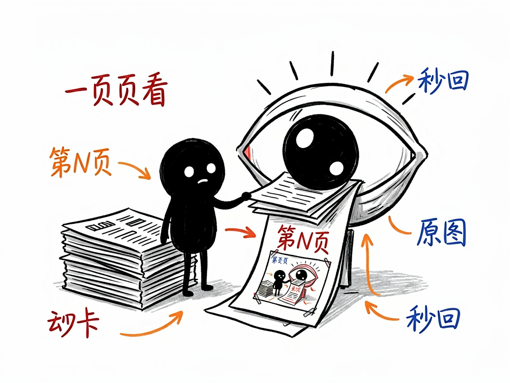

## 它到底能做什么
- 建一次索引，反复提问：第一次处理一份 PDF 需要几分钟（120 页约 3–5 分钟），之后所有提问都是秒级响应，索引会缓存复用。
- 回答带页码引用：每个答案后面跟着 `[第N页]`，方便你翻回原 PDF 对照。
- 命中页原图展示：把答案引用的页面截图直接给你，还会生成一个双击就能打开的网页预览（答案 + 全部引用页都打包在里面，不用联网）。
- 看懂"搜不出来"的内容：扫描版、图表、表格、代码块，这些传统文字搜索的盲区，它都按画面理解。
- 粗筛 + 精排 + 深读的三级流程：先本地快速筛出候选页（零费用），再视觉精排挑出最相关的几页，最后只对命中页深读作答——既省钱又准。
- 想直接翻某几页也行：指定页码，它把那几页渲染成高清图给你。

## 怎么用
你需要在 AI 助手（如 codex / workbuddy 等 agent）里装好这个技能，并配好 DeepSeek 的 API Key。之后全程说人话：
**场景 1：问手册里的参数**
你：这份空调说明书，滤网多久换一次？
AI：它翻完索引后告诉你"建议每 3 个月更换 `[第14页]`"，并把第 14 页原图发给你，上面就印着这条说明。
**场景 2：查合同条款**
你：这份合同里违约金是怎么约定的？
AI：它引用对应页码作答，并把那几页原文截图给你，让你自己核对措辞，不怕它编。
**场景 3：读扫描版报告**
你：这份盖章的竣工报告，验收结论是什么？
AI：即使是纯扫描图片、一个字都搜不出来的 PDF，它照样"看"出结论并给出页码。

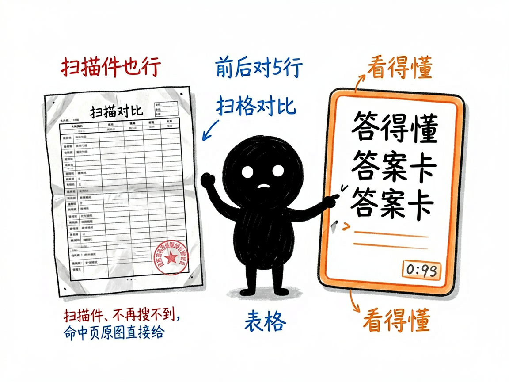

## 谁适合用
- 经常和长文档打交道的人：律师、财务、采购、研究员、学生。
- 手里有一堆扫描版资料（纸质盖章件、老档案）想数字化提问的人。
- 需要让 AI 回答"可核查"的人——答案必须带页码、能给原图，不接受模型张口就来。

## 一点说明
它是一套 AI 技能（skill），不是双击打开的 App。你需要把它装进支持技能的 AI 助手里使用，并自备 DeepSeek API Key（按调用量付费，建一次索引约几毛到几块钱，之后提问很便宜）。视觉理解基于 DeepSeek 官方接口，能力以官方文档为准。

## 闲鱼接单文案

> 以下服务展示在闲鱼 / 淘宝服务市场发布，用于承接本 skill 的定制开发订单。

**标题：PDF智能问答skill定制开发（视觉大模型/扫描件也能问）**

**描述：**

专注 AI Agent 技能（skill）定制开发，现成作品可先看演示再下单。基于 DeepSeek 视觉大模型的 PDF 深度问答技能：AI 一页页"看"完整份 PDF 建立视觉索引，之后随口提问，答案带 `[第N页]` 页码引用并附命中页原图，扫描版、图表、表格、代码块都能看懂，还自动生成双击即开的网页版预览。支持按你的业务场景定制页码引用格式、批量文档管理、私有知识库接入等。

**服务内容：**

- 1、需求沟通梳理：先聊清楚你的文档类型（手册 / 合同 / 财报 / 论文 / 扫描件）、提问场景和引用格式要求，列明功能清单后再动手
- 2、skill交付内容和格式：视觉索引构建 + 三级检索问答（粗筛 / 精排 / 深读）+ 页码引用 + 命中页原图 + 自包含 HTML 预览的完整技能工程
- 3、项目功能/系统开发：按你的业务定制多文档批量索引、缓存管理、权限接入、问答结果导出等流程的开发与联调
- 4、skill源码交付：SKILL.md 技能说明 + Python 脚本 + 参考文档 + 使用演示，兼容 codex / workbuddy 等 agent。全部源码 + 安装部署说明，交付后可自行修改维护

---

<!-- 来源: deepseek-v4-flash-vision-video-rag.md -->

# 一段视频里的事，想问 AI"第几秒发生的"？它让 AI 把视频看完再回答你—— deepseek-v4-flash-vision-video-rag 介绍

你有没有过这种时刻：几个小时的游戏录像想找那次关键团战在第几分几秒；监控视频想确认某个人是什么时候出现的；一部教程视频想定位某个操作步骤；或者就想问"视频里总共出现了几次红色物品"。拖进度条一帧帧找，找到眼花；普通 AI 工具要么只看个封面，要么让你自己截好图再问。你真正想要的是：把视频丢给 AI，它自己看完，然后像看过全片的人那样回答你——还告诉你发生在第几秒。

**deepseek-v4-flash-vision-video-rag 就是来解决这件事的。**

它用 DeepSeek 的视觉大模型，把视频按时间轴抽成一帧帧画面去"看"：先宏观扫一遍建索引（一次性，之后缓存复用），你提问时再对相关片段深读。回答会带着 `[MM:SS]` 时间戳引用，并且自动把引用时刻剪成**可以播放的片段**和关键帧给你——它说 04:12 发生了什么，你点开 04:12 的片段就能亲眼验证。

---

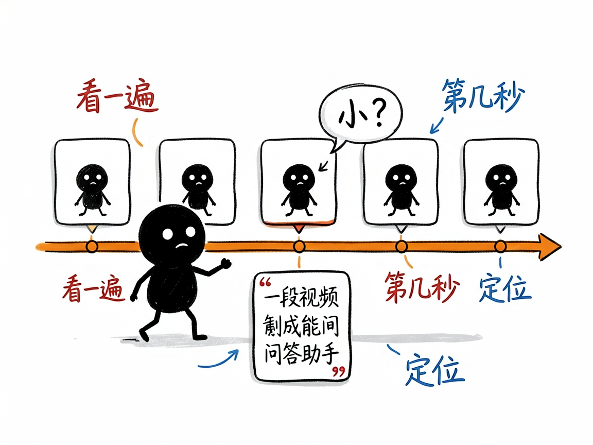

## 它到底能做什么
- 一次性看完，反复提问：建索引阶段自动按视频时长决定抽帧密度（短视频每秒 1 帧，长视频自动降密度），30 秒的视频约 30 秒建完索引，之后每次提问只需 2–3 次模型调用。
- 回答带时间戳引用：每个答案后面跟着 `[MM:SS]`，直接定位到秒。
- 自动剪出可播放片段：引用的时刻会被剪成 mp4 片段，还有该时刻的关键帧图片；全部打包进一个双击即开的网页预览，不用联网。
- 剧情理解与事件时间线：能梳理"先后发生了什么"，也能数次数、找规律。
- OCR 字幕 / HUD 识别：画面里的字幕、游戏界面数字也看得见。
- 动作细节放大：问到"瞄准 / 击杀 / 瞬间"这类动作时，自动对运动最强的时刻做 12fps 逐帧放大分析。
- 想直接看某一秒也行：指定时刻，它给你那一帧的高清图，或指定区间，它剪一段给你。

## 怎么用
你需要在 AI 助手（如 codex / workbuddy 等 agent）里装好这个技能，配好 DeepSeek 的 API Key，电脑上有 ffmpeg。之后全程说人话：
**场景 1：找游戏高光**
你：这局录像，我五杀是在什么时候？
AI：它看完索引后回答"五杀发生在 `[04:12]`"，并附上 04:05–04:15 的可播放片段，你点开就能回看。
**场景 2：查监控**
你：这段监控里，穿红衣服的人第一次出现在第几秒？
AI：它给出带时间戳的答案和对应关键帧截图，人影清清楚楚。
**场景 3：看教程**
你：这个教程里，调色的那一步在第几分钟？
AI：直接给时间戳和片段，不用你从头拖进度条。

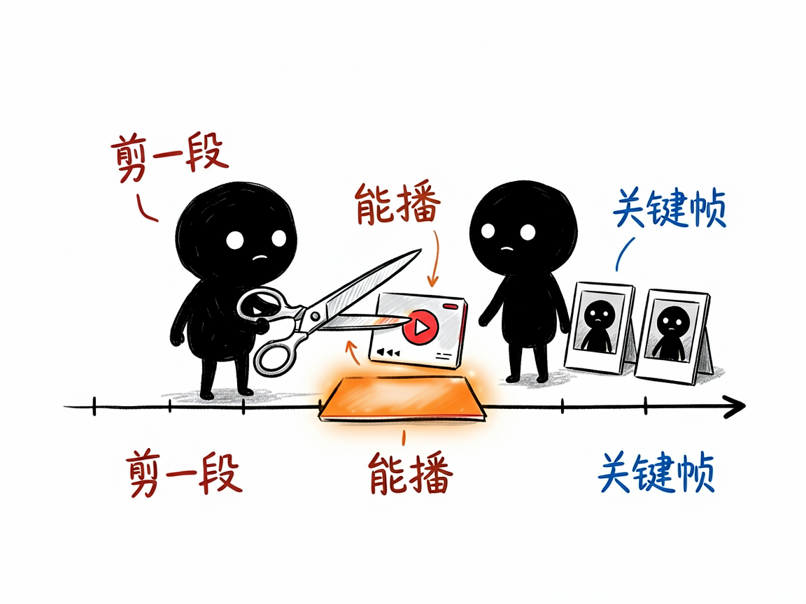

## 谁适合用
- 游戏玩家 / 主播：从长录像里快速定位高光、失误、素材点。
- 有监控回看需求的人：小店老板、家长、物业管理。
- 内容创作者：从素材里按"第几秒发生了什么"检索画面，剪片更快。
- 需要让 AI 回答"可验证"的人：每个结论都有片段回放作证，不接受模型瞎猜。

## 一点说明
它是一套 AI 技能（skill），不是双击打开的 App。你需要把它装进支持技能的 AI 助手里使用，并自备 DeepSeek API Key（按调用量付费）。它的理解完全基于画面，**没有音频分析能力**——视频里说了什么话它听不见，但画面里的字幕文字它看得见。时间戳定位有约 ±2 秒误差，精确时机以片段回放为准。

## 闲鱼接单文案

> 以下服务展示在闲鱼 / 淘宝服务市场发布，用于承接本 skill 的定制开发订单。

**标题：视频智能问答skill定制开发（时间戳定位/自动剪片段）**

**描述：**

专注 AI Agent 技能（skill）定制开发，现成作品可先看演示再下单。基于 DeepSeek 视觉大模型的视频理解问答技能：AI 按时间轴把视频抽帧看完建立索引，之后随口提问，答案带 `[MM:SS]` 时间戳引用，并自动剪出可播放片段、关键帧和自包含网页预览。支持剧情理解、事件时间线、字幕 / HUD 识别、动作细节 12fps 放大分析。适合游戏高光定位、监控回看、素材检索等场景，可按业务定制。

**服务内容：**

- 1、需求沟通梳理：先聊清楚你的视频类型（录像 / 监控 / 教程 / 素材）、提问场景和输出格式要求，列明功能清单后再动手
- 2、skill交付内容和格式：抽帧索引 + 三级检索问答（粗筛 / 精排 / 深读）+ 时间戳引用 + 可播放片段 + 关键帧 + 自包含 HTML 预览的完整技能工程
- 3、项目功能/系统开发：按你的业务定制批量视频管理、片段导出规格、时间线报告生成等流程的开发与联调
- 4、skill源码交付：SKILL.md 技能说明 + Python 脚本 + 参考文档 + 使用演示，兼容 codex / workbuddy 等 agent。全部源码 + 安装部署说明，交付后可自行修改维护

---

<!-- 来源: directing-xiaohei-videos.md -->

# 想让一个黑色小家伙帮你把文章拍成短视频？—— directing-xiaohei-videos 介绍

刷到过那种白底手绘小动画吗？一个实心黑色的小家伙，白点眼睛、细腿、表情永远淡淡的，在纯白画布上认真做一件有点傻的事——讲"信任碎了补不回来"，它就把摔碎的碗粘好，倒水给你看水从裂缝漏出来。看的人先觉得"有点怪"，一秒后突然看懂。directing-xiaohei-videos 就是让 AI 当这种视频的导演：你给主题或文章，它交一条成片。

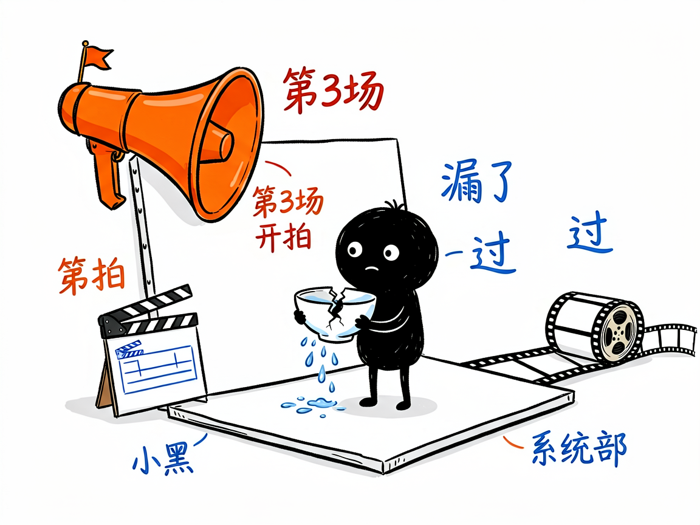

## 它到底能做什么

- **一句话出片**：「用小黑视频讲讲《穷爸爸富爸爸》的核心原理」，等一会儿拿到一条约 1 分钟的竖屏成片（含旁白、字幕、手写批注）。
- **全流程导演**：发明隐喻构图（低科技怪机器 + 小黑动作主体）→ 拆六场分镜 → 写解说词 → 生成动画 → 免费配音 → 后期叠字 → 质检。
- **两阶段确认**：先给你导演方案（分镜 + 解说词 + 批注规划），你点头才开做；改比例、改语言会自动重出方案。
- **默认全免费管线**：Agnes 免费首帧图 + 免费关键帧动画 + edge-tts 免费配音，**一条视频 0 元**（排队约 30-45 分钟）；要 10-15 分钟快速通道可切付费兜底（约 7-13 元/条）。

## 怎么用

**场景 1：讲一个道理**
你：用小黑视频讲讲注意力是怎么被切碎的。
AI：出方案——小黑在两台机器之间来回奔跑，最后累瘫。你批准后成片。

**场景 2：改编文章**
你：把这篇文章做成小黑动画（附文章）。
AI：读懂挑重点，拆六场，旁白 240-270 字，交成片。

## 谁适合用

- 做知识区、观点类短视频的创作者。
- 有文章/笔记想视频化的写作者。
- 想要零成本批量试错的短视频玩家。

## 一点说明

本技能需自备免费 Agnes API key（官网免费领取）。竖屏 9:16 为默认（16:9 也可）。B 站有 demo 成片可看效果。配套 ian-xiaohei-illustrations 是它的姊妹技能（静态配图版）。

## 闲鱼接单文案

> 以下服务展示在闲鱼 / 淘宝服务市场发布，用于承接本 skill 的定制开发订单。

**标题：白底手绘小黑动画短视频（免费管线）skill 软件开发**

**描述：**

专注 AI Agent 技能（skill）定制开发，已做出小黑动画视频导演技能，现成作品可先看 B 站 demo 再下单。你给主题或文章，AI 全流程当导演：发明隐喻构图、拆六场分镜、生成手绘风动画、配中文旁白、后期叠手写批注，交一条约 1 分钟竖屏成片。默认免费管线一条 0 元（Agnes 免费图 + 免费视频 + edge-tts），先出方案确认再制作，改稿只改那一段。支持按你的内容调性定制隐喻风格与批注规范，交付后装进 codex / workbuddy 等 AI 助手即可使用，全部源码交付、支持二次开发。

**服务内容：**

- 1、需求沟通梳理：先聊清楚你的内容类型（道理讲解、文章改编还是产品观点）、竖屏横屏和时长预期，确认免费 key 或付费通道，列明功能清单后再动手
- 2、skill交付内容和格式：完整成片样例（六场分镜 + 旁白 + 批注的成品 mp4）+ 导演方案模板
- 3、项目功能/系统开发：按你的账号调性定制隐喻库、批注色板语义与 QA 标准，可扩展批量排期、多语言旁白等功能的开发与联调
- 4、skill源码交付：SKILL.md 技能说明 + 隐喻发明法 / 分镜模板 / 生产管线 / 质检清单组成的完整技能工程，兼容 codex / workbuddy 等 agent。全部源码 + 安装部署说明 + 使用演示，交付后可自行修改维护

---

<!-- 来源: ecom-details-image.md -->

# 电商主图详情页，一套 Prompt 全搞定？—— ecom-details-image 介绍

做电商最烦的素材环节：主图要白底图、详情页要场景图、社媒要推广图、直播要背景图，一个产品几十张图，找设计师排期两周，改稿改到崩溃。ecom-details-image 把这件事变成一句话：输入产品图和需求描述，自动生成全套电商视觉素材——不配 API 时给你可执行的 Prompt，配了 API 直接出图。

## 它到底能做什么

- **25 种场景模板**：白底主图、生活方式、平铺摆拍、细节特写、海报 Banner、社媒 UGC、模特展示、前后对比、爆炸图、虚拟试穿、直播间场景……
- **Campaign Style Lock**：多图自动锁定色板、冷暖调、字体、光线、布局——整套图视觉一致，不会一张一个风格。
- **转化驱动诊断**：自动判断你的产品是视觉驱动、痛点驱动还是情感价值驱动，针对性排图片序列。
- **参考图生成**：传入产品实拍图，生成的产品外观贴近真实商品，不会画歪你的包装。
- **双模式**：只出 Prompt（拿去任何生图工具用）或直连你自己的 OpenAI 兼容 API 出图。

## 怎么用

**场景 1：新品上架全套图**
你：这是我的产品图，帮我生成 Amazon 主图 7 张 + 详情页 6 屏。
AI：诊断转化类型 → 排图片序列 → Style Lock 锁定视觉 → 输出全套 Prompt（配置了 API 则直接出图）。

**场景 2：社媒推广**
你：给我的保温杯出 5 张小红书风格的种草图。
AI：套 UGC 模板，生活场景+近景+手持角度，5 条 Prompt 一次给出。

## 谁适合用

- 跨境电商卖家（Amazon/Shopify/独立站）。
- 国内电商运营（淘宝/拼多多/抖音小店）。
- 需要批量出营销图但设计资源不足的团队。

## 一点说明

本技能提示词模板源自开源项目（buluslan/gpt-image2-ecommerce，致谢 linux.do 社区）。生图脚本纯 Python 标准库实现零依赖；未配置 API 时 Prompt 模式完全可用。

## 闲鱼接单文案

> 以下服务展示在闲鱼 / 淘宝服务市场发布，用于承接本 skill 的定制开发订单。

**标题：电商主图详情页批量生成（25 模板）skill 软件开发**

**描述：**

专注 AI Agent 技能（skill）定制开发，已做出电商视觉素材批量生成技能，现成作品可先看演示再下单。25 种场景模板覆盖白底主图、场景生活图、平铺摆拍、详情页长图、社媒 UGC、直播间背景、模特展示、爆炸图、虚拟试穿，Campaign Style Lock 保证整套图色板字体光线布局一致，自动诊断视觉/痛点/情感驱动并排图片序列，支持只出 Prompt 或直连你自己的 API 出图。支持按你的品类和品牌调性定制模板，交付后装进 codex / workbuddy 等 AI 助手即可使用，全部源码交付、支持二次开发。

**服务内容：**

- 1、需求沟通梳理：先聊清楚你的平台（Amazon/Shopify/淘宝/抖音）、品类和素材规格需求（主图几张、详情页几屏），确认可用的生图 API，列明功能清单后再动手
- 2、skill交付内容和格式：全套视觉简报 + 可执行生图 Prompt 序列（配置 API 则含成图样例）
- 3、项目功能/系统开发：按你的品牌调性定制专属模板与 Style Lock 规则，可扩展批量任务队列、多语言版本等功能的开发与联调
- 4、skill源码交付：SKILL.md 技能说明 + 25 模板库 / 生图脚本 / 诊断逻辑组成的完整技能工程，兼容 codex / workbuddy 等 agent。全部源码 + 安装部署说明 + 使用演示，交付后可自行修改维护

---

<!-- 来源: ecom-video-seedance-prompt.md -->

# 刷到一条带货爆款视频，想让 AI 照着再来一条？—— ecom-video-seedance-prompt 介绍

你刷到一条带货视频卖爆了，心想"我也想来一条这样的"。可真到自己写提示词就傻眼了：写"拍一个好看的视频"，AI 给你一坨废片；人家写的是"25 岁亚洲女性，黑色齐肩长发，缓慢转身，嘴角微微上扬，暖光侧逆光，中景缓慢推镜，面部不变形"——一次出片。差距不在模型，在提示词。可要把一条 10 秒视频逐帧拆成这样的分镜表，编导得盯半天。

**ecom-video-seedance-prompt 就是来解决这件事的。**

你给它一条带货视频，它还你一套可以直接粘贴进即梦（Seedance）的完整提示词包。基于 DeepSeek 视觉大模型。

---

## 它到底能做什么
- 看懂视频：1fps 抽帧 + 场景切换检测自动切镜头，每个镜头拆出一张 S-A-C-S-C 卡片——主体、动作时序、场景光影、镜头语言、色调情绪，一项不落。
- 全局分析：判断这是什么产品、什么带货框架、自然流还是付费流、钩子在哪、卖点是什么、节奏怎么排。
- 生成提示词包：每镜头一条（≤200 字，带时间锚点）+ 完整版整段（≤800 字，直接粘贴）+ 中英双语负面词 + @参考图清单。
- 三种风格开关：`faithful` 忠实复刻、`organic` 自然流种草、`paid` 千川付费流，同一份分镜表可反复换风格重出。
- 产品信息注入：`--product` 告诉它你卖的到底是什么（品牌、卖点、色号），别让 AI 自己去猜。
- 单镜头重出：`--shot B` 只重出不满意的那个镜头，其他镜头不动。
- 逐镜对照 HTML：每条提示词旁边就摆着原片关键帧，肉眼核对拆解得准不准。
- 拆解永久缓存：同一条视频出三版风格，只花 1 次拆解 + 3 次生成。

## 怎么用
你不需要记复杂流程。在 codex / workbuddy 等 agent 装好 skill、配好 DeepSeek key 后，直接对 AI 说话就行：
**场景 1：拆解一条爆款视频**
你：帮我拆解这条带货视频，看看它是怎么拍出来的。
AI：它抽帧切镜头、逐镜头做 S-A-C-S-C 拆解，再给出全局分析（品类、框架、流量类型、钩子、卖点），存成可反复用的分镜表。
**场景 2：照着复刻一版提示词**
你：按忠实复刻给我提示词，我卖的是 XX 品牌精华液，主打烟酰胺美白，蓝色玻璃瓶身。
AI：它结合分镜表和你的产品信息，生成每镜头提示词、完整版、负面词和参考图清单，附一份与原片的差异说明。
**场景 3：换个流量逻辑再来一版**
你：这版我们要跑千川投放，改成付费流。
AI：它按付费流规则系统性改写——强化钩子、极致特写、硬光侧逆光、加快节奏，提示词整包重出。

## 谁适合用
- 做电商带货、想批量复刻爆款视频结构的商家和投手。
- 帮客户做短视频的信息流代理商、编导。
- 想搞清楚"爆款到底好在哪"的内容从业者。

## 一点说明
ecom-video-seedance-prompt 是一套 AI 技能，装进 codex / workbuddy 等 agent 后对话使用，需要自备 DeepSeek API key。它是"翻译官"不是"播放器"——产出的是提示词，成片要到即梦里生成。模型没有音频模态，口播内容是从画面和字幕推断的，准确口播建议自己补（15 秒配约 120 字）。品牌 LOGO 等不可控元素会在差异说明里如实列出。姊妹版 `glm-ecom-video-seedance-prompt` 用 GLM 引擎，同一套方法论。

## 闲鱼接单文案

> 以下服务展示在闲鱼 / 淘宝服务市场发布，用于承接本 skill 的定制开发订单。

**标题：带货视频AI复刻提示词生成（Seedance/即梦）skill软件开发**

**描述：**

专注 AI Agent 技能（skill）定制开发，已做出"把带货爆款视频翻译成即梦提示词"的成品技能，现成作品可先看演示再下单。输入一条爆款视频，自动拆解镜头、按 S-A-C-S-C 五要素生成每镜头提示词、完整版提示词、中英负面词和参考图清单，支持忠实复刻/自然流/付费流三种风格一键切换。支持按你的品类和投放场景做个性化定制，交付后装进 codex / workbuddy 等 AI 助手即可使用，全部源码交付、支持二次开发。

**服务内容：**

- 1、需求沟通梳理：先聊清楚你的品类、投放渠道（自然流/千川）、常复刻的视频风格，确认 DeepSeek 账号与额度，列明功能清单后再动手
- 2、skill交付内容和格式：镜头拆解分镜表（JSON）+ 每镜头提示词 + 完整版提示词 + 中英负面词 + 参考图清单 + 逐镜对照 HTML
- 3、项目功能/系统开发：按你的品类定制拆解字段、编导规则、风格模板与负面词库的开发与联调
- 4、skill源码交付：SKILL.md 技能说明 + 提示词 / 脚本 / 知识库 / 生成样例组成的完整技能工程，兼容 codex / workbuddy 等 agent。全部源码 + 安装部署说明 + 使用演示，交付后可自行修改维护

---

<!-- 来源: edu-analytic-geometry.md -->

# 一道解析几何题，怎么变成能动手拖的网页 —— edu-analytic-geometry 介绍

做解析几何题的时候，你是不是经常遇到这种情况：参考答案写了一大串推导，可椭圆、双曲线、抛物线到底怎么动起来的，光看纸面上的数字根本想象不出来。尤其是那种"求取值范围""证明定值"的题，结论明明是活的，却被印成了死的。

edu-analytic-geometry 就是来解决这件事的：你给它一道解析几何题（文字、图片、或者让它随机出一道都行），它帮你在 AI 里产出一个能用浏览器直接打开的网页——左边是题面和一根能拖的滑块，中间是分步推导，右边是一块会跟着滑块实时变化的几何画板。拖一拖，题目里的"范围"和"定值"就活过来了。

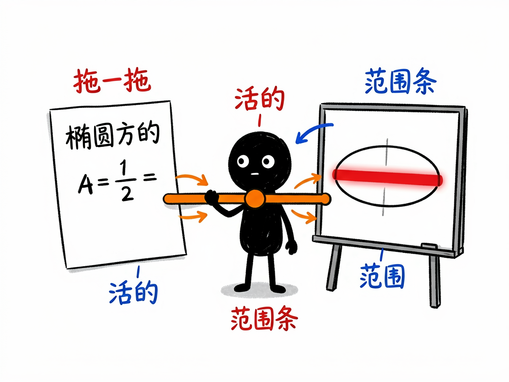

## 它到底能做什么
- 把椭圆、双曲线、抛物线、圆相关的题做成单页交互网页，三栏布局一目了然（题面 + 推导 + 画板）。
- 用一根滑块驱动实时重算：拖一下，交点坐标、弦长、向量数量积、三角形面积这些几何量立刻更新，不用你手算。
- 做"取值范围题"和"定值题"特别拿手——画板上会直接标出"理论范围条"或"定值指示"，很多教辅写错的端点开闭它也能算对。
- 右侧画板画出圆锥曲线和动点、动直线、向量，还能用画笔随手圈画重点。
- 背后用精确的符号计算算答案，保证网页上显示的数字、曲线和推导过程完全一致，不会自相矛盾。
- 支持三种入口：直接给它文字题、拍张题图让它识别、或者让它随机抽一道圆锥曲线题给你练手。

## 怎么用

你不需要记任何命令。在 codex / workbuddy 等 agent 装好 edu-analytic-geometry 技能后，直接对 AI 说话就行：

**场景 1：求数量积的取值范围**
你：帮我把这道解析几何题做成能拖滑块看范围的交互网页：已知椭圆 x²/4 + y²/3 = 1，过右焦点作直线交椭圆于 A、B 两点，求向量 MA·MB 的取值范围。
AI：AI 先精确算出答案（比如闭区间 [-3, 7/4]，很多教辅会少算一个端点），再生成一个网页；你拖动角度滑块，画板上的直线和交点实时移动，左下角的"范围条"会跟着标出端点，被漏掉的端点也看得见。

**场景 2：随机练手**
你：给我随机出一道圆锥曲线题，做成能拖着玩的网页。
AI：AI 抽一道题，生成带滑块的交互网页，你拖一拖就能直观体会曲线怎么动、范围怎么变。

**场景 3：拍照识别**
你：我拍了道解析几何题的照片，帮我做成能拖的网页。
AI：AI 识别题图，生成对应的交互网页，把题里的"定值""范围"用画板演活。

## 谁适合用
- 高中数学老师在备圆锥曲线专题时，做能当堂演示的课件。
- 学生自己刷题想"看懂为什么"，而不是只背结论。
- 家长想帮孩子把抽象的解析几何讲明白。
- 写教辅、做数学科普内容的人，需要高质量的动态配图。

## 一点说明
这是个给 AI 用的技能（skill），不是普通人直接打开的 App。平时你不用自己折腾环境，只要把题交给装好它的 AI，它就会帮你产出那个网页文件。底层用到的符号计算由 AI 在背后完成，你不必自己安装。它专注"解析几何"（带坐标轴、有圆锥曲线），纯平面几何的三角形、四边形证明请看下一个技能 edu-plane-geometry。

## 闲鱼接单文案

> 以下服务展示在闲鱼 / 淘宝服务市场发布，用于承接本 skill 的定制开发订单。

**标题：解析几何交互课件开发 skill软件开发**

**描述：**

专注 AI Agent 技能（skill）定制开发，已做出解析几何交互课件技能，现成作品可先看演示再下单。把椭圆、双曲线、抛物线的题变成"题面 + 滑块 + 分步推导 + 实时画板"的三栏网页，取值范围题带"范围条"、定值题带"定值指示"，背后用精确符号计算保证数字、曲线和推导完全一致。支持文字题、拍照识别、随机出题三种入口，可按你的教材和题型定制，全部源码交付、支持二次开发。

**服务内容：**

- 1、需求沟通梳理：先聊清楚你的用途（备课课件 / 学生自学 / 教辅动态配图）和题目范围，确认典型题目样例，列明功能清单后再动手
- 2、skill交付内容和格式：可拖滑块的交互网页文件（浏览器直接打开）：题面与控制台、分步推导、实时几何画板、范围条 / 定值指示
- 3、项目功能/系统开发：按你的教材版本和题型定制页面布局、滑块参数与推导风格，可扩展题库批量生成等功能的开发与联调
- 4、skill源码交付：SKILL.md 技能说明 + 提示词 / 脚本 / 模板 / 网页样例组成的完整技能工程，兼容 codex / workbuddy 等 agent。全部源码 + 安装部署说明 + 使用演示，交付后可自行修改维护

---

<!-- 来源: edu-chem-reaction.md -->

# 化学反应到底怎么断键成键，让它变成能转着看的 3D 动画 —— edu-chem-reaction 介绍

化学课上讲到"甲烷燃烧""酯化反应"这些，课本上大多是一行反应方程式，最多配几根化学键的示意图。可学生真正想看的是：原子到底是怎么断开旧键、连上新键、重新组合的？为什么反应前后原子总数一点没少？纸上的箭头，很难把这个过程演活。

edu-chem-reaction 就是来解决这件事的：你给它一个化学反应（写文字、写方程式、或者拍张图都行），它帮你在 AI 里产出一个能旋转缩放的 3D 网页——一边是分子在三维空间里断键、成键、重新拼装的动画，一边是配平好的方程式、分步讲解和"原子守恒计数器"，让你亲眼看见反应前后每个原子都去哪儿了。

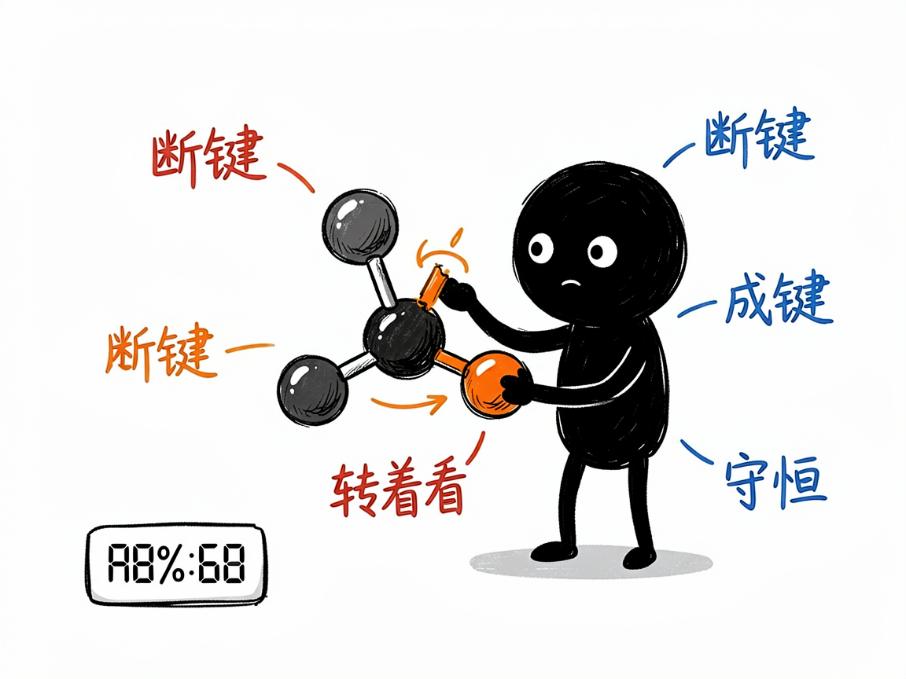

## 它到底能做什么
- 把燃烧、化合、分解、置换、复分解等反应做成微观 3D 演示，让你拖着转、滚轮缩放。
- 用一根"反应进度"滑块，逐帧看化学键的断裂和生成、原子重新组合，关键步骤还会高亮加文字说明。
- 做氧化还原题很实用：能把电子怎么转移清清楚楚地画出来（比如钠和氯气反应）。
- 处理有机机理（如酯化反应）时，会专门展示催化剂和"过渡态"这种关键瞬间。
- 自动配平方程式，并校验"原子守恒"——反应前几种原子、几个，反应后还是那几个，不会算错。
- 还能叠加火焰、能量-反应进程曲线等效果，让放热、吸热一目了然。

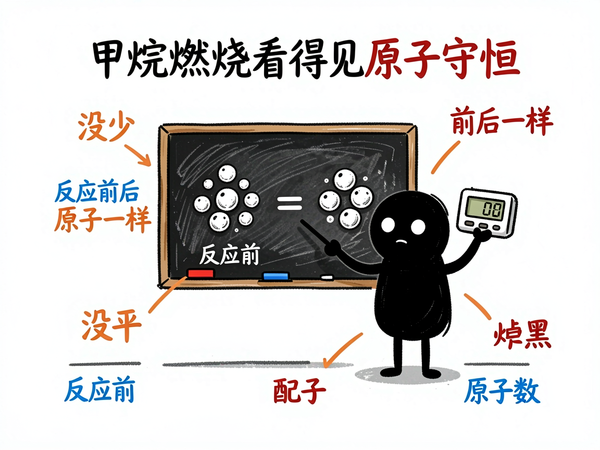

## 怎么用

你不需要记任何命令。在 codex / workbuddy 等 agent 装好 edu-chem-reaction 技能后，直接对 AI 说话就行：

**场景 1：复习甲烷燃烧**
你：帮我把"甲烷燃烧"做成一个能拖滑块看断键成键的 3D 网页，带火焰和能量曲线。
AI：AI 先帮你把方程式配平，再生成一个能旋转缩放的 3D 网页；你拖动"反应进度"滑块，就能看到甲烷和氧气的分子慢慢拆开、碳原子氧原子重新拼成二氧化碳、氢原子拼成水，右侧的原子守恒计数器始终不掉数。

**场景 2：搞懂氧化还原**
你：我想看钠和氯气反应时电子是怎么转移的，做成 3D 动画。
AI：AI 做一个 3D 演示，把钠失去电子、氯气得到电子的过程一步步高亮出来，配合文字说明，电子转移一目了然。

**场景 3：理解有机机理**
你：把酯化反应里催化剂和过渡态那一下演示给我看。
AI：AI 生成专门的 3D 片段，聚焦催化剂参与和过渡态形成的瞬间，帮你理解有机反应的关键步骤。

## 谁适合用
- 初高中化学老师做"微观世界"演示，把看不见的反应讲给学生看。
- 学生理解配平、守恒、氧化还原这些容易晕的概念。
- 科普作者做化学反应的科普动画。
- 需要分子级机理示意的教学内容制作者。

## 一点说明
这是个给 AI 用的技能（skill），不是普通人直接打开的 App；你通常把反应交给装好它的 AI，它帮你产出网页。底层用到的符号计算、分子模型这些都由 AI 在背后完成，你不必自己安装任何东西。如果你手上有更真实的分子构象数据，产出的模型会更逼真，但 AI 不会擅自改动你的电脑环境。具体能覆盖哪些反应、生成效果如何，以技能实际产出为准。

## 闲鱼接单文案

> 以下服务展示在闲鱼 / 淘宝服务市场发布，用于承接本 skill 的定制开发订单。

**标题：化学反应3D动画课件开发 skill软件开发**

**描述：**

专注 AI Agent 技能（skill）定制开发，已做出化学反应 3D 演示技能，现成作品可先看演示再下单。把"甲烷燃烧""酯化反应"这类方程式变成能旋转缩放的 3D 网页：用"反应进度"滑块逐帧看断键成键、电子转移高亮演示、自动配平方程式并带原子守恒计数器，还能叠加火焰和能量曲线。可按你的课程内容定制，全部源码交付、支持二次开发。

**服务内容：**

- 1、需求沟通梳理：先聊清楚要演示的反应清单和教学重点（配平 / 守恒 / 氧化还原 / 有机机理），确认目标学段，列明功能清单后再动手
- 2、skill交付内容和格式：可旋转缩放的 3D 动画网页：分子断键成键过程、反应进度滑块、配平方程式与原子守恒计数器、电子转移高亮、能量曲线
- 3、项目功能/系统开发：按你的课程定制反应库、动画节奏与讲解文案，可扩展整套课件批量生成等功能的开发与联调
- 4、skill源码交付：SKILL.md 技能说明 + 提示词 / 脚本 / 模板 / 网页样例组成的完整技能工程，兼容 codex / workbuddy 等 agent。全部源码 + 安装部署说明 + 使用演示，交付后可自行修改维护

---

<!-- 来源: edu-chem-tutorial.md -->

# 一节复杂的化学课，怎么变成能一步步播放的互动网页 —— edu-chem-tutorial 介绍

有些化学内容，不是"一道题"能讲清的，而是一串知识点：比如氧化还原怎么配平、金属活动性顺序怎么排、元素周期律怎么理解。老师在黑板上讲这些，往往要翻好几页、画好几张图。学生想自己复习时，又得把零散的笔记拼起来。

edu-chem-tutorial 就是来解决这件事的：你给它一个化学主题（比如"氧化还原方程式配平"），它帮你在 AI 里产出一个能一步一步播放的网页课程——每走一步，画面上有对应的动画示意，侧边栏同步给出讲解和要点，顶部还有概览卡片，像有个小老师带着你一点点往下学。

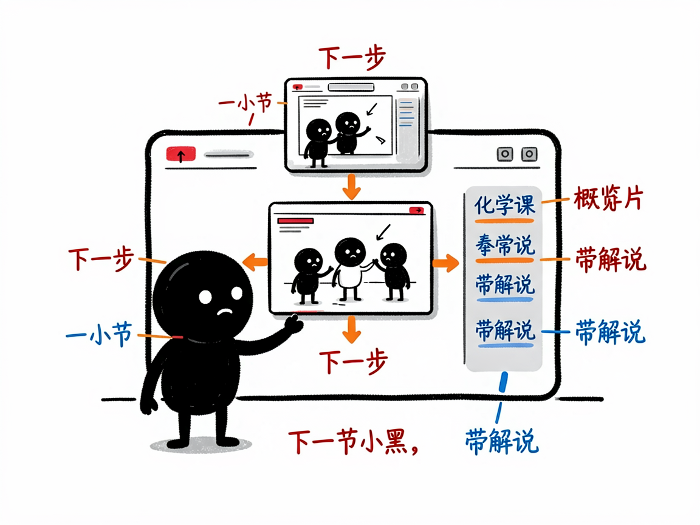

## 它到底能做什么
- 把一整节化学课做成 5 到 15 步的互动课程页，每一步配一段动画，而不是干巴巴的文字。
- 顶部放概览信息卡片，侧边栏放讲解和要点列表，方便学生边看边抓重点。
- 自带播放器控制：能播放、暂停、前后步进，也可以自动按顺序播放，像看带解说的幻灯片。
- 内置一套化学常用绘图原语，做反应图示、微观示意、对比卡都很顺手。
- 适合讲那些"解释型"的复杂主题，比如氧化还原配平、金属活动性、元素周期律、离子共存、速率与平衡等。

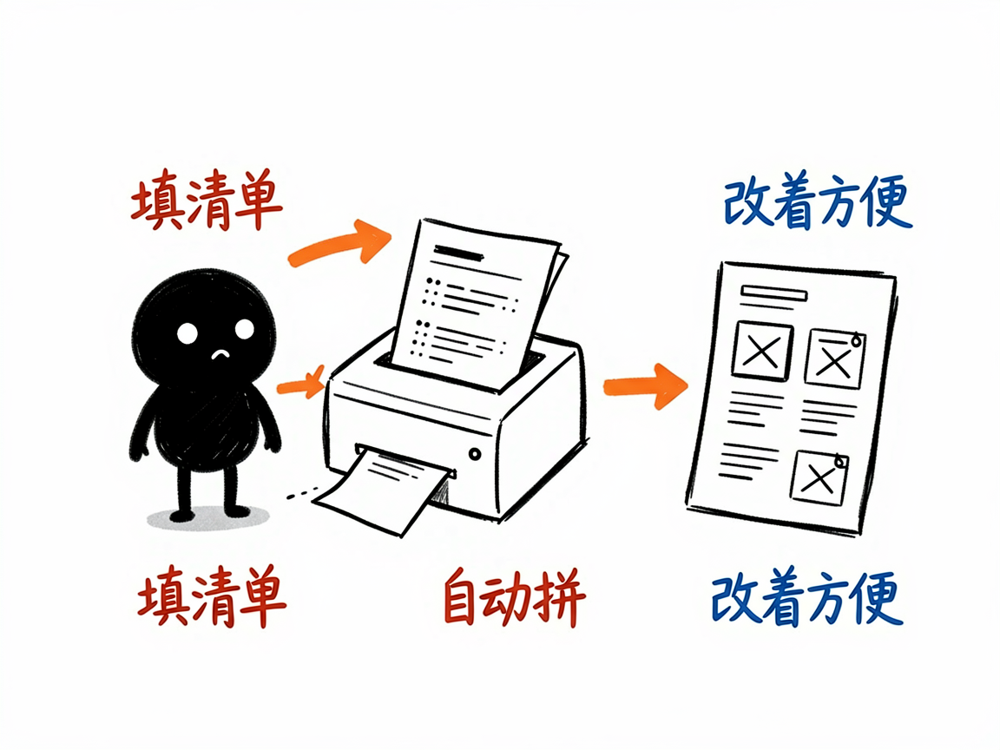

## 怎么用

你不需要记任何命令。在 codex / workbuddy 等 agent 装好 edu-chem-tutorial 技能后，直接对 AI 说话就行：

**场景 1：备一节氧化还原的课**
你：帮我把"氧化还原方程式配平"做成一节能一步步播放的互动网页课，从化合价概念讲到电子守恒。
AI：AI 自动整理出 5 到 15 步的课程结构，每一步配对应的动画和讲解卡片，生成一个能播放、暂停、前后翻页的网页课件，学生按自己的节奏一点点学。

**场景 2：做元素周期律微课**
你：我想要一节讲元素周期律的互动小课，带概览卡片和要点列表。
AI：AI 产出带顶部概览卡、侧边要点栏的分步课程页，把周期律的规律用动画和对比卡讲清楚，适合学生自学或课堂上播放。

**场景 3：复习金属活动性**
你：把金属活动性顺序做成能自动播放的讲解页。
AI：AI 生成幻灯片式课件，按活动性强弱一步步演示，并配上讲解和知识卡片。

## 谁适合用
- 化学老师把一节课备成可反复播放、学生能自学的课件。
- 学生复习重难点章节，按自己的节奏一步步看。
- 科普作者把化学知识做成系列互动小课。
- 培训机构做线上化学微课。

## 一点说明
这是个给 AI 用的技能（skill），不是普通人直接打开的 App；你一般把主题交给装好它的 AI，它帮你产出网页。它用纯网页技术生成，打开即用，不依赖额外的程序库。它擅长的是"分步骤讲解型"化学课；单一反应的微观 3D 演示请看同系列的 edu-chem-reaction。具体能做出哪些场景动画，以技能实际支持为准。

## 闲鱼接单文案

> 以下服务展示在闲鱼 / 淘宝服务市场发布，用于承接本 skill 的定制开发订单。

**标题：化学互动微课课件开发 skill软件开发**

**描述：**

专注 AI Agent 技能（skill）定制开发，已做出化学分步互动课件技能，现成作品可先看演示再下单。把"氧化还原配平""元素周期律"这类主题做成 5–15 步的互动课程网页，每一步配动画示意，顶部概览卡片、侧边讲解要点，支持播放 / 暂停 / 步进，像带解说的幻灯片。适合氧化还原、金属活动性、离子共存、速率与平衡等"解释型"主题，可按你的教材定制，全部源码交付、支持二次开发。

**服务内容：**

- 1、需求沟通梳理：先聊清楚课程主题、目标学段和课程步数规模（5–15 步），确认知识点大纲，列明功能清单后再动手
- 2、skill交付内容和格式：能一步步播放的互动课程网页：分步动画示意、顶部概览卡片、侧边讲解与要点列表、播放器控制
- 3、项目功能/系统开发：按你的教材定制课程结构、动画场景与知识卡片，可扩展整套章节课件批量生成等功能的开发与联调
- 4、skill源码交付：SKILL.md 技能说明 + 提示词 / 脚本 / 模板 / 网页样例组成的完整技能工程，兼容 codex / workbuddy 等 agent。全部源码 + 安装部署说明 + 使用演示，交付后可自行修改维护

---

<!-- 来源: edu-physics-3d.md -->

# 那些必须转着看的物理现象，怎么变成能旋转的 3D 网页 —— edu-physics-3d 介绍

有些物理内容，硬塞进一张平面图是讲不明白的。比如洛伦兹力 F=qv×B，力的方向同时垂直于速度和磁场，只能在三维里比划；再比如原子轨道、晶体结构、电磁波的正交传播，本来就是立体空间里的事。课本上画个侧面图，学生常常转到晕。

edu-physics-3d 就是来解决这件事的：你给它一个需要三维展示的物理场景，它帮你在 AI 里产出一个能随意旋转、缩放、平移的网页——左边题面加控制台，中间分步推导，右边是立体画板，粒子、箭头、轨道曲线都在空间里摆着，你拖一拖就能从任意角度看清关系。

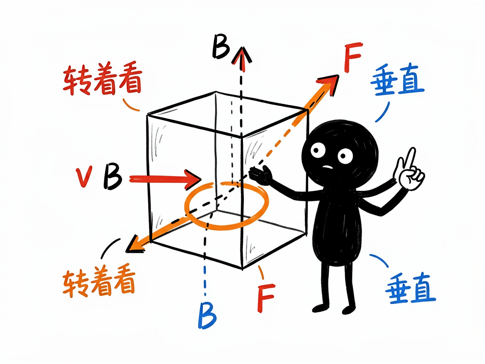

## 它到底能做什么
- 把三维物理场景做成三栏交互网页：题面 + 滑块控制台 + 分步解析 + 可旋转的 3D 画板。
- 用一根滑块（角度、时间、速度等）驱动实时重算，3D 里的箭头、球体、轨迹曲线跟着变。
- 画板支持鼠标拖动旋转、滚轮缩放、平移，能从任意角度观察空间关系，比死板的平面图直观得多。
- 擅长这类"必须 3D"的内容：洛伦兹力与叉乘、右手定则、原子轨道形状、晶体/晶格结构、刚体旋转与角动量、三维磁场、电磁波正交传播。
- 同样会显示"守恒定律"指示，比如带电粒子在磁场里运动时速率恒定，网页会一直亮着提示。

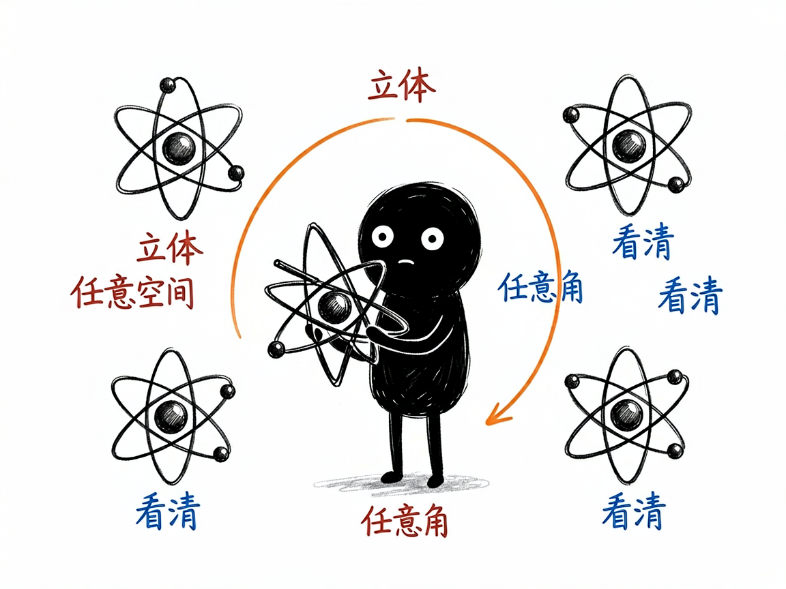

## 怎么用

你不需要记任何命令。在 codex / workbuddy 等 agent 装好 edu-physics-3d 技能后，直接对 AI 说话就行：

**场景 1：搞懂洛伦兹力方向**
你：帮我把"洛伦兹力"做成一个能拖动角度滑块、从任意角度看 v、B、F 三个箭头方向的 3D 网页。
AI：AI 生成一个 3D 网页；从同一点伸出的三个箭头分别代表速度 v、磁场 B、洛伦兹力 F，你旋转视角、拖动角度滑块，就能亲手验证"F 永远垂直于 v 和 B 所在平面"这个右手定则。

**场景 2：看晶体结构**
你：把食盐的晶格结构做成能转着看的 3D 模型。
AI：AI 生成可旋转缩放的晶体模型，你从任意角度观察原子怎么排布，比平面图直观得多。

**场景 3：学右手定则**
你：我想用 3D 方式理解电磁学里的右手定则。
AI：AI 做一个带可拖滑块的 3D 演示，把手指方向和磁场、电流的关系在空间里摆清楚。

## 谁适合用
- 高中/大学物理老师讲电磁学、原子物理、固体物理等立体内容。
- 学生攻克"空间想象"这个老大难。
- 科普作者做三维物理互动演示。
- 需要立体示意的教学内容制作者。

## 一点说明
这是个给 AI 用的技能（skill），不是普通人直接打开的 App；你把场景交给装好它的 AI，它帮你产出网页。它和 edu-physics 是分工关系：二维够用的（抛体、振动、波、光学）用 edu-physics，涉及三维空间的非它莫属。打开网页时最好有网络，三维库是在线加载的。具体支持哪些 3D 对象类型，以技能实际能力为准。

## 闲鱼接单文案

> 以下服务展示在闲鱼 / 淘宝服务市场发布，用于承接本 skill 的定制开发订单。

**标题：物理3D互动课件开发 skill软件开发**

**描述：**

专注 AI Agent 技能（skill）定制开发，已做出物理 3D 互动课件技能，现成作品可先看演示再下单。把洛伦兹力、右手定则、原子轨道、晶体结构、电磁波正交传播这些"必须转着看"的内容，变成能旋转、缩放、平移的 3D 网页，滑块驱动箭头和轨迹实时重算，从任意角度看清空间关系。可按你的课程定制，全部源码交付、支持二次开发。

**服务内容：**

- 1、需求沟通梳理：先聊清楚要演示的 3D 物理场景、可调参数和观察重点（方向关系 / 空间结构），列明功能清单后再动手
- 2、skill交付内容和格式：可旋转缩放平移的 3D 交互网页：立体画板（箭头 / 球体 / 轨迹曲线）、滑块控制台、分步推导、守恒定律指示
- 3、项目功能/系统开发：按你的课程定制 3D 对象类型、镜头视角与讲解文案，可扩展整套课件批量生成等功能的开发与联调
- 4、skill源码交付：SKILL.md 技能说明 + 提示词 / 脚本 / 模板 / 网页样例组成的完整技能工程，兼容 codex / workbuddy 等 agent。全部源码 + 安装部署说明 + 使用演示，交付后可自行修改维护

---

<!-- 来源: edu-physics.md -->

# 物理题里那些"动起来"的过程，怎么变成能拖滑块看的网页 —— edu-physics 介绍

学物理最怕"只看见公式，看不见过程"。比如抛体运动轨迹为什么是抛物线、简谐振动怎么来回摆、机械能为什么守恒，课本上往往是几个静止的图加一串算式。学生脑子里没画面，公式就成了死记硬背。

edu-physics 就是来解决这件事的：你给它一个适合用平面展示的物理场景（力学、热学、电磁、光学、波……），它帮你在 AI 里产出一个能拖滑块的网页——左边题面加控制台，中间分步推导，右边是一块会动的二维画板，粒子怎么飞、波形怎么传、光怎么折射，全都能实时拖着看。

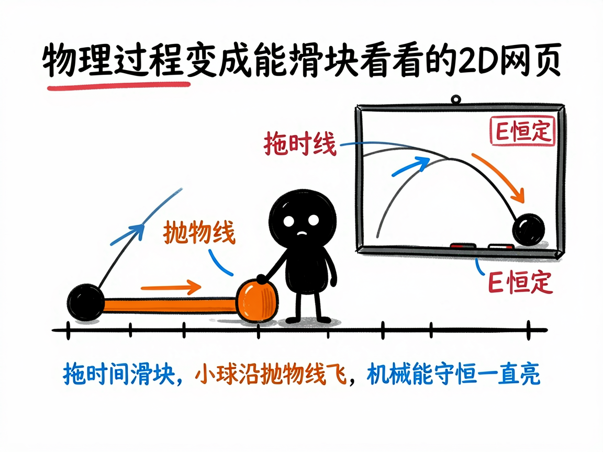

## 它到底能做什么
- 把二维平面就够用的物理场景做成三栏交互网页：题面 + 可拖滑块的控制台 + 分步解析 + 动态画板。
- 用一根滑块（时间、角度、速度、温度等）驱动实时重算：位置、速度、能量、动量这些量跟着变，不用手算。
- 画板上能画轨迹、质点、矢量箭头、波形、光线、电场线，还能用画笔随手标注。
- 特别会显示"守恒定律"：比如机械能守恒，网页会一直亮着"E 恒定"的提示，让你直观确认量真的没变。
- 覆盖很广：抛体运动、碰撞、简谐振动、机械波、电场、磁场、折射反射、干涉衍射、气体状态方程、热力学循环等。

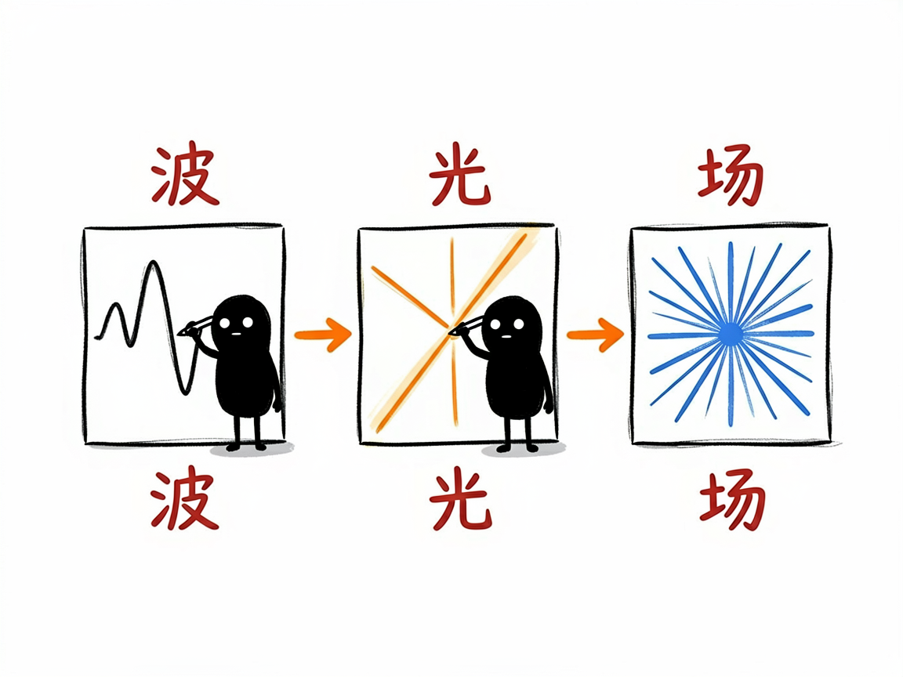

## 怎么用

你不需要记任何命令。在 codex / workbuddy 等 agent 装好 edu-physics 技能后，直接对 AI 说话就行：

**场景 1：学斜抛运动**
你：帮我把"斜抛运动"做成一个能拖时间滑块看轨迹和能量守恒的网页，初始速度 10 米每秒、仰角 45 度。
AI：AI 生成一个交互网页；你拖动"时间"滑块，画板上的小球沿抛物线飞，速度箭头实时转向，读数显示水平和竖直位移、动能和势能，而"机械能 E"一直保持常数——守恒一下就信了。

**场景 2：看波的干涉**
你：把两列水波的干涉做成能拖参数看的动画。
AI：AI 生成画板，你拖动频率、振幅等滑块，就能实时看到干涉条纹怎么随参数变化，波形传播清清楚楚。

**场景 3：复习机械能守恒**
你：我想直观看到机械能守恒，别只给公式。
AI：AI 做一个带"E 恒定"提示的网页，你拖任何参数，画板都实时证明总能量不变。

## 谁适合用
- 初高中物理老师做课堂演示，把抽象过程演给学生看。
- 学生自学时建立"物理图像"，而不是死背公式。
- 家长陪孩子理解运动、波、光这些难点。
- 科普作者做物理互动内容。

## 一点说明
这是个给 AI 用的技能（skill），不是普通人直接打开的 App；你把场景交给装好它的 AI，它帮你产出网页。它只负责"二维平面就够"的物理；如果内容涉及三维空间（比如洛伦兹力叉乘方向、原子轨道、晶体结构、刚体旋转），要看它的兄弟技能 edu-physics-3d。物理量是网页里实时算的，你给的数值要合理，AI 也会自己做正确性检查。具体支持哪些场景，以技能实际能力为准。

## 闲鱼接单文案

> 以下服务展示在闲鱼 / 淘宝服务市场发布，用于承接本 skill 的定制开发订单。

**标题：物理互动课件开发（2D 可拖动画板）skill软件开发**

**描述：**

专注 AI Agent 技能（skill）定制开发，已做出物理互动课件技能，现成作品可先看演示再下单。把抛体运动、简谐振动、机械波、折射干涉这些场景变成"题面 + 滑块控制台 + 分步推导 + 动态画板"的网页，拖滑块实时重算位置、速度、能量、动量，还常亮"机械能 E 恒定"这类守恒提示，覆盖力、热、电磁、光、波各板块。可按你的课程定制，全部源码交付、支持二次开发。

**服务内容：**

- 1、需求沟通梳理：先聊清楚要演示的物理场景、典型参数（初速度、角度、频率等）和教学重点，列明功能清单后再动手
- 2、skill交付内容和格式：可拖滑块的交互网页：题面控制台、分步推导、动态画板（轨迹 / 矢量箭头 / 波形 / 光线 / 电场线）、守恒定律指示
- 3、项目功能/系统开发：按你的课程定制场景库、参数范围与推导风格，可扩展整套章节课件批量生成等功能的开发与联调
- 4、skill源码交付：SKILL.md 技能说明 + 提示词 / 脚本 / 模板 / 网页样例组成的完整技能工程，兼容 codex / workbuddy 等 agent。全部源码 + 安装部署说明 + 使用演示，交付后可自行修改维护

---

<!-- 来源: edu-plane-geometry.md -->

# 三角形、四边形这些平面几何，怎么变成能拖着玩的网页 —— edu-plane-geometry 介绍

平面几何题，最讲究"看图"。勾股定理为什么成立、两个三角形为什么相似、角度和面积怎么变，光看印刷在纸上的固定图形，很难体会到"动起来也成立"。老师想演示"边长变化时面积怎么变"，黑板上重画一遍很费劲。

edu-plane-geometry 就是来解决这件事的：你给它一个平面几何问题或定理（三角形、四边形、梯形、勾股定理、全等相似……），它帮你在 AI 里产出一个能拖滑块的网页——左边题面加控制台，中间分步推导，右边是一块干净的几何画板，没有坐标网格，就是课本里那种纯几何风格，顶点、线段、直角记号、等长标记、角弧一应俱全，拖一拖就看到几何关系活起来。

## 它到底能做什么
- 把纯平面几何题/定理做成三栏交互网页：题面 + 滑块控制台 + 分步解析 + 浅色几何画板。
- 用滑块控制边长、角度、位置等参数，实时重算边长、面积、角度，不用手算。
- 画板还原课本风格：没有坐标轴网格，专门画三角形、四边形、多边形，并支持直角记号、等长标记、角弧等标准几何标注。
- 点可以用"几何构造语法"定义，比如中点、垂足、交点、旋转、反射，不用手动算每个坐标。
- 会显示"恒等式指示"或"范围条"：比如拖边长时，始终亮着"a²+b²−c² ≡ 0"，勾股定理一下就信了。

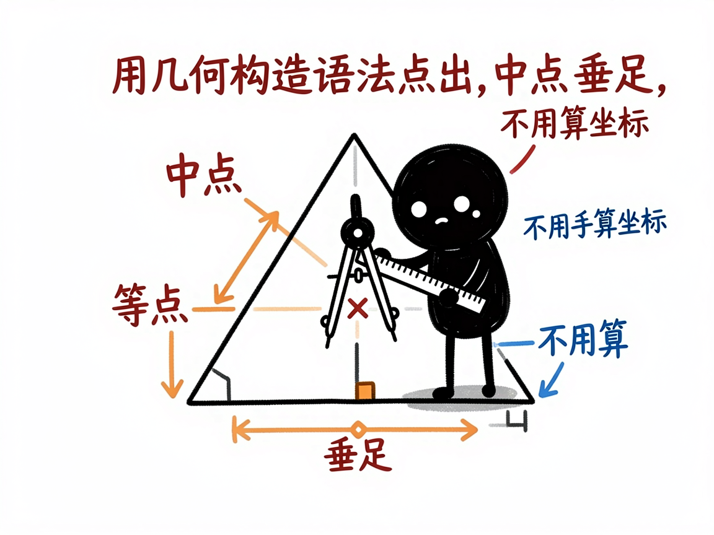

## 怎么用

你不需要记任何命令。在 codex / workbuddy 等 agent 装好 edu-plane-geometry 技能后，直接对 AI 说话就行：

**场景 1：验证勾股定理**
你：帮我把"勾股定理"做成一个能拖直角边 a、看斜边 c 和恒等式 a²+b²−c² 始终为 0 的网页。
AI：AI 生成网页；右边画着一个直角三角形，你拖动滑块改变一条直角边长度，三角形跟着变形，读数显示 a、b、c 和面积，而"a²+b²−c²"那条一直显示 0——不管怎么拖都成立。

**场景 2：看相似三角形**
你：把两个三角形相似的证明做成能拖着看的网页。
AI：AI 生成带滑块的画板，你拖动一边长度或角度，就能看到对应边成比例、对应角不变，相似关系活起来。

**场景 3：演示面积变化**
你：我想看平行四边形边长变化时面积怎么变。
AI：AI 做一个可拖滑块的网页，实时显示边长和面积的对应关系，帮你建立几何直观。

## 谁适合用
- 初中几何老师做定理演示，把"为什么成立"演给学生看。
- 学生理解全等、相似、面积、角度这些关系。
- 家长帮孩子建立几何直观。
- 写几何科普、做课件的人。

## 一点说明
这是个给 AI 用的技能（skill），不是普通人直接打开的 App；你把题目交给装好它的 AI，它帮你产出网页。它专门处理"纯平面几何"（没有圆锥曲线、没有解析坐标轴），带坐标轴网格的解析几何请看 edu-analytic-geometry。几何量和恒等式由网页实时算，AI 会做正确性检查。具体支持哪些构造与标注，以技能实际能力为准。

## 闲鱼接单文案

> 以下服务展示在闲鱼 / 淘宝服务市场发布，用于承接本 skill 的定制开发订单。

**标题：平面几何交互课件开发 skill软件开发**

**描述：**

专注 AI Agent 技能（skill）定制开发，已做出平面几何交互课件技能，现成作品可先看演示再下单。把勾股定理、全等相似这些题 / 定理变成课本风格的几何画板网页：直角记号、等长标记、角弧等标准标注齐全，支持中点、垂足、交点等几何构造，拖滑块时恒亮"a²+b²−c² ≡ 0"这类恒等式指示，"动起来也成立"一眼看清。可按你的教材定制，全部源码交付、支持二次开发。

**服务内容：**

- 1、需求沟通梳理：先聊清楚要演示的定理或题型（全等 / 相似 / 面积 / 角度）和用途（课堂演示 / 自学 / 课件），列明功能清单后再动手
- 2、skill交付内容和格式：可拖滑块的交互网页：课本风几何画板、直角记号 / 等长标记 / 角弧标注、几何构造、恒等式指示与范围条
- 3、项目功能/系统开发：按你的教材定制构造类型、标注风格与题库，可扩展整套专题课件批量生成等功能的开发与联调
- 4、skill源码交付：SKILL.md 技能说明 + 提示词 / 脚本 / 模板 / 网页样例组成的完整技能工程，兼容 codex / workbuddy 等 agent。全部源码 + 安装部署说明 + 使用演示，交付后可自行修改维护

---

<!-- 来源: edu-sci-viz.md -->

# 一个科学现象，怎么变成手机电脑都能玩的单页互动实验 —— edu-sci-viz 介绍

很多人对科学的好奇，是从一个"为什么"开始的：日食月食怎么回事？四季怎么来的？彩虹为什么是弯的？可科普文章往往一上来就甩定义和公式，没等看到重点，人已经晕了。其实先让人拖拖滑杆、转转模型，直觉建立起来，再讲原理才听得进去。

edu-sci-viz 就是来解决这件事的：你给它一个科学或数学概念（日食、月食、太阳系、四季、月相、潮汐、光的折射、彩虹、时区……），它帮你在 AI 里产出一个单文件网页——电脑手机都能直接打开，一页里既有好看的叙事讲解，又有一个能动手玩的"实验台"，拖滑杆、旋转、缩放，先建立直觉，再看正式定义和来源。

## 它到底能做什么
- 把数学/科学概念做成"单文件互动科普页"，一个网页文件搞定，打开即用。
- 遵循"先直觉、后定义"的叙事：事实核验 → 直觉模型 → 正式定义 → 互动实验 → 边界说明 → 来源追溯，读者先玩再学。
- 互动实验台支持滑杆实时反馈、拖动旋转、滚轮缩放、重置视角、暂停，参数一变模型立刻更新。
- 视觉是"编辑部科学手册风"：暖米白纸底、深海军蓝实验区、红/琥珀强调色、宋体大标题、等宽参数，科学又克制。
- 三维场景用网页三维技术在线加载，二维够用的用网页画图，零网络依赖也能跑 2D。
- 特别强调"不说瞎话"：重要结论都回到官方页面或原始论文，页面末尾列出来源，并单独说明"这个模型简化了什么"。

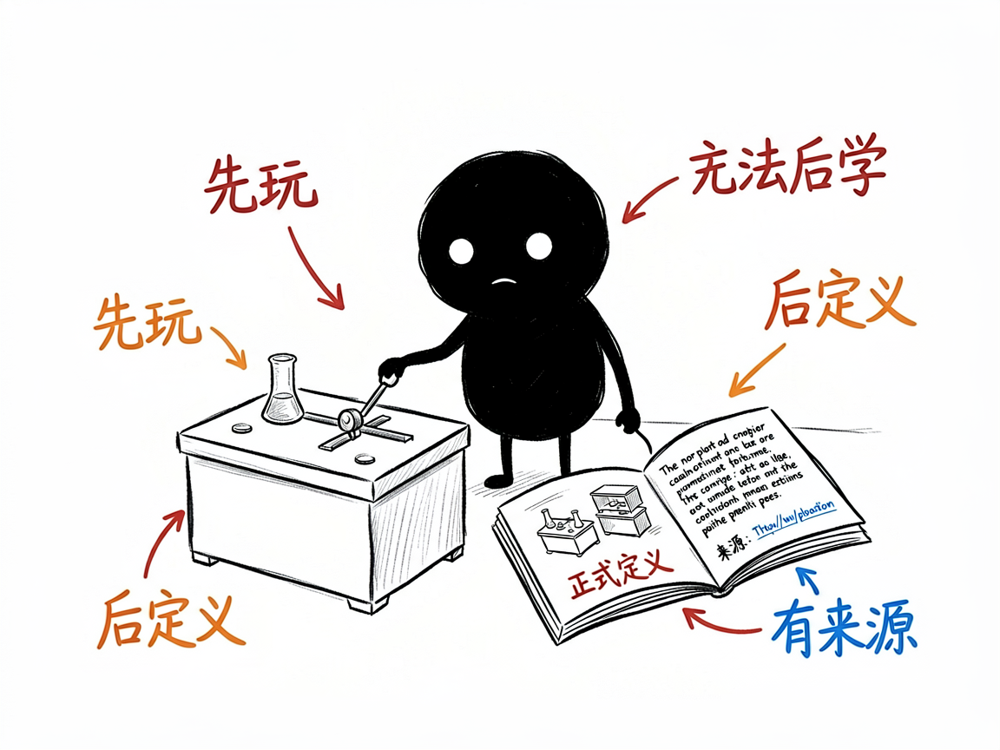

## 怎么用

你不需要记任何命令。在 codex / workbuddy 等 agent 装好 edu-sci-viz 技能后，直接对 AI 说话就行：

**场景 1：做日食科普页**
你：帮我把"日食"做成一个能拖动月球位置、看地月日怎么排成一线才遮挡太阳的互动科普页。
AI：AI 从模板生成一份网页，替换好标题、叙事和场景，你打开后上方是讲解，下方实验台里拖动滑杆改变月球位置，就能看到影子怎么投到地球上、什么时候变成日全食，末尾还附上权威来源链接。

**场景 2：讲四季成因**
你：我想做一个讲"四季是怎么来的"的互动页，带实验台。
AI：AI 生成单页科普，你拖动地球公转位置的滑杆，就能看到太阳直射点怎么移动、昼夜长短怎么变，先玩再读原理。

**场景 3：做彩虹的科普**
你：把"彩虹为什么是弯的"做成能玩的实验页。
AI：AI 生成带互动实验台的网页，你调整观察角度和光线，直观看到彩虹的形成条件和弯曲形状。

## 谁适合用
- 科普作者、自媒体做互动科学文章。
- 老师做课外拓展、天文/地理社团材料。
- 学生和对世界充满好奇的普通人自学。
- 博物馆、科技馆做轻量线上展项。

## 一点说明
这是个给 AI 用的技能（skill），不是普通人直接打开的 App；你把主题交给装好它的 AI，它帮你产出网页。它做的是"叙事科普"，和同系列那些"题面+分步解析+画板"的课件定位不同，两者不互相替代。它要求先查权威来源再动手，禁止虚构数字和结论，所以请给它真实、可核验的主题。具体能覆盖哪些主题、3D 还是 2D，以技能模板和范例实际能力为准。

## 闲鱼接单文案

> 以下服务展示在闲鱼 / 淘宝服务市场发布，用于承接本 skill 的定制开发订单。

**标题：科学互动科普页开发 skill软件开发**

**描述：**

专注 AI Agent 技能（skill）定制开发，已做出单文件互动科普页技能，现成作品可先看演示再下单。把日食、四季、彩虹、潮汐这类概念做成手机电脑都能打开的单页：叙事讲解 + 能动手玩的实验台（拖滑杆、旋转、缩放），遵循"先直觉、后定义"的阅读顺序，页尾附权威来源和"模型简化了什么"的说明，不虚构数字。适合科普自媒体、老师拓展课、科技馆轻量展项，可按你的主题定制，全部源码交付、支持二次开发。

**服务内容：**

- 1、需求沟通梳理：先聊清楚科普主题、目标读者（公众 / 学生 / 展项访客）和平台（手机 / 电脑 / 线下屏），确认主题真实可核验，列明功能清单后再动手
- 2、skill交付内容和格式：单文件互动科普网页：叙事讲解、互动实验台（滑杆实时反馈 / 旋转缩放）、编辑部科学手册风视觉、来源追溯与边界说明
- 3、项目功能/系统开发：按你的主题定制叙事结构、视觉风格与实验台参数，可扩展系列主题批量生成等功能的开发与联调
- 4、skill源码交付：SKILL.md 技能说明 + 提示词 / 脚本 / 模板 / 网页样例组成的完整技能工程，兼容 codex / workbuddy 等 agent。全部源码 + 安装部署说明 + 使用演示，交付后可自行修改维护

---

<!-- 来源: edu-solid-geometry.md -->

# 立体几何题里那些角和距离，怎么变成能旋转的 3D 模型 —— edu-solid-geometry 介绍

立体几何是很多人的噩梦：线面角、二面角、异面直线夹角、点到平面的距离，光看印刷在纸上的三维透视图，根本转不动、看不清。尤其是"建系用向量法"算出来的答案，学生常常不知道自己算的到底对应图形上哪一块。

edu-solid-geometry 就是来解决这件事的：你给它一道立体几何题（文字、图片、或让它随机出一道都行），它帮你在 AI 里产出一个能旋转缩放的 3D 网页——左边是题面、答案和分步解析，右边是题目对应的立体模型，能转着看，还会分步高亮关键元素、自动切换镜头，把"这一步在讲哪条棱、哪个面"演给你看。

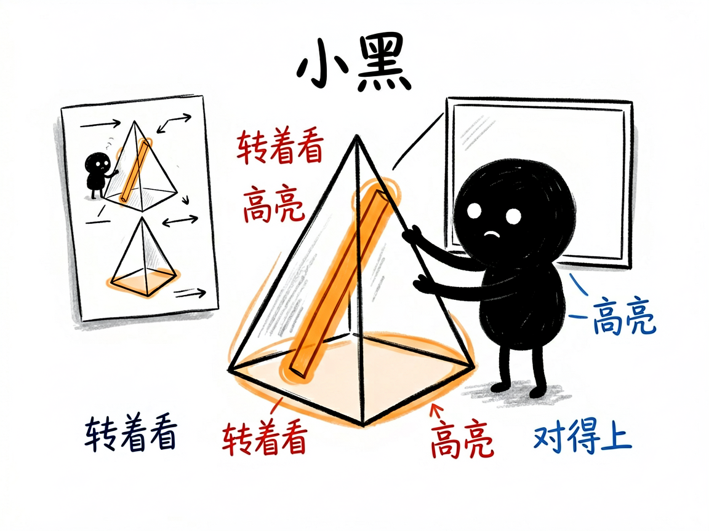

## 它到底能做什么
- 把正方体/长方体、棱锥/棱柱、圆柱/圆锥等立体几何题做成单页 3D 交互网页（左解析、右模型）。
- 覆盖线面角、二面角、异面直线夹角、点到平面距离、体积等常见题型，统一用"建系 + 向量法"求解。
- 右侧搭出可旋转、缩放的模型，分步高亮正在讲的元素，并切换镜头角度。
- 背后用精确的符号计算算坐标、法向量和答案，保证网页上的 3D 坐标、数字和推导过程完全同源、互不矛盾。
- 支持三种入口：直接给文字题、拍题图让它识别确认、或让它随机抽一道练手。
- 题面给了线段长度时，还会在模型上标出长度，方便对照。

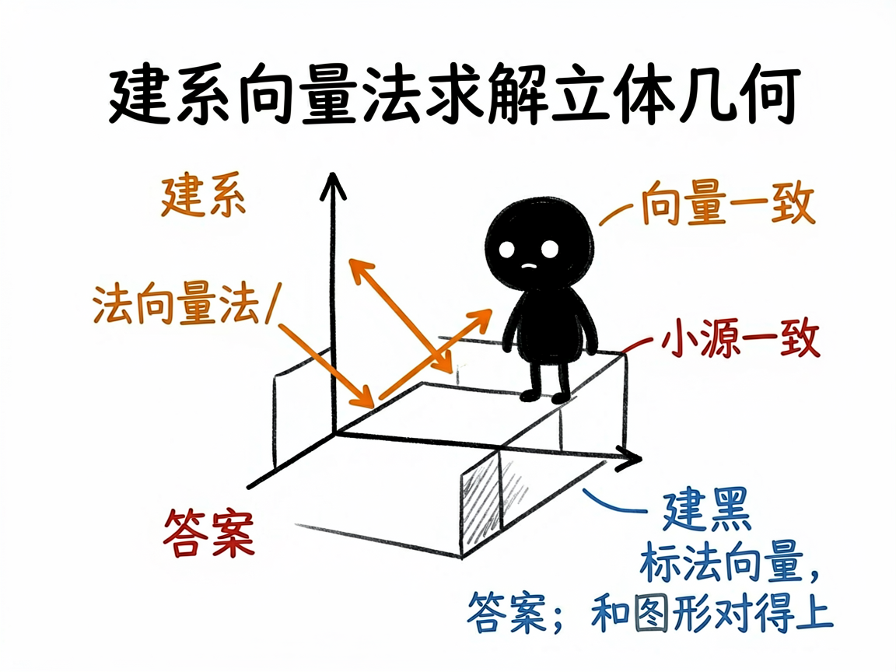

## 怎么用

你不需要记任何命令。在 codex / workbuddy 等 agent 装好 edu-solid-geometry 技能后，直接对 AI 说话就行：

**场景 1：求线面角**
你：帮我把这道立体几何题做成能旋转的 3D 网页：正四棱锥 P-ABCD，底面边长 2，侧棱 PA=√6，求 PA 与底面所成角。
AI：AI 先精确算出线面角，再生成网页；打开后模型能转着看，点"下一步"时对应的棱和底面被高亮、镜头自动对准，左侧同步显示建系和向量计算，答案和图形对得上。

**场景 2：随机练手**
你：给我随机出一道立体几何题，做成能转的 3D 模型。
AI：AI 抽一道题并生成可旋转缩放的 3D 网页，你转动模型、看分步高亮，把抽象的角和距离看明白。

**场景 3：拍照识别**
你：我拍了道立体几何题，帮我做成能转着看的 3D 网页。
AI：AI 识别题图，生成对应的可旋转 3D 模型，分步高亮关键元素，帮你把空间关系理清。

## 谁适合用
- 高中数学老师讲立体几何，把抽象的角和距离演给学生看。
- 学生攻克空间想象，理解"向量法"每一步对应图形哪块。
- 家长帮孩子建立三维直观。
- 写教辅、做数学课件的人。

## 一点说明
这是个给 AI 用的技能（skill），不是普通人直接打开的 App；你把题目交给装好它的 AI，它帮你产出网页。底层用到的符号计算由 AI 在背后完成，你不必自己安装。它专注"立体几何"（三维），纯平面几何请看 edu-plane-geometry，带圆锥曲线的解析几何请看 edu-analytic-geometry。具体题型覆盖以技能文档为准。

## 闲鱼接单文案

> 以下服务展示在闲鱼 / 淘宝服务市场发布，用于承接本 skill 的定制开发订单。

**标题：立体几何3D课件开发 skill软件开发**

**描述：**

专注 AI Agent 技能（skill）定制开发，已做出立体几何 3D 课件技能，现成作品可先看演示再下单。把线面角、二面角、异面直线夹角、点到平面距离这些题变成可旋转缩放的 3D 网页：统一用"建系 + 向量法"求解，分步高亮正在讲的棱和面、自动切换镜头，符号计算保证 3D 坐标、数字和推导完全同源，支持文字题、拍照、随机出题。可按你的题型定制，全部源码交付、支持二次开发。

**服务内容：**

- 1、需求沟通梳理：先聊清楚要覆盖的题型（线面角 / 二面角 / 距离 / 体积）和用途（课堂演示 / 学生自学），确认典型题目样例，列明功能清单后再动手
- 2、skill交付内容和格式：可旋转缩放的 3D 交互网页：题目立体模型、分步高亮与镜头切换、建系向量法推导、线段长度标注
- 3、项目功能/系统开发：按你的教材定制题型库、模型类型与讲解节奏，可扩展题库批量生成等功能的开发与联调
- 4、skill源码交付：SKILL.md 技能说明 + 提示词 / 脚本 / 模板 / 网页样例组成的完整技能工程，兼容 codex / workbuddy 等 agent。全部源码 + 安装部署说明 + 使用演示，交付后可自行修改维护

---

<!-- 来源: exa-company-research.md -->

# 想摸清一家公司底细？让它去全网帮你挖 —— exa-company-research 介绍

你有没有过这种时候：谈合作前想先看看对方公司靠不靠谱，找客户时想快速拉出一批目标企业，或者跳槽前想摸清一家公司的规模、融资和口碑？自己一个个去搜，又慢又碎，还容易漏。

**exa-company-research 就是来解决这件事的。** 你给它一个公司名、一类公司、或者一个行业方向，它还你一份整理好的企业情报：从官网信息、新闻动态、社交媒体声量到高管资料，都能帮你挖出来。

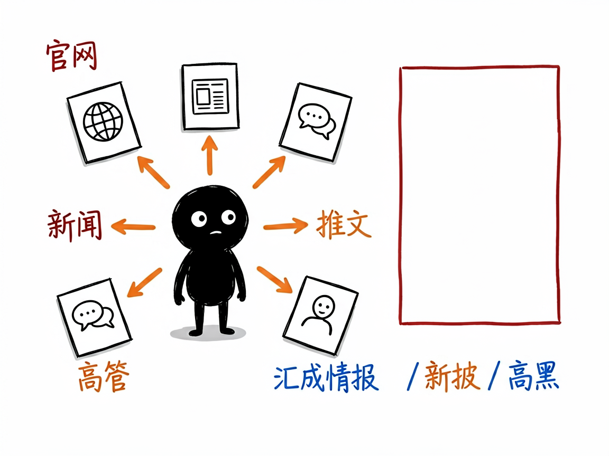

## 它到底能做什么

- 查公司基本信息：用 Exa（一个 AI 搜索引擎）直接抓官网和公开数据库，拿到员工人数、总部地点、融资、营收等资料。
- 找竞争对手和同行：给定行业或赛道，帮你列出一串相关公司，方便做竞品盘点。
- 搜新闻动态：跟踪一家公司近期的媒体报道、产品发布、财报等公开信息。
- 看社交媒体声量：抓取相关的推文（tweet），了解品牌在社交平台上的存在感。
- 查公开的高管资料：通过 LinkedIn 公开资料，找到关键决策人和团队背景。
- 批量建企业名单：支持按"几家""全面"等不同深度灵活调整，自动生成公司清单。

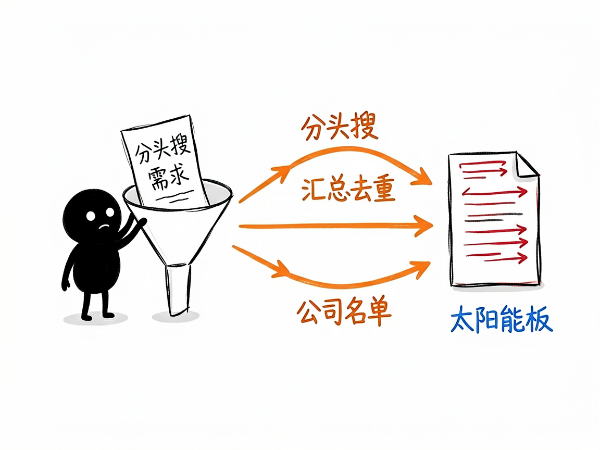

## 怎么用

你不需要记任何命令。在 codex / workbuddy 等 agent 装好 exa-company-research 技能后，直接对 AI 说话就行：

**场景 1：谈合作前先摸底**
你：帮我查一下"星河科技"靠不靠谱，他们规模多大、最近有什么新闻。
AI：它从官网、新闻、社交平台等公开渠道搜集信息，给你一份整理好的公司档案——员工规模、总部、融资情况、近期动态，帮你快速判断值不值得谈。

**场景 2：找一批目标客户**
你：我想做太阳能板生意，帮我列出美国主要的几家同行公司，并看看每家大概规模。
AI：它先按行业拉出一批相关公司，再逐家查官网和公开资料，最后给你一张清单，谁大谁小、官网在哪，一目了然。

**场景 3：跳槽前摸清东家**
你：我要去面试一家公司，帮我摸摸它真实体量和员工口碑。
AI：它汇总这家公司的公开信息、新闻和社交平台上的讨论，帮你拼出"这家公司到底怎么样"的真实画像。

## 谁适合用

- 投资人、BD（商务拓展）和销售人员：找客户、做尽职调查前快速摸底。
- 市场研究员：盘点某个赛道的玩家和竞争格局。
- 求职者：跳槽前了解目标公司的真实体量和口碑。
- 做竞品分析的产品或运营同学。

## 一点说明

这是给 AI 助手用的技能，装好、接好 Exa 这个联网搜索能力后就能用。它查的是公开网络信息，看不到需要登录才能看的私密内容；遇到登录墙或动态加载的页面，结果可能不完整。把它当"联网情报助手"来用，重要商业决定前最好再核对一遍。

## 闲鱼接单文案

> 以下服务展示在闲鱼 / 淘宝服务市场发布，用于承接本 skill 的定制开发订单。

**标题：企业情报调研（公司背景挖掘）skill软件开发**

**描述：**

专注 AI Agent 技能（skill）定制开发，已做出全网企业情报挖掘技能，现成作品可先看演示再下单。接 Exa 联网搜索，一句话查公司规模 / 融资 / 营收等基本盘、盘竞品同行、追新闻动态、看社交声量、挖公开高管资料，还能按行业批量生成目标企业名单。支持按你的用途做个性化定制，交付后装进 codex / workbuddy 等 AI 助手即可使用，全部源码交付、支持二次开发。

**服务内容：**

- 1、需求沟通梳理：先聊清楚你的用途（合作摸底 / 拉客户名单 / 竞品盘点 / 求职背调）和目标公司或行业方向，确认 Exa 联网搜索可用，列明功能清单后再动手
- 2、skill交付内容和格式：公司档案（规模、总部、融资、营收、近期动态）、竞品与同行清单、新闻动态汇总、社交媒体声量、公开高管资料、批量企业名单（整理好的情报报告）
- 3、项目功能/系统开发：按你的行业定制信息维度、名单规模与报告模板，可扩展定期跟踪等功能的开发与联调
- 4、skill源码交付：SKILL.md 技能说明 + 提示词 / 脚本 / 模板 / 报告样例组成的完整技能工程，兼容 codex / workbuddy 等 agent。全部源码 + 安装部署说明 + 使用演示，交付后可自行修改维护

---

<!-- 来源: exa-foreign-trade-research.md -->

# 想出海卖货？先让它帮你摸透目标国市场 —— exa-foreign-trade-research 介绍

做外贸或想出海的朋友，最怕的就是"脑子一热冲进去，结果发现当地早被几家巨头占了"。你其实想知道：这个国家谁在卖同类产品？价格怎么定？渠道怎么走？中国供应商还有没有空子可钻？靠自己翻网页，十天半个月都未必理得清。

**exa-foreign-trade-research 就是来解决这件事的。** 你给它"目标国家 + 产品领域"，它还你一份完整的市场调研报告——竞争格局、定价策略、渠道分析、进入建议，全帮你理顺。

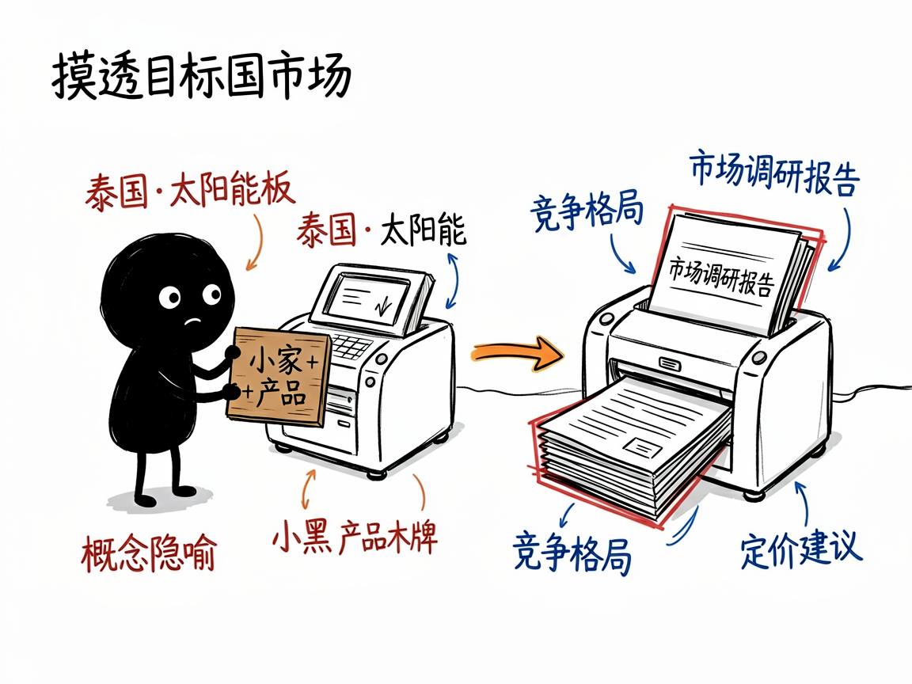

## 它到底能做什么

- 画出竞争格局：自动列出目标市场 TOP20 活跃公司，分成"本土品牌商、制造商、经销商/批发商/进口商"三类，各有来头。
- 逐个拆解竞品：对每家重点公司深挖背景、产品线、定价策略、客户群和优劣势。
- 生成对比矩阵：把所有竞品横向摆在一张表里比，并回答"市场是垄断还是分散""空白点在哪""中国供应商从哪切入"。
- 多源交叉验证：去官网、亚马逊/eBay、LinkedIn、Trustpilot 等平台核价格、销量和用户评价，避免数据一面之词。
- 给出落地建议：报告里专门有一章"中国供应商进入机会与建议"，从切入点、定位、定价到渠道策略都给方向。
- 自动调深浅：你说"快速了解""标准调研"还是"全面深度"，它对应不同的搜索量和耗时。

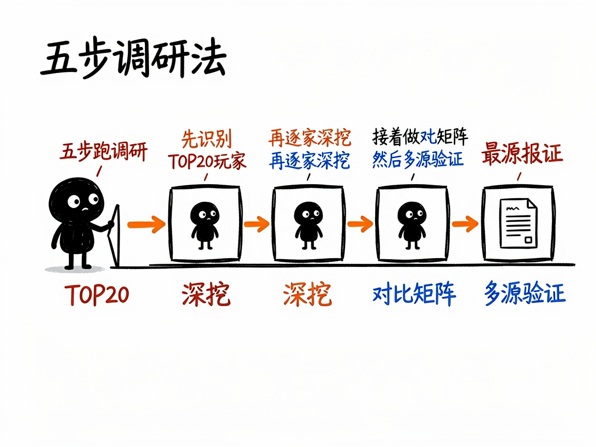

## 怎么用

你不需要记任何命令。在 codex / workbuddy 等 agent 装好 exa-foreign-trade-research 技能后，直接对 AI 说话就行：

**场景 1：进新市场前摸底**
你：帮我调研一下泰国市场的太阳能板，标准深度就行。
AI：它按五步法跑：先识别 TOP20 玩家，再逐家深挖，接着做对比矩阵，然后多源验证，最后产出一份中文市场调研报告，竞争格局、定价、渠道和进入建议都写清楚。

**场景 2：只想快速看个大概**
你：我想大致了解一下越南的健身器材市场，快速版就好。
AI：它用较轻的搜索量跑一遍，很快给你一张竞争格局草图和可切入的空档，先帮你判断值不值得深做。

**场景 3：排除中国同行**
你：帮我看德国市场的户外电源，把中国公司排除掉。
AI：它照常调研，但会自动过滤掉中国公司，让你专注看海外本土和第三方玩家的格局。

## 谁适合用

- 外贸业务员和海外业务负责人：进入新市场前做竞品和定价摸底。
- 想出海的工厂老板：判断自家产品在国外有没有价格和渠道优势。
- 跨境电商卖家：选品、定价、找差异化定位时参考。
- 市场/战略岗：写进入某国市场的可行性分析。

## 一点说明

这是给 AI 助手用的技能，装好、接好 Exa 这个联网搜索能力后就能用，部分验证环节还会用到浏览器方式兜底。报告默认用中文撰写，英文公司名和技术词会保留原文。它分析的是公开信息，给出的"市场机会"是方向性判断，真要砸钱进去，建议再结合实地走访和样品测试来确认。

## 闲鱼接单文案

> 以下服务展示在闲鱼 / 淘宝服务市场发布，用于承接本 skill 的定制开发订单。

**标题：外贸目标国市场调研 skill软件开发**

**描述：**

专注 AI Agent 技能（skill）定制开发，已做出外贸出海市场调研技能，现成作品可先看演示再下单。给它"目标国家 + 产品领域"，自动识别 TOP20 活跃玩家、逐家拆解背景与定价、生成对比矩阵，再去官网、亚马逊、LinkedIn、Trustpilot 多源交叉验证，最后出一份带"中国供应商进入机会与建议"章节的中文调研报告。快速 / 标准 / 深度三档可选，支持按你的行业做个性化定制，全部源码交付、支持二次开发。

**服务内容：**

- 1、需求沟通梳理：先聊清楚目标国家、产品领域、调研深度（快速 / 标准 / 深度）和特殊要求（如排除中国公司），确认 Exa 联网搜索可用，列明功能清单后再动手
- 2、skill交付内容和格式：竞争格局（TOP20 玩家三类分层）、逐家竞品拆解、横向对比矩阵、定价与渠道分析、中国供应商进入机会与建议（中文市场调研报告）
- 3、项目功能/系统开发：按你的行业定制玩家分类、验证渠道与报告章节，可扩展多国批量对比等功能的开发与联调
- 4、skill源码交付：SKILL.md 技能说明 + 提示词 / 脚本 / 模板 / 报告样例组成的完整技能工程，兼容 codex / workbuddy 等 agent。全部源码 + 安装部署说明 + 使用演示，交付后可自行修改维护

---

<!-- 来源: facebook-ads-analyzer.md -->

# 投了 Facebook 广告却看不懂数据？它帮你一眼分清好坏 —— facebook-ads-analyzer 介绍

你花真金白银在 Facebook 上投广告，月底从后台导出一张几百行的 CSV 数据表，密密麻麻全是展示量、花费、点击这些数字。哪个广告真正带来订单、哪个广告纯粹在烧钱，光靠肉眼根本看不过来。facebook-ads-analyzer 就是干这个的：你把导出的数据文件交给它，它帮你算出点击率、转化率这些关键指标，给每条广告打分评级，直接告诉你哪些该加预算、哪些该停掉。

**facebook-ads-analyzer 就是来解决这件事的。**

你给它一份 Facebook 广告后台导出的 CSV 文件，它还你一份带评分、带排名、带优化建议的分析报告。

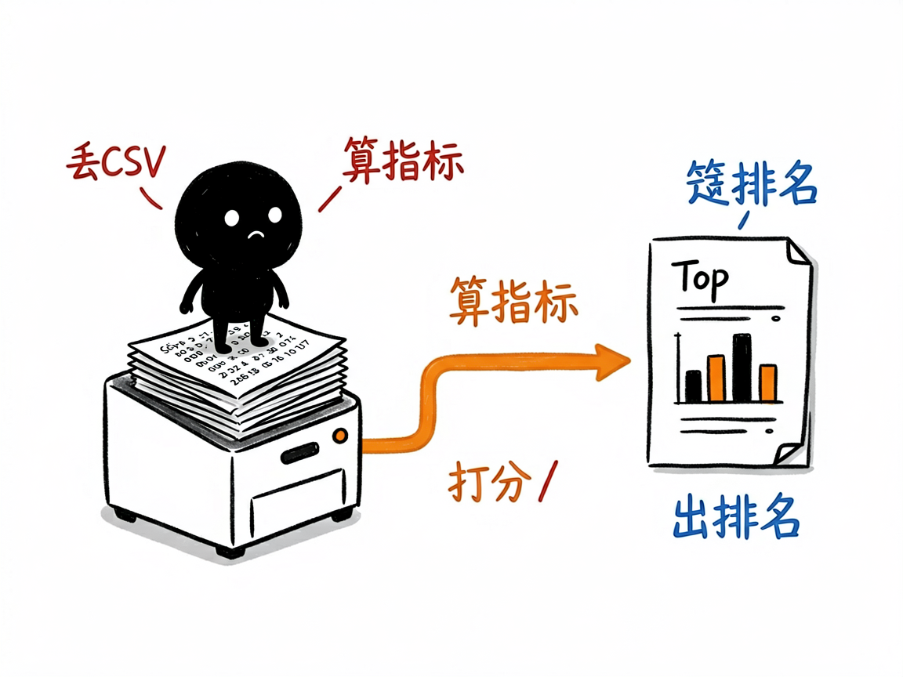

## 它到底能做什么

- 自动读表算指标：读取 Facebook Ads Manager 导出的 CSV（能识别中文列名和特殊编码），算出点击率（CTR）、单次点击费用（CPC）、千次展示费用（CPM）、互动率、转化率等。
- 给每条广告打分评级：用加权公式综合评分，分成"优秀 / 中等 / 差"三档（优秀大概占总量的前 20%）。
- 排出 Top 10 和 Bottom 10：一眼看出表现最好和最差的广告分别是谁。
- 给可执行的优化建议：优秀广告建议加预算，中等的建议做 A/B 测试，差的建议暂停或重做。
- 出投放策略方案：给出保守、平衡、激进三套预算分配思路。
- 支持按地区、时间段对比：比如单独看香港或台湾的数据表现。

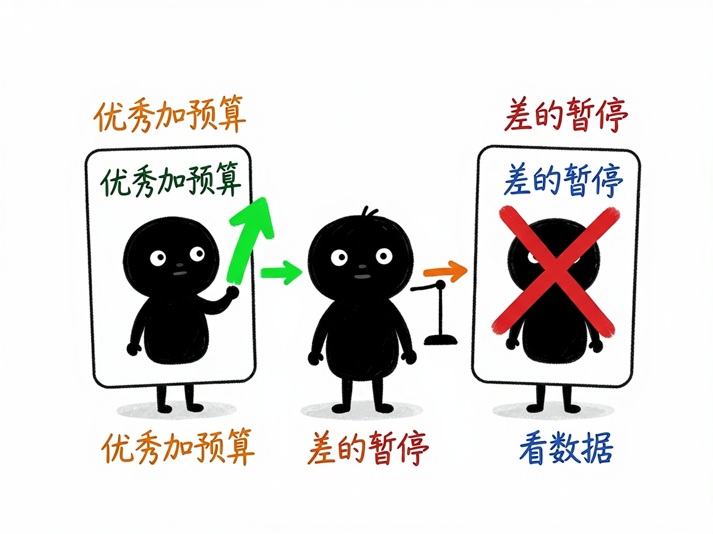

## 怎么用

你不需要记任何命令。在 codex / workbuddy 等 agent 装好 facebook-ads-analyzer 技能后，直接对 AI 说话就行：

**场景 1：月底想看哪些广告在烧钱**
你：这是我这个月 Facebook 广告后台导出的数据表，帮我看看哪些广告真赚钱、哪些纯粹在烧钱。
AI：它会算出每条广告的点击率、转化率等指标，打分排级，排出表现最好和最差的各 10 条，并直接告诉你哪些该加预算、哪些该停掉。

**场景 2：不知道钱该往哪投**
你：根据这份数据，给我一个下个月的预算分配思路。
AI：它会给出保守、平衡、激进三套投放方案，你按自己的风险偏好挑一套就行。

**场景 3：想单独看某个地区**
你：把香港和台湾的数据单独拉出来对比一下。
AI：它会按地区和时间段拆分数据，告诉你这两个市场各自的广告表现差异。

## 谁适合用

- 在 Facebook 上投广告、做独立站或品牌投放的电商卖家。
- 帮客户管广告投放的代运营、投手、优化师。
- 市场团队里需要定期复盘广告 ROI（投资回报）的人。
- 想用数据而不是感觉来决定"钱该往哪投"的创业者。

## 一点说明

它不是独立的可视化软件，而是一个给 AI 助手（如 codex / workbuddy）用的"技能包"。它只认 Facebook Ads Manager 导出的、带中文列名的 CSV，别的格式要先整理成对应字段（表格里需要的列包括账户名称、广告系列/组/广告名称、日期、国家、展示次数、花费金额等，越全越好）。具体评分权重和输出细节以项目里的 SKILL.md / REFERENCE.md 为准。

## 闲鱼接单文案

> 以下服务展示在闲鱼 / 淘宝服务市场发布，用于承接本 skill 的定制开发订单。

**标题：Facebook广告数据分析 skill软件开发**

**描述：**

专注 AI Agent 技能（skill）定制开发，已做出 Facebook 广告复盘分析技能，现成作品可先看演示再下单。自动读取 Ads Manager 导出的 CSV，算出点击率、单次点击费用、转化率等关键指标，给每条广告打分评级，输出加预算、做测试、暂停重做的决策建议和三套预算分配方案。支持按你的投放结构做个性化定制，交付后装进 codex / workbuddy 等 AI 助手即可使用，全部源码交付、支持二次开发。

**服务内容：**

- 1、需求沟通梳理：先聊清楚你的投放规模、复盘周期和最想回答的问题（哪些在赚钱、钱往哪投），确认能导出字段齐全的 CSV 数据，列明功能清单后再动手
- 2、skill交付内容和格式：每条广告的指标测算与评分评级、Top10 / Bottom10 排名、分地区分时段对比、可执行的优化建议与保守 / 平衡 / 激进三套预算方案（Markdown 分析报告）
- 3、项目功能/系统开发：按你的账户结构定制评分权重、分组维度和报告模板，可扩展多平台数据接入等功能的开发与联调
- 4、skill源码交付：SKILL.md 技能说明 + 提示词 / 脚本 / 模板 / 报告样例组成的完整技能工程，兼容 codex / workbuddy 等 agent。全部源码 + 安装部署说明 + 使用演示，交付后可自行修改维护

---

<!-- 来源: fastmoss-rpa.md -->

# 做 TikTok 电商想抄爆款、盯达人？它把榜单数据一键搬下来 —— fastmoss-rpa 介绍

你在做 TikTok 小店（TikTok Shop），想知道最近什么商品突然爆了、哪些达人带货最猛、对手在投什么广告关键词。FastMoss 这个网站能看这些数据，但手动一页页翻、一条条抄进表格，几十页下来人都要麻了。fastmoss-rpa 帮你把 FastMoss 上 7 大榜单的数据自动抓成表格，还能顺手生成一份带洞察的分析报告。

**fastmoss-rpa 就是来解决这件事的。**

你给它一个榜单名称加筛选条件（比如"美国站、涨粉榜"），它还你一份 CSV 数据表，以及一份人话版的分析报告。

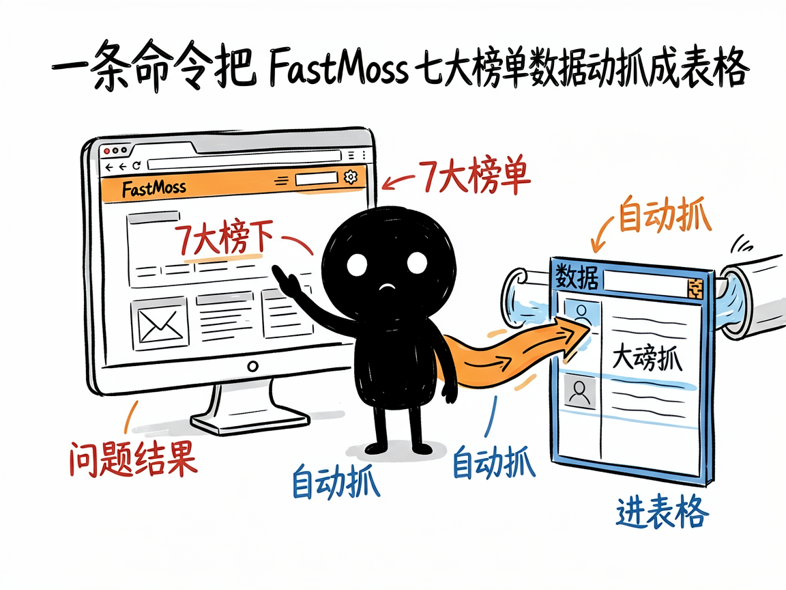

## 它到底能做什么

- 抓商品榜（products）：看新品、销量、热推商品，比如美国最近上新的爆品。
- 抓达人榜（creators）：看涨粉、带货、蓝V、热门、黑马等各类达人，比如印尼涨粉最快的带货号。
- 抓店铺榜（shops）：看各站点的销量榜、热推店铺。
- 抓广告趋势（ads）：看正在投的标签、关键词、品类。
- 抓素材榜（creatives）：看近期跑量的视频、音乐、标签。
- 抓直播榜（livestreams）：看 TT 直播、直播爆品、直播带货达人。
- 抓品类大盘（market）：看行业格局、市场总览、日销趋势，支持多国对比。
- 按国家 / 品类 / 时间筛选：比如"美国 + 印度尼西亚 + 泰国"一键多市场抓，自动切分。

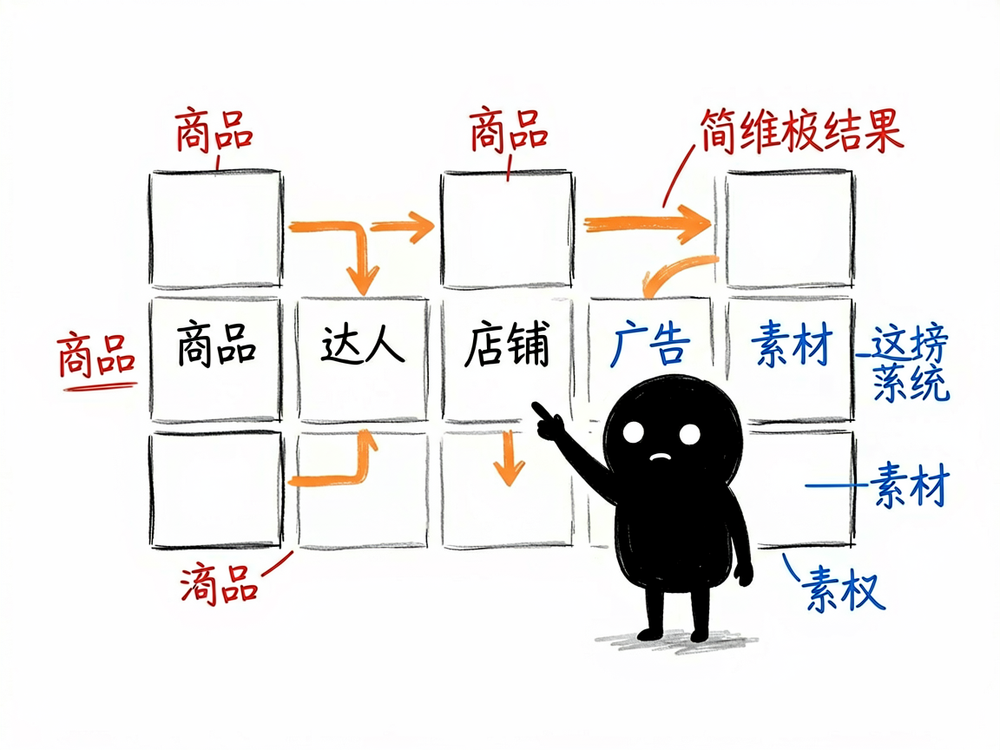

## 怎么用

你不需要记任何命令。在 codex / workbuddy 等 agent 装好 fastmoss-rpa 技能后，直接对 AI 说话就行：

**场景 1：想找最近爆了的商品**
你：帮我看看美国站 TikTok 最近上了哪些新爆品。
AI：它会自动打开 FastMoss、抓下商品榜里美国站的新品和热推商品，整理成一份表格给你，方便你找潜力款。

**场景 2：想找涨粉最快的达人合作**
你：印尼最近涨粉最快的带货达人是谁？给我列一下。
AI：它会抓取达人榜里印尼站的涨粉榜，排出涨粉最快的一批账号，你挑合适的去谈合作。

**场景 3：想出一份多市场对比报告**
你：把美国、印度尼西亚、泰国三个市场的品类大盘都拉出来，做个对比。
AI：它会按国家分别抓数据再自动切分合并，最后给你一份带洞察的多市场对比分析报告。

## 谁适合用

- 做 TikTok Shop 的卖家、选品人员、直播团队。
- 想找爆款、找达人合作、盯对手广告的跨境运营。
- 需要把多国 TikTok 数据做成对比报告的调研者。

## 一点说明

它不是普通能双击打开的软件，而是一个给 AI 助手（如 codex / workbuddy）用的"技能包"。它靠浏览器自动化工具（RPA，让 AI 自动操作网页的工具）驱动你电脑上已经登录 FastMoss 的真实浏览器去抓数据——所以你先在 agent 里装好对应的浏览器自动化技能、用 Chrome 或 Edge 登录 FastMoss 就行。没登录或没连上浏览器，就抓不到。具体支持的榜单和字段以项目 SKILL.md / references 为准。

## 闲鱼接单文案

> 以下服务展示在闲鱼 / 淘宝服务市场发布，用于承接本 skill 的定制开发订单。

**标题：TikTok电商数据采集（FastMoss）skill软件开发**

**描述：**

专注 AI Agent 技能（skill）定制开发，已做出 FastMoss 榜单自动化采集技能，现成作品可先看演示再下单。一句话抓取商品、达人、店铺、广告、素材、直播、品类大盘 7 大榜单，支持多国多条件筛选，自动整理成表格并生成带洞察的中文报告。支持按你的站点和关注榜单做个性化定制，交付后装进 codex / workbuddy 等 AI 助手即可使用，全部源码交付、支持二次开发。

**服务内容：**

- 1、需求沟通梳理：先聊清楚你关注的站点（美国 / 印尼 / 泰国等）、榜单类型和筛选条件，确认电脑已登录 FastMoss，列明功能清单后再动手
- 2、skill交付内容和格式：商品 / 达人 / 店铺 / 广告 / 素材 / 直播 / 品类大盘 7 类榜单的数据采集成果（CSV 表格 + 带洞察的中文分析报告）
- 3、项目功能/系统开发：按你的选品和达人合作流程定制抓取字段、多市场对比与定期采集等功能的开发与联调
- 4、skill源码交付：SKILL.md 技能说明 + 提示词 / 脚本 / 模板 / 报告样例组成的完整技能工程，兼容 codex / workbuddy 等 agent。全部源码 + 安装部署说明 + 使用演示，交付后可自行修改维护

---

<!-- 来源: flue-framework.md -->

# 想做一个能联网、能上线的 AI 智能体？这套方法把套路都定好了 —— flue-framework 介绍

想做一个 AI 智能体（会自己调用工具、管理对话的 AI 助手），可市面上的框架五花八门，光是"怎么定义智能体、怎么接模型、怎么让它对外提供网页接口、怎么上线部署"就有一堆约定要记，稍不留神就报错。

**flue-framework 就是来解决这件事的。** 你告诉它想要什么样的 AI 智能体，它还你一个能跑、能联网提供接口、能部署上线的成品。它是一套帮你按固定套路把模型、会话、工具、技能、运行环境这些零件组装好的方法（可以理解为"框架"——一套现成的工作方式）。

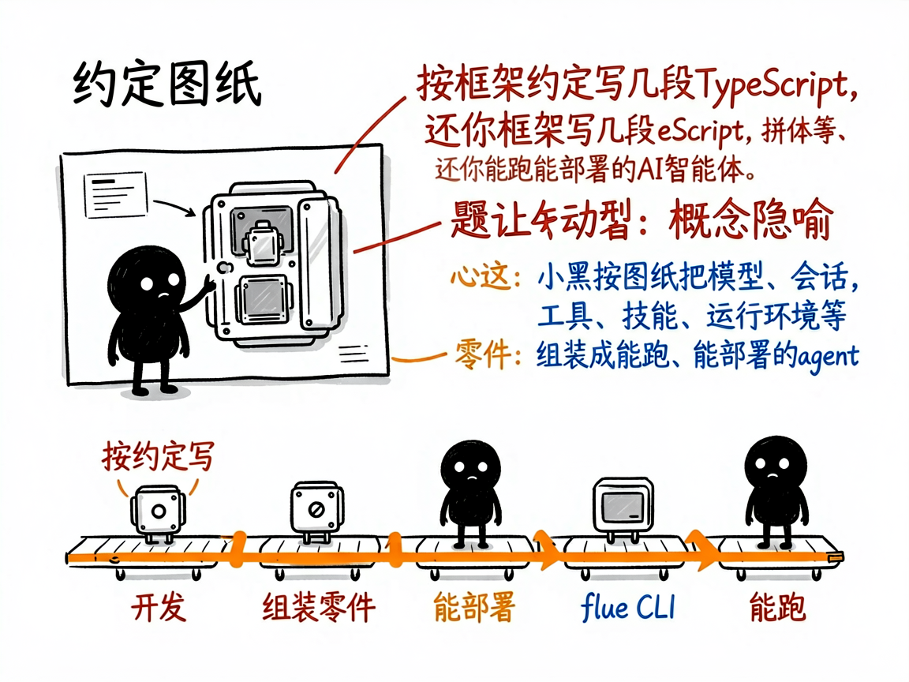

---

## 它到底能做什么

- 帮你用极简的方式定义一个智能体：指定用哪家模型（Anthropic、OpenAI、DeepSeek、OpenRouter 等都内置支持）、给它什么指令。
- 帮你加上自定义工具：让 AI 能发起网络请求、执行代码等，扩展它的能力边界。
- 支持两种形态：一种是对外提供网页聊天、实时推送的常驻助手；一种是跑一次就结束的自动化工作流（比如定时处理一批任务）。
- 支持子智能体：让主 AI 把任务派给专门的 AI 分头做，再汇总结论。
- 自带隔离运行环境（沙箱）、会话管理，还能强制让 AI 返回结构化的数据，方便接进你自己的系统。
- 开发到上线一条龙：开发时热更新调试、打包、以及上线部署的说明，它都帮你安排好。

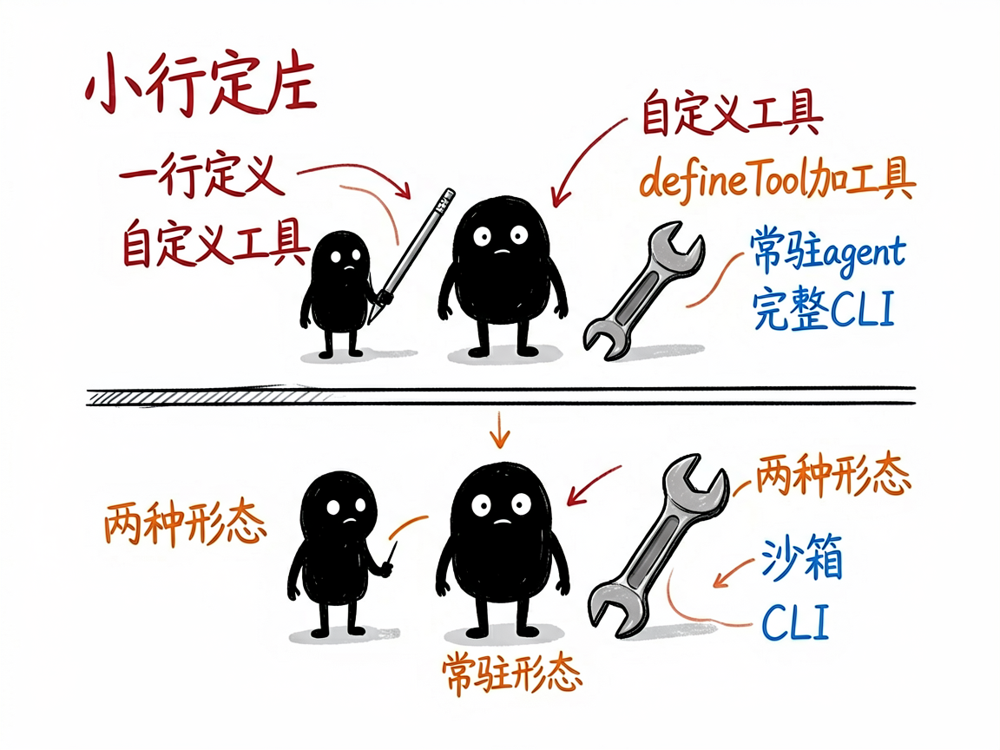

## 怎么用

你不需要记任何命令。在 codex / workbuddy 等 agent 装好 flue-framework 技能后，直接对 AI 说话就行：

**场景 1：你想快速搭一个会讲冷笑话的 AI**
你：帮我搭一个 AI 智能体，模型用 Claude，指令是"讲一个好笑的工程师冷笑话"
AI：它按框架约定帮你把智能体搭好，能直接联网提供接口，不用你自己拼装模型、会话、工具这些零件。

**场景 2：你想要一个能联网查资料的助手**
你：给我做一个智能体，能发起网络请求去查天气，再用网页聊天的方式跟我对话
AI：它加上自定义工具让 AI 能联网，并对外提供网页聊天接口，开发时还能热更新调试。

**场景 3：你想要跑一次就结束的自动化任务**
你：帮我做一个工作流，每天自动跑一次、把结果整理成结构化数据
AI：它用框架的"工作流"形态帮你搭好，跑完就结束，并能强制返回固定格式的数据方便你后续处理。

## 谁适合用

- 想做一个能联网、能上线的 AI 智能体或 AI 产品的人（让 AI 帮你搭，不用自己死磕工程细节）。
- 需要把智能体以网页 / 接口形式对外提供、并上线部署的团队。
- 想在 DeepSeek 等兼容模型上跑 agent、又想要清晰结构的人。

## 一点说明

它是装在 codex / workbuddy 这类 AI 助手里的技能，不是单独打开的 App。你描述想要什么样的智能体，AI（带上这个技能）按框架约定帮你搭好；真正要跑起来，得有一个能加载技能、连得上模型的 AI 环境。它有两个容易踩的坑：常驻助手和工作流的写法不同，选错会报错；初始化时必须接住定义智能体的结果，不能直接传配置。具体版本与能力以项目文档为准，新版本细节可能变动。

## 闲鱼接单文案

> 以下服务展示在闲鱼 / 淘宝服务市场发布，用于承接本 skill 的定制开发订单。

**标题：TypeScript AI智能体框架开发 skill软件开发**

**描述：**

专注 AI Agent 技能（skill）定制开发，已做出基于 TypeScript 的智能体框架技能，现成作品可先看演示再下单。按固定套路把模型、会话、工具、技能、运行环境组装好：一行代码定义智能体（Anthropic / OpenAI / DeepSeek / OpenRouter 内置支持），自定义工具随意扩展，常驻网页助手和一次性自动化工作流两种形态，自带沙箱隔离、子智能体和结构化输出，开发热更新到打包部署一条龙。可按你的业务定制，全部源码交付、支持二次开发。

**服务内容：**

- 1、需求沟通梳理：先聊清楚智能体的用途、想用的模型和形态（常驻网页助手 / 跑一次就结束的工作流），列明功能清单后再动手
- 2、skill交付内容和格式：能跑、能联网提供接口、能部署上线的智能体工程：智能体定义、自定义工具、网页聊天接口或自动化工作流 + 上线部署说明
- 3、项目功能/系统开发：按你的业务定制工具、子智能体编排与部署方案，含热更新调试联调
- 4、skill源码交付：SKILL.md 技能说明 + 提示词 / 脚本 / 模板 / 工程样例组成的完整技能工程，兼容 codex / workbuddy 等 agent。全部源码 + 安装部署说明 + 使用演示，交付后可自行修改维护

---

<!-- 来源: game-gameability.md -->

# 你的"游戏创意"真的该做成游戏吗？这个守门员先帮你挡一道 —— game-gameability 介绍

很多人想做一个游戏，脑子里有个很棒的点子：一个感人的故事、一段沉浸的体验。可真做起来才发现，玩家其实只是在"看剧情、点选项"，换成互动小说或动画也差不多——它并没有用到"游戏"这种媒介才有的乐趣。等美术、程序都投进去才发现问题，就晚了。

**game-gameability 就是来解决这件事的。** 你给它一个还没动手做的游戏概念，它还你一份"游戏性验证"结论：这个想法到底配不配做成游戏，通不过就直接退回概念阶段，别浪费后续资源。它在游戏设计流程里是一个独立的"守门"环节，卡在选定概念之后、正式做世界设计之前。

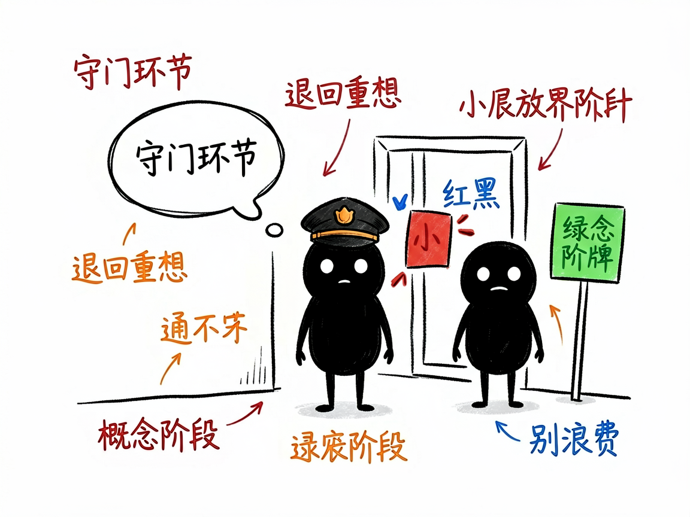

---

## 它到底能做什么

- 提取"核心动词"：逼你想清楚玩家 80% 时间到底在"做"什么动作。硬规矩是——不能是"阅读 / 选择 / 听"这类纯被动动作，必须是主动的操作（比如举证、破解、部署、拼凑）。
- 做"动词压力测试"：拷问这个动作能不能反复玩、熟手和新手有没有差距、做的结果会不会改变游戏世界并影响后续决策，三项里至少两项得过。
- 做"媒介必要性测试"：想象把游戏录成一段不能快进、不能选的视频，观众看视频和你亲自玩，体验差多少？去掉交互还剩 80% 以上，就说明它根本不是游戏。
- 做"原型动词验证"：要求你写出玩家打开游戏 30 秒内做的第一个有意义动作，动作不能需要 60 秒以上教学，且第十个动作要和第一个有本质区别（证明循环有深度）。
- 用"好玩七维"预检：从空间×时间、死亡×经济、成长、任务×收集、合作×对抗、偶然性、机制关联性里，先圈出至少三个能在这概念里落地的维度，说不出怎么落地就不通过。

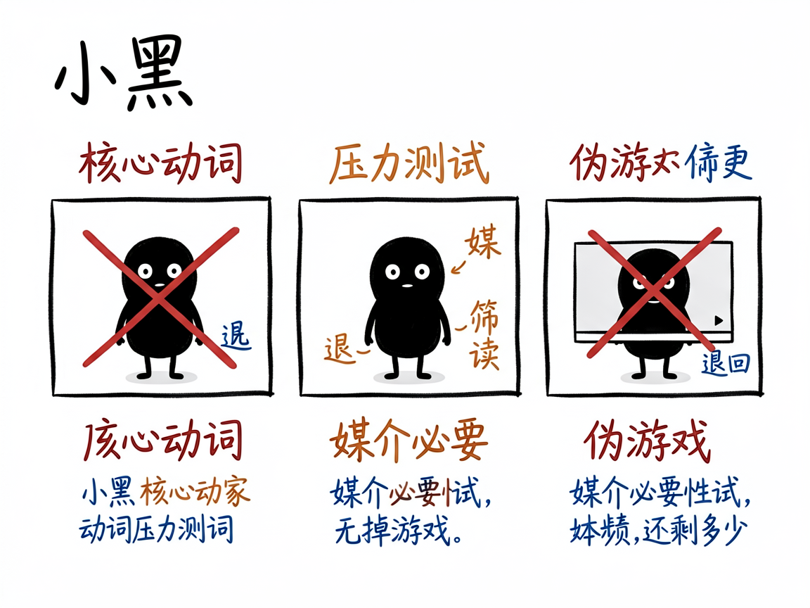

## 怎么用

你不需要记任何命令。在 codex / workbuddy 等 agent 装好 game-gameability 技能后，直接对 AI 说话就行：

**场景 1：你有个很感人的游戏点子，但拿不准是不是游戏**
你：我想做一个游戏，玩家就是看一段剧情、然后点选项推进故事，这个适合做成游戏吗
AI：它逼你提炼"核心动词"，发现玩家 80% 时间只是在"阅读 / 选择"这种被动动作，通不过核心动词硬规矩，直接建议你退回概念阶段，别浪费后续资源。

**场景 2：你想验证一个解谜概念**
你：我有个游戏，玩家要在现场搜集线索、破解机关，这个配不配做游戏
AI：它做动词压力测试（能不能反复玩、熟手新手有没有差距、动作会不会改变世界），再跑媒介必要性测试，最后给你一份游戏性验证报告，结论是"通过 / 退回概念阶段"。

**场景 3：你想提前筛掉伪游戏**
你：帮我把这个创意过一遍好玩七维，看看哪几个维度真能落地
AI：它从空间时间、死亡经济、成长、任务收集、合作对抗、偶然性、机制关联里，先圈出至少三个能落地且说得清怎么落地的维度，说不出就判不通过。

## 谁适合用

- 用 AI 辅助做游戏设计、跑标准化设计流程的设计者或团队。
- 在概念阶段想提前筛掉"伪游戏"创意、避免资源打水漂的人。
- 需要一套可验证（而非纯主观）的方法论来判断"这个点子好不好玩"的项目。

## 一点说明

它是给"做游戏的人（且用 AI 辅助设计流程）"用的技能，不是给玩家打开来玩的东西，也不是普通人直接用的 App——它得嵌在一套更大的游戏设计工作流里才会生效。它的判断偏"结构可验证"（这个维度有没有真被设计进去），至于"玩起来到底愉不愉快"这种主观感受，它不假装打分，留给真人试玩。具体判定标准以项目文档为准。

## 闲鱼接单文案

> 以下服务展示在闲鱼 / 淘宝服务市场发布，用于承接本 skill 的定制开发订单。

**标题：游戏创意游戏性验证 skill软件开发**

**描述：**

专注 AI Agent 技能（skill）定制开发，已做出游戏性守门验证技能，现成作品可先看演示再下单。给它一个还没动手做的游戏概念，先逼你提炼"核心动词"（玩家 80% 时间在主动做什么，纯"阅读 / 选择"直接不过关），再做动词压力测试、媒介必要性测试（录成视频看完还有 80% 体验就说明不是游戏）、原型动词验证和"好玩七维"预检，最后给出"通过 / 退回概念阶段"的结论，帮你在投美术投程序之前挡住伪游戏。可按你的设计流程定制，全部源码交付、支持二次开发。

**服务内容：**

- 1、需求沟通梳理：先聊清楚游戏概念、目标玩家和平台，确认概念文档写到了什么程度，列明功能清单后再动手
- 2、skill交付内容和格式：游戏性验证报告：核心动词结论、动词压力测试结果、媒介必要性测试、原型动词验证、好玩七维预检与最终"通过 / 退回"结论
- 3、项目功能/系统开发：按你的设计流程定制判定标准、测试维度与报告模板，可扩展多概念批量筛选等功能的开发与联调
- 4、skill源码交付：SKILL.md 技能说明 + 提示词 / 脚本 / 模板 / 报告样例组成的完整技能工程，兼容 codex / workbuddy 等 agent。全部源码 + 安装部署说明 + 使用演示，交付后可自行修改维护

---

<!-- 来源: geo-content-optimizer.md -->

# 给一个网址，它告诉你这页内容怎么改才容易被 AI 推荐 —— geo-content-optimizer 介绍

你写好了官网某一页，心里没底：用户用 AI 助手问相关问题时，这页会不会被引用？它跟 Google 的"AI 概览"里那段总结比，缺了啥、多说了啥？光靠自己读，很难看出差距在哪。

**geo-content-optimizer 就是来解决这件事的。**

它专门干一件事：你给它一个网页网址，它会自动去抓取这页内容、在 Google 上做相关查询扩展、把 Google 的"AI 概览"那段答案抓回来，然后拿"AI 概览说的"和"你这页写的"做对比，最后给你一份中文的优化建议报告。你给它一个网址，它还你一份"差在哪、该补啥"的诊断书。

---

## 它到底能做什么
- 抓取页面标题：自动打开网页，提取它的主标题（这决定了后面查什么）。
- 做查询扩展：围绕这个页面主题，在搜索引擎上搜一圈相关的子话题，把覆盖面铺开。
- 抓取 Google AI 概览：把 Google 在相关问题上给出的那段"AI 总结"拿回来做对比基准。
- 生成对比摘要：把扩展开来的搜索结果和 AI 概览分别小结，方便对照。
- 出优化报告：逐条指出"两边都提到的""只有 AI 概览提了的（你的内容缺口）"，并给可执行的修改建议，报告全是中文。

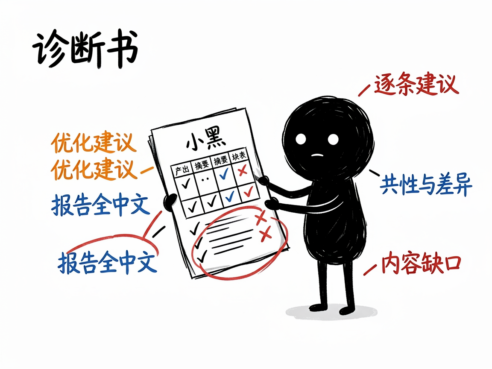

## 怎么用
你不需要记任何命令。在 codex / workbuddy 等 agent 装好 geo-content-optimizer 技能后，直接对 AI 说话就行：
**场景 1：诊断一页官网内容**
你：帮我优化这个页面：https://我的网站.com/某篇文章，看看 AI 会不会引用它。
AI：它自动抓取这页、扩展相关查询、取回 Google 的 AI 概览，再和你的内容逐项对比，最后给你一份中文诊断报告，说清差在哪、该补啥。
**场景 2：只想知道内容缺口**
你：我这页跟 Google AI 概览比，缺了哪些内容？直接告诉我缺口。
AI：它把"AI 概览提到、你页面没提"的部分逐条列出来，并给出补写建议，让你照着补就行。
**场景 3：改完再验一次**
你：我按报告补了内容，再帮我测一次，看这页现在离 AI 概览还差多少。
AI：它重新抓取、重新对比，生成一版新的对比报告，标出已补齐和仍缺口的地方。

## 谁适合用
- 写官网 / 博客内容，想知道"AI 会不会引用我这页"的运营或作者。
- 帮客户做内容优化、需要快速出诊断报告的从业者。
- 做 AI 工具、要把"单页内容优化"做成标准动作的人。

## 一点说明
它是一套 AI 技能（给带它的 AI 助手用的），不是普通人能直接双击打开的网页应用。它依赖搜索和浏览器能力去实时抓 Google 的 AI 概览；如果某些地区或某些查询抓不到实时 AI 概览，它会基于搜索结果生成一版并明确标注"非实时"。注意它做的是"内容优化分析"，不替你改网站代码、也不保证 AI 一定引用。具体能力以项目文档为准。

## 闲鱼接单文案

> 以下服务展示在闲鱼 / 淘宝服务市场发布，用于承接本 skill 的定制开发订单。

**标题：网页内容 AI 引用诊断 skill软件开发**

**描述：**

专注 AI Agent 技能（skill）定制开发，已做出单页内容 AI 诊断技能，现成作品可先看演示再下单。给它一个网址，自动抓取页面、做相关查询扩展、取回 Google 的"AI 概览"答案，然后逐条对比"AI 概览说了什么、你的页面写了什么"，标出内容缺口，最后给一份中文优化诊断报告；按报告补完内容还能复测验收。可按你的行业定制，全部源码交付、支持二次开发。

**服务内容：**

- 1、需求沟通梳理：先聊清楚要诊断的网址、目标关键词和优化目标（补内容缺口 / 提升被引用概率），列明功能清单后再动手
- 2、skill交付内容和格式：中文优化诊断报告：页面与 AI 概览的逐条对比、内容缺口清单、可执行的修改建议（支持改后复测）
- 3、项目功能/系统开发：按你的行业定制查询扩展策略与对比维度，可扩展全站批量诊断等功能的开发与联调
- 4、skill源码交付：SKILL.md 技能说明 + 提示词 / 脚本 / 模板 / 报告样例组成的完整技能工程，兼容 codex / workbuddy 等 agent。全部源码 + 安装部署说明 + 使用演示，交付后可自行修改维护

---

<!-- 来源: geo-optimizer.md -->

# 想让 AI 搜索（ChatGPT、豆包等）推荐你的品牌？它帮你按"AI 口味"改内容 —— geo-optimizer 介绍

现在大家问问题，越来越习惯直接问 ChatGPT、Perplexity、豆包、Gemini 这些 AI 助手，而不只是百度谷歌了。一个问题问下去，AI 会综合网上的内容给答案——可如果你的品牌、你的产品，在 AI 的答案里根本没被提到，或者提到了却说错，那等于在一种新的"搜索入口"上彻底缺席。

**geo-optimizer 就是来解决这件事的。**

GEO 是"生成式引擎优化"（Generative Engine Optimization）的缩写，简单说就是：让 AI 搜索引擎更愿意、更准确地引用你的内容。你给它你的品牌信息和网页，它还你一套让 AI 更容易"看懂并推荐你"的优化方案。

---

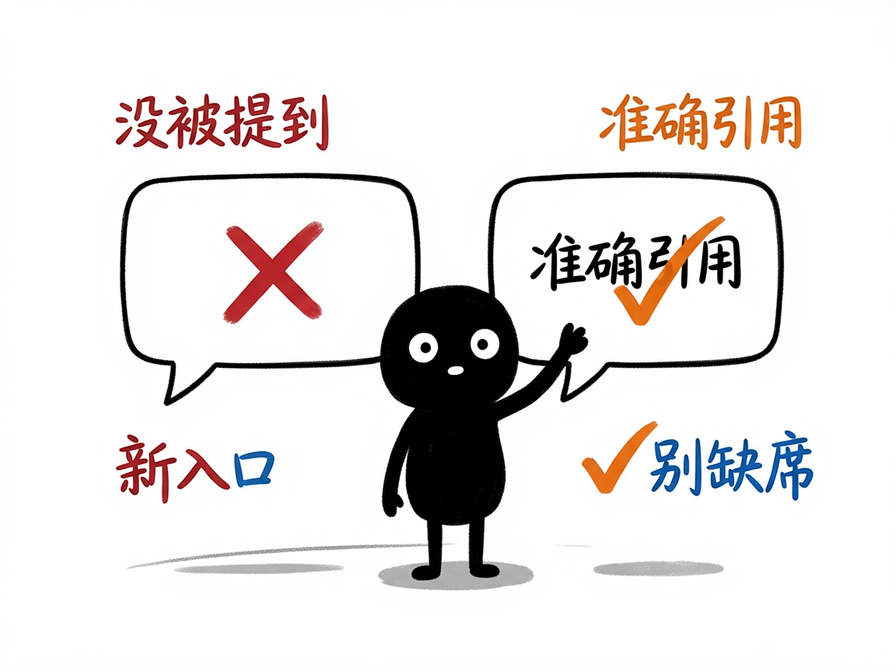

## 它到底能做什么
- 生成结构化数据标记：给网页加一段机器能读的"身份证"，告诉 AI 你是谁、提供什么——比如公司信息、常见问题解答（FAQ）、文章信息。
- 检测内容"AI 友好度"：分析你的文字里营销套话多不多、句子长不长、有没有数据支撑、有没有直接问句，给个可读评分和改善建议。
- 规划内容集群：帮你搭"一个核心主题页 + 多个子主题"的网站结构，让 AI 觉得你在这个领域讲得全、讲得透。
- 测 AI 可见度：看你的品牌名会不会出现在 AI 对相关问题的回答里，并生成季度对比报告。
- 做内容差距分析：你给它一个网址，它会去对比"AI 概览里提到的"和"你页面上说的"差在哪，给出补漏建议。

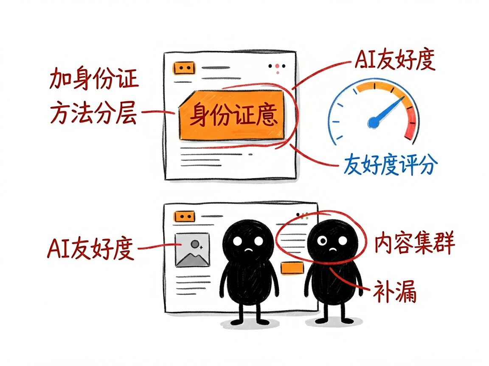

## 怎么用
你不需要记任何命令。在 codex / workbuddy 等 agent 装好 geo-optimizer 技能后，直接对 AI 说话就行：
**场景 1：给品牌页面加上"AI 身份证"**
你：帮我给"XX 品牌"生成一份公司信息的结构化数据标记，我们是做 XX 领域的，主要产品是 XX。
AI：它会产出一段能直接贴进网站的结构化数据，清楚告诉 AI 你的公司是谁、提供什么、擅长哪些领域。
**场景 2：看看我的文案 AI 友不友好**
你：这段官网文案对 AI 友好吗？帮我打个分，顺便说说哪里要改。
AI：它逐条分析你的文字，指出套话、长句、缺数据等问题，并给一版更好被 AI 引用的改写建议。
**场景 3：查我品牌在 AI 里露不露脸**
你：最近豆包、Perplexity 这些 AI 回答相关问题时会不会提到我们品牌？帮我测一下可见度。
AI：它去问相关 AI 并核对你的品牌是否出现，生成一份季度对比报告，告诉你哪些问题里你"缺席"了。

## 谁适合用
- 做品牌内容、官网运营，想在新一代 AI 搜索里占位置的人。
- 帮客户做 SEO / 内容优化的从业者。
- 做 AI 工具、需要把"让 AI 引用"做成标准化流程的人。

## 一点说明
它是一套面向"做内容优化 / 搭 AI 工具"的技能，不是普通人点一下就完事的 APP。它提高的是"被 AI 引用的概率"，不保证某个平台一定会提你（文档里明确写了这点）。部分功能（比如可见度测试）需要你自家的相关接口密钥（API Key）才能跑，没有的话它会给你手动测试的方法。具体能力以项目文档为准。

## 闲鱼接单文案

> 以下服务展示在闲鱼 / 淘宝服务市场发布，用于承接本 skill 的定制开发订单。

**标题：GEO 生成式引擎优化 skill软件开发**

**描述：**

专注 AI Agent 技能（skill）定制开发，已做出 GEO（让 ChatGPT、豆包这些 AI 搜索愿意引用你）优化技能，现成作品可先看演示再下单。给网页生成结构化数据"AI 身份证"（公司 / FAQ / 文章信息），检测文案的 AI 友好度并给改写建议，规划"核心主题 + 子主题"的内容集群，测试品牌在各大 AI 回答里的可见度并出季度对比报告，还能做内容差距分析。可按你的品牌定制，全部源码交付、支持二次开发。

**服务内容：**

- 1、需求沟通梳理：先聊清楚品牌信息、官网网址和最关心的目标（结构化标记 / 文案友好度 / AI 可见度），确认相关接口密钥情况，列明功能清单后再动手
- 2、skill交付内容和格式：结构化数据标记代码、内容 AI 友好度评分与改写建议、内容集群规划、品牌 AI 可见度对比报告
- 3、项目功能/系统开发：按你的行业定制检测维度、集群结构与可见度问题库，可扩展定期监测等功能的开发与联调
- 4、skill源码交付：SKILL.md 技能说明 + 提示词 / 脚本 / 模板 / 报告样例组成的完整技能工程，兼容 codex / workbuddy 等 agent。全部源码 + 安装部署说明 + 使用演示，交付后可自行修改维护

---

<!-- 来源: geolook.md -->

# 做 GEO（让 AI 推荐你的品牌）从诊断到交付，它一条龙包了 —— geolook 介绍

你是个品牌方，或者帮客户做"AI 搜索优化"的服务商。你需要的不是一句"建议你优化一下内容"的空话，而是一套能落地的方案：现在 AI 怎么看你的品牌、差在哪、具体改什么、改完有没有效、最后能打包发给客户的报告。

**geolook 就是来解决这件事的。**

它是一套完整的 GEO（生成式引擎优化，简单说就是让 AI 在回答问题时更愿意、更准确地提到你的品牌）服务流程。你给它一个产品官网网址和一点介绍材料，它还你三份能直接发给客户的交付文档，外加一套能直接用上的优化资料。从"抓官网、做体检、问各家 AI 怎么评价你"，一直做到"告诉你具体改成啥、改完有没有效、打包成正式报告"。

---

pindou 测试视频

## 它到底能做什么

- 站点体检：从可抓取性、长度、结构、能被 AI 抽出来的"事实块"、权威信号等六个方面给官网打分，找出 AI 看不懂的硬伤（比如页面是空的、或者禁止 AI 抓取）。
- AI 答案采样：同时问国内（智谱、豆包、DeepSeek、Kimi、MiniMax）和海外（Gemini、ChatGPT、Claude、Grok、Perplexity）多家 AI，看它们怎么评价你的品牌——国内海外分开算，不混为一谈。
- 生成带验收标准的工单：把问题变成"谁、什么时候、做到什么算完成"的执行清单，而不是泛泛的建议。
- 产出能直接用的资料：直接生成 `llms.txt`（一份专门写给 AI 看的官方事实索引）、结构化数据、常见问题解答等，放进网站就能用。
- 自动验收 + 客户交付：改完会重新检查一遍、自动更新工单状态，并打包成诊断 / 优化 / 执行三份正式交付文档。

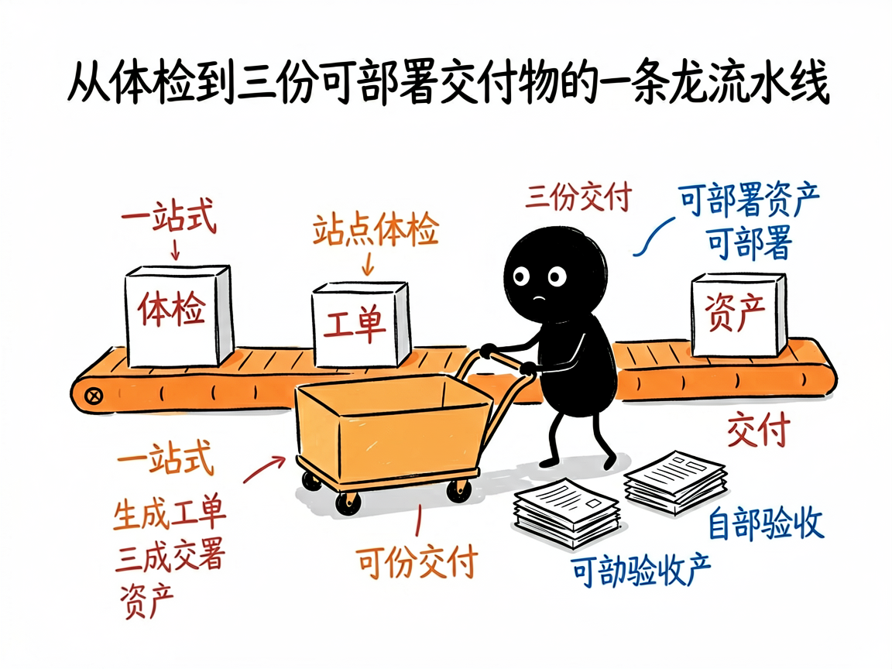

## 怎么用

你不需要记任何命令。在 codex / workbuddy 等 agent 装好 geolook 技能后，直接对 AI 说话就行：  
**场景 1：给客户出一整套 GEO 交付物**  
你：帮我把 example.com 这个品牌的 GEO 从头到尾做一遍，国内海外都要，最后给我能发给客户的三份报告。  
AI：它会先抓取你的官网做体检，再同时问国内外多家 AI 怎么评价你，找出差距、生成带验收标准的优化工单，并打包成诊断、优化、执行三份正式交付文档发还给你。  
**场景 2：只想知道 AI 现在怎么看我的品牌**  
你：现在豆包、ChatGPT 这些 AI 提到我们品牌时都说啥？帮我采样一下，再说说差在哪。  
AI：它同时问国内外多家 AI 关于你品牌的回答，整理出一份对比，告诉你哪些地方被夸、哪些地方被说错或根本没提。  
**场景 3：改完想验收效果**  
你：我按你上次给的工单改了官网，帮我重测一下，看 AI 现在对我的评价有没有变好。  
AI：它重新抓取页面、重问各家 AI，对比改前改后的答案，更新工单状态，并告诉你哪些问题已经解决、哪些还得继续改。

## 谁适合用

- 给客户提供"AI 搜索优化"服务的服务商 / 代运营。
- 自家品牌想系统做 GEO、按周期跟进效果的运营团队。
- 做 AI 工具、要把 GEO 服务做成标准化产品的人。

## 一点说明

它主要靠 AI 能力来完成整条流水线，不是普通用户双击即用的 APP。它要调用各家 AI 的接口（API，让不同软件互相取数据的接口），部分没有联网接口的平台会走人工采样。GEO 提高的是被引用的"概率"而非"保证"——给客户写方案时务必原样写明这点；它也不做传统 SEO 排名、不买外链、不替你改网站实际代码。具体能力以项目文档为准。

## 闲鱼接单文案

> 以下服务展示在闲鱼 / 淘宝服务市场发布，用于承接本 skill 的定制开发订单。

**标题：GEO 品牌优化一条龙服务 skill软件开发**

**描述：**

专注 AI Agent 技能（skill）定制开发，已做出 GEO 全流程交付技能，现成作品可先看演示再下单。给它一个品牌官网和介绍材料：从六维站点体检（可抓取性 / 事实块 / 权威信号等）、国内外十家 AI 的答案采样对比，到生成带验收标准的优化工单、直接能用的 llms.txt / 结构化数据 / FAQ 资料，改完自动复检验收，最后打包成诊断、优化、执行三份可直接发客户的交付文档。可按你的服务流程定制，全部源码交付、支持二次开发。

**服务内容：**

- 1、需求沟通梳理：先聊清楚品牌官网、介绍材料和目标市场（国内 / 海外 / 双线），确认可用的 AI 接口情况，列明功能清单后再动手
- 2、skill交付内容和格式：诊断 / 优化 / 执行三份客户交付文档 + 站点体检结果 + AI 答案采样对比 + 带验收标准的工单 + llms.txt、结构化数据、FAQ 等即用优化资料
- 3、项目功能/系统开发：按你的服务流程定制体检维度、AI 平台名单与交付文档模板，可扩展周期性复检等功能的开发与联调
- 4、skill源码交付：SKILL.md 技能说明 + 提示词 / 脚本 / 模板 / 报告样例组成的完整技能工程，兼容 codex / workbuddy 等 agent。全部源码 + 安装部署说明 + 使用演示，交付后可自行修改维护

---

<!-- 来源: geometry-math-proof-remotion.md -->

# 把数学证明做成动画视频，让公式自己"长"出来 —— geometry-math-proof-remotion 介绍

你想过把勾股定理、欧拉公式这类证明讲给别人听吗？光靠文字和静态图，听着听着人就走神了；真去学动画软件又门槛太高。很多人卡在"想做但做不出来"这一步。

**geometry-math-proof-remotion 就是来解决这件事的。**

你给它一份数学证明的文档，它还你一段深色背景、精准几何风格的推导视频，像 3Blue1Brown（国外那个有名的数理科普频道）那种感觉。

---

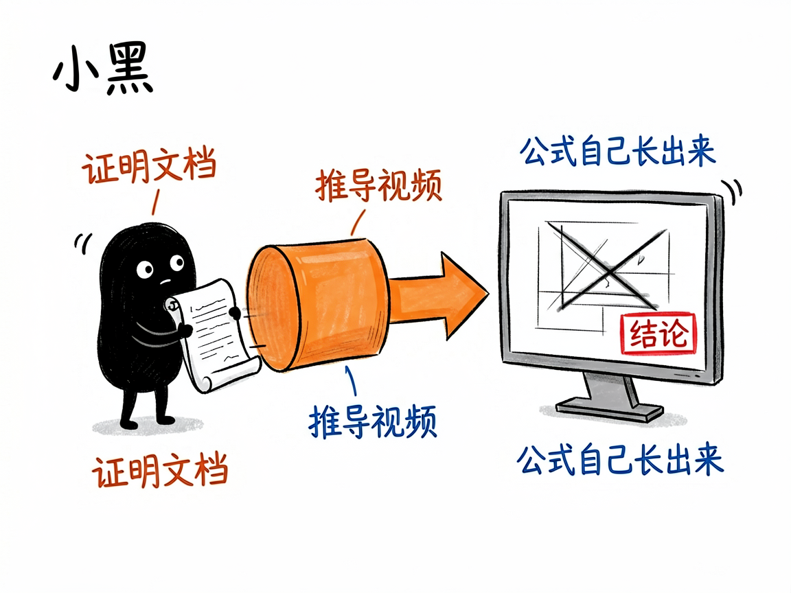

## 它到底能做什么
- 把证明拆成 6~10 个章节，每章只讲一件事，逻辑一步步推进，不会跳步把推导链打断。
- 几何图形全部用矢量方式绘制（SVG，一种放大也不会糊的图形格式），线条像被"描"出来一样慢慢显现，而不是生硬出现。
- 公式在画面右侧逐行揭示，最后结论用黄框大字标出，观众跟着节奏走。
- 自动生成配音（TTS，也就是文字转语音）和同步字幕，关键词用黄色高亮，像看教学视频一样。
- 输出 1920×1080 横屏成片，深底配红蓝绿黄高饱和色，干净、专业、不花哨。

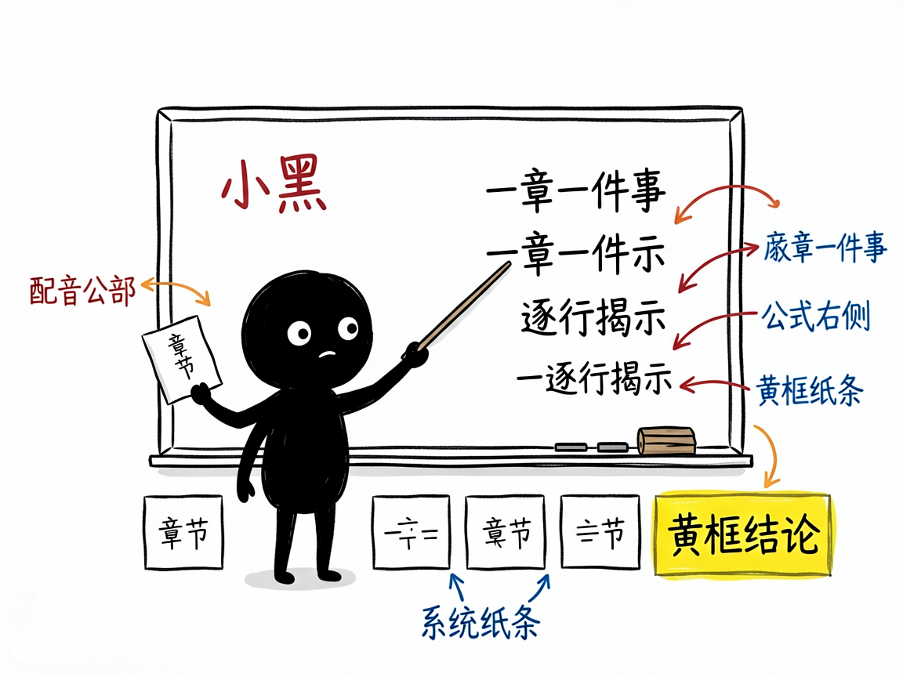

## 怎么用

你不需要记任何命令。在 codex / workbuddy 等 agent 装好 geometry-math-proof-remotion 技能后，直接对 AI 说话就行：

**场景 1：把勾股定理讲给同学听**
你：帮我把勾股定理的证明做成一个动画视频，按"直角三角形、三条边平方、面积拼图"这个思路一步步讲清楚。
AI：它会把证明拆成几个小节，用深色背景、几何图形被"描"出来的方式展现，公式逐行揭示、最后用黄框标出 a²+b²=c²，并配上语音和字幕，给你一段可以直接发的视频。

**场景 2：做一期欧拉公式科普**
你：我想做一期欧拉公式（就是 e 的 iπ 次方加 1 等于 0 那个式子）的科普短视频，要像 3Blue1Brown 那种风格。
AI：它会把推导过程拆成逻辑连贯的章节，用精准几何风格画出来，关键词高亮，最后输出 1080p 横屏成片。

**场景 3：沉淀"经典证明"系列**
你：我们账号想做个"经典数学证明"系列，先来一个"质数有无穷多个"的证明。
AI：它会按统一模板产出视频，你以后持续往里加新的一期，风格和节奏都能保持一致。

## 谁适合用
- 老师、科普作者，想把抽象数学讲得直观。
- 做教育内容的自媒体，缺一个稳定的证明动画模板。
- 想沉淀"经典证明"系列视频的人。

## 一点说明
它是一个跑在 AI 助手（如 Codex、WorkBuddy）里的技能，不是你手机上能直接打开的 App。你给一份证明文档，AI 帮你产出并渲染成一段视频。它依赖 Remotion（一个用代码做视频的开源框架，但你不用写，AI 帮你写）来生成画面。具体能力以项目文档为准。

## 闲鱼接单文案

> 以下服务展示在闲鱼 / 淘宝服务市场发布，用于承接本 skill 的定制开发订单。

**标题：数学证明动画视频制作 skill软件开发**

**描述：**

专注 AI Agent 技能（skill）定制开发，已做出数学证明动画技能，现成作品可先看演示再下单。给它一份数学证明文档，产出 3Blue1Brown 风格的推导视频：证明拆成 6–10 个章节、几何图形像被"描"出来一样逐渐显现、公式逐行揭示、结论黄框标出，自动配音和同步字幕，输出 1080p 横屏成片。可按你的账号风格定制系列模板，全部源码交付、支持二次开发。

**服务内容：**

- 1、需求沟通梳理：先聊清楚要讲的证明（勾股定理、欧拉公式等）、目标观众和时长预期，确认证明思路文档，列明功能清单后再动手
- 2、skill交付内容和格式：1920×1080 横屏推导视频成片：分章节动画、矢量图形描线、公式逐行揭示、黄框结论、配音与关键词高亮字幕（MP4 文件）
- 3、项目功能/系统开发：按你的账号风格定制章节结构、配色与配音，可扩展"经典证明"系列批量出片等功能的开发与联调
- 4、skill源码交付：SKILL.md 技能说明 + 提示词 / 脚本 / 模板 / 视频样例组成的完整技能工程，兼容 codex / workbuddy 等 agent。全部源码 + 安装部署说明 + 使用演示，交付后可自行修改维护

---

<!-- 来源: glm-5.3-flash-vision-rag.md -->

# 让 AI 读完一本几百页的 PDF，还能告诉你答案在第几页？—— glm-5.3-flash-vision-rag 介绍

你手上有一份 120 页的技术手册或扫描版合同，想问它一个具体问题。整本塞给 AI？token 爆炸、慢得要命；用传统文字 RAG？碰到图表、表格、公式、扫描件就瞎了，页码还经常报错。你真正想要的是：问一句话，拿到答案，顺便看到那几页的原图自己核对。

**glm-5.3-flash-vision-rag 就是来解决这件事的。**

你给它一份 PDF 和一个问题，它还你带 `[第N页]` 标注的答案，外加引用页的原图和一份自包含 HTML 预览页。基于智谱视觉大模型 GLM-5.3-Flash。

---

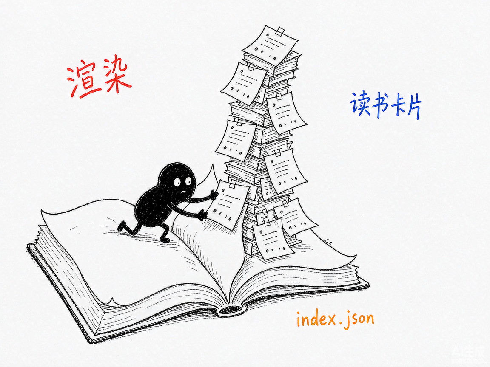

## 它到底能做什么
- 视觉建索引：每页渲染成图，让视觉模型逐页"阅读"并写一张读书卡片（页型、标题、摘要、关键词），一次建完永久复用，重跑直接命中缓存。
- 带页码的答案：每个论点标注 `[第6页]`，页码来自物理事实——图就是第 6 页渲染出来的，不需要模型猜。
- 原图回显：把引用页的高清原图一并给你，自己核对，不用盲信。
- 跨页召回：问"这个概念在哪几页被提到"，能找齐全书所有相关页。
- 章节定位：问"§05 在第几页、讲了什么"，给出起止页码加内容总结。
- 深度对比：问"对比一下 XX 和 YY"，基于相关页做对比分析。
- 指定页渲染：`show.py` 直接高清出第 N 页的图，不用先建索引。
- 扫描版也能用：索引靠视觉阅读，纯图片无文字层的 PDF 照样处理。
- 诚实不编造：只索引前 8 页时追问全书问题，它会明确回答"§03 正文不在提供页面中"。

## 怎么用
你不需要懂 RAG。在 codex / workbuddy 等 agent 装好 skill、配好 GLM key 后，直接对 AI 说话就行：
**场景 1：先让 AI 把书读一遍**
你：帮我读一下这份 120 页的手册。
AI：它逐页视觉阅读建立索引（约 3 分钟，只需一次），之后这本书就"被读过了"，这一步永远不用再做。
**场景 2：问具体问题**
你：审批策略出厂默认是什么？
AI：它本地粗筛出 12 页候选，视觉模型看图确认到 4 页，再深读作答——给出带 `[第6页]` 标注的答案，并把第 6 页原图和 HTML 预览页一起给你。
**场景 3：只要某一页**
你：给我看看第 72 页。
AI：它直接高清渲染那一页的图片，无需先建索引。

## 谁适合用
- 要啃长篇技术文档、论文、教材，又需要精确出处的人。
- 处理扫描版合同、发票、档案等没有文字层材料的法务和财务。
- 做文献综述、需要跨页比对观点的研究者。

## 一点说明
glm-5.3-flash-vision-rag 是一套 AI 技能，装进 codex / workbuddy 等 agent 后对话使用，需要自备 GLM API key（写在 `~/.glm_api_key` 或环境变量）。索引按 PDF 内容哈希缓存，内容改了自动另建。它用的是三层漏斗——本地 TF-IDF 粗筛（免费）→ 视觉精排 → 深读作答，所以每次提问只花 2 次调用、十几秒出答案。局限是单次深读上下文约 12 页，涉及全书统计类问题精度会下降。姊妹版 `deepseek-v4-flash-vision-rag` 用 DeepSeek 引擎，架构同构，可两边对照。

## 闲鱼接单文案

> 以下服务展示在闲鱼 / 淘宝服务市场发布，用于承接本 skill 的定制开发订单。

**标题：PDF视觉问答RAG（带页码引用+原图回显）skill软件开发**

**描述：**

专注 AI Agent 技能（skill）定制开发，已做出"让 AI 真正看懂 PDF 并带页码作答"的成品技能，现成作品可先看演示再下单。支持文字版和扫描版 PDF，能读懂图表、表格、公式，每次回答标注精确到页的引用并把原页图片摊开给你核对，自动生成自包含 HTML 预览页。支持按你的文档类型定制索引粒度与检索策略，交付后装进 codex / workbuddy 等 AI 助手即可使用，全部源码交付、支持二次开发。

**服务内容：**

- 1、需求沟通梳理：先聊清楚你的文档类型（技术书/合同/论文/档案）、体量和关注的问题类型，确认 GLM 账号与额度，列明功能清单后再动手
- 2、skill交付内容和格式：带页码引用的答案 + 引用页高清原图（PNG）+ 自包含 HTML 预览页 + 可复用的索引缓存（index.json）
- 3、项目功能/系统开发：按你的文档特点定制渲染分辨率、卡片字段、粗筛权重与深读页数的开发与联调
- 4、skill源码交付：SKILL.md 技能说明 + 提示词 / 脚本 / 缓存结构 / 生成样例组成的完整技能工程，兼容 codex / workbuddy 等 agent。全部源码 + 安装部署说明 + 使用演示，交付后可自行修改维护

---

<!-- 来源: glm-5.3-flash-vision-video-rag.md -->

# 想问视频"这段动作到底怎么发生的"？让 AI 按秒给你答案—— glm-5.3-flash-vision-video-rag 介绍

你有一段比赛录像、监控片段或者教学视频，想问"第二次团战是怎么输的""爆炸是几点发生的"。可视觉模型根本没有"视频模态"——实测把视频文件直接丢进去，GIF 只解码首帧。你真正想要的是：问一句话，拿到带 `[MM:SS]` 时间戳的答案，还能把那几秒的片段切出来自己看。

**glm-5.3-flash-vision-video-rag 就是来解决这件事的。**

你给它一段视频和一个问题，它还你带时间码的答案、关键时刻的关键帧、可播放的 ±5 秒片段，外加一份内嵌播放器的 HTML 预览页。基于智谱视觉大模型 GLM-5.3-Flash。

---

## 它到底能做什么
- 时间轴建索引：ffmpeg 按时间顺序抽帧，视觉模型逐帧"观看"并写卡片——场景、画面摘要、关键词、可见文字（OCR）、相对前帧的事件、运动强度。一次建完永久复用。
- 带时间码的答案：每个论点标注 `[MM:SS]`，精确定位事件发生的时刻。
- 可播放片段回显：自动切出关键时刻前后 5 秒的 mp4，直接播放核对。
- 微观层自动升级：问动作细节时（一次甩枪只有 150–250 毫秒），自动对该时刻用 12fps 中心放大逐帧重看，给出逐帧攻防链。
- 帧级 OCR：汇总画面里出现过的招牌、字幕、HUD 文字。
- 剧情总结：按时间顺序还原事件脉络。
- 灵活导出：`show.py` 可单独出某时刻高清帧、可播放片段、高帧率放大序列。
- 长片自适应：≤10 分钟降到 0.5fps、≤30 分钟降到 0.25fps，几小时的监控自动降到 0.1fps 建全局索引。

## 怎么用
你不需要懂抽帧和检索。在 codex / workbuddy 等 agent 装好 skill、配好 GLM key 后，直接对 AI 说话就行：
**场景 1：先让 AI 把视频看一遍**
你：帮我看看这段录像。
AI：它按时间轴抽帧阅读建立索引（15 秒视频约 18 秒完成），同时用场景切换检测标出剪辑点。
**场景 2：问一个具体事件**
你：爆炸是几点发生的？
AI：它本地粗筛候选段、视觉模型看图确认、再深读作答——给出带 `[MM:SS]` 的答案，并切出该时刻前后 5 秒的可播放片段。
**场景 3：抠动作细节**
你：玩家瞄准有什么问题？
AI：它自动升级到 12fps 中心放大逐帧分析，输出逐帧动作分解，并把关键帧和 HTML 预览页（内嵌播放器）一起给你。

## 谁适合用
- 做比赛复盘、需要抠动作细节的教练和电竞选手。
- 要从监控录像里定位事件的安防和运营人员。
- 想从教学视频、录屏里检索"讲过什么"的内容从业者。

## 一点说明
glm-5.3-flash-vision-video-rag 是一套 AI 技能，装进 codex / workbuddy 等 agent 后对话使用，需要自备 GLM API key（写在 `~/.glm_api_key` 或环境变量），依赖 ffmpeg/ffprobe 在 PATH。模型没有音频模态——一切理解基于画面，音轨被忽略，"听到了什么"回答不了，枪声、台词只能靠画面痕迹推断（产出里会注明）。宏观 1fps 引用误差约 ±2 秒，动作类问题会自动升级 12fps 微观（约 0.08 秒粒度）。姊妹版 `deepseek-v4-flash-vision-video-rag` 用 DeepSeek 引擎，架构同构。

## 闲鱼接单文案

> 以下服务展示在闲鱼 / 淘宝服务市场发布，用于承接本 skill 的定制开发订单。

**标题：视频理解问答RAG（时间码定位+片段回显）skill软件开发**

**描述：**

专注 AI Agent 技能（skill）定制开发，已做出"让 AI 看懂视频并按秒作答"的成品技能，现成作品可先看演示再下单。输入一段视频，自动抽帧建时间轴索引，提问后返回带 `[MM:SS]` 时间码的答案，并切出对应时刻的可播放片段与关键帧，动作类问题自动升级高帧率微观逐帧分析，生成内嵌播放器的自包含 HTML 预览页。支持按你的视频类型定制抽帧密度与检索策略，交付后装进 codex / workbuddy 等 AI 助手即可使用，全部源码交付、支持二次开发。

**服务内容：**

- 1、需求沟通梳理：先聊清楚你的视频类型（赛事/监控/教学/录屏）、时长范围和常问的问题类型，确认 GLM 账号与额度，列明功能清单后再动手
- 2、skill交付内容和格式：带时间码的答案 + 关键时刻关键帧（JPEG）+ 可播放片段（mp4）+ 内嵌播放器的自包含 HTML 预览页
- 3、项目功能/系统开发：按你的视频特点定制抽帧密度、帧卡片字段、微观层触发规则与片段裁剪逻辑的开发与联调
- 4、skill源码交付：SKILL.md 技能说明 + 提示词 / 脚本 / 缓存结构 / 生成样例组成的完整技能工程，兼容 codex / workbuddy 等 agent。全部源码 + 安装部署说明 + 使用演示，交付后可自行修改维护

---

<!-- 来源: glm-ecom-video-seedance-prompt.md -->

# 同款带货爆款，换个引擎拆会更准吗？—— glm-ecom-video-seedance-prompt 介绍

你刷到一条带货视频卖爆了，想让 AI 照着再来一条。可"拍一个好看的视频"这种提示词只能换回一坨废片，真正能出片的是"主体+动作时序+场景光影+镜头语言+色调情绪"全写齐的分镜级提示词——而把一条视频拆成这个粒度，靠人肉逐帧看要盯半天。

**glm-ecom-video-seedance-prompt 就是来解决这件事的。**

你给它一条带货视频，它还你一套可以直接粘贴进即梦（Seedance）的完整提示词包，每条镜头提示词旁边就摆着原片关键帧，逐镜对照。基于智谱 GLM-5.3-Flash 视觉大模型。

---

## 它到底能做什么
- 整段直传拆解：≤40MB 且 ≤120s 的视频默认整段丢给 GLM 原生视频理解，单次调用出全部分镜表，成本约为抽帧方式的 1/5，动作时序还带真实子时间戳；更长更大的视频自动回落到抽帧管线。
- 镜头级拆解卡：景别、视角、景深、运镜、光影、色彩、主体（人+产品）、动作时序、物理交互、字幕、卖点，一项项拆清楚。
- 全局带货分析：产品品类、人物设定、带货框架、自然流还是付费流、钩子在哪、卖点是什么、节奏怎么排。
- 提示词包一次给全：每镜头 ≤200 字（带时间锚点）+ 完整版 ≤800 字（直接粘贴）+ 中英双语负面词 + @参考图清单 + 差异说明与升级建议。
- 三种风格开关：忠实复刻、自然流种草、千川付费流，同一份分镜表可反复换风格重出。
- 产品信息注入：`--product` 告诉它你卖的到底是什么，卖点和负面词随之定制。
- 单镜头重出：`--shot B` 只重出不满意的镜头，其他不动。
- 逐镜对照 HTML：提示词和原片关键帧并排，肉眼核对拆解得准不准。

## 怎么用
你不需要记复杂流程。在 codex / workbuddy 等 agent 装好 skill、配好 GLM key 后，直接对 AI 说话就行：
**场景 1：拆解一条爆款视频**
你：帮我拆解这条带货视频。
AI：它把视频拆成若干镜头，逐个做 S-A-C-S-C 拆解卡，再给出全局分析（品类、框架、流量类型、钩子、卖点），存成可反复用的分镜表。
**场景 2：照着复刻一版**
你：按忠实复刻给我提示词。
AI：它结合分镜表生成每镜头提示词、完整版、负面词和参考图清单，并附一份与原片的差异说明。
**场景 3：按我的产品改一版投放用的**
你：改成千川付费流，我卖的是 XX 品牌精华液，主打烟酰胺美白，蓝色玻璃瓶身。
AI：它按付费流规则改写——强化钩子、极致特写、硬光侧逆光、加快节奏，并把你的产品信息注入卖点和负面词。

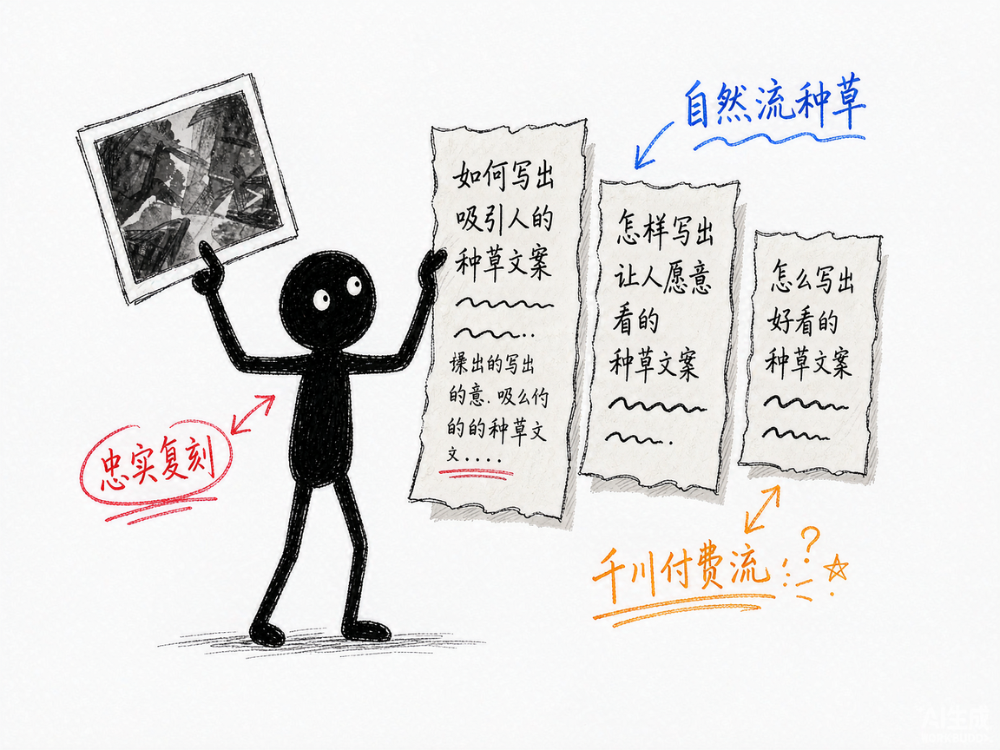

## 谁适合用
- 做电商带货、想批量复刻爆款结构的商家和投手。
- 帮客户做短视频的信息流代理商、编导。
- 已经在用 DeepSeek 版、想换个引擎互相校验效果的人。

## 一点说明
glm-ecom-video-seedance-prompt 是一套 AI 技能，装进 codex / workbuddy 等 agent 后对话使用，需要自备 GLM API key。它产出的是提示词，成片要到即梦里生成。编导方法论知识库与 DeepSeek 版完全共用（S-A-C-S-C 五要素、字数法则、自然流 vs 付费流五维差异、负面词模板）。无音频模态，口播靠画面和字幕推断，准确口播建议自己补（15 秒配约 120 字）。有意思的是双引擎会对同一条片给出不同判断（实测一条广告 DeepSeek 判"自然流"、GLM 判"付费流"），拿不准时两边都跑一下互相校验反而更稳。

## 闲鱼接单文案

> 以下服务展示在闲鱼 / 淘宝服务市场发布，用于承接本 skill 的定制开发订单。

**标题：带货视频AI拆解复刻提示词（GLM视觉引擎）skill软件开发**

**描述：**

专注 AI Agent 技能（skill）定制开发，已做出"整段视频直传视觉模型、一次出全部分镜表"的成品技能，现成作品可先看演示再下单。输入一条带货视频，自动拆解镜头并生成每镜头提示词、完整版提示词、中英负面词和参考图清单，支持忠实复刻/自然流/付费流三种风格切换，产出逐镜对照 HTML。支持按你的品类定制编导规则与负面词库，交付后装进 codex / workbuddy 等 AI 助手即可使用，全部源码交付、支持二次开发。

**服务内容：**

- 1、需求沟通梳理：先聊清楚你的品类、投放渠道（自然流/千川）、常复刻的视频风格，确认 GLM 账号与额度，列明功能清单后再动手
- 2、skill交付内容和格式：镜头拆解分镜表（JSON）+ 每镜头提示词 + 完整版提示词 + 中英负面词 + 参考图清单 + 逐镜对照 HTML
- 3、项目功能/系统开发：按你的品类定制拆解字段、编导规则知识库、风格模板与负面词库的开发与联调
- 4、skill源码交付：SKILL.md 技能说明 + 提示词 / 脚本 / 知识库 / 生成样例组成的完整技能工程，兼容 codex / workbuddy 等 agent。全部源码 + 安装部署说明 + 使用演示，交付后可自行修改维护

---

<!-- 来源: hyperframes-video-spec-builder.md -->

# 拍视频前脑袋一团乱？它帮你把想法聊成一份能直接开拍的方案 —— hyperframes-video-spec-builder 介绍

你想做一个产品宣传片、一条抖音视频，或者一段科普动画，但真坐下来却不知道从哪说起：镜头怎么分、配什么音乐、字幕怎么动、用什么风格？很多人卡在"想法有，脚本没有"。

**hyperframes-video-spec-builder 就是来解决这件事的。**

你跟它聊你的模糊想法，它还你一份结构清晰的视频规格脚本（含分镜表），可以直接丢给渲染端出片。

---

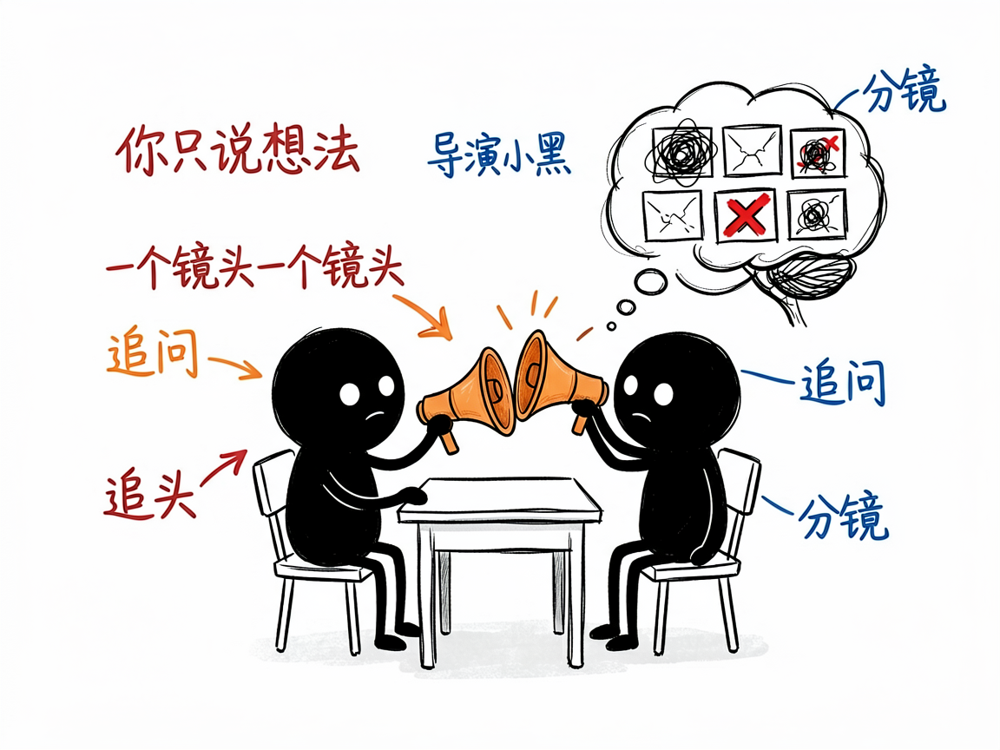

## 它到底能做什么
- 像导演一样坐在你对面，用追问把你脑子里的想法逼到"一个镜头一个镜头"的粒度，不接受"高大上""科技感"这种空话。
- 主动告诉你还能做什么：AI 配音、逐词高亮字幕、3D 旋转、画面跟着鼓点跳、水墨转场……你往往不知道这些能做到。
- 帮你盘点素材：逐字稿、音频、视频、图形、3D 模型、数据，一样样问清楚，不让你漏报。
- 从 8 套现成视觉风格里挑，或按你的描述生成专属主题（一套设计变量，决定配色、字体等观感）。
- 微信文章、热榜话题这类常见需求有专门的快速通道，不用从零聊。

## 怎么用

你不需要记任何命令。在 codex / workbuddy 等 agent 装好 hyperframes-video-spec-builder 技能后，直接对 AI 说话就行：

**场景 1：把一句话需求变成分镜脚本**
你：我想做一个 30 秒的产品演示视频，发抖音。
AI：它会一路追问目的、受众、核心卖点、手头素材和想要的风格，最后给你一份镜头级的分镜脚本，连配乐和字幕怎么动都写清楚了。

**场景 2：给老板的需求落地**
你：老板让我做个品牌宣传片，就说要"高级感"，别的没给。
AI：它会替你把"高级感"拆成具体问题——主色调用什么、要不要旁白、节奏快慢、用不用 3D，最后变成一份能直接交给渲染端执行的方案。

**场景 3：微信文章转视频**
你：我有篇公众号文章想做成视频，别让我从头聊了。
AI：它会走专门的快速通道，读完文章直接帮你出分镜脚本，省掉从零梳理的麻烦。

## 谁适合用
- 内容创作者、市场/运营，要做视频但写不出分镜脚本。
- 有素材、有想法，但被技术细节卡住的普通人。
- 需要把"老板的一句话需求"变成可落地方案的人。

## 一点说明
它本质是跑在 AI 助手里的"需求梳理 + 分镜脚本"技能，自己不渲染视频，产出的是一份规格脚本，真正的画面由配套的 HyperFrames 渲染端完成。具体能力以项目文档为准。

## 闲鱼接单文案

> 以下服务展示在闲鱼 / 淘宝服务市场发布，用于承接本 skill 的定制开发订单。

**标题：视频分镜脚本策划 skill软件开发**

**描述：**

专注 AI Agent 技能（skill）定制开发，已做出导演式分镜策划技能，现成作品可先看演示再下单。把"我想做个 30 秒产品视频"这种模糊想法，用一路追问逼成镜头级的分镜脚本：目的、受众、卖点、素材、风格逐项问清，不接受"高级感"这种空话；还会主动告诉你 AI 配音、逐词高亮、3D 旋转这些效果能不能做。微信文章转视频有快速通道。可按你的内容类型定制，全部源码交付、支持二次开发。

**服务内容：**

- 1、需求沟通梳理：先聊清楚视频目的、受众、核心卖点和手头素材（逐字稿 / 音频 / 图 / 3D 模型），选定视觉风格，列明功能清单后再动手
- 2、skill交付内容和格式：镜头级视频规格脚本（含分镜表）：每个镜头的画面、时长、配乐、字幕动效与视觉主题，可直接交给渲染端出片
- 3、项目功能/系统开发：按你的内容类型定制追问流程、视觉风格库与快速通道，可扩展专属主题生成等功能的开发与联调
- 4、skill源码交付：SKILL.md 技能说明 + 提示词 / 脚本 / 模板 / 脚本样例组成的完整技能工程，兼容 codex / workbuddy 等 agent。全部源码 + 安装部署说明 + 使用演示，交付后可自行修改维护

---

<!-- 来源: i18n-helper-skills.md -->

# 想把网站或代码做成多语言？这两个助手一个管网页、一个管源码 —— i18n-helper-skills 介绍

你的网站或产品想出海、想做繁体或日文版，可面对一堆 HTML 页面或几千行源码里的"保存成功""欢迎使用"，整个人都麻了：到底哪些要翻、怎么翻、翻完怎么不破版？手动改既慢又容易漏。

**i18n-helper-skills 就是来解决这件事的。** 它其实是一套"翻译助手合集"，里面有两个分工明确的技能：**html-i18n** 管纯静态网页，**i18n-helper** 管编程框架的源码。你给它一个站点或一段代码，它还你一套整理好的多语言版本或翻译文件，而且会跳过代码、链接这些不该翻的东西。

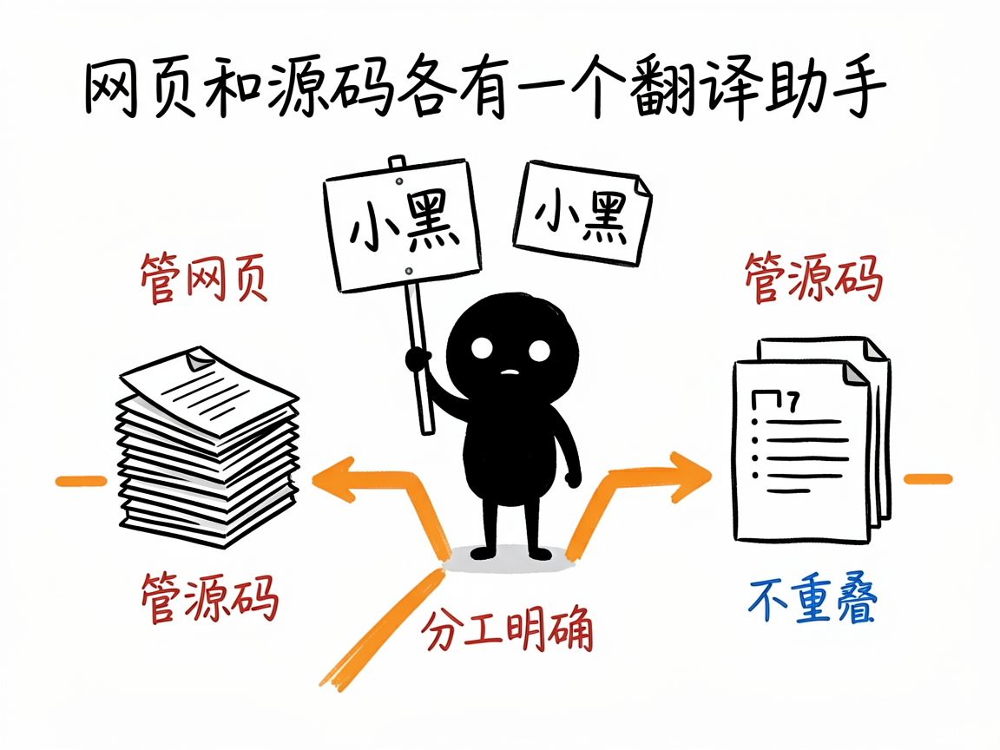

## 它到底能做什么

- **html-i18n（静态网页翻译）**：扫描你的 .html 文件，提取出可翻译的文字，生成各语言的独立目录（如 `en/`、`ja/`、`zh-TW/`）。原中文版一个字都不动，译文输出到新目录，样式和图片全站共享，对搜索引擎友好。
- 提取时会自动跳过代码块、链接地址、样式类名，避免把"技术零件"也翻成外文。
- 简体转繁体可以直接做字形+术语映射，不用逐字手改。
- **i18n-helper（源码国际化）**：扫描 React / Vue / Laravel / WordPress / Python / Java / Go 等源码里"写死"的中文，把它们换成框架通用的翻译函数调用，并生成对应语言文件（支持 JSON / YAML / PO / XLIFF / PHP 数组等格式）。
- 翻译那一步由 AI 按统一的术语表来译，保证同一词前后译法一致。
- 最后做完整性检查，告诉你每种语言翻了多少、漏了哪些。

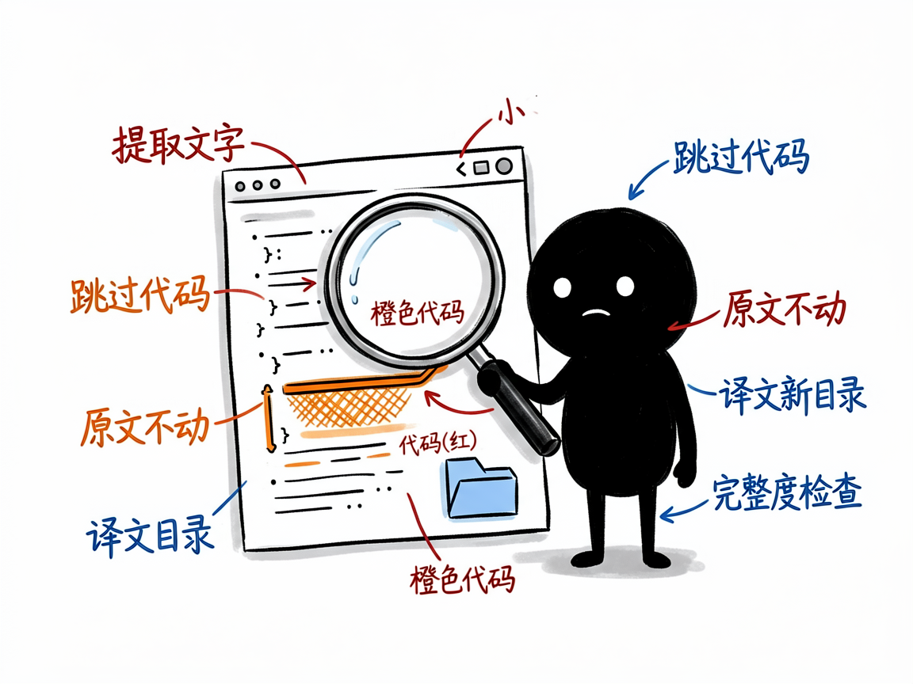

## 怎么用

你不需要记任何命令。在 codex / workbuddy 等 agent 装好 i18n-helper-skills 里的对应技能后，直接对 AI 说话就行：

**场景 1：纯 HTML 小站想出英文版**
你：我有个纯 HTML 做的小站，帮我出一份英文版，中文原版一个字都别动。
AI：它扫描所有页面、抽出可翻译文字，自动跳过代码和链接，生成英文目录和译文，原站保持不动，样式图片照常共用。

**场景 2：React 项目要加多语言**
你：我们这个 React 项目里中文都写死在代码里了，帮我改成支持中英文，别破版。
AI：它识别项目框架，把写死的中文换成通用翻译函数调用，生成中英文语言文件，并做完整性检查告诉你漏了哪些。

**场景 3：先看看翻得全不全**
你：刚才翻完一轮，帮我检查一下各语言都翻全了没有，有没有漏的。
AI：它逐语言统计翻译完成度，把没翻到的条目列出来给你补，避免发布后才发现缺字。

## 谁适合用

- 个人站长、文档站/博客作者，想给纯 HTML 站点做多语言版。
- 开发者，要给 React / Vue / Laravel / WordPress 等项目加多语言支持。
- 小团队，没有专业本地化流程，想低成本把产品"出海"或做繁体。

## 一点说明

怎么选是关键：项目里**只有 .html / 样式 / 图片、没源码** → 用 html-i18n；**有 .js / .vue / .php 等源码** → 用 i18n-helper，两者互补不重叠，别用错。它不是全自动翻译机——提取、回填、检查由技能完成，"翻译"那一步要由 AI 或你来定稿，长正文建议逐段精译而非纯机器映射。它是装在 AI agent 里的技能合集（不是图形界面软件）；具体支持的语言和框架以项目说明文档为准。

## 闲鱼接单文案

> 以下服务展示在闲鱼 / 淘宝服务市场发布，用于承接本 skill 的定制开发订单。

**标题：网站多语言国际化（i18n）skill软件开发**

**描述：**

专注 AI Agent 技能（skill）定制开发，已做出网页 + 源码双管的多语言技能合集，现成作品可先看演示再下单。html-i18n 管纯静态网页：生成 en / ja / zh-TW 等独立语言目录，原版一个字不动，自动跳过代码块和链接；i18n-helper 管框架源码：把 React / Vue / Laravel / WordPress / Python / Java / Go 里写死的中文换成通用翻译函数，生成 JSON / YAML / PO 等语言文件，统一术语表保证译法一致，最后出完整性检查报告。全部源码交付、支持二次开发。

**服务内容：**

- 1、需求沟通梳理：先聊清楚项目类型（纯 HTML 站还是带源码的工程）、目标语言和术语要求，确认站点 / 代码可访问，列明功能清单后再动手
- 2、skill交付内容和格式：多语言网站目录或语言文件包（原版不动、代码链接不误翻、术语前后一致）+ 每种语言的翻译完成度检查报告
- 3、项目功能/系统开发：按你的技术栈定制提取规则、术语表与回填流程，可扩展自动化批量翻译等功能的开发与联调
- 4、skill源码交付：SKILL.md 技能说明 + 提示词 / 脚本 / 模板 / 翻译文件样例组成的完整技能工程，兼容 codex / workbuddy 等 agent。全部源码 + 安装部署说明 + 使用演示，交付后可自行修改维护

---

<!-- 来源: ian-xiaohei-illustrations.md -->

# 文章写好了却愁配图？让"小黑"把你的观点画成清爽怪诞的手绘图 —— ian-xiaohei-illustrations 介绍

写文章最尴尬的环节之一，就是配图：网上扒的图版权说不清，PPT 风的信息图又太死板，找设计师排期又等不起。你真正想要的，是几张"读得懂、不土、和文字严丝合缝"的插图，最好还能批量来。

**ian-xiaohei-illustrations 就是来解决这件事的。** 你给它一篇中文文章，它还你一组 16:9 横版的手绘正文配图——纯白底、黑色线稿、少量红橙蓝中文批注，主角是一个叫"小黑"的怪诞小人和你文章里的核心观点一起"做一件荒诞但成立的事"。它专做"正文配图"，不是商业插画、也不是可爱卡通。

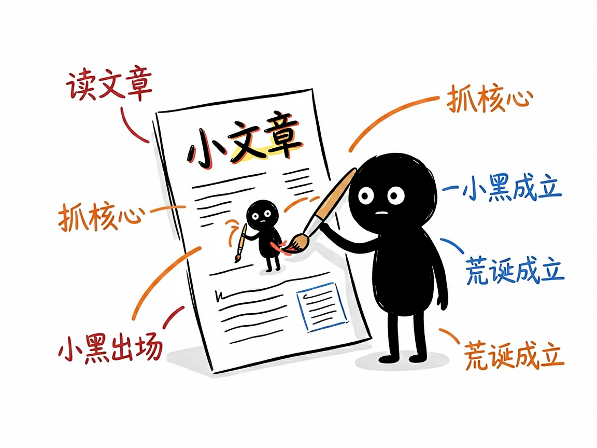

## 它到底能做什么

- 先"消化正文"：读你的文章，挑出最适合用图表达的"认知锚点"——核心判断、前后对比、流程闭环、常见坑、状态变化等，而不是平均撒图。
- 先出配图策略（shot list）：每张图标明放哪段后、讲什么、小黑在干嘛、建议元素和中文标注词，默认 4–8 张，短文 1–3 张。
- 把文章里的判断/流程/结构/隐喻，变成一张清爽、怪诞、可读但不像说明书的手绘解释图。
- 默认视觉 IP 是"小黑"：黑实心、白点眼、细腿、空表情，必须参与画面核心动作，不能只站旁边当装饰。
- 生成后做质量检查：太满、太像 PPT、小黑变装饰、背景不干净等问题会重画或修。
- 支持三种交付方式：直接嵌链接（最省事）、存到本地（适合公众号发稿）、转成内嵌编码（网络不稳时兜底）。

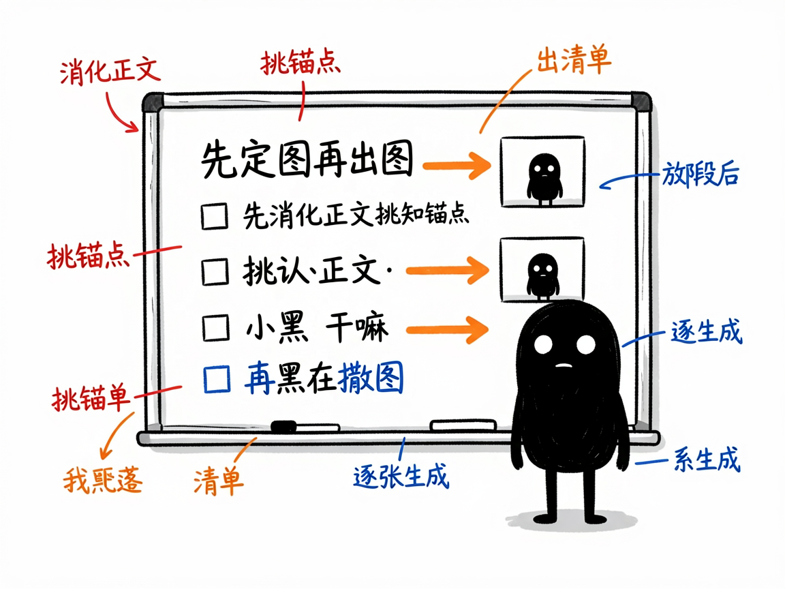

## 怎么用

你不需要记任何命令。在 codex / workbuddy 等 agent 装好 ian-xiaohei-illustrations 技能后，直接对 AI 说话就行：

**场景 1：写完长文要配一套图**
你：这篇讲"拖延症"的文章写好了，帮我配 5 张小黑风格的正文插图，要在关键段落后面。
AI：它先消化全文、挑出 5 个认知锚点，给你一份配图清单（每张放哪、小黑在干嘛、标什么词），确认后逐张出图并插回文章对应位置。

**场景 2：只要几张图不要动文字**
你：我这篇已有文章只想加配图，文字一个字都别改。
AI：它只走配图流程，分析文章的认知锚点产出图清单，生成小黑风格配图插回去，完全不碰你的文字。

**场景 3：先打个样再批量**
你：先帮我出一张样图看看风格对不对，对了再批量出剩下的。
AI：它先出一张小样验证整体效果，你满意后再把整批图一次性生成，避免网络不稳时白忙活。

## 谁适合用

- 公众号/博客作者，给文章配统一风格的插图（它常被写作类技能调用）。
- 做方法论、流程、结构类内容的人，需要把抽象概念画清楚。
- 知识博主、文档整理者，想让长文不再只有字。

## 一点说明

它的定位是"正文配图"，不是封面大图、也不是品牌吉祥物设计。每张图只讲一个核心结构，且要求每次从当前文章重新发明隐喻，不照抄过往案例。它是装在 AI agent 里的一个技能（不是图形界面软件）；出图依赖外部生图接口，连通性和图片托管稳定性会影响最终效果，具体以项目说明文档为准。

## 闲鱼接单文案

> 以下服务展示在闲鱼 / 淘宝服务市场发布，用于承接本 skill 的定制开发订单。

**标题：文章手绘配图生成（小黑风格）skill软件开发**

**描述：**

专注 AI Agent 技能（skill）定制开发，已做出小黑手绘配图技能，现成作品可先看演示再下单（本文整套插图就是它画的）。读你的文章挑出认知锚点，先出配图清单（每张放哪段、小黑在干嘛、标注什么词），再逐张生成 16:9 手绘图：纯白底、黑色线稿、少量红橙蓝中文批注，"小黑"怪诞小人必须参与画面核心动作，出图后自动做质量检查不达标重画。支持批量出图和多种交付格式，全部源码交付、支持二次开发。

**服务内容：**

- 1、需求沟通梳理：先聊清楚文章内容、配图数量（短文 1–3 张、长文 4–8 张）和交付方式（嵌链接 / 本地文件 / 内嵌编码），列明功能清单后再动手
- 2、skill交付内容和格式：配图清单（shot list）+ 16:9 小黑风格手绘配图成图（已插回文章对应位置或独立交付）
- 3、项目功能/系统开发：按你的内容类型定制视觉动作、标注风格与出图数量，可扩展整套账号视觉规范等功能的开发与联调
- 4、skill源码交付：SKILL.md 技能说明 + 提示词 / 脚本 / 模板 / 图片样例组成的完整技能工程，兼容 codex / workbuddy 等 agent。全部源码 + 安装部署说明 + 使用演示，交付后可自行修改维护

---

<!-- 来源: keyword-research.md -->

# 2000+ 关键词不会理？让 AI 帮你分类成能打的词库 —— keyword-research 介绍

做亚马逊广告，最头疼的是词太多、太乱：哪些该打、哪些该否、哪些是大词哪些是长尾，全靠人肉分，几天都分不完。keyword-research 就是来解决这个的：它基于 Sorftime 数据采集 2000+ 关键词，再用 LLM 智能按 8 个维度分类，直接产出词库、CSV 和可视化看板。

## 它到底能做什么

- 海量采集：流量词、竞品词、类目词、长尾词，合计 2000+ 关键词。
- 8 维智能分类：否定词、品牌词、材质词、场景词、属性词、功能词、核心词、其他，一键分好。
- 多种产出：Markdown 报告 + CSV 词库 + HTML 仪表板，可直接拿来投广告。
- 反查 + 扩展：从 ASIN 反查对手布局，再延伸长尾，覆盖更全。

## 怎么用

**场景 1：给一个产品建词库**
你：帮我调研 B07PWTJ4H1 这个 ASIN 的关键词词库。
AI：它采 2000+ 词，按 8 维分类，给你一份能直接用的词库和看板。

**场景 2：筛否定词省广告费**
你：哪些词跟我的产品不相关，帮我标出来。
AI：自动把否定/敏感词挑出，你直接加进否定投放，少烧钱。

## 谁适合用

- 亚马逊 PPC 投手、关键词策略分析师。
- 运营、广告优化师。
- 想从"凭感觉投词"升级到"按词性投词"的卖家。

## 一点说明

本技能依赖 Sorftime MCP 采集数据，需配置账号。分类由 LLM Agent 完成，长尾扩展量大，建议分批处理。具体以 SKILL.md 为准。

## 闲鱼接单文案

> 以下服务展示在闲鱼 / 淘宝服务市场发布，用于承接本 skill 的定制开发订单。

**标题：亚马逊关键词调研词库 skill软件开发**

**描述：**

专注 AI Agent 技能（skill）定制开发，已做出关键词调研词库技能，现成作品可先看演示再下单。基于 Sorftime 采集 2000+ 关键词，再按否定词、品牌词、材质词、场景词、属性词、功能词、核心词等 8 个维度智能分类，支持 ASIN 反查和长尾扩展，产出的词库和看板可直接拿去投广告。支持按你的产品和广告目标做个性化定制，交付后装进 codex / workbuddy 等 AI 助手即可使用，全部源码交付、支持二次开发。

**服务内容：**

- 1、需求沟通梳理：先聊清楚你的产品或 ASIN、广告目标（建词库还是筛否定词省钱），确认 Sorftime 账号可用，列明功能清单后再动手
- 2、skill交付内容和格式：2000+ 关键词采集与 8 维智能分类成果（Markdown 报告 + CSV 词库 + HTML 仪表板，可直接用于投放）
- 3、项目功能/系统开发：按你的品类调整分类维度与词库结构，可扩展批量 ASIN 反查、词库定期更新等功能的开发与联调
- 4、skill源码交付：SKILL.md 技能说明 + 提示词 / 脚本 / 模板 / 词库样例组成的完整技能工程，兼容 codex / workbuddy 等 agent。全部源码 + 安装部署说明 + 使用演示，交付后可自行修改维护

---

<!-- 来源: liurun-bookwriter.md -->

# 想写出"刘润式"有洞察的商业长文？让这个助手替你搭好骨架 —— liurun-bookwriter 介绍

你是不是也遇到过这种情况：脑子里有个商业观点想写下来，可一打开文档就卡住——开头怎么抓人？结构怎么排？金句从哪来？最后写出来的东西要么像流水账，要么满篇"赋能""底层逻辑"这种自己也别扭的词。

**liurun-bookwriter 就是来解决这件事的。** 你给它一个商业选题，它还你一篇有同理心、有逻辑势能、带金句的商业长文，而且通篇是刘润那股"替读者着想"的味儿。它把刘润 28 年商业写作经验（来自《我这28年的写作心法》《5分钟商学院》）提炼成一套可直接用的框架，不是简单套模板，而是真把"怎么写"教给 AI。

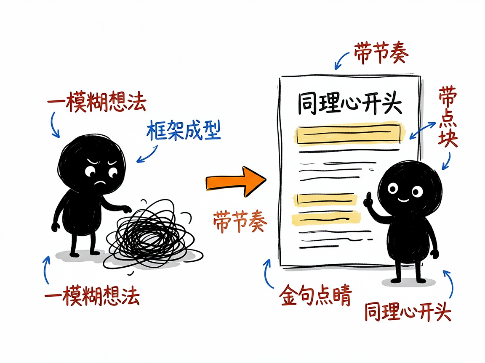

## 它到底能做什么

- 用三种成稿结构帮你写：最简单的**3段式**（适合商业评论、方法论）、珍珠项链般的**10点式**（适合案例拆解、企业参访）、克制的**32条**（适合事件评论、热点回应）。
- 自动套用"逻辑势能"。说人话就是：它先想清楚"先抛答案还是先抛冲突"，让文章有节奏地往下冲，而不是平铺直叙。
- 每篇都塞进"金句、故事、比方"这类内容块，让文章有记忆点，不是干巴巴讲道理。
- 帮你把用词拿捏到位：短、准、改。它会主动避开"大家""赋能""综上所述"这些刘润自己都嫌弃的词。
- 带着"同理心"开头——想象读者此刻正在地铁上、在午休、在深夜焦虑，先接住对方的情绪再开讲。
- 写完后做 12 项质量自检（禁用词、句长、人称频率等），不合格会标出来。

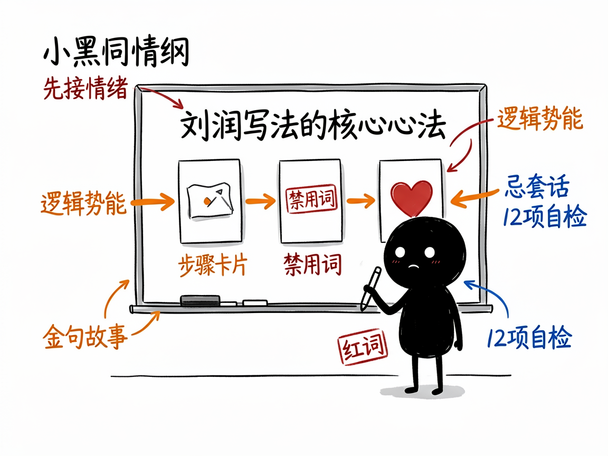

## 怎么用

你不需要记任何命令。在 codex / workbuddy 等 agent 装好 liurun-bookwriter 技能后，直接对 AI 说话就行：

**场景 1：热点来了想抢评**
你：用刘润的风格写一篇关于鸿蒙的 32 条评论。
AI：它识别成"32条"结构，选定逻辑势能，调研素材，按心法逐条撰写，每写完一条停下来等你确认，最后做 12 项质量自检再交稿。

**场景 2：企业参访要出案例稿**
你：我刚去一家做储能的公司参访完，帮我用 10 点式写一篇案例拆解，突出它的商业模式。
AI：它按"珍珠项链"结构把参访所得串成 10 个有故事、有金句的点，开头先用同理心接住读者，整篇是刘润那股替读者着想的味儿。

**场景 3：想写篇方法论**
你：帮我用 3 段式写一篇"小公司怎么招到对的人"的方法论文章。
AI：它搭好"问题—分析—行动"的三段骨架，填充金句和比方，避开那些自己也别扭的词，给你一篇干净利落的方法论。

## 谁适合用

- 公众号作者、商业自媒体，想稳定产出有质感的商业评论。
- 企业市场/品牌人员，要写方法论文章、案例拆解、企业家专访。
- 知识博主，想把"观点"讲出结构和说服力。
- 做 AI 写作类产品的团队，可把它当成一个高质量"风格框架"来复用。

## 一点说明

它最擅长的是有商业洞察的长文，但边界也清楚：写不了学术论文、纯小说、朋友圈那种超短文案，也做不了需要复杂图表的财务报告。它帮你把"写法"做到位，但替不了你自己的商业思考和真实调研——涉及数据、案例时它要求标注来源和时效。它是装在 AI agent 里的一个技能（不是独立打开的 App），装好后你直接在对话框里用就行；具体能调到什么程度，以项目的说明文档为准。

## 闲鱼接单文案

> 以下服务展示在闲鱼 / 淘宝服务市场发布，用于承接本 skill 的定制开发订单。

**标题：刘润式商业长文写作 skill软件开发**

**描述：**

专注 AI Agent 技能（skill）定制开发，已做出刘润风格写作技能，现成作品可先看演示再下单。把《我这28年的写作心法》《5分钟商学院》的写法拆成可执行框架：3 段式 / 10 点式 / 32 条三种成稿结构，自动安排逻辑势能和同理心开头，每篇配金句、故事、比方，主动避开"赋能"这类禁用词，写完做 12 项质量自检。适合商业评论、案例拆解、热点回应，可按你的公众号调性定制，全部源码交付、支持二次开发。

**服务内容：**

- 1、需求沟通梳理：先聊清楚商业选题、目标读者和文体（商业评论 / 案例拆解 / 热点回应），确认素材和引用来源，列明功能清单后再动手
- 2、skill交付内容和格式：完整商业长文稿：选定成稿结构、逻辑势能编排、金句故事比方、同理心开头、12 项自检结果（可直接发布的文章稿）
- 3、项目功能/系统开发：按你的公众号调性定制结构模板、禁用词表与自检规则，可扩展系列专栏批量产出等功能的开发与联调
- 4、skill源码交付：SKILL.md 技能说明 + 提示词 / 脚本 / 模板 / 文章样例组成的完整技能工程，兼容 codex / workbuddy 等 agent。全部源码 + 安装部署说明 + 使用演示，交付后可自行修改维护

---

<!-- 来源: luozhenyu-bookwriter.md -->

# 想写出"罗振宇式"有启发的好文章？这个助手帮你把金句和故事安排明白 —— luozhenyu-bookwriter 介绍

你有没有过这种感觉：听罗振宇讲东西特别带劲——几句对仗短句就让你"哦"地一下，一个历史人物的故事就把道理说透了。可自己提笔，写出来的全是"我们要相信""加油"这种自己也知道没劲的话。

**luozhenyu-bookwriter 就是来解决这件事的。** 你给它一个认知类选题，它还你一篇有启发、有金句、有故事、带"躬身入局"劲头的文章，语气像罗振宇。它把罗振宇 14 年内容经验（《罗辑思维》、"罗胖60秒"、跨年演讲、《阅读的方法》《启发》等）拆成一套可执行的写法框架。

它和刘润那个是"同门不同味"：刘润偏商业洞察，罗振宇偏认知启发。一个开头常是"你可能正在……"，这个开头常是"我是罗胖……"。

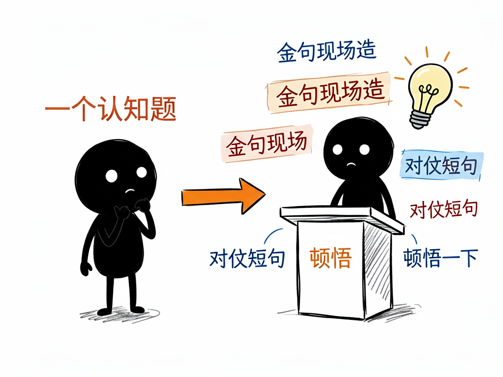

## 它到底能做什么

- 支持三种写法：**罗胖60秒**（60–150 字超短启发，适合热点快评）、**罗辑思维长文**（2000–4000 字，适合认知升级、人物拆解）、**跨年演讲稿**（万字起，适合年度总结、大型演讲）。
- 自动套三种逻辑势能：先抛冲突再给答案、先具体再抽象最后落到行动、先讲现象再解释最后给启发，让文章有起承转合。
- 强制"金句现场原创"：它不照搬罗振宇的原句，而是按公式（对仗式、反常识式、"一X就Y"式等）为你的主题现造金句，每千字至少 3 句。
- 帮你用历史人物讲现代道理（曾国藩、拿破仑、卢梭……），但要求每篇换新故事，不老拿同一批人凑数。
- 用"打比方"把抽象概念翻成生活里摸得着的东西（水、路、容器、种子），降低理解门槛。
- 写完后做 12 项质量自检，比如禁用词（"大家""鸡汤""震撼发布"）、句长上限（比刘润更短，每句不超过 40 字）。

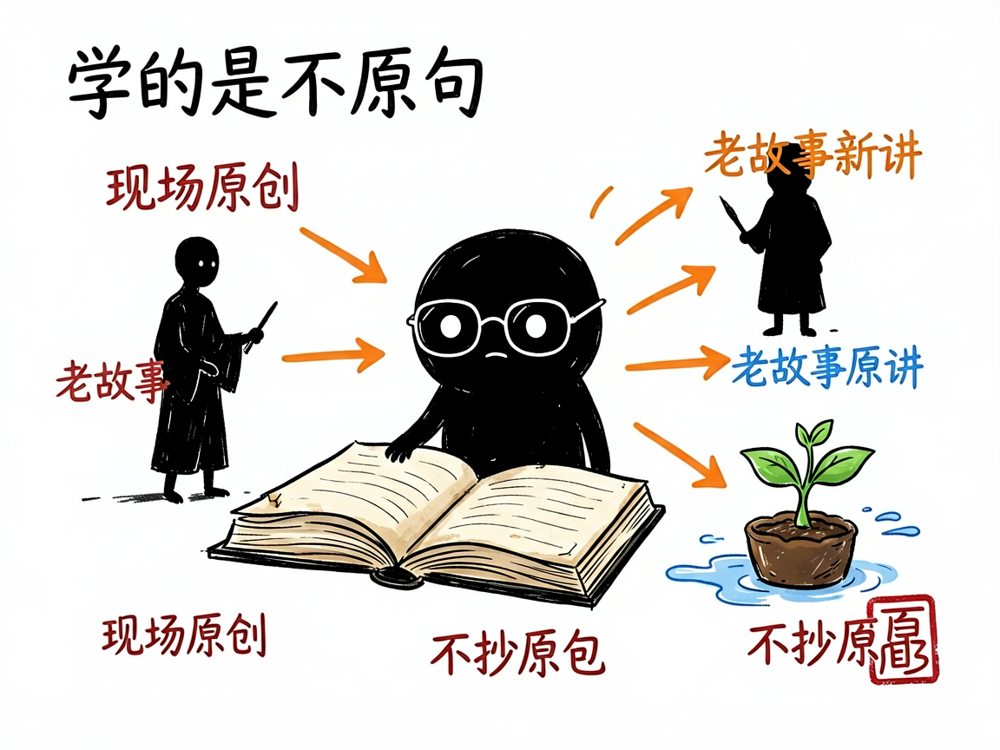

## 怎么用

你不需要记任何命令。在 codex / workbuddy 等 agent 装好 luozhenyu-bookwriter 技能后，直接对 AI 说话就行：

**场景 1：想赶个热点，发条短启发**
你：帮我用罗胖60秒的风格，写一条关于"AI 时代普通人怎么办"的短启发，100 字左右。
AI：它识别成"罗胖60秒"短文体，选好逻辑势能，现造几句金句、配一个生活比方，几分钟给你一段可直接发的短文，并标出哪里还能加故事。

**场景 2：要写篇年度复盘长文**
你：年底了，我想写一篇关于"长期主义"的跨年演讲体长文，2000 字，带点历史人物故事。
AI：它按跨年演讲稿结构起草，每写完一个小主题就停下来等你确认，过程中不断塞金句、换故事、打比方，最后做 12 项自检再交给你。

**场景 3：想拆一个人物**
你：用罗辑思维长文的味道，拆解一下曾国藩，讲讲他怎么面对失败。
AI：它选好人物、找新角度、铺开"现象—解释—启发"的节奏，给你一篇有故事也有观点的长文，绝不拿老套例子凑数。

## 谁适合用

- 知识博主、认知类自媒体，想稳定产出有启发的好文。
- 做个人成长、长期主义、读书分享内容的人。
- 需要写演讲稿、年度复盘、热点回应的人。
- 做 AI 写作类产品的团队，可把它当现成的"启发式风格框架"来复用。

## 一点说明

它最讲究的一条原则是"学风格不抄句子"——金句、故事、比喻都必须为当前主题现场原创，直接套罗振宇代表作里的原句会被判不及格。它不擅长学术论文、纯虚构、朋友圈超短文案、财务报告这类。它是装在 AI agent 里的一个技能（不是独立打开的软件），装好后你直接在对话框里用就行；具体能调到什么程度，以项目里的说明文档为准。

## 闲鱼接单文案

> 以下服务展示在闲鱼 / 淘宝服务市场发布，用于承接本 skill 的定制开发订单。

**标题：罗振宇式启发文章写作 skill软件开发**

**描述：**

专注 AI Agent 技能（skill）定制开发，已做出罗振宇风格写作技能，现成作品可先看演示再下单。支持罗胖60秒短启发、罗辑思维 2000–4000 字长文、跨年演讲稿万字体三种写法；金句按对仗式、反常识式等公式现场原创（每千字至少 3 句，不抄原句），用历史人物讲现代道理且每篇换新故事，打比方降低理解门槛，写完做 12 项自检。可按你的账号调性定制，全部源码交付、支持二次开发。

**服务内容：**

- 1、需求沟通梳理：先聊清楚认知类选题、文体（60 秒 / 长文 / 演讲稿）和篇幅，确认观点素材，列明功能清单后再动手
- 2、skill交付内容和格式：启发式文章完稿：选定逻辑势能、原创金句、人物故事、生活化比方、自检结果（60 字短文到万字演讲稿）
- 3、项目功能/系统开发：按你的账号定制金句公式、故事库规则与自检标准，可扩展系列内容批量产出等功能的开发与联调
- 4、skill源码交付：SKILL.md 技能说明 + 提示词 / 脚本 / 模板 / 文章样例组成的完整技能工程，兼容 codex / workbuddy 等 agent。全部源码 + 安装部署说明 + 使用演示，交付后可自行修改维护

---

<!-- 来源: make-prompt-seedance2.md -->

# 想用 AI 生成短视频，但不会写提示词？它帮你写出能用的分镜 —— make-prompt-seedance2 介绍

你听说即梦、豆包这些 AI 能直接把一句话变成视频，兴致冲冲试了，结果生成的不是你想要的：人物脸崩了、产品变形了、镜头乱跳。问题往往不在模型，而在你给的那句提示词太笼统。

**make-prompt-seedance2 就是来解决这件事的。** 你告诉它"我想做个什么视频"，它还你一份可以直接复制到即梦（Seedance 2.0，字节的 AI 视频模型）使用的完整分镜提示词。

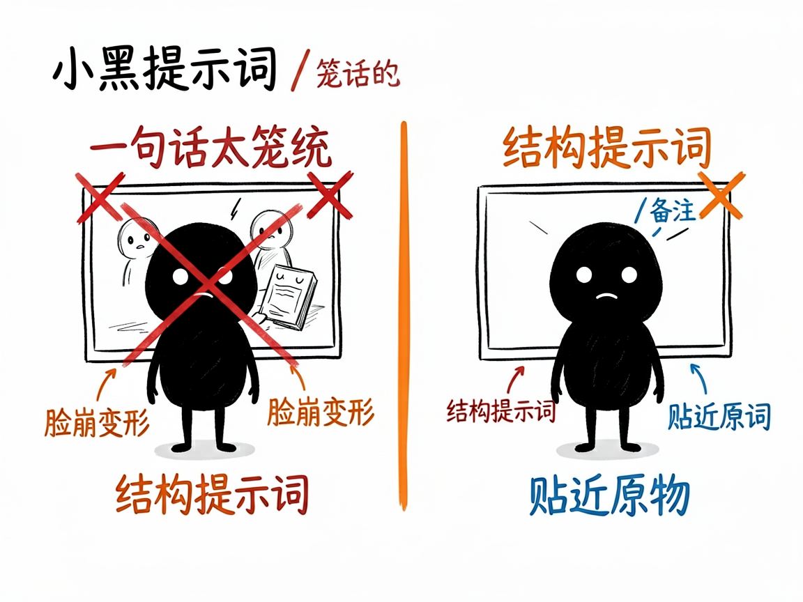

## 它到底能做什么

- 先看懂你上传的参考图：产品长什么样、什么颜色材质，直接写进提示词，让 AI 生成更贴近原物。
- 自动判断你该走哪条路线：通用创意、抖音带货、品牌广告片、真人感探店、还是改已有的视频，各有不同写法。
- 带货视频会按"黄金 3 秒钩子 + 卖点演示 + 促单"的结构来写；广告片追求电影级质感；真人感路线专门做出"不像 AI"的手机随手拍效果。
- 支持引用素材语法：`@图片1 作为首帧`、`@视频1 参考运镜`，把你的图/视频喂给模型锁住主体。
- 写好的提示词可直接粘贴到即梦、小云雀、豆包使用。

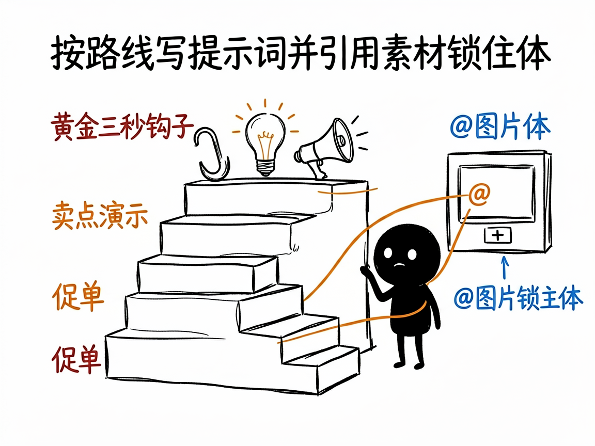

## 怎么用

你不需要记任何命令。在 codex / workbuddy 等 agent 装好 make-prompt-seedance2 技能后，直接对 AI 说话就行：

**场景 1：给个产品图做带货视频**
你：我发了这张产品白底图，帮我做个抖音带货视频，要抓人、要讲卖点。
AI：它分析图片、诊断卖点痛点，按"基础参数、镜头语言、核心主体、商业场景、强制约束"五大模块产出提示词，并告诉你上传图片的顺序和 `@图片1` 的对应关系。

**场景 2：想拍条不像 AI 的探店**
你：我想做一条探店视频，要像手机随手拍的真人感，别一股 AI 味。
AI：它走"真人感探店"路线，写出带生活化运镜和真实氛围的分镜提示词，专门规避那种一眼假的 AI 质感。

**场景 3：已有视频想改一版**
你：我这条视频大致满意，帮我改一版更广告片的调性。
AI：它识别你走的是"改已有视频"路线，基于原片重写电影级质感的提示词，你拿去即梦生成就行。

## 谁适合用

- 想做 AI 短视频带货、种草、探店的电商人和博主。
- 需要做品牌广告片、产品展示的市场人员。
- 任何想用即梦/豆包生成视频、但被"怎么写提示词"卡住的人。

## 一点说明

它是一个跑在 AI 助手里的"提示词专家"技能，产出的是文字提示词，不是视频本身——视频要你拿去即梦等平台生成。注意它不支持写实的真人脸部素材。它是装在 AI agent 里的一个技能（不是独立软件）；具体能力以项目说明文档为准。

## 闲鱼接单文案

> 以下服务展示在闲鱼 / 淘宝服务市场发布，用于承接本 skill 的定制开发订单。

**标题：AI短视频提示词分镜编写 skill软件开发**

**描述：**

专注 AI Agent 技能（skill）定制开发，已写出即梦（Seedance 2.0）分镜提示词技能，现成作品可先看演示再下单。先看懂你上传的产品参考图（颜色、材质直接写进提示词），自动判断走通用创意、抖音带货、品牌广告片、真人感探店还是改片路线；带货按"黄金 3 秒钩子 + 卖点演示 + 促单"结构写，支持 @图片1 之类素材引用语法锁住主体，写好直接粘贴到即梦、小云雀、豆包就能用。可按你的品类定制，全部源码交付、支持二次开发。

**服务内容：**

- 1、需求沟通梳理：先聊清楚视频用途（带货 / 种草 / 广告 / 探店）、产品图和素材情况、想要的成片感觉，列明功能清单后再动手
- 2、skill交付内容和格式：五大模块完整分镜提示词（基础参数、镜头语言、核心主体、商业场景、强制约束）+ 素材上传顺序与 @引用对应说明（可直接粘贴即梦 / 小云雀 / 豆包使用）
- 3、项目功能/系统开发：按你的品类定制路线写法、钩子结构与强制约束库，可扩展批量出词等功能的开发与联调
- 4、skill源码交付：SKILL.md 技能说明 + 提示词 / 脚本 / 模板 / 提示词样例组成的完整技能工程，兼容 codex / workbuddy 等 agent。全部源码 + 安装部署说明 + 使用演示，交付后可自行修改维护

---

<!-- 来源: market-insight.md -->

# 搞不清用户到底要啥？让它十分钟帮你把人看透 —— market-insight 介绍

很多人做产品或写文案时，最卡的一步不是"不会做"，而是"不知道用户在想啥"。你以为大家图便宜，其实人家要的是面子；你以为功能越多越好，其实用户只想要一个"啊哈"的爽点。传统做法要么花几万找咨询公司，要么约十几个人深访，又慢又贵。

**market-insight 就是来解决这件事的。** 你给它一个产品方向和一点背景，它还你一套能直接拿去写文案、做设计的用户洞察，十分钟就能有方向感。

## 它到底能做什么

- 画用户画像：避开"男女老少通吃"的陷阱，给你 4 类具象的用户（比如"乡愁味蕾固执派"），并标出谁最值得先抓。
- 拆情绪动因：从"痛点（怕什么）、痒点（想成为谁）、爽点（哪个瞬间最满足）"三个角度，挖出能直接写进广告的真实动机。
- 列产品机会：把情绪洞察转成按优先级排好的需求清单（P0 核心 / P1 重要 / P2 锦上添花），告诉你明天就能先干哪三件。
- 生成创业路线图（可选）：基于《小而美》方法论，把机会变成一人公司/小团队能落地的 6 步计划——社区定位、极简 MVP、前 100 个客户冷启动等。
- 按需选深度：你可以只要用户画像，只要情绪洞察，只要产品机会，或走完整四阶段。

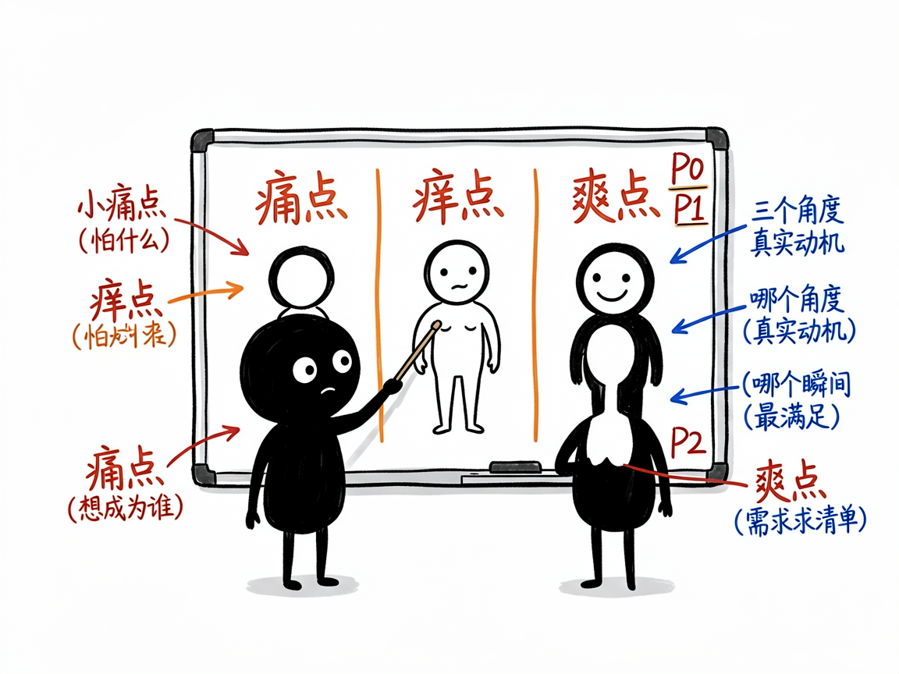

## 怎么用

你不需要记任何命令。在 codex / workbuddy 等 agent 装好 market-insight 技能后，直接对 AI 说话就行：

**场景 1：刚冒出一个产品点子**
你：我想做个胡辣汤外卖，帮我做完整用户洞察。
AI：它先问你产品处于概念、开发还是上市阶段，然后一步步产出用户画像、情绪点、P0 机会，甚至一份 90 天创业手册。你拿到的不是空话，而是"85℃热汤逼出一身汗"这种有画面感的表达，能直接当文案用。

**场景 2：只想要用户画像**
你：我做了个考研笔记 app，先帮我画一下典型用户是谁。
AI：它给你几类具象用户画像，谁最值得先抓、他们分别在怕什么想成为什么，一眼看清。

**场景 3：找功能优先级**
你：我的宠物用品店该先上哪个功能？帮我排个优先级。
AI：它把用户情绪转成 P0/P1/P2 需求清单，告诉你明天就能先干哪三件，不纠结。

## 谁适合用

- 创业者和一人公司、自由职业者：想清楚"卖给谁、凭啥买"。
- 产品经理：找差异化和功能优先级。
- 市场/文案同学：挖情绪点，写出让人共鸣的内容。
- 想做副业、把技能变现的人：用"小而美"路线低成本启动。

## 一点说明

这是一个"思考框架型"技能，靠 AI 和你对话推演，不联网抓数据、也不依赖外部账号，普通人也能在 AI 助手对话里直接用。它给的是"方向感"不是"标准答案"——传统调研要花几万和一个月，它用十分钟换来的结论，最好再拿真实用户快速测一测。已融资、要快速规模化的公司，和重资产传统行业，不太适合它的"小而美"路线。

## 闲鱼接单文案

> 以下服务展示在闲鱼 / 淘宝服务市场发布，用于承接本 skill 的定制开发订单。

**标题：用户洞察与需求分析 skill软件开发**

**描述：**

专注 AI Agent 技能（skill）定制开发，已做出十分钟级用户洞察技能，现成作品可先看演示再下单。产出 4 类具象用户画像并标出优先人群，从痛点 / 痒点 / 爽点挖出能直接写进广告的情绪动因，把洞察转成 P0 / P1 / P2 排序的产品机会清单，还可选《小而美》方法论的 6 步创业路线图。思考框架型技能、不依赖任何外部账号，支持按你的行业做个性化定制，全部源码交付、支持二次开发。

**服务内容：**

- 1、需求沟通梳理：先聊清楚你的产品方向、所处阶段（概念 / 开发 / 上市）和最想要的产出（画像 / 情绪洞察 / 机会清单 / 全套），列明功能清单后再动手
- 2、skill交付内容和格式：4 类用户画像与优先人群、痛点痒点爽点情绪洞察、P0 / P1 / P2 产品机会清单、可选 6 步创业路线图（可直接用于文案和设计的洞察报告）
- 3、项目功能/系统开发：按你的行业定制画像维度、机会评估框架与路线图方法论，可扩展多产品线批量分析等功能的开发与联调
- 4、skill源码交付：SKILL.md 技能说明 + 提示词 / 脚本 / 模板 / 报告样例组成的完整技能工程，兼容 codex / workbuddy 等 agent。全部源码 + 安装部署说明 + 使用演示，交付后可自行修改维护

---

<!-- 来源: math-concept-film.md -->

# 想讲清楚一个数学概念，能不能让 AI 直接拍部短片？—— math-concept-film 介绍

你想给学生讲明白傅里叶级数，光靠嘴说加黑板画图，学生还是一脸茫然。想自己做条动画视频吧，Manim 环境配半天、台词写到头秃、配音还对不上画面，一周过去了片子连影子都没有。你真正想要的其实只是：说出一个概念的名字，拿到一部能直接放给学生看的短片。

**math-concept-film 就是来解决这件事的。**

你给它一个数学概念（比如"傅里叶级数""泰勒公式""特征值"），它还你一部 2~4 分钟、纸墨手账质感、带中文旁白和字幕的 `final.mp4`。

---

## 它到底能做什么
- 一句话出片：报出概念名，AI 自动走完"写台词 → 配音 → 量出每句时长 → 按真实时长设计画面 → 渲染合成"整条流水线。
- 纸墨手账画风：宣纸暖底、墨色笔触，像一本会动的数学手账，不是冷冰冰的炫酷科技风。
- 中文旁白：微软云扬声线（可换晓晓、云希），语速 +15%，不催眠。
- 公式白话化：每个符号出现前，先用大白话把主意喊出来，不甩公式砸人。
- 镜头会讲课：讲局部就推近，讲完拉回全景，逐项巡讲公式——底层基于 Manim。
- 数学保真：画面上每个数字都经过验算，每个"所以"都有前因，不做样子货。
- 内置成片实例：《方波的和声》（傅里叶级数，89 秒）、泰勒公式预告片等，先看效果再决定。

## 怎么用
你不需要记任何命令。在 codex / workbuddy 等 agent 装好 skill 后，直接对 AI 说话就行：
**场景 1：一句话做条傅里叶级数短片**
你：帮我用视频讲清楚傅里叶级数。
AI：它写台词、配中文旁白、量出每句真实时长，再按这个时长设计 Manim 画面并渲染，把 final.mp4 交给你。
**场景 2：换个概念再来一条**
你：把泰勒公式做成动画。
AI：同一套流水线再走一遍，几分钟后给你另一部短片。
**场景 3：不满意就让它返工**
你：第 20 秒那里节奏太快了，跟不上。
AI：它按你的反馈改台词和分镜，重新渲染那一版，直到你说过。

## 谁适合用
- 数学、物理老师，想给学生做概念讲解短片，又没时间学动画工具。
- 做知识类视频的博主，需要稳定的数学动画产能。
- 自学时想真正"看懂"某个抽象概念在干嘛的人。

## 一点说明
math-concept-film 是一套 AI 技能，装进 codex / workbuddy 等 agent 后对话使用。配音环节需要联网（微软在线 TTS，免费），渲染不需要联网。默认 16:9 横屏版式，竖屏需自己调构图；渲染时用 `-qh` 可出 1080p。项目有参考学习 Math-To-Manim。

## 闲鱼接单文案

> 以下服务展示在闲鱼 / 淘宝服务市场发布，用于承接本 skill 的定制开发订单。

**标题：数学概念动画短片生成（Manim+AI配音）skill软件开发**

**描述：**

专注 AI Agent 技能（skill）定制开发，已做出"说一个概念就出一部数学动画短片"的成品技能，现成作品可先看演示再下单。你说概念名，它自动完成写台词、中文配音、按时长设计画面、Manim 渲染合成，交付带旁白和字幕的 MP4 成片。支持按你的学科方向定制画风、讲解节奏与知识深度，交付后装进 codex / workbuddy 等 AI 助手即可使用，全部源码交付、支持二次开发。

**服务内容：**

- 1、需求沟通梳理：先聊清楚你要讲哪些概念、面向什么水平的学生、期望片长和画风，确认 Manim 与配音环境，列明功能清单后再动手
- 2、skill交付内容和格式：数学概念动画短片成片（MP4 文件）+ 台词脚本 + 分镜与时长轴 + 渲染工程
- 3、项目功能/系统开发：按你的学科定制概念讲解逻辑、白话化措辞、镜头语言与验算规则的开发与联调
- 4、skill源码交付：SKILL.md 技能说明 + 提示词 / 脚本 / 模板 / 成片样例组成的完整技能工程，兼容 codex / workbuddy 等 agent。全部源码 + 安装部署说明 + 使用演示，交付后可自行修改维护

---

<!-- 来源: mathigon-skill.md -->

# 想动手做一套会互动的数学课本，该怎么上手 —— mathigon-skill 介绍

你大概听说过 Mathigon——那个把数学讲得特别漂亮的免费互动在线课本网站（圆、图论、数列、概率……点一点就能玩）。如果你想自己给它加一节课、改一段内容、或者把某个互动小元件做得更好，会卡在一个现实问题：它的内容是用一套专门的写作方式写的，格式、玩法、组件都有规矩，新手容易摸不着门。

mathigon-skill 就是来解决这件事的：你给它"我想改/加 Mathigon 的某一节内容"这样的任务，它帮你在 AI 里产出一份能直接照着改的操作指引——每一步该读哪个参考文档、课程内容文件怎么写、互动脚本怎么配、那些带 x-开头的互动组件怎么用，避免你乱改把课本弄坏。

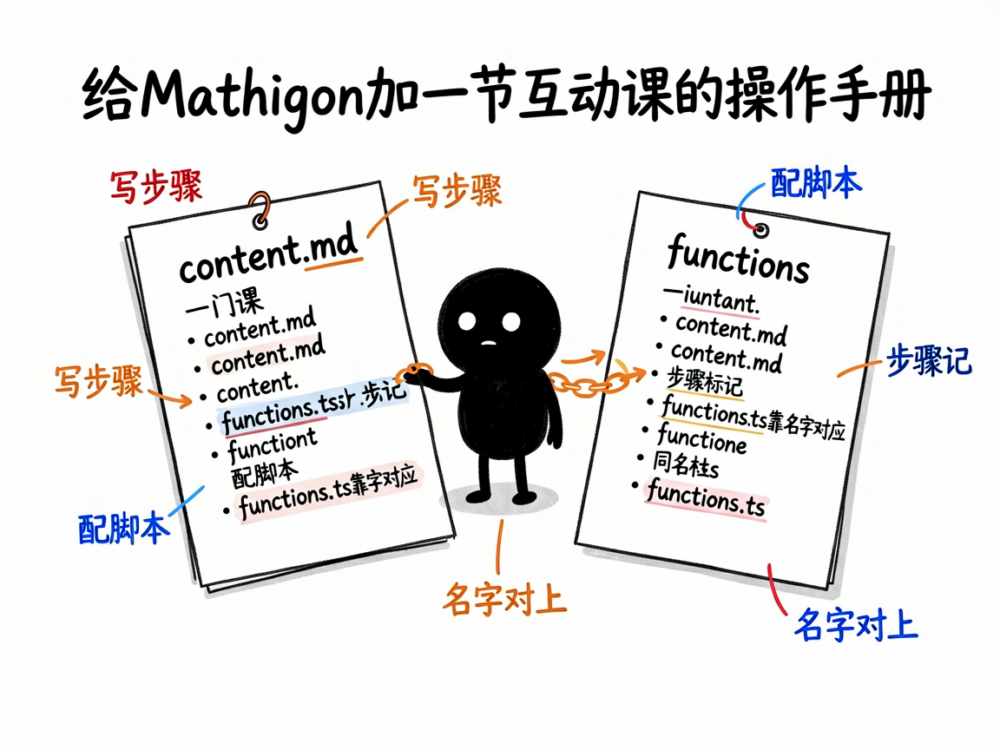

## 它到底能做什么
- 它是一份"如何编写 Mathigon 互动课程"的操作手册，专门服务于 Mathigon 课本仓库里的内容（每门课由内容文件、互动脚本、样式三件套组成）。
- 讲清核心心智模型：一门课是一串"步骤"，每步在内容文件里用标记声明，需要自定义互动时再配一个对应的脚本函数，两者靠名字自动对应。
- 告诉你写不同类型内容该先读哪份参考：写文章用"Markdown 方言"指南，写互动脚本用"函数模型"指南，用几何画板、滑块、方程等组件时该查什么。
- 覆盖怎么调用 Mathigon 自带的工具库（画点、随机、动画、滑动等），怎么在浏览器里本地预览、怎么做代码检查。
- 专门强调中文课程的非显眼规则：每个小节必须显式写英文段落标识，否则后面的小节会打不开。
- 提醒"几何图别凭感觉乱画"：涉及长度、角度、坐标时，必须先实打实算一遍再写，避免图看着对其实错。

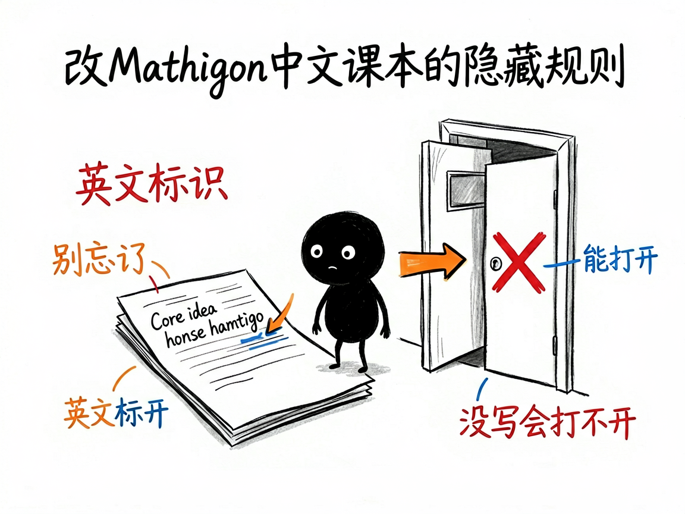

## 怎么用

你不需要记任何命令。在 codex / workbuddy 等 agent 装好 mathigon-skill 技能后，直接对 AI 说话就行：

**场景 1：加一节新课后**
你：我想给 Mathigon 加一节讲"斐波那契数列"的互动课，你一步步告诉我怎么做。
AI：AI 调出这份操作手册，告诉你先读哪份参考、课程内容文件怎么写、互动脚本怎么配，并提醒中文段落标识等隐藏规则，相当于有个老师傅带着你改。

**场景 2：修一个互动组件**
你：我这个几何画板组件点不动，帮我看哪里写错了。
AI：AI 对照手册的组件规范，指出脚本函数和内容的对应问题，并告诉你正确的写法，避免你乱改把课本弄坏。

**场景 3：改中文课本**
你：我改了中文课程，但后面小节打不开，怎么回事？
AI：AI 提醒你这条隐藏规则——每个小节必须写英文段落标识，并帮你补上，问题立刻解决。

## 谁适合用
- 想给 Mathigon 贡献/翻译课程的教育者、数学爱好者。
- 老师想把自己擅长的一节数学做成互动课本。
- 需要维护或二次开发 Mathigon 课本的技术协作人员。
- 做互动数学内容、想借鉴其写作体系的人。

## 一点说明
这是个给 AI 用的技能（skill），而且它偏向"操作手册"性质——不是普通人点开就能用的 App，也不是自动帮你生成网页，而是指导懂一点技术的协作者正确地改 Mathigon 课本。它依赖 Mathigon 课本仓库本身的内容结构，改写需要按它给的规范来。仓库本身不含服务器和组件库，相关能力来自外部包；动手前请先读它指定的本地化参考。具体操作步骤和规则以项目内参考文档为准。

## 闲鱼接单文案

> 以下服务展示在闲鱼 / 淘宝服务市场发布，用于承接本 skill 的定制开发订单。

**标题：Mathigon互动数学课程开发 skill软件开发**

**描述：**

专注 AI Agent 技能（skill）定制开发，已做出 Mathigon 互动课程开发手册型技能，现成作品可先看演示再下单。讲清 Mathigon 课程"内容文件 + 互动脚本 + 样式"三件套的写法、步骤化心智模型、Markdown 方言和 x- 互动组件用法，还专门提醒中文课程必须写英文段落标识这类不踩坑不知道的隐藏规则，帮你安全地加课、改课、修互动组件。可按你的课程需求定制，全部源码交付、支持二次开发。

**服务内容：**

- 1、需求沟通梳理：先聊清楚你想新增或修改的课程内容（加一节课 / 改互动组件 / 中文化）和现有技术基础，列明功能清单后再动手
- 2、skill交付内容和格式：步骤化操作指引与规范文档：该读哪份参考、课程内容文件怎么写、互动脚本怎么配、组件用法、中文课隐藏规则、本地预览与检查方法
- 3、项目功能/系统开发：按你的课程定制内容文件、互动脚本与样式，含本地预览联调，避免改坏课本
- 4、skill源码交付：SKILL.md 技能说明 + 提示词 / 脚本 / 模板 / 文档样例组成的完整技能工程，兼容 codex / workbuddy 等 agent。全部源码 + 安装部署说明 + 使用演示，交付后可自行修改维护

---

<!-- 来源: paper-cutout-remotion.md -->

# 想做有层次感的剪纸动画，又不会画画？它帮你把故事拆成会动的四层 —— paper-cutout-remotion 介绍

你想做个讲历史、讲品牌故事的小动画，但平面的图太单薄，真去做 3D 又太难。有没有一种办法，让画面有前后纵深、像纸片一层层叠起来那种味道，还不用你亲手画？

**paper-cutout-remotion 就是来解决这件事的。**

你给它一份分镜脚本，它还你一段纸片分层风格的动画视频，背景、主角、配角、前景各动各的，靠前后遮挡做出立体感。

---

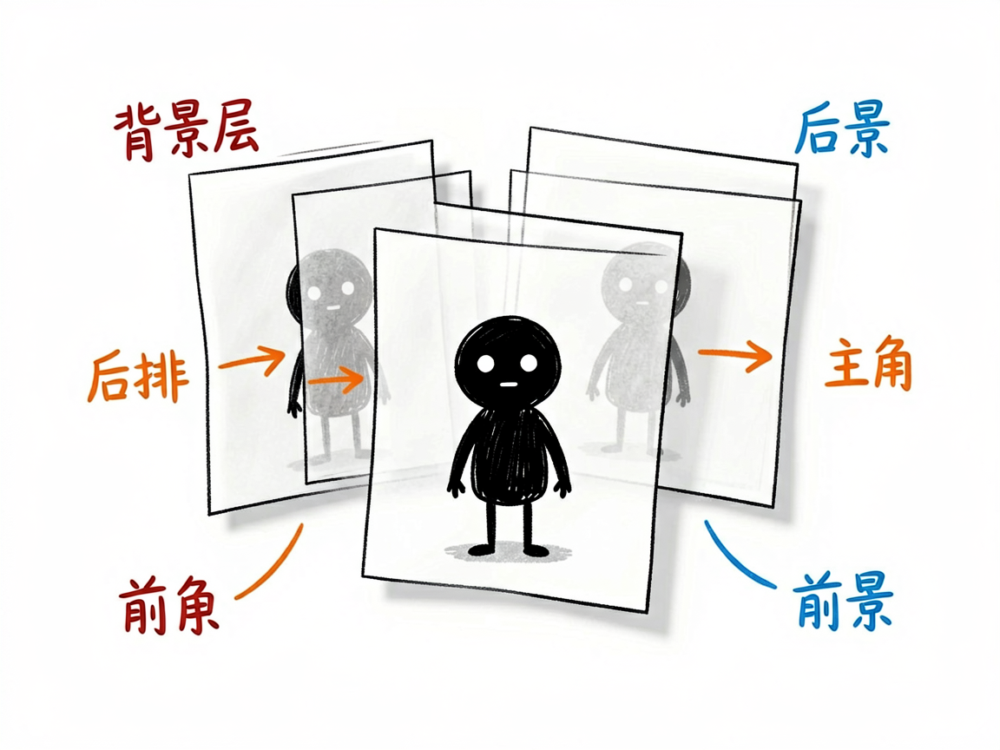

## 它到底能做什么
- 把每个镜头拆成四层：背景、后排、主角、前景，每层是独立的透明图（PNG，带透明背景），分别运动、互不干扰。
- 图片由 AI 生成（绘图接口），角色用绿幕方式生成方便抠成透明图，再分层摆放。
- 主角先出场、配角跟上、后排填充，错峰出现，画面有节奏不乱。
- 配上 AI 配音（MiniMax 高质量或免费的微软 edge 配音）和字幕，宣纸米白的底色调，朱砂红、墨黑这类中国风配色。
- 适合历史叙事、知识科普、商业故事、人物关系这类"能分出主次"的内容。

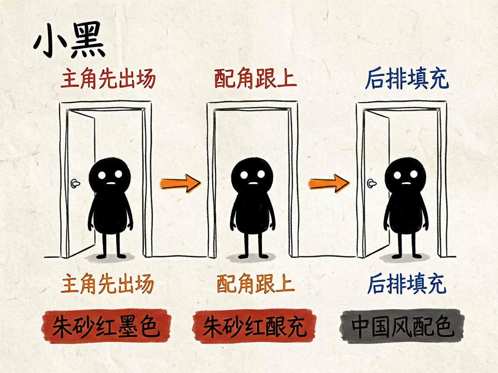

## 怎么用

你不需要记任何命令。在 codex / workbuddy 等 agent 装好 paper-cutout-remotion 技能后，直接对 AI 说话就行：

**场景 1：讲一段历史小故事**
你：我想做一个讲"唐代长安"的 1 分钟动画，要有宫殿、有街上的人，中国风一点。
AI：它会先把镜头拆成背景、后排、主角、前景四层，用 AI 画出宣纸米白底、朱砂红配色的图，再让各层错峰动起来，配上中文配音和字幕，给你一段有纵深的剪纸风视频。

**场景 2：做品牌故事短片**
你：我们公司想做个品牌起源的小动画，要有主角、有背景氛围。
AI：它会按"能分出主次"的思路分层安排画面，主角先出场、背景慢慢铺满，配上合适的配音，产出一段有质感的商业故事片。

**场景 3：做知识科普**
你：讲一下"活字印刷"是怎么一步步发展起来的。
AI：它会把过程拆成有主次的镜头，用前后遮挡做出层次，帮你把知识点讲得既清楚又有味道。

## 谁适合用
- 做历史、文化、品牌故事类视频的作者。
- 知识科普、商业案例讲解，需要画面有主次和纵深。
- 喜欢剪纸/拼贴质感，但不想自己一张张画图的人。

## 一点说明
它是跑在 AI 助手里的技能，不是开箱即用的 App。核心是"分层"思维：先把镜头定好、再让 AI 画图，否则人物比例和主次容易返工。它依赖 Remotion（一个用代码做视频的开源框架，但你不用写，AI 帮你写）来生成画面。具体能力以项目文档为准。

## 闲鱼接单文案

> 以下服务展示在闲鱼 / 淘宝服务市场发布，用于承接本 skill 的定制开发订单。

**标题：剪纸分层动画视频制作 skill软件开发**

**描述：**

专注 AI Agent 技能（skill）定制开发，已做出剪纸分层动画技能，现成作品可先看演示再下单。给它一份分镜脚本，产出"背景、后排、主角、前景"四层纸片叠出来的动画：AI 生成各层透明图、错峰出场、靠前后遮挡做出立体感，宣纸米白底配朱砂红、墨黑的中国风配色，自动配音和字幕。适合历史叙事、品牌故事、知识科普，可按你的题材定制，全部源码交付、支持二次开发。

**服务内容：**

- 1、需求沟通梳理：先聊清楚故事 / 分镜内容、想要的风格（中国风 / 品牌质感）和时长，确认分镜脚本草稿，列明功能清单后再动手
- 2、skill交付内容和格式：纸片分层风格动画成片：四层遮挡立体画面、错峰出场节奏、中国风配色、AI 配音与字幕（MP4 文件）
- 3、项目功能/系统开发：按你的题材定制分层模板、配色与配音方案，可扩展系列短片批量出片等功能的开发与联调
- 4、skill源码交付：SKILL.md 技能说明 + 提示词 / 脚本 / 模板 / 视频样例组成的完整技能工程，兼容 codex / workbuddy 等 agent。全部源码 + 安装部署说明 + 使用演示，交付后可自行修改维护

---

<!-- 来源: pindou-pattern.md -->

# 把任意图片变成"照着拼"的拼豆图纸 —— pindou-pattern 介绍

你有没有过这种经历：看到一张可爱的卡通头像，想用拼豆（Perler Bead）把它做出来，可一想到要一格一格去数颜色、算坐标，就头大？

**pindou-pattern 就是来解决这件事的。**

它把一个图片（或像素数据）自动变成一张可以直接照着拼的"拼豆施工图"——深色标题栏、四周标着行列坐标、每个小格子里写着对应的品牌色号、每 10 格加重一条线，最后还附上一份"每种颜色用了多少颗"的物料清单。

一句话总结：**你给它一张图，它还你一张能直接上手拼的图纸。**

---

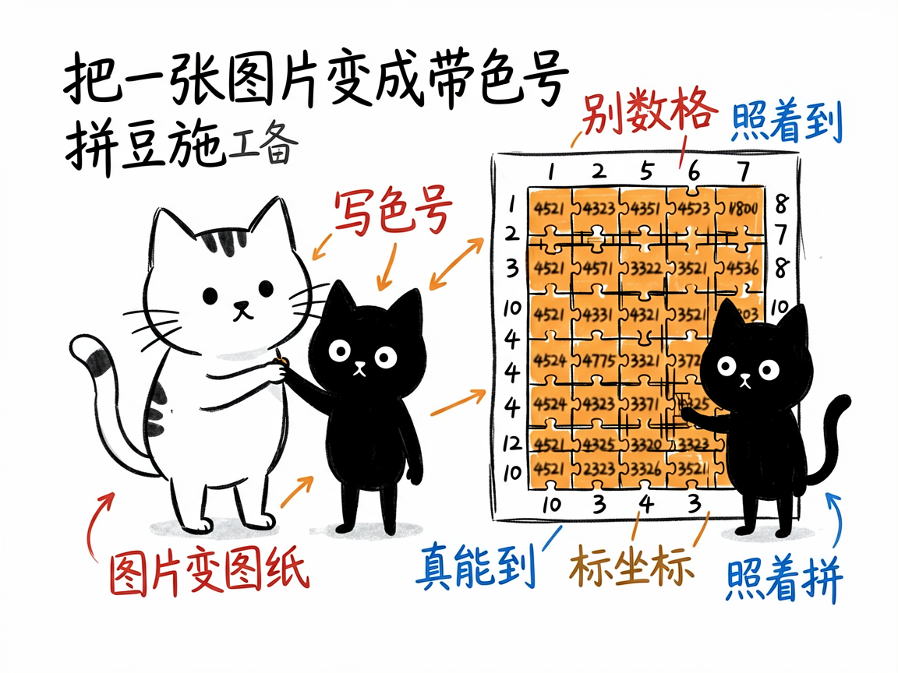

## 它到底能做什么
- 图片变图纸：上传一张 PNG / JPG / WebP 等格式的图片，指定网格大小（比如 32×32），它就自动量化成拼豆格子，输出一张带色号、坐标、网格线的图。
- 五大品牌色号：内置 MARD、COCO、漫漫、盼盼、咪小窝共 205 种颜色，生成的色号都是你真能买到的豆子，不会出现"图上有、店里没有"的尴尬。
- 物料清单：除了图纸，还能导出"每种颜色用了多少颗、总共多少颗"，方便你按单买料，不浪费。
- AI 优化：如果你对图纸效果不满意（太乱、太杂、细节糊了），它会先用 AI 把原图改绘成干净的像素风，再重新生成图纸。
- 白底处理：卡通角色这类白底图，可以设置"近白色当作空格"，不把豆子浪费在背景上。

---

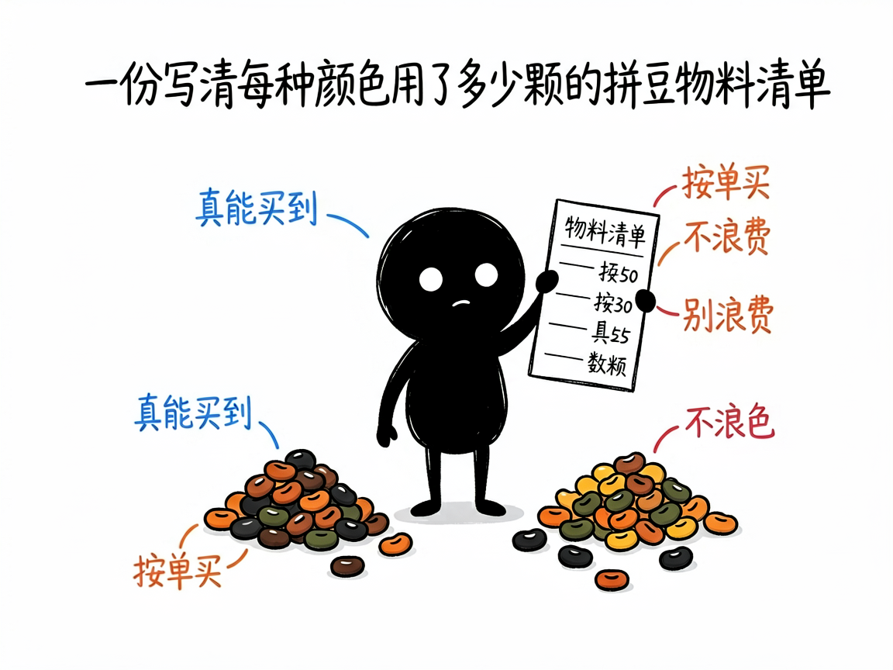

## 怎么用
你不需要记任何命令。在 codex / workbuddy 等 agent 装好 pindou-pattern 技能后，直接对 AI 说话就行：
**场景 1：把照片变成拼豆图纸**
你：帮我把这张卡通猫的照片变成拼豆图纸，用 32×32 的格子，MARD 品牌的色号。
AI：它生成一张带行列坐标、每格写着品牌色号的施工图，并告诉你画布多大、用了几种颜色、总共多少颗豆。
**场景 2：想要更精细、换品牌**
你：这张图我想要更大更精细，用 48×48，颜色换成盼盼品牌的。
AI：它按新尺寸和品牌重新量化，输出更细的图纸和对应的色号清单。
**场景 3：先 AI 优化再出图**
你：这张照片直接量化太乱了，你先把它改绘成干净的像素风，再给我出图纸。
AI：它先用 AI 把原图处理成清爽的像素画，再量化生成图纸，出来的效果会干净很多。

## 谁适合用
- 拼豆爱好者，想把自己喜欢的图变成可拼的图纸；
- 想做礼物、摆件、钥匙扣，但懒得手动数格子的手作党；
- 需要批量出图（比如一整套角色）的创作者。

---

## 一点说明
图纸是确定性生成的，规格（尺寸、颜色数、用豆量）都以技能生成时给出的数字为准，不需要靠"肉眼判断好不好看"——好不好拼，你自己看图纸就能判断。

另外，它只负责"出图"，不替你做视觉审美判断：图纸对不对、颜色分布合不合适，最终还是你的眼睛说了算。

## 闲鱼接单文案

> 以下服务展示在闲鱼 / 淘宝服务市场发布，用于承接本 skill 的定制开发订单。

**标题：拼豆图纸生成 skill软件开发**

**描述：**

专注 AI Agent 技能（skill）定制开发，已做出拼豆图纸生成技能，现成作品可先看演示再下单。把任意图片变成能直接照着拼的"拼豆施工图"：四周行列坐标、每格写着品牌色号、每 10 格加重一条线，内置 MARD、COCO、漫漫、盼盼、咪小窝五大品牌共 205 种真实色号（图上有、店里也有），并附"每种颜色多少颗"的物料清单按单买料；白底图可设"近白当空格"省豆，效果不满意还能先用 AI 改绘成干净像素风再出图。可按你的品牌定制，全部源码交付、支持二次开发。

**服务内容：**

- 1、需求沟通梳理：先聊清楚图片来源、网格尺寸（如 32×32 / 48×48）、常用品牌色号和白底处理需求，列明功能清单后再动手
- 2、skill交付内容和格式：带行列坐标和品牌色号的拼豆施工图 + 物料清单（每种颜色颗数、颜色总数、用豆总量），可选 AI 改绘后的优化版图纸
- 3、项目功能/系统开发：按你的品牌和尺寸定制色库与量化方案，可扩展整套角色批量出图等功能的开发与联调
- 4、skill源码交付：SKILL.md 技能说明 + 提示词 / 脚本 / 模板 / 图纸样例组成的完整技能工程，兼容 codex / workbuddy 等 agent。全部源码 + 安装部署说明 + 使用演示，交付后可自行修改维护

---

<!-- 来源: podcast-shorts-remotion.md -->

# 有一段播客音频，想快速变成竖屏短视频？它帮你秒出字幕版 —— podcast-shorts-remotion 介绍

你录了一期播客，或者攒了一段口播，觉得内容不错想发短视频平台，但一想到要加字幕、配章节、调颜色、渲染导出，就懒得动了。其实这活儿可以非常快。

**podcast-shorts-remotion 就是来解决这件事的。**

你给它一段音频（最好再给个逐字稿），它还你一条 1080×1920 的竖屏短视频，带字幕、章节标签、进度条和主题配色。

---

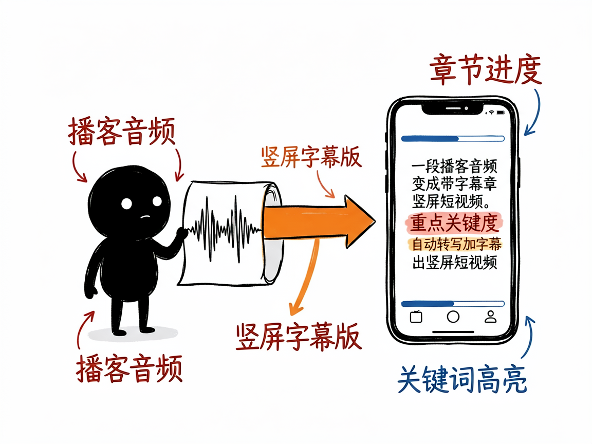

## 它到底能做什么
- 把音频当作时间轴唯一基准，自动转写（Whisper，一种语音识别）出字幕，并帮你校正识别错误。
- 按内容切成章节，顶部有进度条，底部有居中字幕，关键词高亮，像刷知识类短视频那样。
- 围绕主题自动配一套配色（红金、翠绿、靛蓝等几套现成方案挑），不用你自己调。
- 主打一个"快"：并行转写、一次写对、跳过冗余检查，直接出预览片，几分钟音频约十分钟量级渲染完。
- 预览片（540×960 半高清）就是默认交付物，确认满意再决定是否要 1080p 高清版。

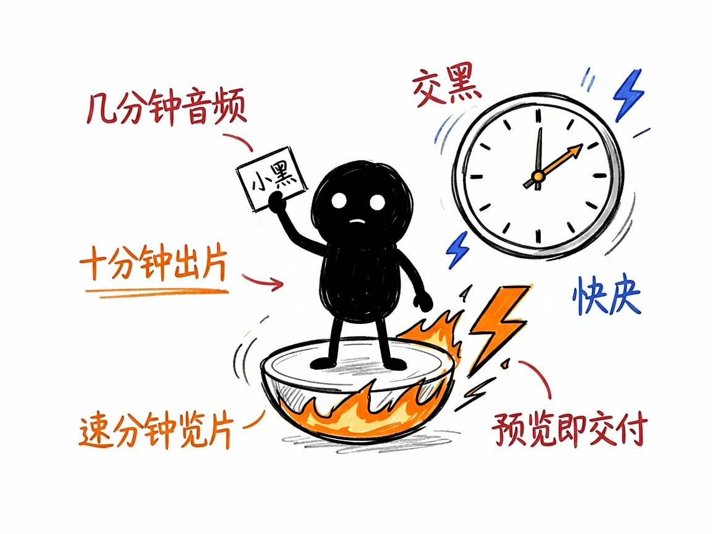

## 怎么用

你不需要记任何命令。在 codex / workbuddy 等 agent 装好 podcast-shorts-remotion 技能后，直接对 AI 说话就行：

**场景 1：把播客变成短视频**
你：我录了一期 20 分钟的播客，帮我剪一条带字幕的竖屏短视频发出去。
AI：它会自动转写音频、按内容切章节、加上居中字幕和顶部进度条，再配一套合适的主题配色，给你一条 1080×1920 的竖屏短片。

**场景 2：口播也能用**
你：我有一段口播录音，想快速出字幕版视频，越省事越好。
AI：它会以音频为基准转写并校正字幕，关键词高亮，直接出预览片，你确认满意后再要高清版。

**场景 3：赶时间**
你：我这音频就 5 分钟，想尽快拿到能发的版本。
AI：它主打一个"快"，会并行处理、跳过冗余检查，几分钟音频大约十分钟量级就能渲染出预览片，你确认就能发。

## 谁适合用
- 播客主、口播博主，想把手头音频快速变成可发的短视频。
- 做知识分享、行业解读，需要稳定出字幕版竖屏视频的人。
- 追求效率、不想在渲染校验上耗时间的内容生产者。

## 一点说明
它是跑在 AI 助手里的技能，不是独立 App。渲染靠本机浏览器环境，长音频会比较吃时间（这是硬件地板，不是卡住）。它产出的是一段 Remotion（一个用代码做视频的开源框架，但你不用写，AI 帮你写）视频。具体能力以项目文档为准。

## 闲鱼接单文案

> 以下服务展示在闲鱼 / 淘宝服务市场发布，用于承接本 skill 的定制开发订单。

**标题：播客音频转竖屏字幕短视频 skill软件开发**

**描述：**

专注 AI Agent 技能（skill）定制开发，已做出播客转短视频技能，现成作品可先看演示再下单。丢一段音频进来，以音频为时间轴自动转写字幕并校正，按内容切章节、加顶部进度条、底部居中字幕关键词高亮，围绕主题自动配好配色；主打一个"快"——几分钟音频约十分钟量级出预览片，确认后再出 1080p 高清版。可按你的账号风格定制，全部源码交付、支持二次开发。

**服务内容：**

- 1、需求沟通梳理：先聊清楚音频来源和时长、有没有逐字稿、目标平台和想要的配色，列明功能清单后再动手
- 2、skill交付内容和格式：1080×1920 竖屏字幕短视频：自动转写校正的字幕、章节切分、进度条、关键词高亮、主题配色（预览片 + 确认后的高清版）
- 3、项目功能/系统开发：按你的账号风格定制章节策略、配色与字幕样式，可扩展批量切条等功能的开发与联调
- 4、skill源码交付：SKILL.md 技能说明 + 提示词 / 脚本 / 模板 / 视频样例组成的完整技能工程，兼容 codex / workbuddy 等 agent。全部源码 + 安装部署说明 + 使用演示，交付后可自行修改维护

---

<!-- 来源: product-research.md -->

# 想选品却看不懂数据？让 AI 当你的选品分析师 —— product-research 介绍

选品不是"看一眼销量"就完事。真正可靠的决策，要从属性、竞品反馈、壁垒到 VOC（用户声音）一层层交叉分析，普通人根本算不过来。product-research 就是干这个的：它基于 Sorftime MCP，用 LLM Agent 驱动做多维度选品调研，从数据采集一路走到"该不该做"的决策评分。

## 它到底能做什么

- 数据采集：类目、Top100、关键词、趋势、竞品差评，自动拉全。
- 属性标注：把产品按类型、维度打标，结构化可比。
- 交叉分析：从数据里发现普通人看不出的关联和机会。
- VOC 分析：竞品差评里挖用户真实痛点。
- 壁垒评估 + 决策评分：给出 overall_score 和 verdict（做 / 不做 / 谨慎）。

## 怎么用

**场景 1：盯一个关键词想选品**
你：帮我调研 earbuds 这个品类，看值不值得做。
AI：它先采数据出基础看板，再交互式做 LLM 分析，最后给你带决策评分的报告。

**场景 2：中途想干预**
你：这一步竞品 VOC 我想自己看。
AI：交互式推进，你随时介入调整方向，不被黑盒带着走。

## 谁适合用

- 选品经理、产品开发。
- 想用数据做"进不进、怎么做"决策的卖家。
- 需要可视化看板向上汇报的团队。

## 一点说明

本技能由 LLM 完成分析与决策，脚本只做数据采集和看板渲染，依赖 Sorftime 接口。具体以 SKILL.md 为准。

## 闲鱼接单文案

> 以下服务展示在闲鱼 / 淘宝服务市场发布，用于承接本 skill 的定制开发订单。

**标题：亚马逊选品调研分析 skill软件开发**

**描述：**

专注 AI Agent 技能（skill）定制开发，已做出多维度选品调研技能，现成作品可先看演示再下单。自动采集类目、Top100、关键词、趋势、竞品差评数据，做属性标注、交叉分析和 VOC 用户声音挖掘，评估进入壁垒后输出"做 / 不做 / 谨慎"的决策评分，全程交互式推进、可随时干预。支持按你的品类做个性化定制，交付后装进 codex / workbuddy 等 AI 助手即可使用，全部源码交付、支持二次开发。

**服务内容：**

- 1、需求沟通梳理：先聊清楚你的目标品类或关键词、要回答的决策问题（进不进、怎么做），确认 Sorftime 账号可用，列明功能清单后再动手
- 2、skill交付内容和格式：选品数据看板、属性标注与交叉分析、竞品差评 VOC 痛点挖掘、壁垒评估与决策评分成果（可视化看板 + Markdown 决策报告）
- 3、项目功能/系统开发：按你的选品流程定制分析维度、评分模型与看板模板，可扩展多品类批量调研等功能的开发与联调
- 4、skill源码交付：SKILL.md 技能说明 + 提示词 / 脚本 / 模板 / 报告样例组成的完整技能工程，兼容 codex / workbuddy 等 agent。全部源码 + 安装部署说明 + 使用演示，交付后可自行修改维护

---

<!-- 来源: reddit-business-idea-validator.md -->

# 想做个生意但怕没人买单？让 Reddit 上的真人帮你投票 —— reddit-business-idea-validator 介绍

你想做个产品，比如"给独居老人做智能药盒"，但心里没底：美国人真有这需求吗？大家都在抱怨啥？现在有没有人已经在做了？你当然可以去 Reddit 翻，但几百万帖子里找信号，等于大海捞针，还容易只看得到自己想看的。

**reddit-business-idea-validator 就是来解决这件事的。** 你给它一个想法，它自动去 Reddit 抓相关帖子和评论，让多个 AI 一起分析，最后还你一份带 0–100 评分的报告，直说这个方向值不值得做。

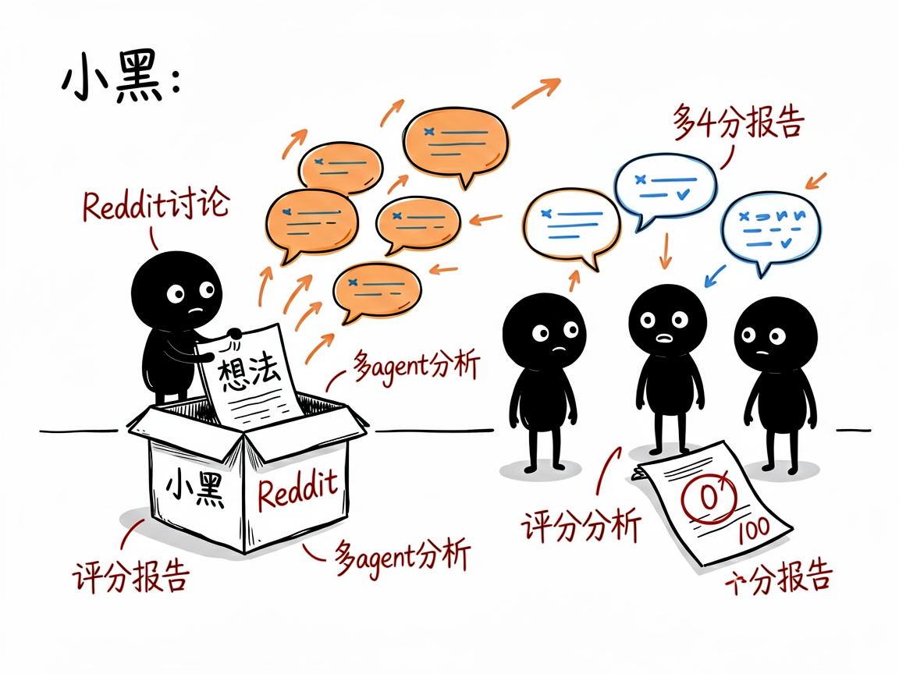

## 它到底能做什么

- 验证想法：把你的创意当关键词，去 Reddit 找真人讨论，看有没有人关心。
- 挖痛点：从帖子和评论里提炼用户真正在抱怨什么、需要什么。
- 看竞品：现在大家都在用什么替代方案，市场饱不饱和。
- 找机会：哪些需求没被满足，你可以做差异化。
- 打分定性：给出 0–100 综合分（≥75 强、50–74 有潜力、30–49 弱、<30 不建议），一眼看懂。
- 出报告：报告含数据统计、核心痛点、现有方案、市场机会、行动建议、四象限评论标签分析和用户画像。

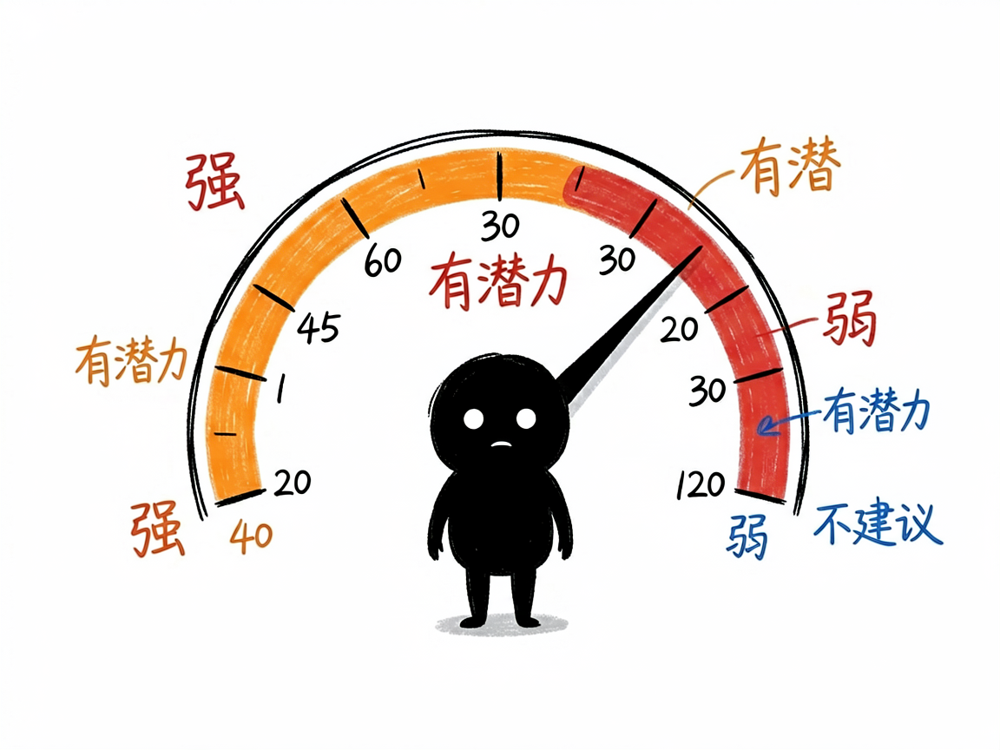

## 怎么用

你不需要记任何命令。在 codex / workbuddy 等 agent 装好 reddit-business-idea-validator 技能后，直接对 AI 说话就行：

**场景 1：验证一个海外点子**
你：我想做个给独居老人用的智能药盒，帮我在 Reddit 上看看美国人有没有这需求。
AI：它去 Reddit 抓相关帖子和评论，让多个 AI 分头分析痛点和竞品，最后给你一份带 0–100 评分的报告，直说这个方向值不值得做，还附上核心痛点和行动建议。

**场景 2：重要决定前深查**
你：这个SaaS点子我要认真评估，帮我深度查一下。
AI：它用更深的档位（耗时会更长）多抓多分析，把市场饱和度、现有替代方案、没被满足的需求都摸透，再给一个更稳妥的分数和判断。

**场景 3：先看个热闹试水**
你：我有个小想法，先随便看看有没有人讨论。
AI：它用轻量档位快速扫一遍，几分钟就告诉你"有没有人在聊、大概什么态度"，帮你低成本试水温。

## 谁适合用

- 想做海外/英文市场生意的人：Reddit 用户以欧美为主，最适合验证英文市场需求。
- 独立开发者和内容创业者：低成本验证"这个点子有没有人买单"。
- 做跨境电商、SaaS 的人：先看海外真实声音再决定投不投入。

## 一点说明

这是给 AI 助手用的技能，装好、接好 Reddit 的数据接口和兼容 OpenAI 的 AI 模型密钥后就能用（配置一次即可，你不用自己写代码）。另外，Reddit 在中国大陆访问受限，需要能正常访问 Reddit 的网络环境才能抓数据。它只覆盖 Reddit 这一个数据源、主要面向英文市场，不擅长小红书/抖音类国内数据，也不做纯关键词 SEO 那种事。分数是 AI 基于真实讨论打的，低分也是有用的负面信号，别只盯着高分看。

## 闲鱼接单文案

> 以下服务展示在闲鱼 / 淘宝服务市场发布，用于承接本 skill 的定制开发订单。

**标题：海外生意点子验证（Reddit 需求调研）skill软件开发**

**描述：**

专注 AI Agent 技能（skill）定制开发，已做出 Reddit 真人需求验证技能，现成作品可先看演示再下单。把你的生意点子自动拿到 Reddit 上抓相关帖子和评论，多个 AI 分头分析痛点、竞品和市场机会，最后给出 0–100 评分（≥75 强、50–74 有潜力、<30 不建议）和直说值不值得做的验证报告。轻量 / 深度档位可选，支持按你的行业做个性化定制，全部源码交付、支持二次开发。

**服务内容：**

- 1、需求沟通梳理：先聊清楚你的生意点子和验证深度（轻量试水 / 认真评估），确认 Reddit 数据接口、AI 模型密钥和可访问 Reddit 的网络环境，列明功能清单后再动手
- 2、skill交付内容和格式：0–100 评分与结论、核心痛点、现有替代方案、市场机会、行动建议、四象限评论标签分析、用户画像（数据统计 + 验证报告）
- 3、项目功能/系统开发：按你的行业定制分析维度、评分权重与报告模板，可扩展多平台数据源接入等功能的开发与联调
- 4、skill源码交付：SKILL.md 技能说明 + 提示词 / 脚本 / 模板 / 报告样例组成的完整技能工程，兼容 codex / workbuddy 等 agent。全部源码 + 安装部署说明 + 使用演示，交付后可自行修改维护

---

<!-- 来源: resume-matcher.md -->

# 不知道简历行不行、跟岗位匹不匹配？它像一个严格的 HR 帮你挑刺重写 —— resume-matcher 介绍

你投了 N 份简历石沉大海，心里犯嘀咕：是我的简历写得不好，还是本来就不对口？自己看自己的简历，怎么看都还行；可你缺一个"招聘方视角"——到底哪里啰嗦、哪里没数据、哪里跟岗位要求对不上。

**resume-matcher 就是来解决这件事的。**

它用资深 HR（HRBP）+ 技术主管的视角，给你的简历做一次深度"挑刺"审计，并把它和目标岗位的招聘要求（JD）逐条比对匹配度，最后还帮你把简历改好、导出成能直接看的版本。你给它简历加岗位要求，它还你一份"问题清单 + 修改蓝图 + 优化后简历"。

---

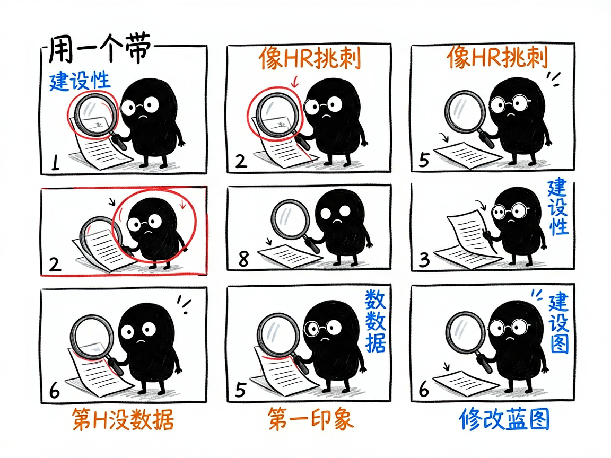

## 它到底能做什么
- 解析简历 / 岗位要求：直接把 PDF 或 Word 文件发给它，也能粘贴纯文本，它会自动提取内容（注意加密的或图片扫描件读不了）。
- 结构化对比：把简历和岗位要求各自拆成"技能、经历、关键词"，让你一眼看清匹配和不匹配的地方。
- HRBP 五步审计：从"第一印象"到"地毯式挑刺"再到"修改蓝图"，像面试你的 HR 一样具体、有建设性地指出问题。
- 重写简历：不是只给建议，而是直接产出一版优化后的简历全文，量化指标处用占位符提醒你补数字。
- 可视化导出：内置一个中文简历编辑器，把优化后的简历导进去就能排版、调样式、导出 PDF。

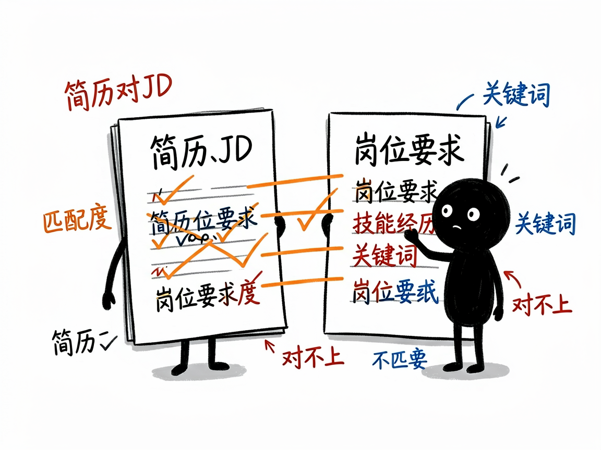

## 怎么用
你不需要记任何命令。在 codex / workbuddy 等 agent 装好 resume-matcher 技能后，直接对 AI 说话就行：
**场景 1：让严格 HR 给简历挑刺**
你：帮我看看这份简历，对照我发的这个岗位要求，逐条说我哪里不行、怎么改。
AI：它先用招聘方视角审计你的简历，再和岗位要求逐条比对，给出一份"问题清单 + 修改蓝图"，并直接产出一版优化后的简历全文。
**场景 2：只想知道匹不匹配**
你：我这份经历跟这个岗位对不对口？先别重写，先告诉我匹配度。
AI：它把你的技能和经历拆开，和岗位要求的关键词对照，清楚标出哪些匹配、哪些缺，让你心里有数。
**场景 3：导出能打印的 PDF**
你：改好的简历帮我导进简历编辑器，排版漂亮点，我要导出 PDF 投出去。
AI：它把优化后的简历送进中文简历编辑器，帮你调样式、排版，并导出成可直接打印的 PDF。

## 谁适合用
- 正在找工作、想提升简历通过率的求职者。
- 不确定自己的经历跟某岗位"对不对口"、想先看匹配度的人。
- 帮别人改简历、或做 AI 工具想内置简历分析能力的人。

## 一点说明
它是一套 AI 技能，最舒服的用法是在带它的 AI 助手对话框里发"帮我看看这份简历 + 这个岗位要求"，它来帮你做解析、审计、给改稿。它靠 AI 推理做审计，不依赖外部大模型接口；图片扫描件、加密 PDF 提取不了文字，需要你给文本版。它给的是修改方向和一版草稿，最终投递前关键信息（数字、事实）还得你自己核实补齐。具体能力以项目文档为准。

## 闲鱼接单文案

> 以下服务展示在闲鱼 / 淘宝服务市场发布，用于承接本 skill 的定制开发订单。

**标题：简历匹配分析与优化 skill软件开发**

**描述：**

专注 AI Agent 技能（skill）定制开发，已做出简历深度审计技能，现成作品可先看演示再下单。用资深 HR（HRBP）+ 技术主管的双视角给简历做五步挑刺审计（从第一印象到地毯式挑刺再到修改蓝图），把简历和目标岗位 JD 逐条结构化对比（技能 / 经历 / 关键词），直接产出一版优化后的简历全文（量化指标处留占位符提醒你补数字），内置中文简历编辑器排版导出 PDF。可按你的行业定制，全部源码交付、支持二次开发。

**服务内容：**

- 1、需求沟通梳理：先聊清楚你的求职方向、目标岗位 JD 和最想要的产出（看匹配度 / 挑刺改稿 / 排版导出 PDF），提供文本版简历，列明功能清单后再动手
- 2、skill交付内容和格式：问题清单 + 修改蓝图 + 优化后简历全文 + 中文简历编辑器排版导出的可打印 PDF
- 3、项目功能/系统开发：按你的行业定制审计维度、匹配规则与简历模板样式，可扩展批量岗位匹配等功能的开发与联调
- 4、skill源码交付：SKILL.md 技能说明 + 提示词 / 脚本 / 模板 / 简历样例组成的完整技能工程，兼容 codex / workbuddy 等 agent。全部源码 + 安装部署说明 + 使用演示，交付后可自行修改维护

---

<!-- 来源: review-analysis.md -->

# 买家到底在骂什么？让 AI 从评论里挖出产品痛点 —— review-analysis 介绍

一条差评背后，可能藏着十个没说出口的退货理由。靠人肉翻评论，几百条看不完，看完也总结不出规律。review-analysis 就是干这个的：它自动抓取亚马逊商品评论，识别产品痛点、分析退货原因，顺手生成改进建议和客服回复模板。

## 它到底能做什么

- 差评聚类：自动提取 1-3 星评论，按痛点分门别类。
- 痛点挖掘：核心痛点 Top 3，告诉你用户为什么退、为什么差评。
- 退货原因：从评论文本里剖析真实退货动因。
- 改进建议：能直接落地的优化方向。
- 客服模板：自动写好客服回复话术，省得逐条想词。
- 报告存档：分析完保存成 report.md，随时复盘。

## 怎么用

**场景 1：看一款产品的差评**
你：把这款产品最近的评论都看看，买家最不爽的点是什么？
AI：它识别痛点和退货原因，给你改进建议，还顺手写好客服回复模板。

**场景 2：上新品前避雷**
你：我打算做类似产品，竞品的坑在哪？
AI：扒竞品差评，把高频痛点列出来，你设计时直接规避。

## 谁适合用

- 产品开发、品质改进团队。
- 客服、用户体验负责人。
- 想用评论数据指导选品和优化的卖家。

## 一点说明

本技能依赖 Sorftime 接口拉取评论数据，需配置账号。分析框架为 6 维 v7.0。具体以 SKILL.md 为准。

## 闲鱼接单文案

> 以下服务展示在闲鱼 / 淘宝服务市场发布，用于承接本 skill 的定制开发订单。

**标题：亚马逊评论痛点分析 skill软件开发**

**描述：**

专注 AI Agent 技能（skill）定制开发，已做出评论深度分析技能，现成作品可先看演示再下单。自动抓取亚马逊商品评论，把 1-3 星差评按痛点聚类，挖出核心痛点 Top3 和真实退货原因，顺手生成可落地的改进建议和客服回复话术模板，分析结果自动存档可复盘。支持按你的产品类目做个性化定制，交付后装进 codex / workbuddy 等 AI 助手即可使用，全部源码交付、支持二次开发。

**服务内容：**

- 1、需求沟通梳理：先聊清楚要分析的商品（自家产品还是竞品避雷）和分析目的（品质改进 / 上新避坑 / 客服提效），确认 Sorftime 账号可用，列明功能清单后再动手
- 2、skill交付内容和格式：差评聚类与核心痛点 Top3、退货原因剖析、可落地改进建议、客服回复话术模板（report.md 分析报告，自动存档可复盘）
- 3、项目功能/系统开发：按你的产品类目定制痛点分类框架与话术风格，可扩展多 ASIN 批量分析、定期复盘等功能的开发与联调
- 4、skill源码交付：SKILL.md 技能说明 + 提示词 / 脚本 / 模板 / 报告样例组成的完整技能工程，兼容 codex / workbuddy 等 agent。全部源码 + 安装部署说明 + 使用演示，交付后可自行修改维护

---

<!-- 来源: seedance2-storyboard.md -->

# 想把小说做成多集 AI 短剧？—— seedance2-storyboard 介绍

看到别人用 AI 把《林教头风雪山神庙》做成十集水墨短剧，自己也想试试，结果卡在第一步：剧本怎么拆集？角色提示词怎么写才能每集长得一样？分镜提示词是什么格式？seedance2-storyboard 把这整套流程做成了技能：小说、文章、故事大纲丢进去，产出从剧本到分镜的全套制作文件。

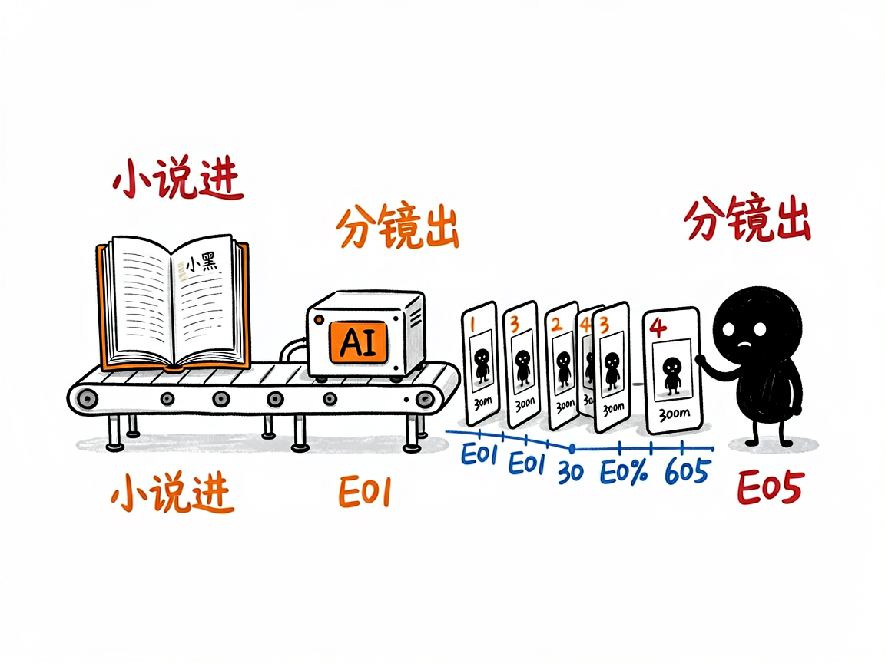

## 它到底能做什么

- **完整四幕剧本**：起承转合结构，标准脚本格式——镜头描述、对白、OS/VO 旁白、闪回、字幕齐全。
- **多集分解**：自动把故事拆成多集系列，每集时长可控。
- **素材资产规划**：编号的角色（C）、场景（S）、道具（P）生成提示词，适配 GPT-Image-2、Seedream、Nano Banana Pro 等生图模型——编号管理保证每集角色长相一致。
- **Seedance 2.0 分镜脚本**：时间轴格式提示词，直接贴进 Seedance 出视频，配合视频延长功能实现集间无缝衔接。
- **文-资-视-剪工作流**：剧本创作 → 资产构建 → 视频生成 → 后期剪辑，外加声音设计指导。

## 怎么用

**场景 1：名著改编**
你：把《武松打虎》做成 5 集短视频系列。
AI：四幕剧本 → 拆 5 集 → 输出武松/老虎/景阳冈的编号素材提示词 → 每集 Seedance 分镜脚本。

**场景 2：自有故事**
你：这是我写的短篇《项链》改编剧本大纲，帮我规划成视频系列。
AI：补全剧本 → 规划资产 → 生成分镜，附声音设计建议。

## 谁适合用

- 想做 AI 短剧、故事类短视频的创作者。
- 有小说/网文 IP 想视频化的作者。
- 研究 AI 视频工作流的玩家。

## 一点说明

本技能专注于"文→资→视→剪"中文-资-视三环的脚本生产；实际生图与视频生成在各平台完成。仓库自带林冲、武松、草船借箭、司马光、崖山海战、项链等完整示例项目可对照学习。与 smy-seedance-storyboard（上美影水墨风格专用版）同源，本版为通用 Seedance 2.0 工作流。

## 闲鱼接单文案

> 以下服务展示在闲鱼 / 淘宝服务市场发布，用于承接本 skill 的定制开发订单。

**标题：小说转多集 AI 短剧（剧本+分镜）skill 软件开发**

**描述：**

专注 AI Agent 技能（skill）定制开发，已做出 Seedance 2.0 分镜脚本生成技能，现成作品可先看演示再下单。小说、文章、故事大纲丢进去，产出四幕完整剧本、多集分解、编号的角色场景道具生图提示词、Seedance 2.0 时间轴分镜脚本，文-资-视-剪全流程指导，自带林冲、武松、崖山海战等多个完整示例。支持按你的故事题材和画风定制模板，交付后装进 codex / workbuddy 等 AI 助手即可使用，全部源码交付、支持二次开发。

**服务内容：**

- 1、需求沟通梳理：先聊清楚你的源材料（小说、剧本大纲还是完整剧本）、目标集数时长和画风（水墨、写实、动漫），列明功能清单后再动手
- 2、skill交付内容和格式：完整剧本 + 素材清单提示词 + 每集分镜脚本的成套制作文件（含示例项目可对照）
- 3、项目功能/系统开发：按你的题材定制剧本结构、资产编号规则与分镜节奏，可扩展特定画风模板、声音设计规范等功能的开发与联调
- 4、skill源码交付：SKILL.md 技能说明 + 工作流文档 / 提示词手册 / 完整示例项目组成的技能工程，兼容 codex / workbuddy 等 agent。全部源码 + 安装部署说明 + 使用演示，交付后可自行修改维护

---

<!-- 来源: sellersprite-amazon-research.md -->

# 想用卖家精灵做全链路调研？让 AI 替你调 43 个数据工具 —— sellersprite-amazon-research 介绍

卖家精灵手里几十个数据工具，选品、关键词、竞品、广告、流量、定价……一个个手动调，光搞清楚入口就头大。sellersprite-amazon-research 就是干这个的：它通过卖家精灵的 43 个 MCP 数据工具，把亚马逊全链路调研打包成你能直接说的人话指令。

## 它到底能做什么

- 全链路覆盖：选品分析、关键词研究、竞品监控、市场分析、定价策略、评论分析、广告优化、流量分析、Listing 优化、蓝海机会挖掘。
- 43 个数据工具：一个技能调通卖家精灵几乎全部接口。
- 命令化触发：/product-research、/market-analysis、/competitor-analysis、/ad-optimizer 等，随叫随用。
- 策略洞察：新品爆发、隐形爆款、ABA 增长词、低品牌垄断等选品机会自动识别。

## 怎么用

**场景 1：快速看一个市场**
你：帮我做美国站XX类目的市场分析。
AI：它调卖家精灵市场工具，给你规模、竞争、机会的结论。

**场景 2：盯竞品广告**
你：这个 ASIN 的广告结构怎么样？
AI：拉竞品广告数据，拆解它的投放逻辑，你能照着学或对着打。

## 谁适合用

- 跨境电商卖家、Amazon 运营。
- 产品开发、广告优化师。
- 需要做全链路数据决策的团队。

## 一点说明

本技能依赖卖家精灵 MCP（密钥走 header 传入，不是 URL 参数），需配置账号。接口多、参数模式不一，具体以 SKILL.md 为准。

## 闲鱼接单文案

> 以下服务展示在闲鱼 / 淘宝服务市场发布，用于承接本 skill 的定制开发订单。

**标题：卖家精灵全链路调研 skill软件开发**

**描述：**

专注 AI Agent 技能（skill）定制开发，已做出调通卖家精灵 43 个数据工具的全链路调研技能，现成作品可先看演示再下单。选品分析、关键词研究、竞品监控、市场分析、定价策略、评论分析、广告优化、流量分析、Listing 优化、蓝海机会挖掘一句话直达，自动识别新品爆发、隐形爆款、ABA 增长词等选品机会。支持按你的运营场景做个性化定制，交付后装进 codex / workbuddy 等 AI 助手即可使用，全部源码交付、支持二次开发。

**服务内容：**

- 1、需求沟通梳理：先聊清楚你的调研场景（市场分析 / 竞品 / 广告 / 流量 / 定价）和常用数据工具，确认卖家精灵 MCP 账号可用，列明功能清单后再动手
- 2、skill交付内容和格式：选品、关键词、竞品、市场、定价、评论、广告、流量等全链路调研成果与策略洞察（数据表 + Markdown 分析报告）
- 3、项目功能/系统开发：按你的运营流程定制常用命令组合、报告模板与机会识别规则，可扩展定期监控等功能的开发与联调
- 4、skill源码交付：SKILL.md 技能说明 + 提示词 / 脚本 / 模板 / 报告样例组成的完整技能工程，兼容 codex / workbuddy 等 agent。全部源码 + 安装部署说明 + 使用演示，交付后可自行修改维护

---

<!-- 来源: sellersprite-rpa.md -->

# 想挖亚马逊选品数据、查竞品，又嫌手动点太累？它一个入口全搞定 —— sellersprite-rpa 介绍

你在用卖家精灵（sellersprite.com）做亚马逊选品和分析，网站功能很全，但跨站点、跨模块手动点一遍要花半个多小时，还容易看花眼。sellersprite-rpa 把卖家精灵 5 个核心数据分析模块打包成一个入口：选产品、关键词选品、选市场、ABA 搜索频率、查竞品，让你一句话就能抓数据，再一句话出多站点对比报告，半个钟的活儿变成几十秒。

**sellersprite-rpa 就是来解决这件事的。**

你给它一个模块名加站点（比如"美国站、查竞品 yoga mat"），它还你一份 CSV 数据表，以及一份中文多站点对比报告。

## 它到底能做什么

- 选产品（products）：抓各站点、各类目下的热销 ASIN（商品编号），帮你找潜力款。
- 关键词选品（keywords）：抓各站点的关键词搜索量、点击量、PPC（广告出价）数据。
- 选市场（markets）：看细分市场的规模和集中度，判断类目值不值得进。
- ABA 数据选品（aba）：调出亚马逊 Brand Analytics 的关键词搜索频率排行（这是亚马逊官方品牌分析数据）。
- 查竞品（competitors）：按关键词、品牌、卖家或 ASIN 反查竞品是谁。
- 多站点对比：一次跑美国、日本、英国等多个站点，自动按站点拆成不同表格并合并。
- 自动出报告：把抓到的数据喂回去，生成中文 Markdown 分析报告。

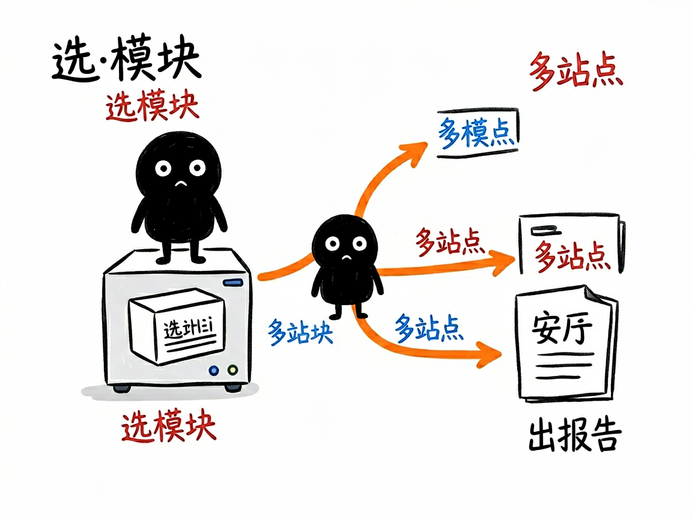

## 怎么用

你不需要记任何命令。在 codex / workbuddy 等 agent 装好 sellersprite-rpa 技能后，直接对 AI 说话就行：

**场景 1：想快速找美国站热销品**
你：帮我抓一下美国站最近热销的产品 Top 100。
AI：它会打开卖家精灵、按站点抓下热销 ASIN，整理成表格，省去你手动点半小时。

**场景 2：想按关键词查竞品**
你：在美国站，搜"yoga mat"这个关键词，看看都是谁在卖、谁排前面。
AI：它会按关键词反查竞品，列出相关卖家和商品，帮你摸清对手。

**场景 3：想出一份多站点对比报告**
你：把美国、日本、英国三个站的选品数据都拉出来，做个对比报告。
AI：它会一次跑多个站点，自动按站点拆表并合并，最后给你一份中文多站点对比分析报告。

## 谁适合用

- 用卖家精灵做亚马逊选品、竞品调研的卖家和运营。
- 需要跨多站点批量拉数据、做对比分析的研究人员。
- 想把手工点击变成可复用流程、定期拉数据的团队。

## 一点说明

它不是双击即用的 App，而是给 AI 助手（如 codex / workbuddy）用的"技能包"。它靠浏览器自动化工具（RPA，让 AI 自动操作网页的工具）驱动你已登录卖家精灵的真实浏览器去抓数据，不用你配密钥。你先在 agent 里装好对应的浏览器自动化技能、登录卖家精灵就行。免费会员会有部分数据被遮蔽（比如某些排名只显示前 50），这是卖家精灵本身的限制，不是技能问题。具体支持的站点和字段以项目 SKILL.md / references 为准。

## 闲鱼接单文案

> 以下服务展示在闲鱼 / 淘宝服务市场发布，用于承接本 skill 的定制开发订单。

**标题：亚马逊卖家精灵数据采集 skill软件开发**

**描述：**

专注 AI Agent 技能（skill）定制开发，已做出卖家精灵自动化采集技能，现成作品可先看演示再下单。一句话抓取选产品、关键词选品、选市场、ABA 搜索频率、查竞品 5 大模块的数据，支持多站点批量抓取并自动生成中文对比报告，半小时的手工活变成几十秒。支持按你的站点和类目做个性化定制，交付后装进 codex / workbuddy 等 AI 助手即可使用，全部源码交付、支持二次开发。

**服务内容：**

- 1、需求沟通梳理：先聊清楚你要用的模块（选品 / 关键词 / 市场 / ABA / 竞品）和目标站点，确认电脑已登录卖家精灵，列明功能清单后再动手
- 2、skill交付内容和格式：热销 ASIN、关键词搜索量与 PPC 出价、细分市场规模、ABA 搜索频率排行、竞品反查等数据采集成果（CSV 表格 + 中文多站点对比分析报告）
- 3、项目功能/系统开发：按你的选品流程定制抓取模块组合、多站点批量与定期采集等功能的开发与联调
- 4、skill源码交付：SKILL.md 技能说明 + 提示词 / 脚本 / 模板 / 报告样例组成的完整技能工程，兼容 codex / workbuddy 等 agent。全部源码 + 安装部署说明 + 使用演示，交付后可自行修改维护

---

<!-- 来源: sif-amazon-research.md -->

# 流量掉了查不出原因？让 AI 用 Sif 数据给你做根因诊断 —— sif-amazon-research 介绍

流量突然掉、广告烧钱没转化——大多数人只会瞎调，因为看不懂背后的真实数据。sif-amazon-research 就是干这个的：它基于 Sif 的真实市场、流量、关键词、销量和广告数据，帮你做市场验证、竞品拆解、流量诊断、关键词策略、广告复盘和增长优化，而且每一步都要求"拿证据说话"。

## 它到底能做什么

- 证据驱动：所有结论都挂 Sif 数据链，不靠拍脑袋。
- 八大场景：市场/机会研究、市场验证、竞品分析、关键词布局、新品评估、上市后反馈、增长优化、流量/广告诊断。
- 根因诊断：流量异常专门做 root-cause 拆解，告诉你到底掉在哪。
- 标准化输出：每条结论都带决策、证据链、业务影响、优先动作、待办和验证计划。
- 风险提示：数据不全时明确标"这是假设"，不拿单一指标下结论。

## 怎么用

**场景 1：流量下跌急救**
你：我这个 ASIN 最近流量掉了，帮我查原因。
AI：它拉 Sif 的流量和广告趋势，定位掉在自然还是广告、哪个词、哪天，给出根因。

**场景 2：上新前验证**
你：这个品值得不该进、该不该推？
AI：用关键词需求和竞品信号做验证，给你"进 / 不进 / 谨慎"的决策和证据。

## 谁适合用

- 亚马逊运营、广告投手。
- 需要做竞品拆解和增长优化的卖家。
- 想用真实数据做"推不推、停不停"决策的人。

## 一点说明

本技能依赖 Sif MCP 的真实市场/流量/广告数据，需配置账号。它强调"不拿单一指标下结论"，数据缺失时会标注为假设。具体以 SKILL.md 为准。

## 闲鱼接单文案

> 以下服务展示在闲鱼 / 淘宝服务市场发布，用于承接本 skill 的定制开发订单。

**标题：亚马逊流量诊断与增长优化（Sif）skill软件开发**

**描述：**

专注 AI Agent 技能（skill）定制开发，已做出基于 Sif 真实数据的流量诊断技能，现成作品可先看演示再下单。覆盖市场验证、竞品拆解、关键词布局、新品评估、增长优化、流量 / 广告根因诊断等八大场景，每条结论都带证据链、业务影响、优先动作和验证计划，数据不足时明确标注假设，不拿单一指标下结论。支持按你的运营问题做个性化定制，交付后装进 codex / workbuddy 等 AI 助手即可使用，全部源码交付、支持二次开发。

**服务内容：**

- 1、需求沟通梳理：先聊清楚你要解决的问题（流量下跌急救、上新验证还是广告复盘）和目标 ASIN，确认 Sif 账号可用，列明功能清单后再动手
- 2、skill交付内容和格式：流量根因诊断、市场验证、竞品拆解、关键词与广告策略等调研成果（带决策、证据链、优先动作的标准化 Markdown 报告）
- 3、项目功能/系统开发：按你的运营节奏定制诊断场景、指标口径与报告模板，可扩展多 ASIN 定期体检等功能的开发与联调
- 4、skill源码交付：SKILL.md 技能说明 + 提示词 / 脚本 / 模板 / 报告样例组成的完整技能工程，兼容 codex / workbuddy 等 agent。全部源码 + 安装部署说明 + 使用演示，交付后可自行修改维护

---

<!-- 来源: simple-review-analyzer.md -->

# 一堆电商差评好评看不过来？让它秒变读懂用户的产品参谋 —— simple-review-analyzer 介绍

卖家的后台里堆着成百上千条评论，好评差评混在一起，你明明知道"用户有话说"，却没空一条条看。结果产品该改啥、差评到底卡在哪、哪个卖点最打动人，全凭感觉。尤其是想研究竞品时，对手几百条评论更是无从下手。

**simple-review-analyzer 就是来解决这件事的。** 你给它一份评论的表格文件（CSV），它还你三样东西：打标后的明细数据、一份深度洞察报告、和一个能直接打开看的可视化看板。

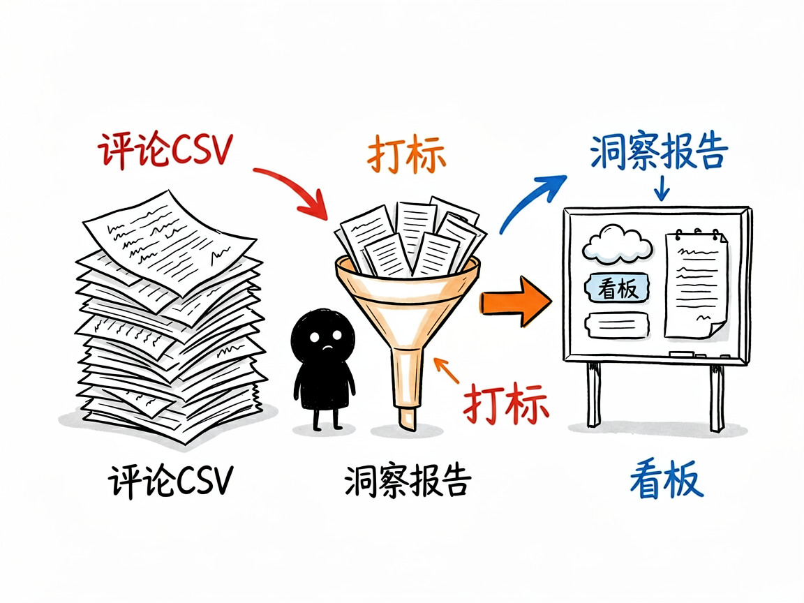

## 它到底能做什么

- 22 维度智能打标：给每条评论自动贴标签，覆盖人群（性别/年龄/职业）、使用场景、功能满意度、质量（材质/做工/耐用）、服务（发货/包装/客服/退换/保修）、体验（舒适/易用/外观/价格）、竞品对比、复购意愿和情感倾向。
- 识别用户画像：从评论里归纳出 3–4 类典型用户，每类配精选"黄金样本"评论，帮你真正看懂是谁在买。
- 挖 VOC（客户之声）：汇总用户痛点、情感分布和关键词，知道大家到底在意什么。
- 出可视化看板：一个黑金风格 HTML 页面，带 6 个交互图表，浏览器直接打开就能向团队展示。
- 做竞品分析：把对手的评论也喂进去，对比双方优劣势，找差异化机会。

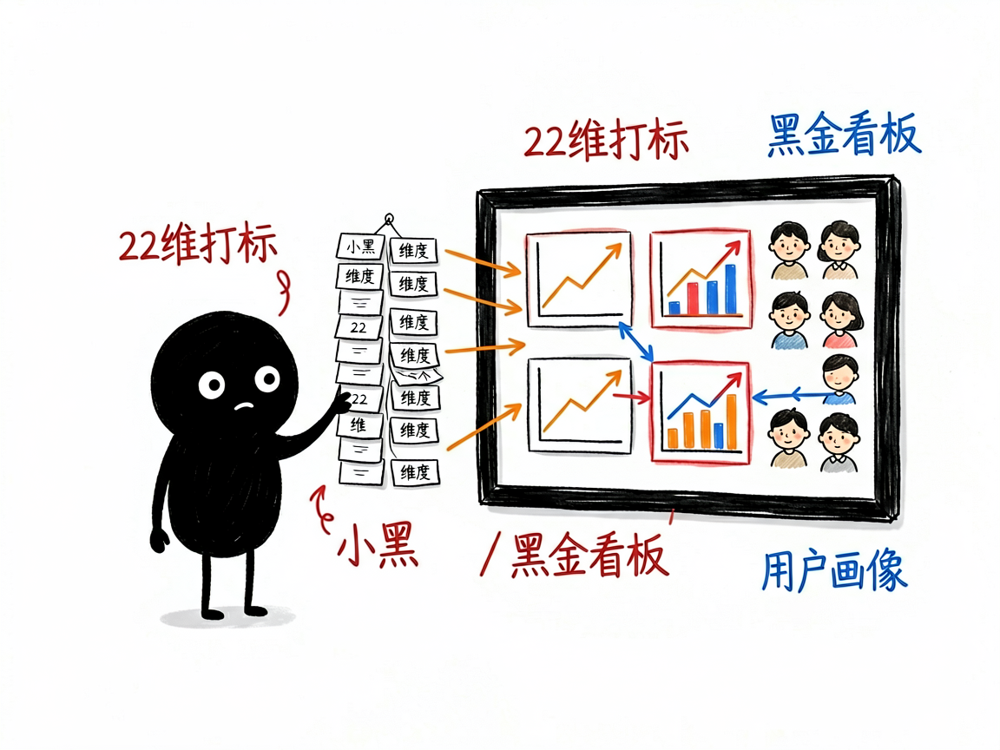

## 怎么用

你不需要记任何命令。在 codex / workbuddy 等 agent 装好 simple-review-analyzer 技能后，直接对 AI 说话就行：

**场景 1：分析自家产品评论**
你：这是我家店铺的评论表 reviews.csv，帮我分析一下用户都在吐槽啥、又夸啥。
AI：它先看你要分析多少条（通常推荐 100 条平衡速度与质量），然后给每条评论打 22 个维度的标签，最后还你打标明细、一份深度洞察报告和一张能直接打开看的可视化看板。

**场景 2：研究竞品**
你：这是我对手的评论，帮我看看他们哪里被骂得最惨。
AI：它把对手评论同样打标，揪出差评集中点和高频痛点，再和你的优势对比，帮你找差异化机会。

**场景 3：找核心用户画像**
你：我不想看全部，先告诉我到底是谁在买我家东西。
AI：它从评论里归纳出 3–4 类典型用户，每类配几条"黄金样本"评论，让你一眼看懂客户长什么样。

## 谁适合用

- 电商卖家：从自家评论里找产品改进点。
- 产品经理：用真实反馈指导功能优先级。
- 品牌方：做竞品评论对比，找差异化定位。
- 市场研究员：批量分析多个产品，看行业趋势和用户偏好。

## 一点说明

这是给 AI 助手用的技能，不是爬虫——你得自己先把评论导出成 CSV 再交给它，它不负责从平台抓取数据。它靠 AI 模型给每条评论打标，分析数量别贪多，100 条通常最划算。打标是 AI 理解后的归纳，适合找方向和做展示，关键结论建议再回原评论核对。

## 闲鱼接单文案

> 以下服务展示在闲鱼 / 淘宝服务市场发布，用于承接本 skill 的定制开发订单。

**标题：电商评论分析（VOC 用户之声）skill软件开发**

**描述：**

专注 AI Agent 技能（skill）定制开发，已做出电商评论深度分析技能，现成作品可先看演示再下单。丢一份 CSV 评论表进来，自动给每条评论打 22 个维度的标签（人群、场景、质量、服务、体验、复购意愿等），归纳 3–4 类典型用户画像，汇总 VOC 痛点，还能做竞品评论对比，产出洞察报告和一个浏览器直接打开的可视化看板。支持按你的品类做个性化定制，全部源码交付、支持二次开发。

**服务内容：**

- 1、需求沟通梳理：先聊清楚评论来源（自家产品还是竞品）、分析条数（推荐 100 条）和最关心的问题，确认评论能导出成 CSV，列明功能清单后再动手
- 2、skill交付内容和格式：22 维打标明细数据、深度洞察报告、黑金风可视化看板（HTML，6 个交互图表）、典型用户画像与黄金样本评论、竞品优劣势对比（CSV + 报告 + 看板）
- 3、项目功能/系统开发：按你的品类定制打标维度、画像框架与看板图表，可扩展多产品批量对比等功能的开发与联调
- 4、skill源码交付：SKILL.md 技能说明 + 提示词 / 脚本 / 模板 / 报告样例组成的完整技能工程，兼容 codex / workbuddy 等 agent。全部源码 + 安装部署说明 + 使用演示，交付后可自行修改维护

---

<!-- 来源: sorftime-rpa.md -->

# 想用 Sorftime 挖亚马逊数据，又不想一页页手抄？它一个入口抓 11 类 —— sorftime-rpa 介绍

你用 Sorftime（sorftime.com）做亚马逊卖家分析，它家榜单很多：畅销榜、产品选品、关键词、品牌、卖家，还有各种"反查"工具。手动在网页上点、复制、粘贴，光一个类目就能耗掉一下午。sorftime-rpa 把原来 11 个分散的技能合并成了一个入口，让你一句话抓数据、一句话出报告，覆盖选品和"查竞品/品牌/市场/关键词"两大块。

**sorftime-rpa 就是来解决这件事的。**

你给它一个板块名加站点（比如"美国站、查品牌 Anker"），它还你一份 CSV 数据表，以及一份分析报告。

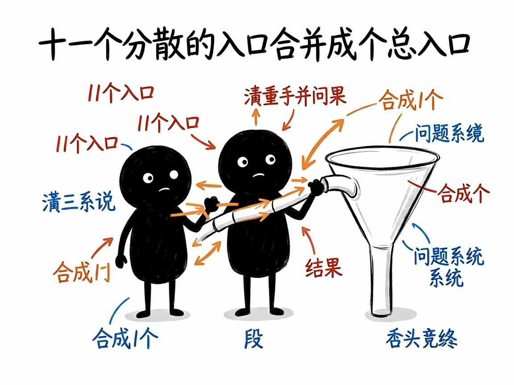

## 它到底能做什么

选品模块（看榜单、找方向）：

- 畅销榜（bestseller）：每个类目 TOP100 商品。
- 产品选品（product）：各站热销 ASIN。
- 关键词（keyword）：各站热门搜索词及趋势。
- 选品牌（brand）/ 选卖家（seller）：各站品牌榜、卖家榜。
- 选市场（market）：细分市场的规模、新品占比、均价等。

查模块（按条件反查）：

- 查 ASIN（checkproduct）：批量查商品详情，如价格、销量、评价、排名。
- 查品牌（checkbrand）/ 查卖家（checkseller）/ 查市场（checkmarket）：按关键词跨站反查。
- 查关键词（checkkeyword，实验性）：看流量来源、搜索趋势等。

它还支持 14 个亚马逊站点（美国、日本、英国、德国等），并能把 CSV 自动生成中文 Markdown 报告。

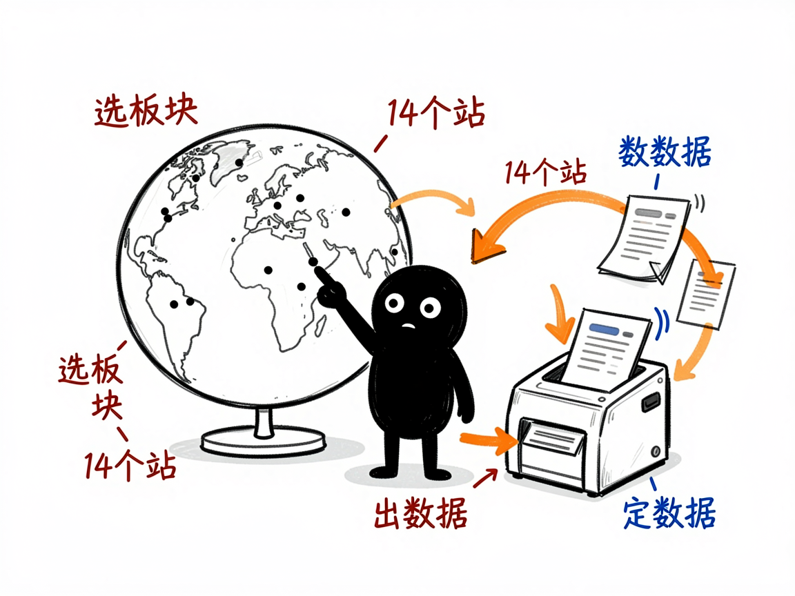

## 怎么用

你不需要记任何命令。在 codex / workbuddy 等 agent 装好 sorftime-rpa 技能后，直接对 AI 说话就行：

**场景 1：想看品牌榜**
你：帮我看美国站和日本站的品牌榜。
AI：它会打开 Sorftime、按站点抓下品牌榜数据，整理成表格给你。

**场景 2：想查某个品牌在各站的情况**
你：帮我查一下 Anker 在美国站各个类目里表现怎么样。
AI：它会按品牌跨站反查，把 Anker 在各站的数据整理出来，让你一眼看清它的布局。

**场景 3：想批量查几个商品**
你：帮我查这几个 ASIN 的价格、销量和评价排名。
AI：它会批量查商品详情，把每个编号的价格、销量、评价、排名整理成表，还能生成一份中文分析报告。

## 谁适合用

- 用 Sorftime 做亚马逊选品、竞品监控的卖家和运营。
- 需要跨 14 个站点批量拉品牌、卖家、市场数据的研究人员。
- 想把这些手工活变成可复用流程、定期跑的人。

## 一点说明

它不是双击即用的软件，而是给 AI 助手（如 codex / workbuddy）用的"技能包"。它靠浏览器自动化工具（RPA，让 AI 自动操作网页的工具）驱动你已登录 Sorftime 的真实浏览器去读数据（Sorftime 接口全程加密，所以只能"看"页面解密后的内容，不用配密钥）。因此你先在 agent 里装好对应的浏览器自动化技能、登录 Sorftime 就行。免费会员部分数据会被遮蔽，属于平台限制。查关键词模块标注为实验性，可能不稳定。具体板块和字段以项目 SKILL.md / references 为准。

## 闲鱼接单文案

> 以下服务展示在闲鱼 / 淘宝服务市场发布，用于承接本 skill 的定制开发订单。

**标题：Sorftime亚马逊数据采集 skill软件开发**

**描述：**

专注 AI Agent 技能（skill）定制开发，已做出 Sorftime 全板块自动化采集技能，现成作品可先看演示再下单。一个入口覆盖畅销榜、产品、关键词、品牌、卖家、市场等选品板块和 ASIN / 品牌 / 卖家 / 市场 / 关键词各类反查，支持 14 个亚马逊站点，自动生成中文分析报告。支持按你的站点和板块做个性化定制，交付后装进 codex / workbuddy 等 AI 助手即可使用，全部源码交付、支持二次开发。

**服务内容：**

- 1、需求沟通梳理：先聊清楚你要抓的板块（榜单类 / 反查类）和目标站点，确认电脑已登录 Sorftime，列明功能清单后再动手
- 2、skill交付内容和格式：类目畅销榜 TOP100、热销 ASIN、热门关键词、品牌 / 卖家榜单、市场概况及各类反查数据采集成果（CSV 表格 + 中文 Markdown 分析报告）
- 3、项目功能/系统开发：按你的调研流程定制板块组合、跨站批量抓取与报告模板等功能的开发与联调
- 4、skill源码交付：SKILL.md 技能说明 + 提示词 / 脚本 / 模板 / 报告样例组成的完整技能工程，兼容 codex / workbuddy 等 agent。全部源码 + 安装部署说明 + 使用演示，交付后可自行修改维护

---

<!-- 来源: sprite-gen.md -->

# 想给游戏做个会动的小角色？说一句话它帮你生成精灵图动画 —— sprite-gen 介绍

你在做小游戏、做动效，需要一个会走路、会攻击的小角色动画。过去这得找美术一张张画帧、再拼成"精灵图"（sprite sheet，就是把一连串动作帧排在一张图里）。你既不会画，也不想折腾一堆第三方付费工具。

**sprite-gen 就是来解决这件事的。**

它让你用一段文字描述角色和动作（比如"一只萌萌的小龙，走路循环"），自动生成一张排好格子的精灵图，并切成一帧帧、合成成会动的 GIF，还附一个能在浏览器里预览的页面。你给它一句描述，它还你一套能直接塞进游戏里的动画素材。

---

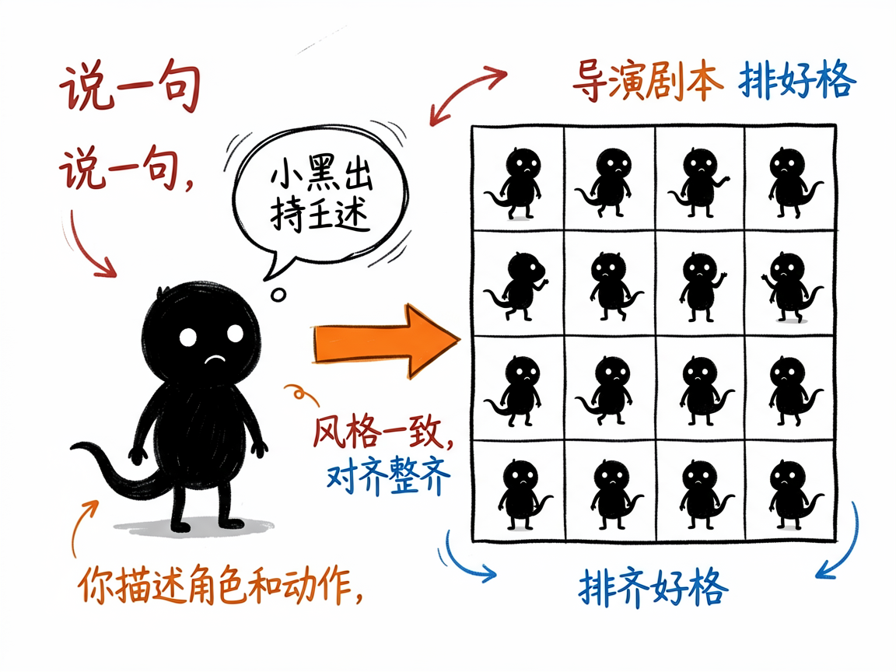

## 它到底能做什么
- 文字生成角色：你描述长相、风格、动作类型（走 / 攻击 / 待机 / 施法 / 跳舞），它先"导演"出一版具体剧本再出图。
- 生成整齐的格子图：一张方图里排好 N×N 个动作帧（默认 4×4=16 帧），每格角色一致、对齐整齐，方便游戏引擎切片。
- 智能去背景：生成的图往往带杂色背景或水印，它会自动识别并抠掉，保留透明底，方便叠到游戏场景里。
- 切成帧 + 合成 GIF：自动把大图切成单帧，再合成成带透明度的动画 GIF。
- 出预览页：生成一个网页，棋盘格背景上看 GIF 和每一帧，方便你检查动作顺不顺。

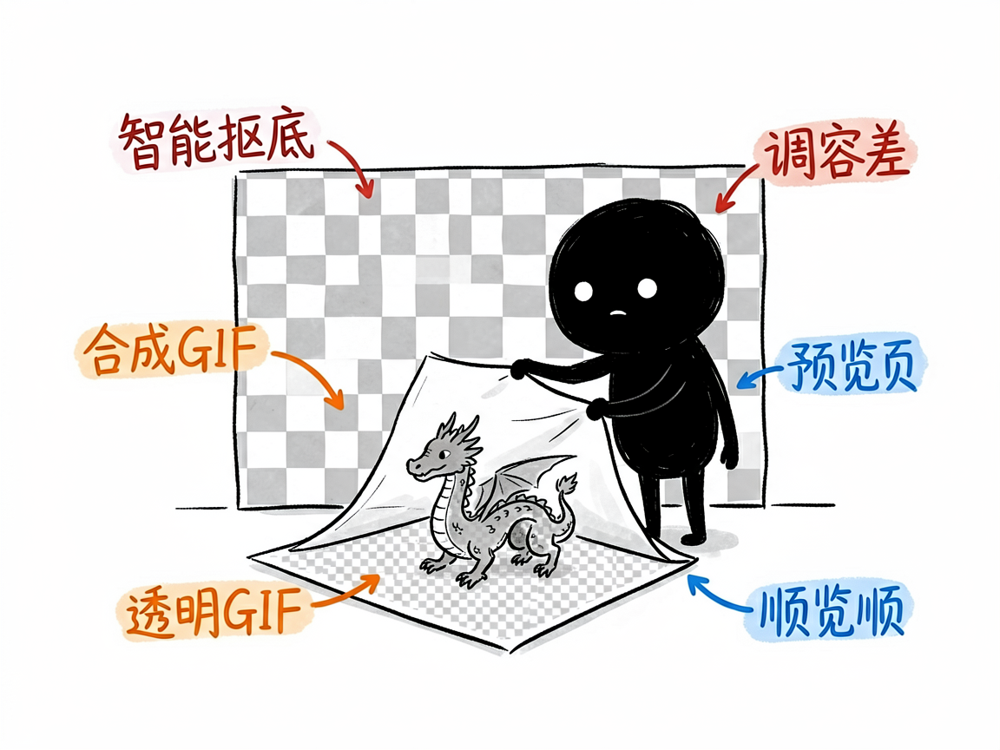

## 怎么用
你不需要记任何命令。在 codex / workbuddy 等 agent 装好 sprite-gen 技能后，直接对 AI 说话就行：
**场景 1：一句话生成会走路的小龙**
你：帮我生成一只萌萌的小龙走路循环动画，四方向都来一份。
AI：它先写出具体的动作剧本，再生成一张排好格子的精灵图，自动抠掉背景、切成帧并合成成会动的 GIF，还给你一个能预览每一帧的网页。
**场景 2：检查动作顺不顺、再调**
你：这个攻击动作有点卡，能帮我重新生成一版更流畅的，帧数再多一点吗？
AI：它按你的反馈重新出图、重排格子、重新合成，把新一版 GIF 和预览页发还给你比对。
**场景 3：给现有角色加个施法动作**
你：我已经有主角的精灵图了，再帮我补一套"施法"的动作帧，风格保持一致。
AI：它参照你已有的角色风格，生成一套对齐整齐的施法动作帧，接进原来的图里就能用。

## 谁适合用
- 做独立游戏、小游戏，需要角色动画素材的开发者。
- 想快速试验"某个角色动起来啥样"的原型玩家。
- 做 AI 工具、要把"文字生成游戏动画"做成能力的人。

## 一点说明
它核心靠 AI 生图能力出图，再由技能自动完成切图、去背景、合成 GIF。由于 AI 生图目前不能保证透明背景，它内置了"自动抠背景"来补救，但复杂背景偶尔会有瑕疵，可能需要换生成策略。它产出的是素材，最终游戏手感还得你来调。具体能力以项目文档为准。

## 闲鱼接单文案

> 以下服务展示在闲鱼 / 淘宝服务市场发布，用于承接本 skill 的定制开发订单。

**标题：游戏精灵图动画生成 skill软件开发**

**描述：**

专注 AI Agent 技能（skill）定制开发，已做出精灵图动画生成技能，现成作品可先看演示再下单。一句话描述角色和动作（"一只萌萌的小龙，走路循环"），它先"导演"出动作剧本再出图：生成一张 N×N 排格整齐的精灵图（默认 4×4 共 16 帧，角色逐帧一致），自动抠掉背景保留透明底，切帧合成带透明度的动画 GIF，附一个浏览器预览页方便检查动作顺不顺。可直接进游戏引擎使用。可按你的游戏风格定制，全部源码交付、支持二次开发。

**服务内容：**

- 1、需求沟通梳理：先聊清楚角色描述（长相 / 风格）、动作类型（走路 / 攻击 / 待机 / 施法 / 跳舞）、方向和帧数要求，列明功能清单后再动手
- 2、skill交付内容和格式：排格精灵图（N×N 动作帧）+ 透明底动画 GIF + 逐帧预览网页（可直接切片进游戏引擎的素材）
- 3、项目功能/系统开发：按你的游戏风格定制角色剧本、帧布局与动作库，可扩展整套角色批量生成等功能的开发与联调
- 4、skill源码交付：SKILL.md 技能说明 + 提示词 / 脚本 / 模板 / 图片样例组成的完整技能工程，兼容 codex / workbuddy 等 agent。全部源码 + 安装部署说明 + 使用演示，交付后可自行修改维护

---

<!-- 来源: staticshield.md -->

# 想给网页加个密码锁、只有知道密码的人能看？它把 HTML 加密成自解密页面 —— staticshield 介绍

你做了个网页——也许是份内部资料、一封电子请柬、一个只在小圈子里传的页面——你不想谁都能随便打开，但又没有服务器、不会搭登录系统。普通的"网页加密"要么要后端，要么形同虚设。

**staticshield 就是来解决这件事的。**

它把一个 HTML 网页加密成一个"自带解锁页"的文件：别人打开它，看到一个输入密码的框，输对密码才能在浏览器里当场解密、看到原内容；密码错就啥也看不到。你给它一个网页和密码，它还你一个能直接放到任意托管（比如网盘、CDN，甚至本地双击打开）上、靠密码保护的安全页面。

---

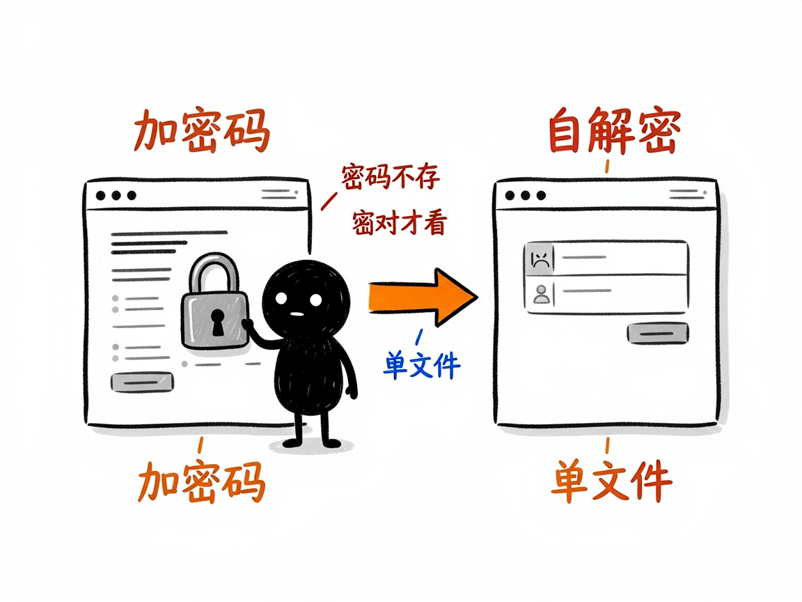

## 它到底能做什么
- 单文件加密：把一篇网页加密码变成自包含的解锁页，不依赖任何后端服务器。
- 整站打包加密：一整个文件夹（网页 + 样式 / 脚本 / 图片）可以"内联"成单文件再加密，或批量加密成一包。
- 强加密：用业界标准的强加密算法（AES-256）配合密钥派生，密码够强就够安全。
- 自动生成强密码：自己想不出密码时，它可以帮你随机生成一串够长的密码。
- 贴心小功能：可加"记住我"、密码提示、自定义解锁页图标，甚至生成一个把密码藏在链接里的分享地址。

## 怎么用
你不需要记任何命令。在 codex / workbuddy 等 agent 装好 staticshield 技能后，直接对 AI 说话就行：
**场景 1：把一份内部资料加密码**
你：帮我把这份内部汇报网页加密，密码设成"XX2026"，生成一个能直接发群里的安全页面。
AI：它把网页加密成带密码框的解锁页，你双击或发到网盘上，别人输对密码才能在浏览器里看到内容。
**场景 2：整个小站点打包加密**
你：我这个活动页面是个文件夹，里面有图有样式，帮我整站打包加密，密码我自己设。
AI：它把整个文件夹内联合并成一个加密文件，你拿到后能直接托管，只有知道密码的人能打开。
**场景 3：怕密码不够强**
你：我懒得想密码，你帮我随机生成一个够长的强密码，顺便把解锁页加上"记住我"。
AI：它生成一串高强度随机密码并记在交付说明里，同时给你加上"记住我"等贴心选项。

## 谁适合用
- 想分享敏感/私密网页内容、但不想搭服务器的人。
- 做内部资料、活动页面，需要简单密码保护的小团队。
- 做 AI 工具、要把"网页加密"做成能力的人。

## 一点说明
它是一套 AI 技能，最顺手的是在带它的 AI 助手里说"帮我把这个网页加密"，它来帮你完成加密并告诉你密码。解密发生在浏览器里，所以打开时需要联网环境或直接本地打开都行。务必记住：密码一旦生成就无法找回，它也不会替你存——丢了就只能重新加密。它保护的是"内容不被随便看到"，不等于能防住决心破解的人，密码强度很关键。具体能力以项目文档为准。

## 闲鱼接单文案

> 以下服务展示在闲鱼 / 淘宝服务市场发布，用于承接本 skill 的定制开发订单。

**标题：网页密码加密保护 skill软件开发**

**描述：**

专注 AI Agent 技能（skill）定制开发，已做出网页加密技能，现成作品可先看演示再下单。把 HTML 网页加密成自带密码解锁页的自包含文件：不用服务器，放到网盘、CDN 或本地双击都能用；单文件和整站文件夹打包都支持，AES-256 强加密，还能自动生成强密码、加"记住我"和密码提示、自定义解锁页图标、生成把密码藏在链接里的分享地址。可按你的场景定制，全部源码交付、支持二次开发。

**服务内容：**

- 1、需求沟通梳理：先聊清楚要保护的网页（单页还是整站文件夹）、密码要求和分发方式（网盘 / 链接 / 本地），列明功能清单后再动手
- 2、skill交付内容和格式：加密后的自解锁页面文件（单文件或整站加密包）+ 强密码与使用说明（可含"记住我"、密码提示、藏密码分享链接）
- 3、项目功能/系统开发：按你的场景定制解锁页样式与附加功能，可扩展批量加密等功能的开发与联调
- 4、skill源码交付：SKILL.md 技能说明 + 提示词 / 脚本 / 模板 / 样例组成的完整技能工程，兼容 codex / workbuddy 等 agent。全部源码 + 安装部署说明 + 使用演示，交付后可自行修改维护

---

<!-- 来源: stem-illustration.md -->

# 一张科研/教学示意图，怎么让 AI 帮你画出来 —— stem-illustration 介绍

写论文、做课件、出科普的时候，经常需要一张示意图：信号通路、实验流程、细胞结构、机制图、学术海报……可这类图要么得请专业画师、要么自己用软件抠半天。更麻烦的是，AI 生图虽然方便，却常把箭头方向画反、把蛋白质名字写错，还不小心编出不存在的通路。

stem-illustration 就是来解决这件事的：你给它一个 STEM（科学、技术、工程、数学）领域的画图需求，它帮你在 AI 里先产出一份"视觉简报"——包含准确的中文说明和可直接拿去生图的英文提示词（Prompt）；确认后它能调用接口真把图生成出来。它内置 24 种场景模板、6 大学科适配，还带着一套"科学准确性铁律"，尽量不让 AI 画出错的图。

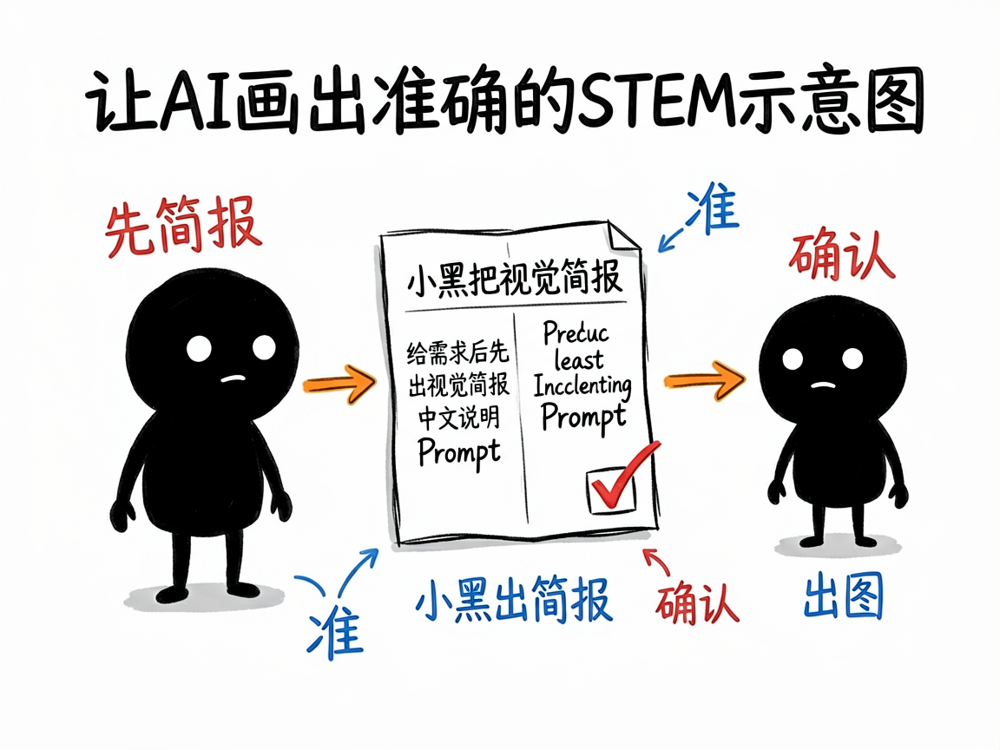

## 它到底能做什么
- 覆盖 6 大学科（生命科学、医学、化学、物理、工程、数学）的概念示意图、教学插图、技术架构图。
- 提供 24 个场景模板：信号通路、实验流程、细胞结构、概念信息图、学术海报、机制图、质粒图、机器学习架构、物理原理图、数学概念图等。
- 有 4 种风格变体可选：学术期刊风、教材插图风、信息图风、3D 渲染风。
- 生图前先产出"视觉简报"：学科、模板、尺寸、配色、核心元素、完整英文 Prompt，你确认后再出图。
- 强制"STEM 提示铁律"：颜色用十六进制码、方向显式声明、术语标准化、禁止虚构数据和相互作用，尽量保准确。
- 多图任务（如一整套论文 Figure）会锁定统一风格（色板、字体、线宽），避免一套图里各画各的。

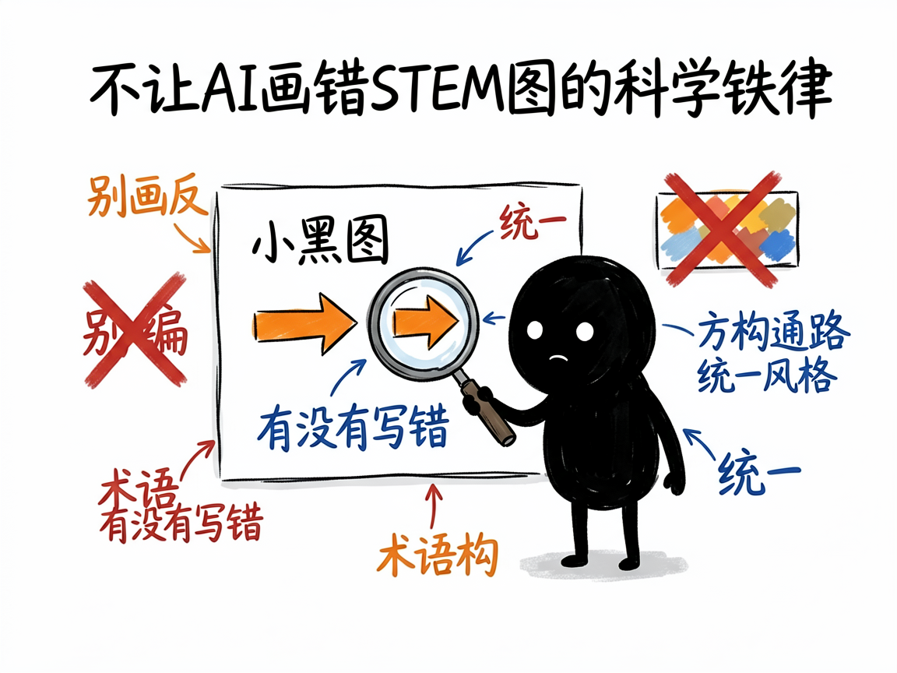

## 怎么用

你不需要记任何命令。在 codex / workbuddy 等 agent 装好 stem-illustration 技能后，直接对 AI 说话就行：

**场景 1：画信号通路图**
你：帮我做一张 MAPK-ERK 信号通路图，期刊风格，垂直方向。
AI：AI 匹配信号通路模板、选学术期刊变体，先给你一份视觉简报和英文 Prompt；你确认后它调用生图接口，产出一张垂直方向、期刊风格的 3:4 信号通路图。

**场景 2：做学术海报**
你：我要一张细胞结构的教材插图风海报。
AI：AI 产出带统一配色和标注的视觉简报，确认后生成一张准确的细胞结构插图，术语和箭头方向都经核对。

**场景 3：整套论文配图**
你：帮我把这篇论文的 Figure 1 到 Figure 4 做成一套风格统一的图。
AI：AI 锁定统一色板、字体、线宽，按模板逐张产出，保证整套图风格一致、科学准确。

## 谁适合用
- 研究生、科研者做论文配图、图文摘要、学术海报。
- 老师做教学插图、课件图。
- 科普作者做生命科学/化学/物理等概念图。
- 需要成套风格统一图示的团队。

## 一点说明
这是个给 AI 用的技能（skill），不是普通人直接打开的 App；你给它需求，它产出简报并（在你确认后）调接口生图。它需要你配置好生图接口的密钥（地址、模型、API key），否则生不了图。它有明确的"能力边界"：AI 生图适合概念示意、流程、结构类图，但不保证几何/数学严格正确，也禁止用来生成真实实验数据图（柱状/折线/散点等要用代码工具画）。严格几何证明图、坐标函数图，技能建议改用代码生成。具体模板与生成效果以技能文档和实际接口为准。

## 闲鱼接单文案

> 以下服务展示在闲鱼 / 淘宝服务市场发布，用于承接本 skill 的定制开发订单。

**标题：科研教学STEM示意图生成 skill软件开发**

**描述：**

专注 AI Agent 技能（skill）定制开发，已做出 STEM 科研示意图生成技能，现成作品可先看演示再下单。内置信号通路、实验流程、细胞结构、学术海报等 24 种场景模板，覆盖生、医、化、物、工、数 6 大学科，期刊风 / 教材风 / 信息图 / 3D 渲染 4 种风格；先出"视觉简报"（中文说明 + 英文 Prompt）你确认再生图，带科学准确性铁律（颜色十六进制、方向显式声明、禁止虚构通路），整套论文配图风格统一。可按你的学科定制，全部源码交付、支持二次开发。

**服务内容：**

- 1、需求沟通梳理：先聊清楚画图需求（学科、场景、风格、尺寸）和用途（论文 / 课件 / 科普 / 海报），确认生图接口密钥可用，列明功能清单后再动手
- 2、skill交付内容和格式：视觉简报（学科、模板、配色、核心元素、英文 Prompt）+ 生成好的示意图（单图或整套风格统一的论文 Figure）
- 3、项目功能/系统开发：按你的学科定制场景模板与风格变体，可扩展整套配图批量生成、风格锁定等功能的开发与联调
- 4、skill源码交付：SKILL.md 技能说明 + 提示词 / 脚本 / 模板 / 图片样例组成的完整技能工程，兼容 codex / workbuddy 等 agent。全部源码 + 安装部署说明 + 使用演示，交付后可自行修改维护

---

<!-- 来源: stock-deep-research.md -->

# 说一句"帮我研究下茅台"，它像投研团队一样给你出尽调报告 —— stock-deep-research 介绍

想认真研究一只股票，自己翻财报、搜公告、看研报，半天下来信息散落各处，还分不清哪些是干货、哪些是营销话术。真想搞明白"这家公司生意好不好、财务实不实、价格贵不贵"，门槛其实不低。

**stock-deep-research 就是来解决这件事的。** 你给它一只股票（或公司名、代码），它还你一份像专业投研团队做出来的、带完整引用的尽调报告。它先把 7 个独立的研究环节（问需求、定计划、分头调研、综合、查引用等）串成一条完整流水线，自动跑完。

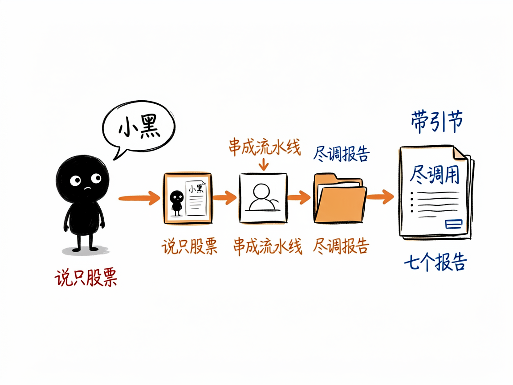

---

## 它到底能做什么

- 先问清你的需求：投资风格（价值 / 成长 / 红利等）、持有周期、最关心什么（护城河、财务、估值……）、风险偏好，然后生成一份研究计划让你确认。
- 派出多个 AI 研究员并行干活，对一只股票跑 8 个阶段的尽职调查：公司事实底座、行业周期、业务拆解、财务质量、股权治理、市场分歧、估值与护城河，再加综合报告。
- 强制交叉验证：比如拿经营现金流和净利润对账、把公司和同行全面对标、还必须列出 3 到 5 个看空风险场景，防止只报喜不报忧。
- 每个事实性声明都标出来源，并按 A 到 E 评级（A 是年报和监管文件，E 是论坛传闻），还会做"幻觉检测"，揪出编造的数据。
- 报告末尾给一个信号灯评级（三绿 = 积极关注、三黄 = 中性观望、两红 = 回避），但明确不预测股价、不荐股。
- 也能研究非股票主题（比如固态电池行业），走通用研究流程，同样产出带引用报告；还能单独用来检查你已有报告的引用靠不靠谱。

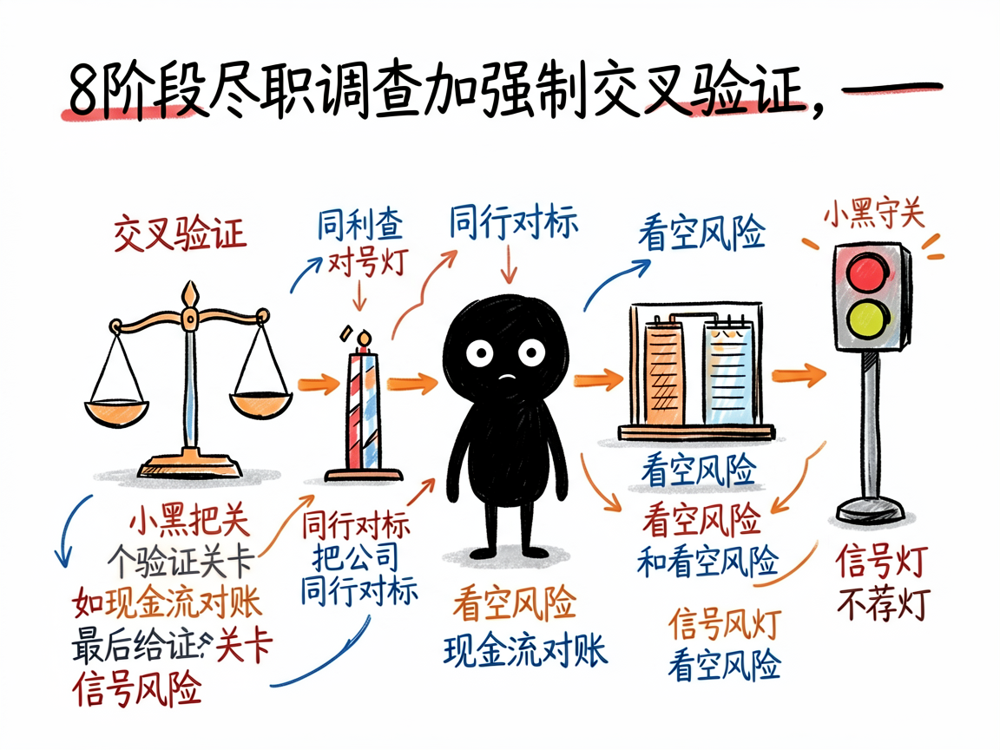

## 怎么用

你不需要记任何命令。在 codex / workbuddy 等 agent 装好 stock-deep-research 技能后，直接对 AI 说话就行：

**场景 1：想认真研究一只股票**
你：帮我研究一下贵州茅台 600519 值不值得投资
AI：它先问清你的投资风格、持有周期、最关心什么，生成研究计划让你确认，然后派出多个研究员分头做 8 个阶段的尽调，最后给你一份带引用的尽调报告。

**场景 2：你风格明确、想直接要结果**
你：按价值投资、长期持有、保守风格，帮我尽调腾讯控股 00700.HK
AI：它跳过提问直接开干，强制交叉验证（拿经营现金流和净利润对账、和同行对标），还会列出 3 到 5 个看空风险，报告末尾给一个信号灯评级（绿 / 黄 / 红）。

**场景 3：不只看股票，也想研究行业**
你：帮我研究一下固态电池行业现在啥情况
AI：它走通用研究流程，同样产出带引用的行业报告；也能单独帮你检查已有报告的引用靠不靠谱。

## 谁适合用

- 想认真了解某家公司、但没时间自己翻财报的普通投资者。
- 做基本面研究、需要系统化尽调框架的分析者。
- 需要带引用、可复核的研究文档的产品、战略或投研团队。

## 一点说明

它是装在 codex / workbuddy 这类 AI 助手里的技能集合，不是普通人直接打开的 App——得先有能加载技能的 AI 环境。它只做研究、不做投资建议：不预测股价、不给买卖点、不承诺收益，只是把基本面研究做扎实，决定要你自己下。投资有风险，报告末尾都会附免责声明。具体能力以项目文档为准。

## 闲鱼接单文案

> 以下服务展示在闲鱼 / 淘宝服务市场发布，用于承接本 skill 的定制开发订单。

**标题：股票公司尽调研究报告 skill软件开发**

**描述：**

专注 AI Agent 技能（skill）定制开发，已做出投研级股票尽调技能，现成作品可先看演示再下单。说一句"帮我研究下茅台"，它先问清你的投资风格和关注点，再派多个 AI 研究员跑 8 个阶段尽调（公司事实、行业周期、业务拆解、财务质量、股权治理、市场分歧、估值与护城河），强制交叉验证、必列看空风险，来源 A–E 评级加幻觉检测，报告末尾给信号灯结论（只研究不荐股）。也能做行业通用研究。可按你的框架定制，全部源码交付、支持二次开发。

**服务内容：**

- 1、需求沟通梳理：先聊清楚研究标的（股票 / 公司 / 行业）、投资风格、持有周期和最关心的问题，列明功能清单后再动手
- 2、skill交付内容和格式：尽调研究报告：8 阶段分析、交叉验证结果（现金流对账 / 同行对标）、3–5 个看空风险场景、信号灯评级、完整引用与免责声明
- 3、项目功能/系统开发：按你的研究框架定制尽调阶段、指标口径与报告模板，可扩展自选股定期体检等功能的开发与联调
- 4、skill源码交付：SKILL.md 技能说明 + 提示词 / 脚本 / 模板 / 报告样例组成的完整技能工程，兼容 codex / workbuddy 等 agent。全部源码 + 安装部署说明 + 使用演示，交付后可自行修改维护

---

<!-- 来源: story-handdrawn-remotion.md -->

# 有段故事想变成手绘风视频？它让每句话被"画"三次 —— story-handdrawn-remotion 介绍

你想把一段日记、一个童话、或者一个温情小故事做成视频，但嫌真人出镜麻烦，又想要那种手绘日记、蜡笔涂色的治愈感。自己画？一集都画不完。

**story-handdrawn-remotion 就是来解决这件事的。**

你给它一段故事文字，它还你一段 3:4 竖屏的手绘日记漫画动画，每句话都像被现场画出来三次。

---

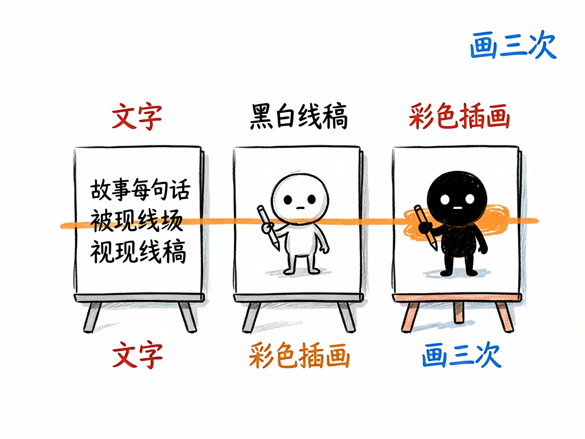

## 它到底能做什么
- 把故事按句号拆成"一句一拍"，每句配一张图，节奏清晰不堆砌。
- 每句做"文字 → 黑白线稿 → 彩色插画"三次横向擦除揭示，像有人在你面前一笔笔画出来，很有韵味。
- 可选右下角翻书转场，像翻一本手绘日记。
- 默认免费生成图片和免费配音（微软 edge 中文女声），也能升级到更高质量的付费方案。
- 额外支持英文教学闪卡模式：顶部英文句子、下方插画加关键词音标，适合中小学英语教学。

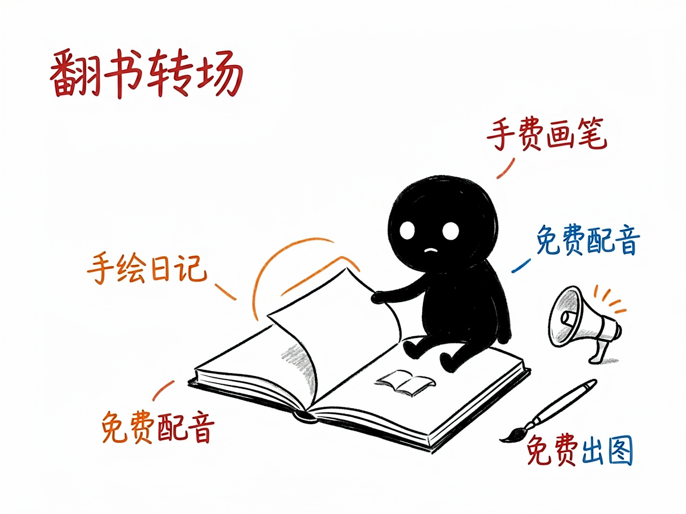

## 怎么用

你不需要记任何命令。在 codex / workbuddy 等 agent 装好 story-handdrawn-remotion 技能后，直接对 AI 说话就行：

**场景 1：把日记做成治愈系视频**
你：帮我把手写的这周日记做成一段手绘风短视频，要蜡笔涂色、治愈一点。
AI：它会把日记按句拆成一拍一图，每句都做"文字→线稿→彩图"的擦除动画，配上中文女声配音和翻书转场，给你一段 3:4 竖屏的手绘日记视频。

**场景 2：做童话短片**
你：我想给女儿讲一个自编的小童话，做成动画。
AI：它会把故事一句句画出来、配上温柔的旁白，产出一段像绘本翻页的温情小动画。

**场景 3：做英文教学卡**
你：帮我做一套英文故事教学卡，要带音标和释义。
AI：它会切到英文教学闪卡模式，每句英文配插画和关键词音标、释义、例句，适合中小学英语课堂。

## 谁适合用
- 写日记、童话、亲情故事的作者，想做成治愈系短视频。
- 老师做教学小品、步骤插画。
- 想做英文故事教学卡的人。

## 一点说明
它是跑在 AI 助手里的技能，产出一段手绘动画。默认"70% 质量就交付"，不追求每张图完美——目标是几小时出片。它是静帧擦除风格，不是会动的视频片段（那要看 story-handdrawn-video）。它依赖 Remotion（一个用代码做视频的开源框架，但你不用写，AI 帮你写）来生成画面。具体能力以项目文档为准。

## 闲鱼接单文案

> 以下服务展示在闲鱼 / 淘宝服务市场发布，用于承接本 skill 的定制开发订单。

**标题：手绘日记风故事视频制作 skill软件开发**

**描述：**

专注 AI Agent 技能（skill）定制开发，已做出手绘日记动画技能，现成作品可先看演示再下单。把日记、童话、温情小故事按句拆成"一句一拍"，每句做"文字 → 黑白线稿 → 彩色插画"三次擦除揭示，像有人当面一笔笔画出来，配翻书转场和中文配音，3:4 竖屏治愈感拉满；另有英文教学闪卡模式（句子 + 插画 + 音标释义），适合英语课堂。可按你的内容定制，全部源码交付、支持二次开发。

**服务内容：**

- 1、需求沟通梳理：先聊清楚故事文本、风格（治愈日记 / 童话 / 英文教学）和发布用途，列明功能清单后再动手
- 2、skill交付内容和格式：3:4 竖屏手绘日记动画成片：一句一拍三次揭示动画、翻书转场、配音字幕（或英文教学闪卡版视频）
- 3、项目功能/系统开发：按你的内容定制画面风格、节奏与教学模式，可扩展系列内容批量出片等功能的开发与联调
- 4、skill源码交付：SKILL.md 技能说明 + 提示词 / 脚本 / 模板 / 视频样例组成的完整技能工程，兼容 codex / workbuddy 等 agent。全部源码 + 安装部署说明 + 使用演示，交付后可自行修改维护

---

<!-- 来源: story-handdrawn-video.md -->

# 想做会动的手绘蜡笔风短视频？它每段直接生成一段动画 —— story-handdrawn-video 介绍

上一个是把静帧一张张擦出来讲，但你想让画面本身就动起来：小猫真的在走、雨真的在下，整段是 Q 版手绘蜡笔风的视频。这种"文生视频"怎么搞？

**story-handdrawn-video 就是来解决这件事的。**

你给它一段故事文字，它还你一条 9:16 竖屏的短视频，每场都是一段会动的蜡笔风动画片段。

---

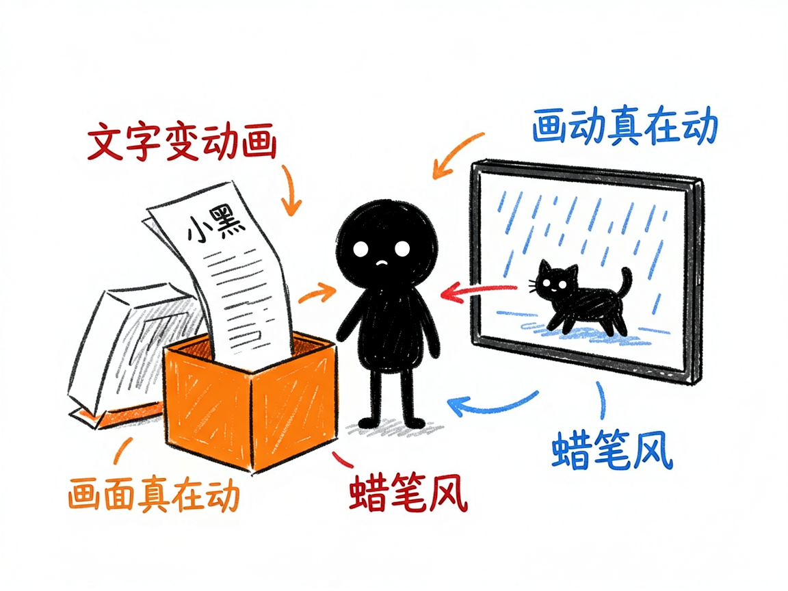

## 它到底能做什么
- 每一句故事直接生成一段文生视频动画（Agnes Video，一个文生视频模型），画面自己会动，没有擦除、没有翻页。
- 锁定蜡笔手绘风：粗黑轮廓、平涂色块、Q 版比例、定格动画那种轻微顿挫感，风格统一。
- 字幕由视频框架用毛笔字体确定性渲染，绝不让视频模型画中文字（避免乱码）。
- 先配音、再按旁白时长生成视频，音画对齐不裁不补。
- 支持英语教学卡模式：画面是叙事场景，叠加关键词、音标、释义、例句的教学卡，适合课文/词汇教学。

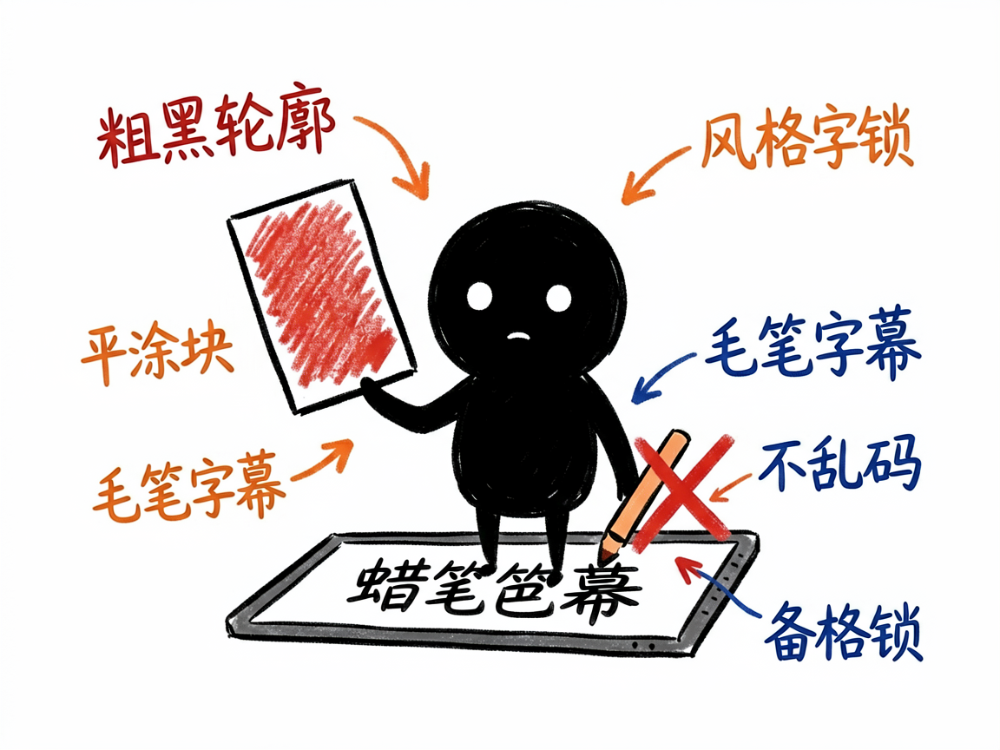

## 怎么用

你不需要记任何命令。在 codex / workbuddy 等 agent 装好 story-handdrawn-video 技能后，直接对 AI 说话就行：

**场景 1：做会动的小猫日记**
你：帮我把"我家小猫今天追蝴蝶"这段故事做成会动的蜡笔风短视频。
AI：它会先给故事配上旁白，再按每句旁白时长生成一段会动的蜡笔风动画——小猫真在跑、蝴蝶真在飞，最后用毛笔字体叠上字幕，给你一条 9:16 竖屏短片。

**场景 2：做童话动画**
你：我想做一个 Q 版手绘风的童话小动画，画面要一直动。
AI：它会锁定蜡笔手绘风（粗黑轮廓、平涂色块、Q 版比例），把每场都做成会动的片段，风格从头到尾统一。

**场景 3：做英文教学卡**
你：帮我做一段英语课文教学视频，要带关键词、音标和例句。
AI：它会切到英语教学卡模式，在叙事画面里叠加关键词、音标、释义、例句的教学卡，适合课文和词汇教学。

## 谁适合用
- 做童话、生活日记、情感小品的博主，想要会动的蜡笔风。
- 英语课文、词汇、听力教学视频的制作者。
- 想要"画面真在动"而非静帧擦除效果的人。

## 一点说明
它是跑在 AI 助手里的技能，产出一段会动的视频。免费额度下视频生成较慢（每段几十秒到两分钟、限流每分钟一次），要有耐心。跨场人物脸可能不一样（纯文生视频锁不住脸），这是正常的。它依赖 Remotion（一个用代码做视频的开源框架，但你不用写，AI 帮你写）来生成画面。具体能力以项目文档为准。

## 闲鱼接单文案

> 以下服务展示在闲鱼 / 淘宝服务市场发布，用于承接本 skill 的定制开发订单。

**标题：蜡笔手绘风动画短视频生成 skill软件开发**

**描述：**

专注 AI Agent 技能（skill）定制开发，已做出会动的蜡笔风动画技能，现成作品可先看演示再下单。每一句故事直接生成一段真的在动的蜡笔风视频片段（小猫真在跑、雨真在下），锁定粗黑轮廓、平涂色块、Q 版比例的统一画风；先配音再按旁白时长生成视频，音画对齐不裁不补，字幕用毛笔字体确定性渲染绝不出乱码，还有英语教学卡模式。可按你的内容定制，全部源码交付、支持二次开发。

**服务内容：**

- 1、需求沟通梳理：先聊清楚故事文本、画面风格要求和时长预期，确认对"跨场人物脸不完全一致"的接受度，列明功能清单后再动手
- 2、skill交付内容和格式：9:16 竖屏会动的蜡笔风动画成片：逐场文生视频片段、音画对齐旁白、毛笔字体字幕（或英语教学卡版视频）
- 3、项目功能/系统开发：按你的内容定制画风锁定、场景拆分与教学卡样式，可扩展系列内容批量出片等功能的开发与联调
- 4、skill源码交付：SKILL.md 技能说明 + 提示词 / 脚本 / 模板 / 视频样例组成的完整技能工程，兼容 codex / workbuddy 等 agent。全部源码 + 安装部署说明 + 使用演示，交付后可自行修改维护

---

<!-- 来源: talking-head-remotion.md -->

# 要做口播视频，又不想从零搭工程？它给你一套现成的模板 —— talking-head-remotion 介绍

你想做口播视频：自己出镜讲干货，配字幕、加个录屏、底部来条进度条。可是一打开视频工程就懵了——背景怎么做、字幕怎么对齐、人像放哪、动效从哪来？

**talking-head-remotion 就是来解决这件事的。**

你给它口播音频（或视频）和脚本，它还你一套能直接复用、排布好的口播视频，人像、字幕、进度条、动效都帮你安排妥当。

---

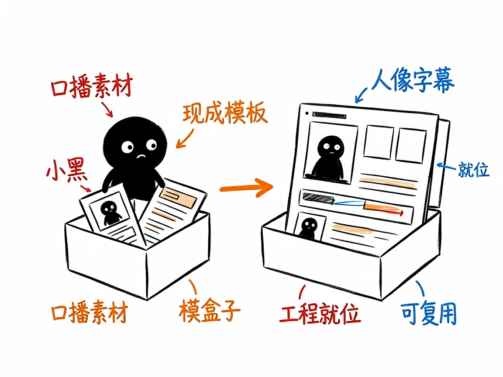

## 它到底能做什么
- 直接生成一套现成、可复用的口播视频工程，并自带跨项目公共素材库：字体、音效、背景音乐、可复用动效组件。
- 右下角圆形画中画放你的口播人像（看到头和肩膀），底部同步字幕，顶部章节进度条。
- 字幕驱动时间线：你说到的内容才蹦出来，不整页 PPT 式铺满，画面有呼吸感。
- 支持挂录屏、截图、音效和背景音乐，BGM 永远压在人声下面不抢戏。
- 默认横屏 1920×1080，现代暖白工作室风格；竖屏需要单独调那几层。

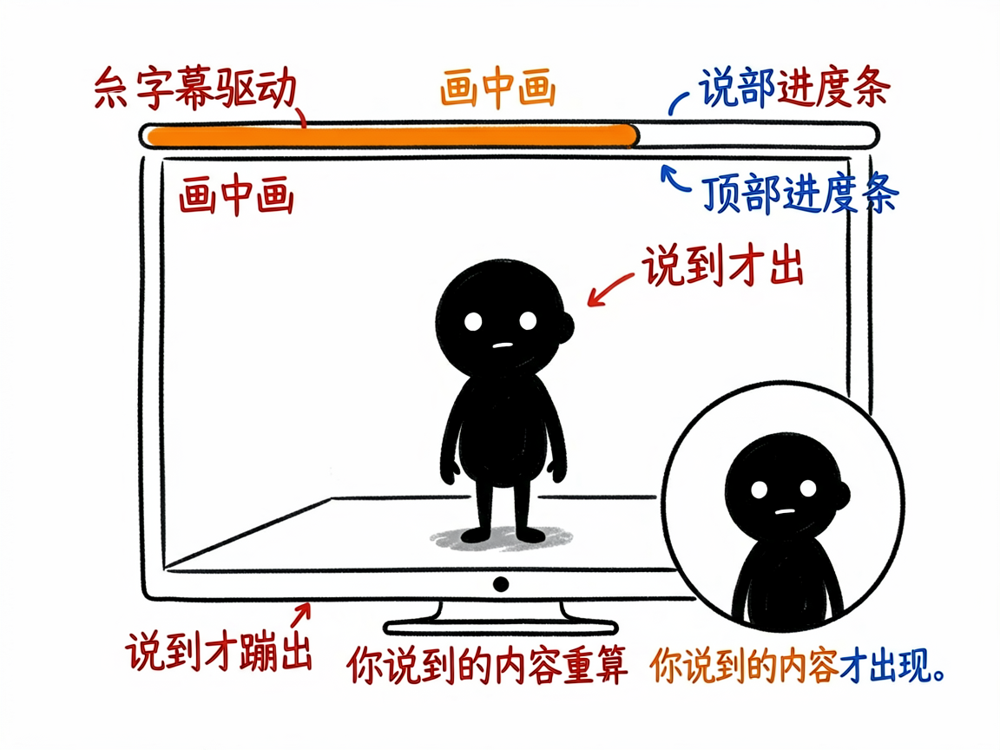

## 怎么用

你不需要记任何命令。在 codex / workbuddy 等 agent 装好 talking-head-remotion 技能后，直接对 AI 说话就行：

**场景 1：做一期知识口播**
你：我录了一段 10 分钟讲"怎么存钱"的口播，帮我做成带字幕和进度条的视频。
AI：它会把你的口播素材排成一套现成工程：右下角放你的人像画中画、底部同步字幕、顶部章节进度条，字幕跟着你讲的内容逐句蹦出，背景音乐压在人声下不抢戏。

**场景 2：加上录屏演示**
你：我这期口播想顺带展示一下软件操作，帮我挂个录屏。
AI：它支持挂录屏、截图、音效，会把录屏嵌进画面合适的位置，和你的口播人像、字幕协调排好。

**场景 3：做成可复用模板**
你：我们团队每期口播格式都差不多，能不能做成一套能反复用的结构？
AI：它会生成一套可复用的口播工程，自带字体、音效、BGM 和动效组件库，你们以后每期直接套用就行。

## 谁适合用
- 做知识分享、行业解读的口播博主。
- 想把现有口播模板迁移复用的人。
- 需要稳定、可复用口播工程结构的团队。

## 一点说明
它是跑在 AI 助手里的工程模板/技能，不是录视频的软件——你先得有口播素材。它强调"元素逐个进场、每屏文字别太多"，适合讲干货而不适合强剧情。它依赖 Remotion（一个用代码做视频的开源框架，但你不用写，AI 帮你写）来生成画面。具体能力以项目文档为准。

## 闲鱼接单文案

> 以下服务展示在闲鱼 / 淘宝服务市场发布，用于承接本 skill 的定制开发订单。

**标题：口播视频工程模板开发 skill软件开发**

**描述：**

专注 AI Agent 技能（skill）定制开发，已做出可复用口播视频工程技能，现成作品可先看演示再下单。给它口播音频（或视频）和脚本，产出排布妥当的成片和一套能反复用的工程：右下角圆形画中画人像、底部同步字幕、顶部章节进度条、字幕驱动时间线逐句蹦字，支持挂录屏、截图、音效和背景音乐（BGM 永远压在人声下），自带字体音效动效素材库。可按你的栏目风格定制，全部源码交付、支持二次开发。

**服务内容：**

- 1、需求沟通梳理：先聊清楚口播素材情况（音频 / 视频 / 脚本）、要不要挂录屏和团队复用需求，列明功能清单后再动手
- 2、skill交付内容和格式：排布完成的口播视频成片 + 可复用工程：画中画、同步字幕、章节进度条、动效、公共素材库（工程文件 + MP4）
- 3、项目功能/系统开发：按你的栏目风格定制布局、动效与竖屏版本，可扩展团队模板库等功能的开发与联调
- 4、skill源码交付：SKILL.md 技能说明 + 提示词 / 脚本 / 模板 / 视频样例组成的完整技能工程，兼容 codex / workbuddy 等 agent。全部源码 + 安装部署说明 + 使用演示，交付后可自行修改维护

---

<!-- 来源: tikhub-api-helper.md -->

# 想抓抖音、小红书、TikTok 的数据？它帮你查接口、调接口 —— tikhub-api-helper 介绍

你做运营、做研究，或者就是好奇：某个博主有多少粉丝、某条视频下面大家在聊什么、最近某个话题在 TikTok 上火成啥样。你听说这些数据都有官方接口能拿，但面对几十个平台、几百个接口名，根本不知道从哪个下手、参数怎么填。

**tikhub-api-helper 就是来解决这件事的。**

它帮你使用 TikHub 这家数据服务商提供的接口，去取各大社交平台上的公开内容。你给它一句人话（比如"我想查某个 TikTok 用户资料"），它还你该调哪个接口、参数怎么写，甚至直接帮你把数据要回来。你给它一个想法，它还你一份整理好的数据。

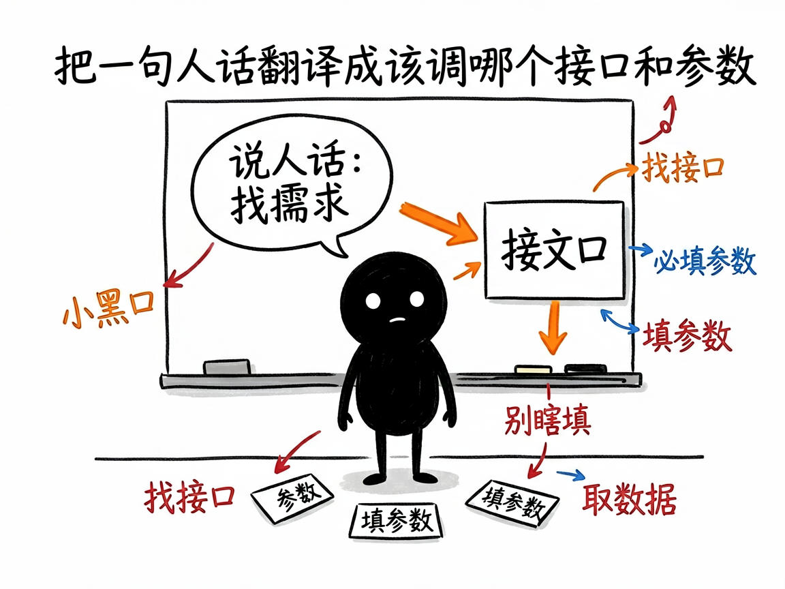

## 它到底能做什么

- 按关键词找接口：比如搜"user profile""视频评论""trending"，它会列出匹配的接口和需要填的参数。
- 按平台列清单：覆盖 TikTok、抖音、小红书、Instagram、YouTube、Twitter、Reddit、B站、微博、知乎等十几家，每家有哪些接口一目了然。
- 直接调接口取数：拿到接口名和参数后，帮你发起请求，把返回结果整理好给你看。
- 看接口详情：告诉 AI 你想看哪个接口，它就把这个接口要传哪些必填参数列清楚，避免瞎填。
- 支持国内/海外两种访问地址：在国内会自动走能直连的域名，少折腾。

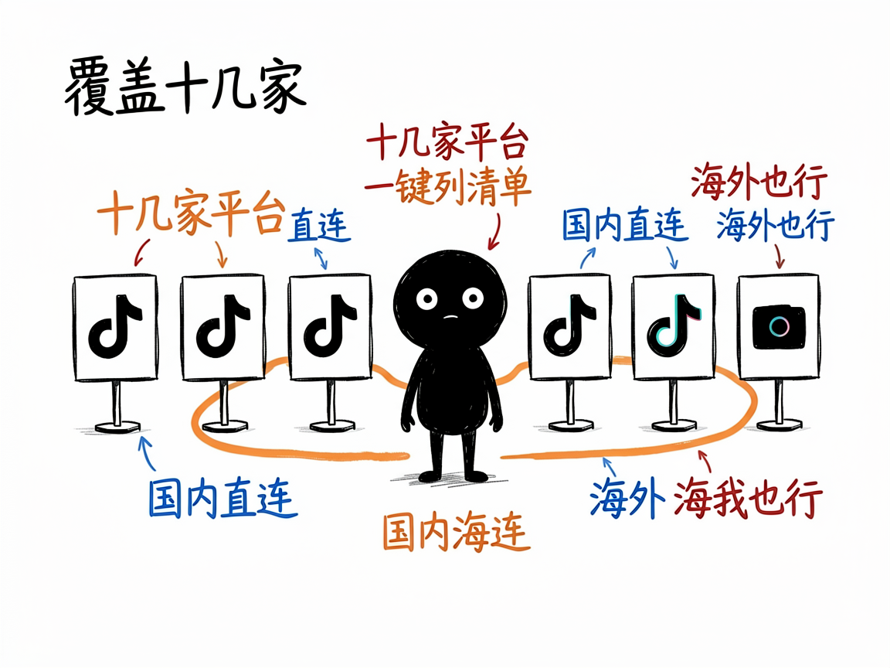

## 怎么用

你不需要记任何命令。在 codex / workbuddy 等 agent 装好 tikhub-api-helper 技能后，直接对 AI 说话就行：

**场景 1：想知道查某个博主该用哪个接口**
你：我想查某个 TikTok 用户的资料，该调哪个接口？
AI：它会帮你找到匹配的接口，列出名字和要填的参数，甚至直接把数据取回来给你。

**场景 2：想知道接口要填什么参数**
你：这个查用户资料的接口，具体要传哪些参数？
AI：它会把必填参数一项项列清楚，告诉你每个参数怎么填，免得你瞎试。

**场景 3：想直接把数据要回来**
你：别光告诉我接口了，直接帮我把这个博主的数据抓下来。
AI：它发起请求、把返回结果整理好给你看，你拿到就是现成的数据。

## 谁适合用

- 做社媒数据分析、竞品调研的运营或分析师。
- 想批量采集公开内容做研究的开发者。
- 搭 AI 工具、需要接社交媒体数据的人。

## 一点说明 / 小提示

它是个给想查接口、调接口的人用的助手，本质是把海量的 TikHub 接口"翻译"成你能用的步骤，不是给完全不懂技术的人直接点的按钮。取数据需要一个 TikHub 账号的 API 令牌（开发时可用内置默认令牌试，正式用得去 tikhub.io 申请自己的），并且要遵守各家平台的速率限制。它只处理公开的接口数据，具体能取到多少以平台开放范围和你的账号额度为准。具体能力以项目文档为准。

## 闲鱼接单文案

> 以下服务展示在闲鱼 / 淘宝服务市场发布，用于承接本 skill 的定制开发订单。

**标题：社媒数据接口查询调用（TikHub）skill软件开发**

**描述：**

专注 AI Agent 技能（skill）定制开发，已做出社媒数据接口助手技能，现成作品可先看演示再下单。把 TikHub 上几百个接口"翻译"成人话可用：说一句"我想查某博主资料 / 某视频评论 / 某话题热度"，它告诉你该调哪个接口、参数怎么填，甚至直接帮你把数据取回来整理好。覆盖 TikTok、抖音、小红书、Instagram、YouTube、Twitter、Reddit、B站、微博、知乎等十几家平台，国内海外双访问地址。可按你的采集需求定制，全部源码交付、支持二次开发。

**服务内容：**

- 1、需求沟通梳理：先聊清楚要查的平台和数据类型（用户资料 / 视频评论 / 热门内容）、数据量级，确认 TikHub API 令牌可用，列明功能清单后再动手
- 2、skill交付内容和格式：接口匹配与参数说明 + 整理好的数据结果（你要的博主资料、评论、榜单等现成数据）
- 3、项目功能/系统开发：按你的采集需求定制常用接口组合、批量采集与定期拉数流程，含联调测试
- 4、skill源码交付：SKILL.md 技能说明 + 提示词 / 脚本 / 模板 / 数据样例组成的完整技能工程，兼容 codex / workbuddy 等 agent。全部源码 + 安装部署说明 + 使用演示，交付后可自行修改维护

---

<!-- 来源: wechat-article-remotion.md -->

# 有一篇公众号文章想变成视频？丢个链接就行 —— wechat-article-remotion 介绍

你写了一篇（或看了一篇）不错的公众号文章，想把它变成能发的视频，但不想重新写脚本、重新排版、重新找图。最好能把原文图原样用上，别被裁掉。

**wechat-article-remotion 就是来解决这件事的。**

你给它一个公众号文章链接，它还你一段 Studio 风格的视频，原文图完整保留、字幕和章节自动排好。

---

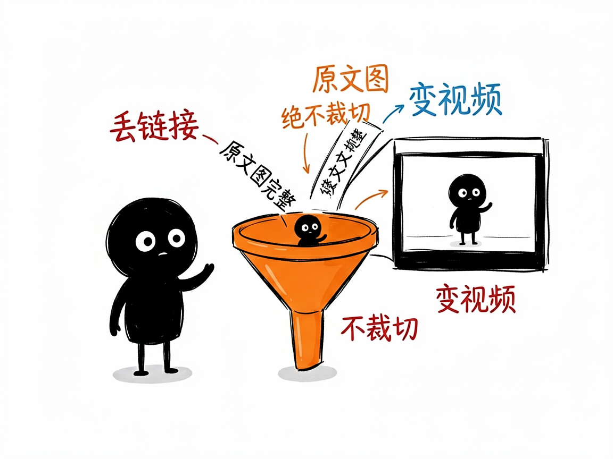

## 它到底能做什么
- 直接读公众号链接（mp.weixin.qq.com），自动抓正文和原文图片下载到工程里。
- 把文章拆成 6~12 个场景：封面、要点清单、数据、对比、结尾，外加专门的"文章图片"场景。
- 原文图永远完整显示、绝不裁切（这是铁律），适合图文并茂的长文。
- 自动生成配音（MiniMax 高质量或免费的微软 edge 配音）和同步字幕，关键词蓝色高亮。
- 暖白画布加透视格子背景，顶部章节进度条，整体干净、像知识类栏目。

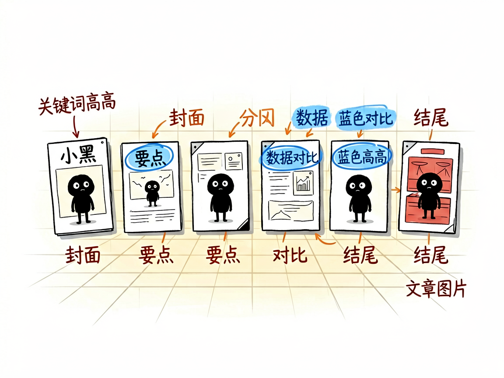

## 怎么用

你不需要记任何命令。在 codex / workbuddy 等 agent 装好 wechat-article-remotion 技能后，直接对 AI 说话就行：

**场景 1：把爆款文章转视频**
你：这篇公众号文章写得不错，链接发你，帮我做成视频发出去，原文图都要保留。
AI：它会读取链接、抓正文和原图，把文章拆成封面、要点、数据、对比等几个场景，原文图完整不裁切，再配上蓝色高亮字幕和配音，给你一段 Studio 风格的视频。

**场景 2：做内容二创**
你：帮我把这篇长文转成一条竖屏短视频，方便发别的平台。
AI：它会按文章结构自动分场景、排字幕和章节进度条，产出一段干净的知识类栏目风视频，你拿去别的平台发就行。

**场景 3：保留原文配图**
你：我这篇是图文并茂的，图千万别给我裁了。
AI：原文图完整显示是铁律，它会把每张图原样放进展厅，绝不做裁切。

## 谁适合用
- 公众号作者，想把手头文章分发成视频触达更多平台。
- 做内容二创、把好文转成短视频的运营。
- 需要保留原文配图、不想重新找素材的人。

## 一点说明
它是跑在 AI 助手里的技能，不是直接粘贴链接就出片的网站——你给链接，AI 帮你抓内容、配音、渲染成视频。关键点：公众号常见"一段文字配一张图"，图属于前面那段文字，配错会图文错位，这点 AI 会帮你处理好。它依赖 Remotion（一个用代码做视频的开源框架，但你不用写，AI 帮你写）来生成画面。具体能力以项目文档为准。

## 闲鱼接单文案

> 以下服务展示在闲鱼 / 淘宝服务市场发布，用于承接本 skill 的定制开发订单。

**标题：公众号文章转视频 skill软件开发**

**描述：**

专注 AI Agent 技能（skill）定制开发，已做出公众号转视频技能，现成作品可先看演示再下单。丢一个文章链接进来，自动抓正文和原文图片，把文章拆成封面、要点清单、数据、对比、结尾、图片展厅等 6–12 个场景，"原文图完整显示绝不裁切"是铁律，自动配音加关键词高亮字幕，产出干净的 Studio 知识栏目风成片。可按你的栏目风格定制，全部源码交付、支持二次开发。

**服务内容：**

- 1、需求沟通梳理：先聊清楚要转的文章链接、目标平台（横屏 / 竖屏）和配图保留要求，列明功能清单后再动手
- 2、skill交付内容和格式：Studio 风格视频成片：原文图完整保留的分场景画面、章节进度条、配音与关键词高亮字幕（MP4 文件）
- 3、项目功能/系统开发：按你的栏目风格定制场景模板、配色与配音方案，可扩展批量转视频等功能的开发与联调
- 4、skill源码交付：SKILL.md 技能说明 + 提示词 / 脚本 / 模板 / 视频样例组成的完整技能工程，兼容 codex / workbuddy 等 agent。全部源码 + 安装部署说明 + 使用演示，交付后可自行修改维护

---

<!-- 来源: wechat-writer.md -->

# 想认真运营公众号却卡在"写+配图"？这个助手从选题一路帮你写到出图 —— wechat-writer 介绍

做公众号最累的其实不是写一篇，而是"写之前想选题、写的时候调语气、写完还要满世界找配图"。尤其科技、AI、管理这类内容，既怕写得像机器稿，又怕图片风格不统一、和文章对不上。

**wechat-writer 就是来解决这件事的。** 你给它一个主题（或一段初稿），它还你一篇有大卫风格、经过审校、并且自动配好"小黑怪诞手绘"正文的公众号文章。它把"确认需求→联网查资料→给选题→写稿→三遍审校→自动配图"整条链路打通了，你基本不用在写和配图之间来回切。

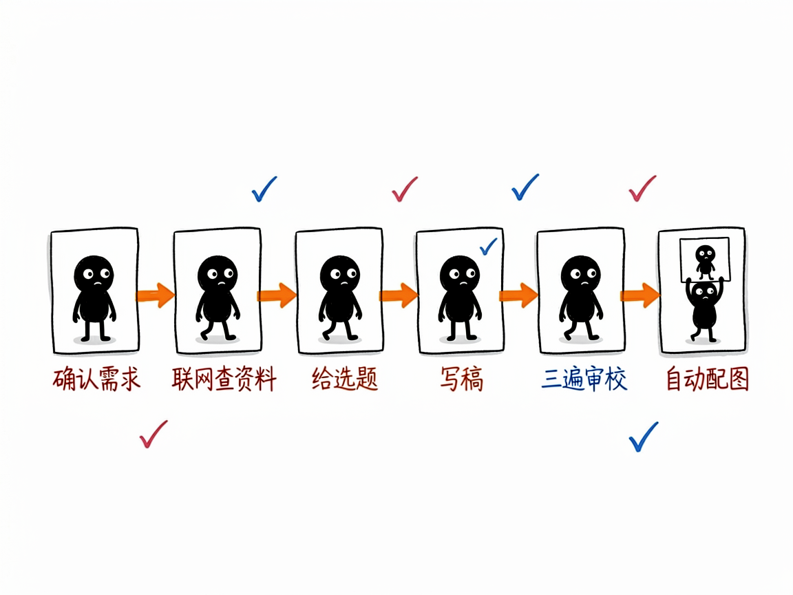

## 它到底能做什么

- 覆盖全流程：需求确认、信息搜索、选题讨论、初稿写作、三遍审校、爆款优化，最后自动触发配图。遇到新概念/新产品，它强制"先搜索、再选题、再写、再配图"，不跳步。
- 给 3–4 个选题卡片（含标题、角度、类型、大纲）让你挑，而不是一上来就硬写。
- 支持"一键直出"模式：你说"直接写"，它就只做最小假设直接出完整稿，省去来回问答。
- 也支持只改稿、只审校、只优化标题/开头/结尾，或"只配图"不碰文字。
- 默认带联网检索，涉及时间、数据、产品能力等可核查事实时，会在文末给出参考来源清单，不瞎编。
- **写审校完成后自动配图**：分析文章的"认知锚点"（核心判断、前后对比、流程等），产出配图清单（shot list），逐张生成小黑风格配图并插回文章。

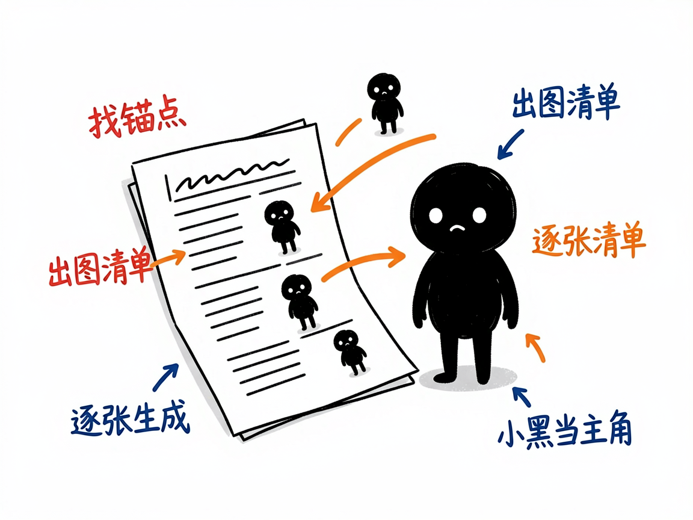

## 怎么用

你不需要记任何命令。在 codex / workbuddy 等 agent 装好 wechat-writer 技能后，直接对 AI 说话就行：

**场景 1：给个主题就让它从头写到出图**
你：帮我写一篇公众号文章，主题"中小公司怎么用 AI 提效"，读者是企业管理者和职场人，2000 字左右，要联网查资料，也要配图。
AI：它先给 3–4 个选题卡片让你挑，选定后出稿、做三遍审校，再自动生成 4–6 张小黑风格配图插回文章，最后存成一篇完整的稿子。

**场景 2：只想快速出稿**
你：直接写，主题"远程办公的三个坑"，1500 字，不用配图。
AI：它走"一键直出"模式，只做最小假设直接出完整稿，省去来回问答，你拿到就能用。

**场景 3：已有文章只补图**
你：我这篇已有文章只想加配图，文字一个字都别动。
AI：它走配图流程，分析认知锚点产出图清单，生成小黑风格配图插回去，完全不碰你的文字。

## 谁适合用

- 公众号作者（尤其科技/AI/管理/职场方向），想稳定产出还带统一配图。
- 企业市场/运营，需要周期性发文又缺设计和写作人力。
- 知识博主，想把观点文章写得更有个人风格、更"不像 AI 写的"。

## 一点说明

它默认是大卫的风格（重真实经历、清晰结构、轻评论、金句收束），且默认开启配图。如果你不想配图，说一句"不要配图"它就会跳过。配图能力是"借"了另一个技能（ian-xiaohei-illustrations）来实现的，要那个技能也在才能跑。它是装在 AI agent 里的一个技能（不是双击打开的 App）；配图依赖外部生图接口，具体可用性以项目说明文档为准。

## 闲鱼接单文案

> 以下服务展示在闲鱼 / 淘宝服务市场发布，用于承接本 skill 的定制开发订单。

**标题：公众号文章写作+配图 skill软件开发**

**描述：**

专注 AI Agent 技能（skill）定制开发，已做出公众号写作全链路技能，现成作品可先看演示再下单。确认需求 → 联网查资料 → 给 3–4 个选题卡片 → 写稿 → 三遍审校 → 自动配图一整条链路打通：先搜再写不瞎编，文末附参考来源；写完自动分析文章认知锚点，逐张生成统一的小黑手绘配图插回正文。支持一键直出、只改稿、只配图等模式。可按你的公众号风格定制，全部源码交付、支持二次开发。

**服务内容：**

- 1、需求沟通梳理：先聊清楚文章主题、目标读者、篇幅、要不要联网查资料和配图，列明功能清单后再动手
- 2、skill交付内容和格式：完整公众号文章稿：选题卡片、正文（大卫风格、三遍审校）、4–6 张统一风格配图、文末参考来源清单
- 3、项目功能/系统开发：按你的公众号调性定制写作风格、审校规则与配图风格，可扩展定时选题等功能的开发与联调
- 4、skill源码交付：SKILL.md 技能说明 + 提示词 / 脚本 / 模板 / 文章样例组成的完整技能工程，兼容 codex / workbuddy 等 agent。全部源码 + 安装部署说明 + 使用演示，交付后可自行修改维护

---

<!-- 来源: weekend-city-trip.md -->

# 下周末去哪个城市玩？它把一周末的活动、演出、美食、地铁全查齐 —— weekend-city-trip 介绍

周五晚上你突然想：下周末去趟成都/广州/杭州吧，但又懒得一个个去刷小红书、查演唱会排期、找美食街、研究地铁怎么坐。真要自己调研，光是"这周末有啥活动"就能花掉一个晚上。

**weekend-city-trip 就是来解决这件事的。**

它专做"中国城市的短期（本周末 / 下周末 / 未来一个月）旅游调研"，一次性把 11 类信息查齐：小红书近期活动、演唱会、集市、球赛、博物馆、优惠门票、喜茶门店、美食街、city walk 路线、5A 景区、地铁路线，最后整理成一份结构清晰的文字攻略，想看地图还能给你标出来。你给它"城市 + 时间"，它还你一份能直接照着玩的周末攻略。

---

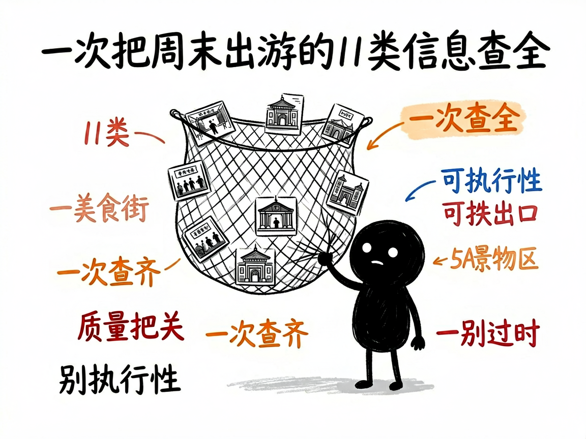

## 它到底能做什么
- 锁定时间窗口：自动算出"本周末 / 下周末 / 未来一个月"对应的具体日期，专门找近期、未来的活动，避免翻到过时的旧闻。
- 11 个方向一网打尽：从演出赛事到优惠门票、从网红打卡到地铁出口，按统一模板一次查全。
- 质量把关：查完会做完整性、准确性、可执行性检查——演出缺时间场馆、信息跨城市串台、价格太旧，都会补查或标注"出行前请二次确认"。
- 可选地图版：如果你要，它能把报告里的真实地点抽出来，用高德地图标成一张可交互的网页地图（按 11 类分色标记）。
- 可选网页版：纯文字攻略也能转成排版好看、能直接打印成 PDF 的网页。

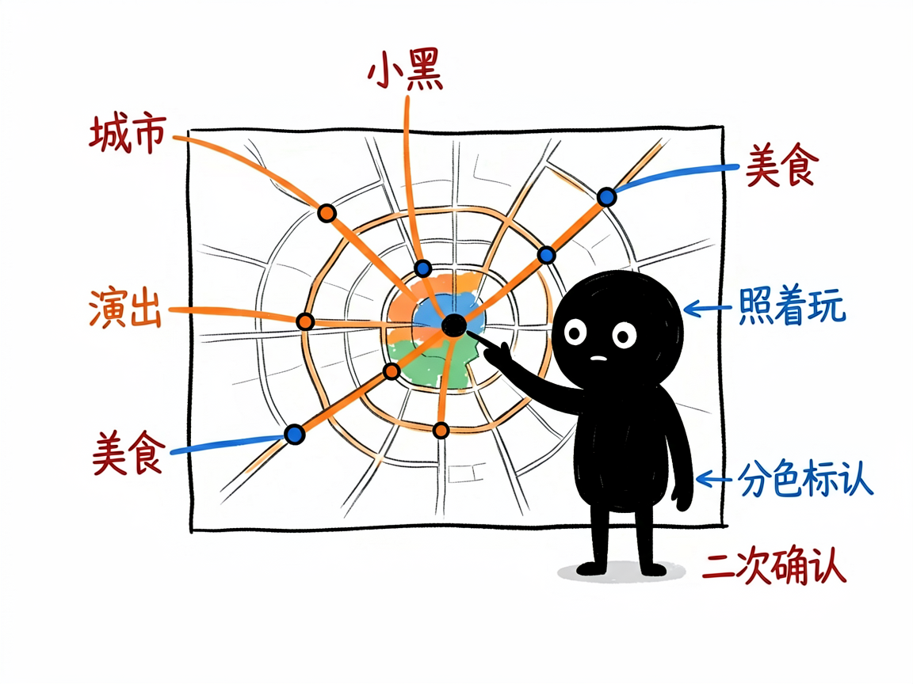

## 怎么用
你不需要记任何命令。在 codex / workbuddy 等 agent 装好 weekend-city-trip 技能后，直接对 AI 说话就行：
**场景 1：下周末去广州怎么玩**
你：调研一下广州下周末有什么好玩的，演出、集市、美食、地铁都帮我查齐。
AI：它按流程搜完、整合成一份结构清晰的攻略，覆盖 11 类信息，并把结果整理成一份能直接照着玩的报告。
**场景 2：要一张能看的地图**
你：攻略里这些地点帮我标到地图上，按类型分色，我想一眼看分布。
AI：它把报告里的真实地点抽出来，用高德地图生成一张可交互的网页地图，11 类信息分色标好。
**场景 3：想打印带走**
你：这份攻略排版好看点，我要导成 PDF 带在路上看。
AI：它把纯文字攻略转成排版精美的网页版，你可以直接打印成 PDF。

## 谁适合用
- 想周末短途出游、懒得自己做功课的普通用户（通过带这个技能的 AI 助手使用）。
- 做旅游内容、需要快速产出城市攻略的人。
- 做 AI 工具、要把"城市周末调研"做成标准化流程的人。

## 一点说明
它是一套 AI 技能，不是独立 APP——你是在 AI 助手对话框里发一句话，它替你做搜索、抽地点、写报告。它依赖搜索接口和高德地图密钥（需你自己申请配置，文档不内置任何密钥）；只覆盖中国城市、且是短期出游，海外城市或长期旅居不在范围内。报告里部分票价、地铁出口等信息可能偏旧，它会在文末提示你"出行前二次确认"。具体能力以项目文档为准。

## 闲鱼接单文案

> 以下服务展示在闲鱼 / 淘宝服务市场发布，用于承接本 skill 的定制开发订单。

**标题：城市周末旅游攻略定制 skill软件开发**

**描述：**

专注 AI Agent 技能（skill）定制开发，已做出城市周末游调研技能，现成作品可先看演示再下单。给它"城市 + 时间"（本周末 / 下周末 / 未来一个月），一次查齐 11 类信息：小红书近期活动、演唱会、集市、球赛、博物馆、优惠门票、美食街、city walk 路线、5A 景区、地铁路线，做完完整性 / 准确性 / 可执行性检查后整理成结构清晰的攻略；可选高德地图交互版（地点分色标注）和可打印 PDF 网页版。可按你的需求定制，全部源码交付、支持二次开发。

**服务内容：**

- 1、需求沟通梳理：先聊清楚目标城市、出行时间窗口和想要的版本（文字攻略 / 交互地图 / 可打印网页），确认搜索接口与高德地图密钥可用，列明功能清单后再动手
- 2、skill交付内容和格式：结构化周末攻略（11 类信息 + 时间地点价格 + 出行提示），可选高德地图分色标注网页版、可打印 PDF 网页版
- 3、项目功能/系统开发：按你的需求定制信息类别、地图标注样式与报告模板，可扩展多城市批量产出等功能的开发与联调
- 4、skill源码交付：SKILL.md 技能说明 + 提示词 / 脚本 / 模板 / 攻略样例组成的完整技能工程，兼容 codex / workbuddy 等 agent。全部源码 + 安装部署说明 + 使用演示，交付后可自行修改维护

---

<!-- 来源: whiteboard-explainer.md -->

# 想让 AI 画出「讲到哪画到哪」的白板讲解视频？—— whiteboard-explainer 介绍

把一篇讲稿变成白板手绘动画视频：图形被一笔笔描出来、文字逐笔写出，**旁白讲到哪，画面就画到哪**——不是 PPT 翻页，是真·手绘过程。这就是 whiteboard-explainer 干的事。

## 它到底能做什么

- **真手绘过程**：白板图上的图形按笔画绘出、文字逐笔写出，元素级精确对齐旁白（讲到哪画到哪）。
- **两种成片模式**：slide 序列（一拍一图，适合逐句讲解）和单画布生长（一张大图逐步长出来，适合数学推导、流程图、知识图谱）。
- **本地 CPU 渲染**：零 API 成本、帧帧确定、改一句重渲一秒，不怕云服务限流。
- **免费工具链**：PIL 程序化画白板图 + Agnes 免费生图（具象画面）+ edge-tts 免费旁白 + ffmpeg 合成，全链路不花钱。

## 怎么用

**场景 1：做知识科普视频**
你：把这篇"什么是日全食"的讲稿做成白板动画。
AI：拆好每拍一图 + 逐句 TTS，月亮画出来的时候旁白正好讲到月亮，太阳被挡住的瞬间音画同步。

**场景 2：数学推导视频**
你：把勾股定理的推导做成逐步生长的白板视频。
AI：一张大画布，讲到辅助线画辅助线、讲到面积等式写面积等式，整块板子随着讲解慢慢长满。

## 谁适合用

- 做知识区、科普区视频的创作者。
- 要把课件、推导、流程图变成"手绘讲解感"视频的老师和学生。
- 想要确定可重渲、又不想为 AI 视频付费的效率型选手。

## 一点说明

本技能基于 whiteboard-animator 引擎（PyPI 包，首次 setup 自动安装，自带 83MB 文字检测模型）。AI 生图仅画无字插画，所有中文文字用本机字体叠加，保证字字清晰。渲染速度约为视频时长，8 秒片段约 5-8 秒出片。

## 闲鱼接单文案

> 以下服务展示在闲鱼 / 淘宝服务市场发布，用于承接本 skill 的定制开发订单。

**标题：白板手绘讲解视频生成 skill 软件开发**

**描述：**

专注 AI Agent 技能（skill）定制开发，已做出白板讲解动画自动生成技能，现成作品可先看演示再下单。讲稿放进去，白板视频出来：图形一笔笔描、文字逐笔写、旁白讲到哪画到哪（元素级音画对齐），本地渲染零 API 成本、秒级重渲。支持逐拍幻灯片与单画布逐步生长两种模式，配套免费 TTS 旁白与程序化绘图模板。支持按你的讲解场景定制白板风格与绘制节奏，交付后装进 codex / workbuddy 等 AI 助手即可使用，全部源码交付、支持二次开发。

**服务内容：**

- 1、需求沟通梳理：先聊清楚你的内容类型（知识科普、数学推导、流程讲解还是数据图表）和成片风格，确认讲解稿来源与画布比例，列明功能清单后再动手
- 2、skill交付内容和格式：逐拍白板图 + 逐句旁白音轨 + 精确对齐的成片 mp4（含 region 规划模板与程序化绘图示例）
- 3、项目功能/系统开发：按你的讲解需求定制白板模板、绘制节奏与文字排版，可扩展多语言旁白、竖屏版本等功能的开发与联调
- 4、skill源码交付：SKILL.md 技能说明 + 渲染脚本 / 绘图模板 / region 规划示例组成的完整技能工程，兼容 codex / workbuddy 等 agent。全部源码 + 安装部署说明 + 使用演示，交付后可自行修改维护

---

<!-- 来源: xhs-business-validator.md -->

# 有个生意点子？先丢到小红书里看看大家买不买账 —— xhs-business-validator 介绍

你冒出一个点子："在深圳卖陈皮怎么样？""做个针对宝妈的收纳课行不行？"光靠自己拍脑袋，永远在"我觉得行"和"万一没人要"之间反复横跳。其实小红书上早有一堆人在讨论这类话题、吐槽痛点、晒需求——只是你没力气一条条翻完。

**xhs-business-validator 就是来解决这件事的。** 你给它一个生意想法，它还你一份带 0–100 评分的小红书市场验证报告，告诉你这个点子到底有没有戏。

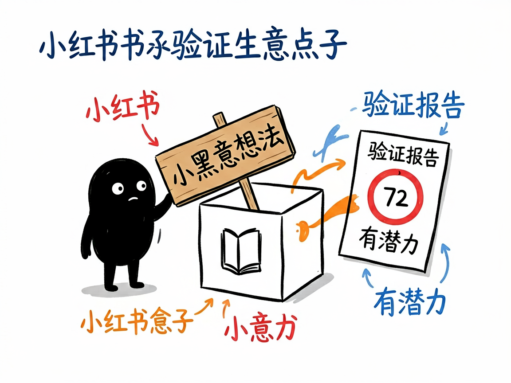

## 它到底能做什么

- 搜笔记和评论：通过 TikHub 接口（一个第三方数据服务）拉取小红书上和你想法相关的笔记和评论。
- 挖用户痛点：从大家的自来水和评论里，提炼出真实抱怨和没被满足的需求。
- 看现有方案：现在用户都在用什么办法解决，市场是不是已经很卷。
- 打分定性：综合 0–100 分（80+ 机会大、60–79 有潜力、40–59 再验证、0–39 风险高），一句话给结论。
- 出 HTML 报告：含统计指标、关键痛点、解决方案、市场机会、建议、热门笔记 Top3、评论标签分析和用户画像。
- 两种模式：快速模式（约 1–2 分钟，看 5 条评论）和完整模式（约 5–15 分钟，看 20 条），按需选。

## 怎么用

你不需要记任何命令。在 codex / workbuddy 等 agent 装好 xhs-business-validator 技能后，直接对 AI 说话就行：

**场景 1：验证一个点子**
你：帮我验证一下在深圳卖陈皮这个想法。
AI：它先问你要快速还是完整模式，跑完先给一句话结论："评分 72/100，有一定市场潜力"，再展开关键发现——大家在抱怨什么、现在用什么方案、你的机会在哪。

**场景 2：给账号定位找方向**
你：我想做个针对宝妈的收纳课，先看看小红书上有没有人需要。
AI：它去抓相关笔记和评论，分析宝妈群体的真实痛点和现有方案，给你一份带评分的验证报告，帮你判断这个方向值不值得做。

**场景 3：快速试水温**
你：我有个小品类想随手看看热度。
AI：它用快速模式一两分钟扫一遍，给你一个大致分数和几条关键评论，帮你低成本试水，不纠结。

## 谁适合用

- 想在国内（尤其小红书受众）做点小生意的人：快速试水温。
- 品牌方和 content 创作者：看某个品类在小红书上的声量和痛点。
- 选品、做账号定位的人：先验证需求再动手，少踩坑。

## 一点说明

这是给 AI 助手用的技能，装好、接好 TikHub 的数据接口就能拉小红书数据（密钥只存在你本地，不外传）。好消息是快速模式用 AI 助手自身能力分析，不强制要额外的 AI 模型密钥。它分析的是公开笔记和评论，评分是 AI 基于讨论热度、反馈和竞争情况综合判断的方向性结论，不能替代真实成交测试。注意它只覆盖小红书这一个平台的数据。

## 闲鱼接单文案

> 以下服务展示在闲鱼 / 淘宝服务市场发布，用于承接本 skill 的定制开发订单。

**标题：小红书生意点子验证 skill软件开发**

**描述：**

专注 AI Agent 技能（skill）定制开发，已做出小红书市场验证技能，现成作品可先看演示再下单。把你的生意想法拿到小红书上抓相关笔记和评论，挖真实痛点、看现有方案卷不卷，给出 0–100 评分（80+ 机会大、60–79 有潜力、40–59 再验证）和 HTML 验证报告；快速模式 1–2 分钟、完整模式 5–15 分钟。支持按你的品类做个性化定制，交付后装进 codex / workbuddy 等 AI 助手即可使用，全部源码交付、支持二次开发。

**服务内容：**

- 1、需求沟通梳理：先聊清楚你的生意想法和模式选择（快速试水 / 完整验证），确认 TikHub 数据接口可用，列明功能清单后再动手
- 2、skill交付内容和格式：0–100 评分与一句话结论、关键痛点、现有解决方案、市场机会、热门笔记 Top3、评论标签分析与用户画像（HTML 验证报告）
- 3、项目功能/系统开发：按你的品类定制分析维度、评分口径与报告模板，可扩展多平台数据源接入等功能的开发与联调
- 4、skill源码交付：SKILL.md 技能说明 + 提示词 / 脚本 / 模板 / 报告样例组成的完整技能工程，兼容 codex / workbuddy 等 agent。全部源码 + 安装部署说明 + 使用演示，交付后可自行修改维护

---

<!-- 来源: xiyou-insight.md -->

# 想透视竞品广告和流量？让 AI 用西柚洞察帮你拆 —— xiyou-insight 介绍

竞品广告怎么打的、流量从哪来的、新品是怎么推起来的——这些信息散在西柚洞察成百上千个接口里，自己查根本查不过来。xiyou-insight 就是干这个的：它基于西柚洞察 MCP，把亚马逊竞品分析与广告策略打包成 7 大核心场景，你要哪块，它直接调数据给你看。

## 它到底能做什么

- 7 大场景：广告效果实时监控、高性价比流量缺口挖掘、对标竞对打法拆解、新品推广提效、竞品流量透视、广告策略拆解、关键词库搭建。
- 全维度数据：ASIN 基础、关键词（近7天/月度/排名趋势）、流量与销量、广告分析，一应俱全。
- MCP 驱动：所有数据通过 xydc-mcp 直接调，脚本只做后处理和看板。
- 轻量可视化：自动聚合、生成报告和 Dashboard，结论看得清。

## 怎么用

**场景 1：盯竞品广告**
你：帮我看看这个 ASIN 最近广告投放有什么变化。
AI：它拉广告变化日趋势和排名变化，告诉你竞品是不是在加预算、推新词。

**场景 2：找流量缺口**
你：这个类目有没有高性价比但没人打的流量？
AI：扫竞品流量结构，把空缺的高价值词挖出来给你。

## 谁适合用

- 亚马逊卖家、广告优化师。
- 做竞品分析和关键词研究的人。
- 想用西柚洞察数据提效、但懒得逐个接口查的团队。

## 一点说明

本技能依赖西柚洞察 MCP（xydc-mcp），需配置账号。7 大场景覆盖广告监控到关键词库搭建，具体以 SKILL.md 为准。

## 闲鱼接单文案

> 以下服务展示在闲鱼 / 淘宝服务市场发布，用于承接本 skill 的定制开发订单。

**标题：亚马逊竞品广告流量透视（西柚洞察）skill软件开发**

**描述：**

专注 AI Agent 技能（skill）定制开发，已做出基于西柚洞察数据的竞品透视技能，现成作品可先看演示再下单。广告效果实时监控、高性价比流量缺口挖掘、竞对打法拆解、新品推广提效、竞品流量透视、广告策略拆解、关键词库搭建 7 大场景直达，全维度数据自动聚合并生成可视化报告。支持按你的盯盘需求做个性化定制，交付后装进 codex / workbuddy 等 AI 助手即可使用，全部源码交付、支持二次开发。

**服务内容：**

- 1、需求沟通梳理：先聊清楚你的使用场景（盯竞品广告、找流量缺口还是建关键词库）和目标 ASIN 或类目，确认西柚洞察账号可用，列明功能清单后再动手
- 2、skill交付内容和格式：广告监控趋势、流量缺口挖掘、竞品打法拆解、关键词库搭建等调研成果（数据表 + 可视化 Dashboard 报告）
- 3、项目功能/系统开发：按你的盯盘需求定制监控指标、竞品清单与看板模板，可扩展定期监控预警等功能的开发与联调
- 4、skill源码交付：SKILL.md 技能说明 + 提示词 / 脚本 / 模板 / 报告样例组成的完整技能工程，兼容 codex / workbuddy 等 agent。全部源码 + 安装部署说明 + 使用演示，交付后可自行修改维护
