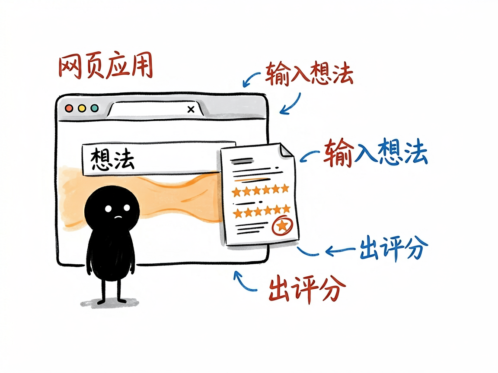
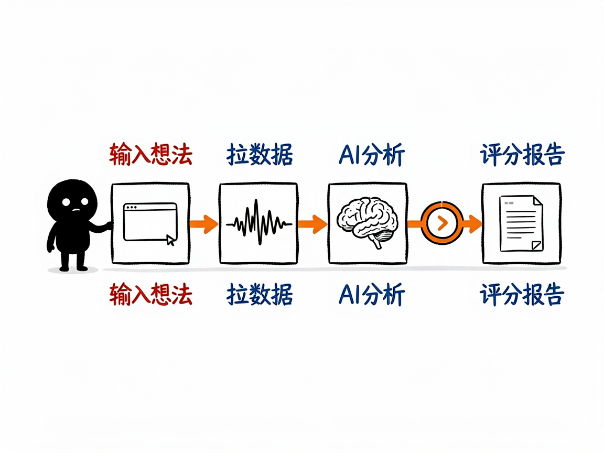

# 那个最早的小红书生意验证器原版 —— XHS_Business_Idea_Validator 介绍

你有个生意点子，比如"在深圳卖陈皮"，想知道小红书上的人买不买账。前面那篇 xhs-business-validator 其实是从一个更早的"原版"项目改出来的技能版。这个 XHS_Business_Idea_Validator 就是那个原版——一个独立的小红书商业创意验证器。

**XHS_Business_Idea_Validator 就是来解决这件事的。** 你给它一个生意想法，它去小红书里搜相关笔记和评论，分析用户痛点和市场信号，最后给你一份带评分的验证报告，告诉你这个点子值不值得做。

## 它到底能做什么

- 搜小红书笔记和评论：围绕你的想法，拉取相关的笔记内容和用户评论。
- 分析用户痛点：从大家的讨论里提炼真实需求、抱怨和没被满足的空档。
- 给市场信号打分：综合讨论热度、反馈和竞争情况，打出 0–100 的评估分。
- 生成验证报告：输出关键痛点、现有解决方案、市场机会和行动建议。
- 支持不同模式：轻量快速看和较完整的深度分析两套节奏可选。

## 怎么用

你不需要记任何命令。在 codex / workbuddy 等 agent 装好 XHS_Business_Idea_Validator 技能后，直接对 AI 说话就行：

**场景 1：验证一个点子**
你：帮我验证一下在深圳卖陈皮这个想法。
AI：它去小红书里拉相关笔记和评论，分析用户痛点和市场信号，最后给你一份带 0–100 评分的验证报告——关键痛点、现有方案、市场机会和行动建议都写清楚。

**场景 2：给品类找方向**
你：我想做针对宝妈的收纳内容，先看看小红书上有没有人需要。
AI：它搜一圈相关讨论，把真实需求和没被满足的空档挖出来，再打个分，帮你判断这个方向值不值得投入。

**场景 3：快速看个大概**
你：我有个小想法，先随手看看热度。
AI：它用轻量模式快速扫一遍，给你一个大致分数和几条关键讨论，帮你低成本试水温。

## 谁适合用

- 想在国内（小红书受众）试水小生意的人：先验证需求再投入。
- 做选品、账号定位、内容创作的人：看品类声量和真实痛点。
- 品牌方：快速摸清楚某个方向在小红书上的反馈。

## 一点说明

XHS_Business_Idea_Validator 是更早的网页应用原版，而 xhs-business-validator 是把同一套思路做成、能直接在 AI 助手对话里调用的"技能版"，两者高度同源。注意它只覆盖小红书这一个平台的数据，评分是方向性判断，不代表真实成交结果。
