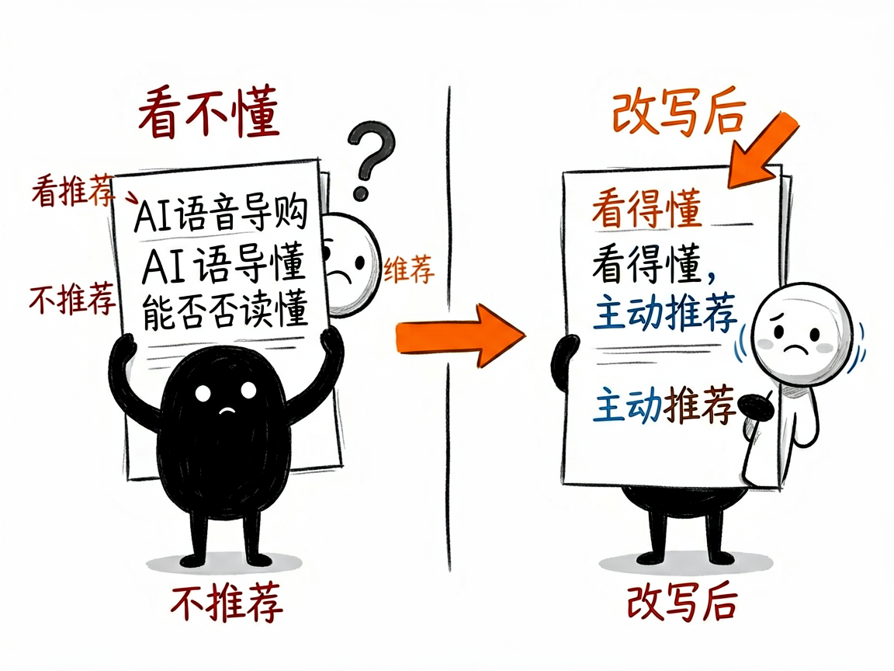
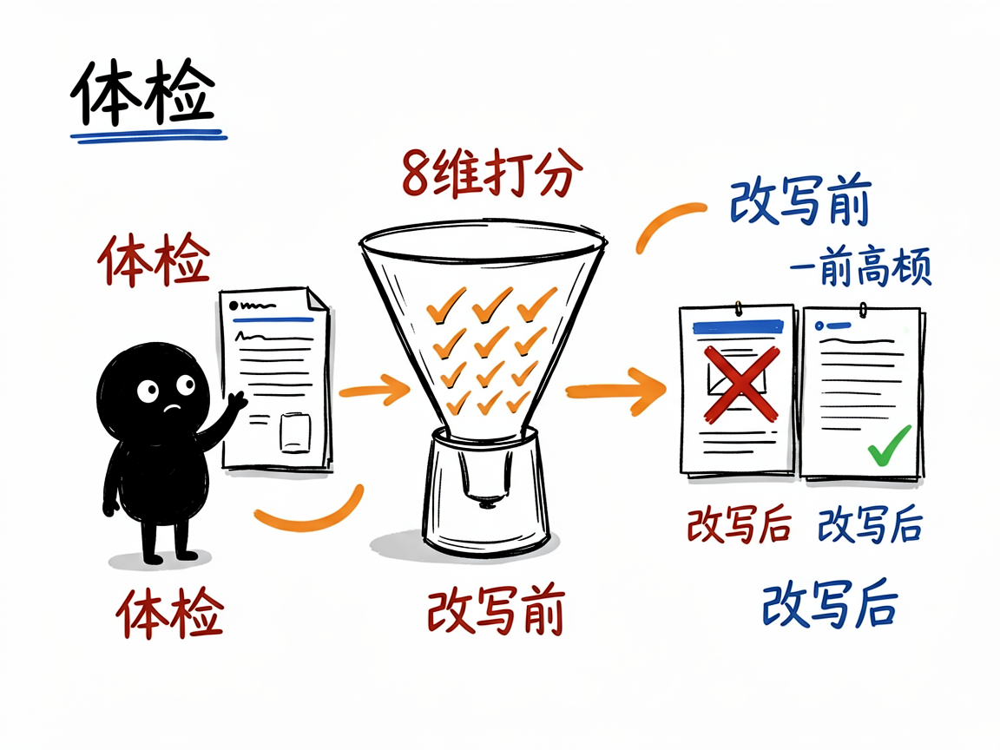

# 你的亚马逊商品，AI 导购看得懂吗？—— amazon-listing-alexa-optimizer 介绍

你在亚马逊上卖东西，买家现在可能不再自己翻页找货了——他们直接开口问语音助手："给我推荐一款适合欧洲旅行用的转换插头"。亚马逊在 2026 年正式上线了"Alexa for Shopping"（把 AI 购物助手整合进语音购物），也就是大家说的"AI 导购"。如果 AI 看不懂你的商品页，它就根本不会把你放进推荐里。更麻烦的是，2026 年亚马逊还改了规则：美国站标题被砍到最多 75 个字符，还新增了一个叫 Item Highlights 的字段。

**amazon-listing-alexa-optimizer 就是来解决这件事的。**

你给它一份亚马逊商品页（标题、五点描述、图片文案、后台属性等），它还你一份"体检报告"加"改写方案"——告诉你哪里 AI 看不懂、怎么改才容易被推荐。

---



## 它到底能做什么

- 帮你做全面体检：从 8 个维度给商品页打分，包括标题、五点描述、新字段 Item Highlights、图片页（A+）、问答和评论、后台结构化属性、关键词布局等。
- 站在 AI 视角挑毛病：它会检查"AI 看完你的页，能不能回答四个问题——你到底是什么、适合谁和什么场景、解决什么具体问题、凭什么值得推荐"。回答不清，就难被推荐。
- 帮你写得更像"人话"：不再让你堆关键词，而是把卖点改成"回答问题"的写法，比如清楚写"支持哪些国家、带几个插孔、是否支持电压转换"。
- 给你新旧对照的改写示例：标题、Item Highlights、五点描述都给出改前改后，连字符数都帮你算好。
- 顺手排查五大常见误区：比如"拿到 Amazon's Choice 就一定被推荐""标题越短流量一定掉"这些想当然的坑。
- 给出一份 7 天落地清单：按轻重缓急告诉你先改什么、后改什么。

## 一个具体例子

最直接的方式，是把你的商品页内容直接贴给 AI 助手：

```
帮我检查这个 Listing：
标题：[你的标题]
品牌：[品牌名]
五点：
1. ...
2. ...
类目：[产品类目]
目标市场：美国站
后台属性：[已填字段]
```

它会自动触发，输出一份结构化诊断报告：综合得分、8 个维度得分表、问题清单（按优先级排序）、改写前后对照、买家问题清单和 7 天行动清单。如果你只给了一个亚马逊链接，它会先用真实浏览器把页面数据抓下来再分析。



## 谁适合用

- 亚马逊美国站（及其他站点）的卖家、运营、Listing 优化师。
- 负责产品上架、商品页文案的跨境电商团队。
- 想提前适配"AI 购物"新规则的品牌方。
- 帮卖家做代运营、代写 Listing 的服务商。

## 一点说明

这个项目的文档写得很克制：它明确不承诺"改完一定被 Alexa 推荐"，因为亚马逊没有公开推荐算法的具体公式。所有建议都基于已经确认的变化（标题 75 字符新规、Item Highlights 字段、AI 广告入口等）。

另外，它不是一个普通人直接双击打开的 App，而是一个给 AI 编程助手（如 Claude Code）用的"技能包"。你要先把项目放进 AI 助手的 skills 目录，然后用自然语言把商品页内容交给它，它才会工作。具体能力和最新规则以项目里的 SKILL.md 和 references 文档为准。
