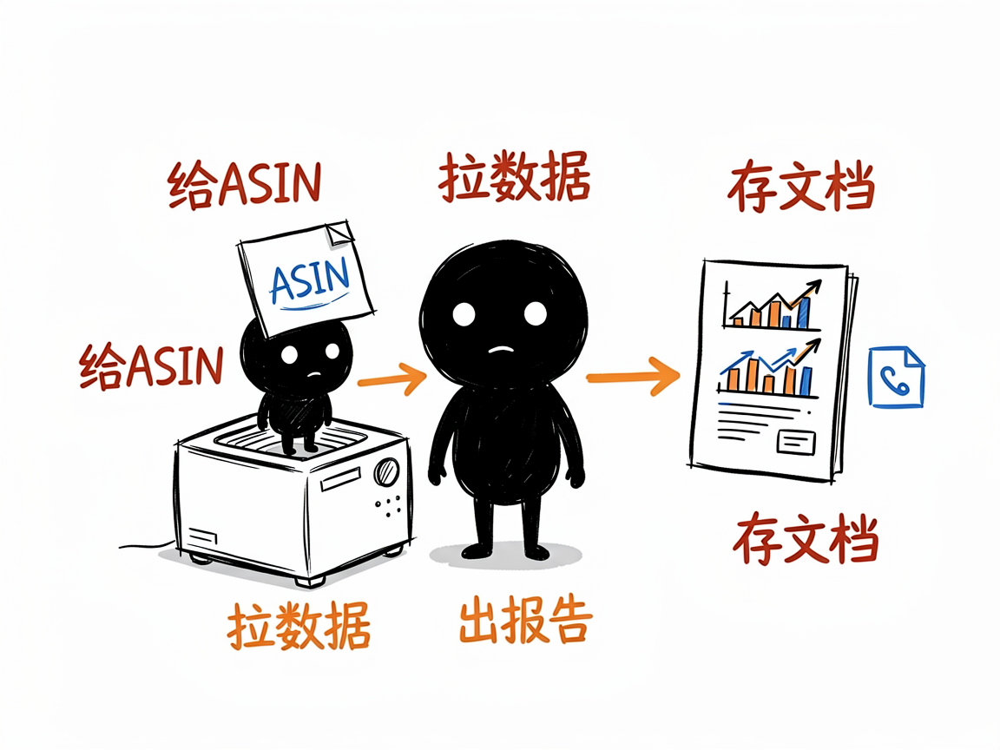

# 想在亚马逊上卖好货？这一整套 AI 选品运营助手能帮上忙 —— amazon-skill 介绍

做亚马逊跨境电商，最头疼的往往是几件事连在一起：选什么品有前途、怎么把商品页写好让人愿意下单、竞品最近在偷偷做什么、评论里买家到底在骂什么。这些活儿以前得天天盯数据、翻榜单、人工总结，费时又费脑。amazon-skill 不是单个工具，而是一整套亚马逊运营 AI 技能的集合，把选品、写 Listing、分析评论、盯竞品这些环节分别打包成好用的"助手"。

**amazon-skill 就是来解决这件事的。**

你给它一个需求（比如"帮我分析这个类目""帮我写一条 Listing""看看这个 ASIN 的评论痛点"），它还你一份带数据、带结论的分析或文案产出。

## 它到底能做什么

这一套里包含了 8 个各有专长的子技能：

- 亚马逊竞品穿透分析（amazon-analyse）：丢一个商品编号（ASIN）进去，它从价格、评分、关键词布局到评论情感，做出一份竞品情报报告。
- 爆款 Listing 打造（amazon-listing-builder）：按"先分析、再生成、最后校验"的流程，帮你写标题、五点、A+ 页面、问答，适配新的语义搜索和 AI 购物趋势。
- 品类选品分析（category-selection）：用五维评分模型对一个品类做市场调研，帮你判断这个类目值不值得进。
- 关键词调研（keyword-research）：采集上千个关键词，按品牌词、材质词、场景词等 8 类智能分类，产出词库和看板。
- 选品分析（product-research）：基于数据做多维度选品调研，从属性标注到竞品反馈、壁垒评估，给出决策建议。
- 评论深度分析（review-analysis）：自动识别产品痛点、退货原因，顺手生成改进建议和客服回复模板。
- 卖家精灵调研（sellersprite-amazon-research）：通过卖家精灵的数据接口，做选品、竞品、广告、流量、定价等全链路分析（覆盖 43 个数据工具）。
- Sif / 西柚洞察调研（sif-amazon-research、xiyou-insight）：借助第三方数据平台，做竞品拆解、流量诊断、广告策略分析。

## 怎么用

你不需要记任何命令。在 codex / workbuddy 等 agent 装好 amazon-skill 技能后，直接对 AI 说话就行：

**场景 1：想摸清一个竞品**
你：帮我分析一下美国站这个商品（报上它的 ASIN 编号），看看价格、评分、关键词和评论到底怎么样。
AI：它会自动拉数据，生成一份竞品情报报告，把对手的强项和软肋讲清楚，让你知道该跟还是该避。

**场景 2：想写一条能打的 Listing**
你：我要上一款瑜伽垫，帮我把标题、五点、A+ 页面和问答都写出来。
AI：它会先分析这个类目，再生成文案，最后做一遍校验，产出的内容适配新的语义搜索和 AI 购物趋势，你拿去就能用。

**场景 3：想看看买家在骂什么**
你：把这款产品最近的评论都看看，买家最不爽的点是什么？
AI：它会自动识别产品痛点和退货原因，给你一份改进建议，还顺手写好客服回复模板，省得你逐条想词。

## 谁适合用

- 亚马逊卖家、运营、产品开发、Listing 优化师。
- 做跨境电商代运营、代分析的团队。
- 想用数据而不是拍脑袋做选品决策的创业者。
- 需要快速产出竞品情报、广告策略的研究人员。

## 一点说明

这套技能不是一个给普通人双击打开的 App，而是给 AI 助手（如 codex / workbuddy）用的"技能包"合集，在 agent 里装好就能用。更重要的一点是：其中不少子技能依赖第三方数据服务（卖家精灵、Sorftime、Sif、西柚洞察等）的接口或登录态，没配上这些账号，对应的分析就跑不起来。具体每个子技能能做什么、怎么配数据，以各自目录下的 SKILL.md / README.md 为准。

## 闲鱼接单文案

> 以下服务展示在闲鱼 / 淘宝服务市场发布，用于承接本 skill 的定制开发订单。

**标题：亚马逊运营AI技能（skill）软件开发**

**描述：**

专注 AI Agent 技能（skill）定制开发，本篇介绍的技能包就是现成作品，可先看演示再下单。覆盖亚马逊运营全流程：品类选品、关键词调研、选品分析、Listing 打造、竞品穿透、评论挖掘、广告流量诊断。支持按你的类目和已有的数据账号（卖家精灵 / Sorftime / Sif / 西柚洞察）做个性化定制，交付后装进 codex / workbuddy 等 AI 助手即可使用，全部源码交付、支持二次开发。

**服务内容：**

- 1、需求沟通梳理：先聊清楚你的运营痛点（选品、写 Listing、盯竞品还是挖评论），确认数据来源与可行性，列明功能清单后再动手
- 2、skill交付内容和格式：品类选品、关键词调研、选品分析、Listing 打造、竞品穿透、评论挖掘、广告流量诊断等具体报告和数据采集成果（Markdown 报告 / 词库看板 / Listing 文案）
- 3、项目功能/系统开发：按你的类目和需求定制开发各功能模块，含第三方数据接口（卖家精灵 / Sorftime / Sif / 西柚洞察）对接与联调测试
- 4、skill源码交付：SKILL.md 技能说明 + 提示词 / 脚本 / 模板 / 报告样例组成的完整技能工程，兼容 codex / workbuddy 等 agent。全部源码 + 安装部署说明 + 使用演示，交付后可自行修改维护
