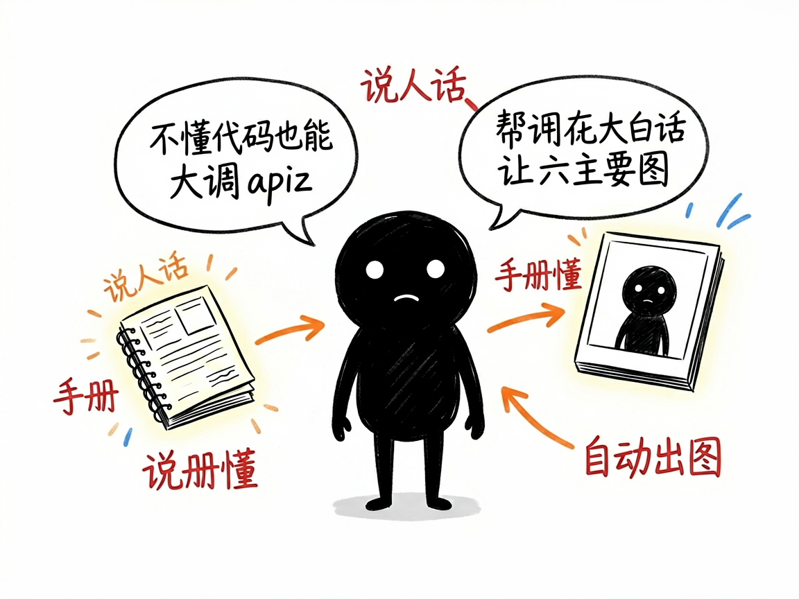
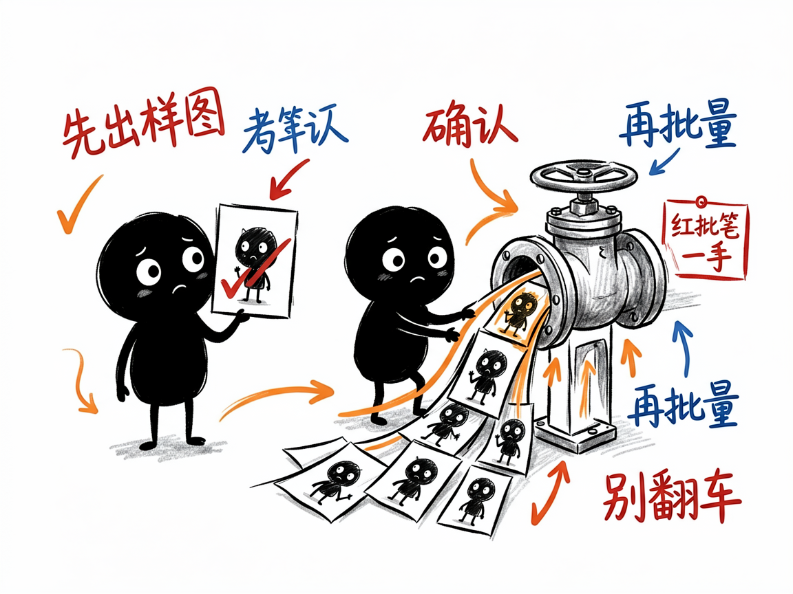

# 不懂代码也能让 AI 帮你做电商图、短视频和角色设计 —— apiz-use 介绍

你是淘宝、抖音或跨境电商的卖家，想批量做商品主图、宣传海报、竖版短视频，或者设计一套原创角色形象，可一看到命令行就头大，更别说去挑模型、调参数了。apiz-use 本身不生成内容，它是一份给 AI 助手看的"实战手册"：装好之后，你直接用大白话提需求，AI 就知道怎么调用 apiz（上面那个模型网关）把活儿干对，还帮你提前避开各种容易翻车的坑。

**apiz-use 就是来解决这件事的。**

你给它一句人话需求（比如"帮我做一套 6 张淘宝主图"），它还你一套排好版、调好参数的生成方案，并自动驱动 AI 把图或视频做出来。

---

## 它到底能做什么

- 电商作图：淘宝/天猫主图、产品九宫格宣传图、照片转手绘风海报，一条龙出图。
- 视频生成：产品宣传视频、分镜短剧、带原生对白的短视频，还能控制镜头和节奏。
- 角色设计：原创角色人设、保持同一张脸的一致性、做开心/生气等不同微表情。
- 图片本地化：把中文海报翻译成英文/日文/韩文，并把模特换成当地面孔，产品外观不变。
- 批量下载素材：把淘宝/天猫商品的主图、详情图、SKU 图一键下载打包。
- 避坑指南：内置一堆"铁律"，比如重要图先出 1 张样图确认再批量、本地图片要先上传、视频提示词必须加"不要水印不要字幕"等约束。

## 一个具体例子

装好 apiz 和这个手册后，你完全不用记命令，直接对 AI 说就行：

> "帮我做一套 6 张淘宝主图，产品是钨钢划线笔，参考图在桌面 product.jpg。
> 第一张突出'工业级超硬'，第二张展示合金刀头……
> 风格现代简约电商风，白底浅灰背景。先做第一张给我确认，没问题再做剩下的。"

AI 会自己查手册、调 apiz、生成图片。要做视频也可以：

> "用这张挡风被产品图做一条 15 秒抖音竖版宣传视频，0-3 秒产品亮相……
> 风格明亮干净，不要文字不要水印。"

## 谁适合用

- 淘宝、天猫、抖音、拼多多等平台的电商卖家和运营。
- 做短视频、短剧、带货内容的内容创作者。
- 需要把同一张图做多语言版本、换本地模特的跨境卖家。
- 想设计原创 IP 角色、做表情包的个人或团队。

## 一点说明

apiz-use 不是独立软件，它是配合 apiz（模型网关）使用的一份"技能手册"，要给 AI 编程助手（如 Claude Code）用，需要把文件夹放进助手的 skills 目录，并且你那边已经装好 apiz、登录了账号。它本质是帮 AI 把你的中文需求翻译成正确的操作步骤，所以你依然要自己准备好产品参考图、想清楚的文案。具体支持的模型和价格以 apiz 官方为准。
