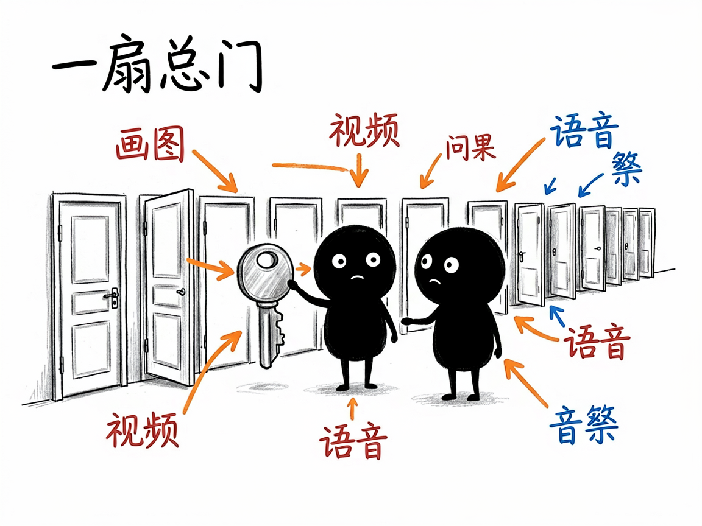
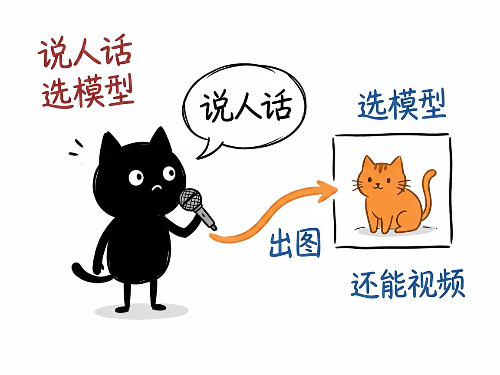

# 想用几百种 AI 模型画图、做视频、配音，又不想一个个去注册？—— apiz 介绍

你想让 AI 帮你画一张图、做一段视频、给视频配上自然的人声、甚至克隆一个声音？现在市面上的 AI 模型一大堆：OpenAI 的、Google 的、快手的、各种开源的，每个都要单独注册、单独配密钥、单独看文档，光是记住各家怎么用就够劝退了。apiz 做的事很简单：它把这些模型全部接到一个入口，你在装好它的 AI 助手里说话，就能调用几百种模型。

**apiz 就是来解决这件事的。**

你给它一句提示词（比如"一只橘猫坐在窗台"）加上想用的模型名，它还你一张图、一段视频、一段语音或一个任务结果。

---

## 它到底能做什么
- 文生图 / 图生图：用文字描述生成图片，或给一张图让它改成别的风格、换背景。
- 文生视频 / 图生视频：用文字或图片生成短视频，支持多款主流视频模型（如可灵、Seedance、Sora、Veo 等）。
- 语音合成：把文字变成语音，可选不同音色、语速。
- 声音克隆：给一段样本音频，克隆出相似的声音。
- 字幕打轴 / 语音识别：给音频或歌词，自动对齐出带时间戳的字幕；也能把录音转成文字。
- 音乐生成：描述风格，直接生成一段背景音乐。
- 视频解析与镜像：解析抖音等分享链接拿到无水印下载地址；把外部链接转存到它自己的存储。
- 查余额、每日签到：账号是积分制，可以查余额，每天还能免费签到领积分。

## 怎么用
你不需要记任何命令。在 codex / workbuddy 等 agent 装好 apiz 技能后，直接对 AI 说话就行：
**场景 1：一句话出张图**
你：用 image4.0 这个模型帮我画一张"一只可爱的橘猫坐在窗台"。
AI：它调用对应的模型生成图片，把成图直接发还给你。
**场景 2：图生视频**
你：拿这张产品图，用可灵帮我把场景动起来，生成一段短视频。
AI：它用你指定的视频模型，把静态图变成一段会动的视频返回给你。
**场景 3：文字变语音**
你：把"你好，欢迎使用 AI 语音合成"这段词，用自然点的女声念出来，给我一段语音。
AI：它调用语音合成，生成一段对应音色的音频交给你。

## 谁适合用
- 想省去分别注册各家 AI 平台、统一管理模型的人。
- 在搭建 AI 应用、需要稳定调用多种生成模型的团队。
- 做内容创作、想把"画图 / 视频 / 配音"一条龙自动化的人。

## 一点说明
apiz 是一套 AI 技能（也是一个模型网关），你装好后直接在 AI 助手对话框里说话就能调用几百种模型，不用自己去各家平台分别注册、配密钥。它是个"统一入口"，本身按积分收费，具体模型清单、价格和能力以官方文档为准。

## 闲鱼接单文案

> 以下服务展示在闲鱼 / 淘宝服务市场发布，用于承接本 skill 的定制开发订单。

**标题：AI模型聚合调用（画图/视频/配音）skill软件开发**

**描述：**

专注 AI Agent 技能（skill）定制开发，已做出统一接入数百种 AI 模型的网关技能，现成作品可先看演示再下单。一个入口调用文生图、图生视频、语音合成、声音克隆、字幕打轴、音乐生成等能力，覆盖可灵、Seedance、Sora、Veo 等主流模型。支持按你的业务场景做个性化定制，交付后装进 codex / workbuddy 等 AI 助手即可使用，全部源码交付、支持二次开发。

**服务内容：**

- 1、需求沟通梳理：先聊清楚你要用哪些模型能力（画图、视频、配音、声音克隆等）和使用场景，确认 apiz 账号与积分额度，列明功能清单后再动手
- 2、skill交付内容和格式：文生图 / 图生图、文生视频 / 图生视频、语音合成、声音克隆、字幕打轴、音乐生成、视频解析等模型调用成果（图片 / 视频 / 音频文件 + 任务结果）
- 3、项目功能/系统开发：按你的业务定制模型选型、参数模板、批量生成与结果回收等流程的开发与联调
- 4、skill源码交付：SKILL.md 技能说明 + 提示词 / 脚本 / 模板 / 生成样例组成的完整技能工程，兼容 codex / workbuddy 等 agent。全部源码 + 安装部署说明 + 使用演示，交付后可自行修改维护
