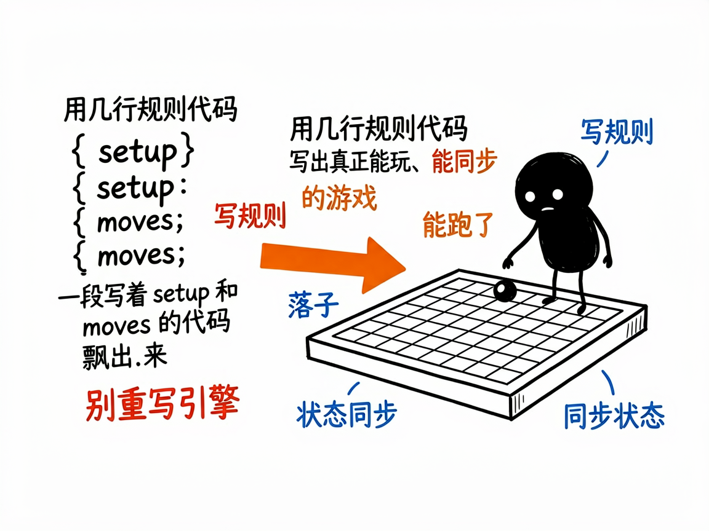
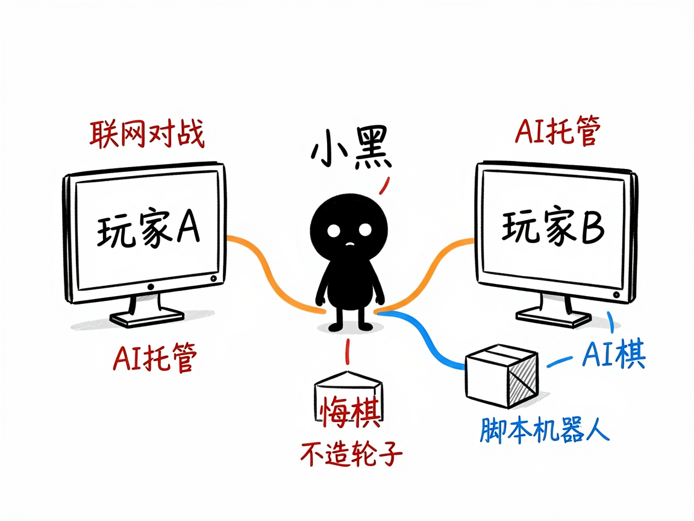

# 想自己做一款棋牌或桌游？它帮你把规则写成能跑的游戏 —— boardgame-io 介绍

你脑子里有个游戏点子：一个三子棋变种、一副卡牌对战、或者带骰子的桌游。你不会写复杂的游戏引擎，但想让它真的能两个人玩、能联网、还能让电脑当对手。

**boardgame-io 就是来解决这件事的。** 它是一个专门做"回合制游戏"（棋类、卡牌、骰子、策略游戏）的开发框架（可以理解为一套现成的工作方法）。你告诉它游戏的规则和点子，它还你一个真正能玩、能联机、能测试的游戏。你不用从零写服务器和状态同步那套麻烦事，框架都替你管好了。

---

## 它到底能做什么

- 帮你把游戏规则讲清楚：你描述"棋盘长啥样、玩家每步能干什么、怎么算赢"，它负责在两端同步状态、支持悔棋和电脑托管。
- 自动联网对战：想和朋友在线玩，它自带服务端方案，不用你自己造轮子。
- 做单人 vs AI：内置"脚本机器人"机制，可以让电脑按你写的套路出招当对手。
- 出游戏界面：配合网页界面技术（React，一种做网页界面的工具）就能画出棋盘、手牌，点一下就走一步。
- 带现成模板：备好"极简棋类"和"卡牌对战"两套可直接改的骨架，换皮就能用。
- 写测试：游戏逻辑能脱离界面单独跑，保证规则改了不出 bug。

## 怎么用

你不需要记任何命令。在 codex / workbuddy 等 agent 装好 boardgame-io 技能后，直接对 AI 说话就行：

**场景 1：你想做一个三子棋变种**
你：帮我做一个三子棋变种，9 格棋盘，两个玩家轮流落子，先连成一线就赢
AI：它把规则写成游戏逻辑，自动帮你管状态同步、悔棋和电脑托管，再配上网页棋盘界面，你点一下就走一步。

**场景 2：你想和朋友在线对战**
你：给我做一个能联机的卡牌对战游戏，最好电脑也能当对手
AI：它用自带的服务端方案帮你接上联网对战，并用脚本机器人让电脑按套路出招，不用你自己写服务器。

**场景 3：你想快速出原型**
你：我想先拿现成模板改一个骰子的桌游，换换皮就行
AI：它直接套用"卡牌对战"或"极简棋类"骨架给你改主题，比从零写引擎省事，还能单独跑测试保证规则不出 bug。

## 谁适合用

- 想做一款自己的桌游 / 棋牌小游戏来练手或上线的人（让 AI 按这框架帮你搭）。
- 想给现有网站加个能玩的小游戏的人。
- 做 AI 工具、需要按"棋盘 / 回合制"思路搭原型的构建者。

## 一点说明

它是装在 codex / workbuddy 这类 AI 助手里的技能，不是普通人双击就能打开的 App。最实用的玩法是让 AI 直接复制它给的现成模板改主题，而不是从头重写引擎——文档里反复强调"复制比重写靠谱"。如果你自己不会写代码，可以把它交给会编程的人，或装在带这个技能的 AI 助手上让它帮你搭。具体能力以项目文档为准。
