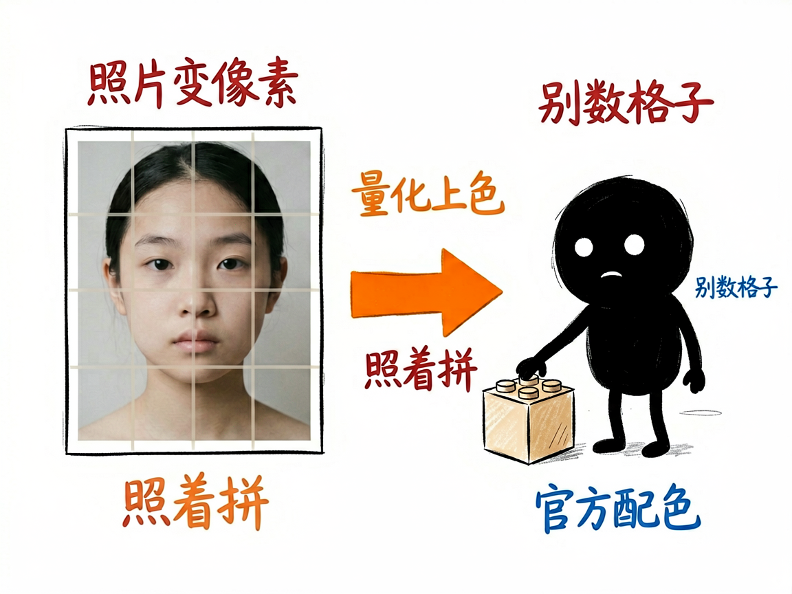
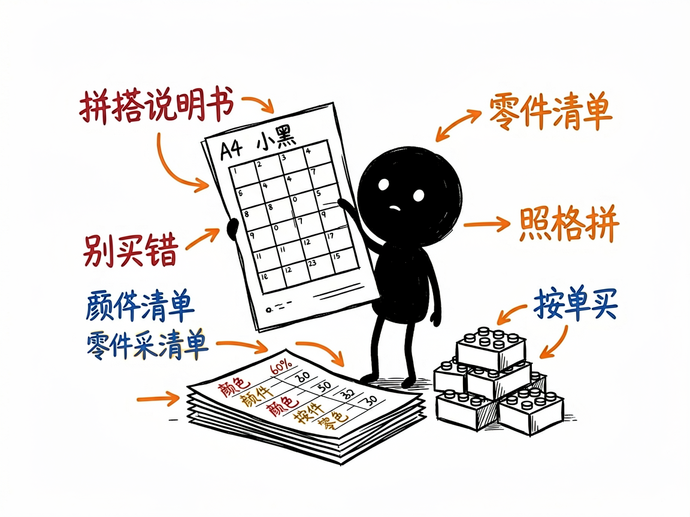

# 想把照片变成乐高像素画？交给它出拼搭说明书和零件清单 —— brickMosaic 介绍

你手里有一张喜欢的照片，也许是自家娃的笑脸、偶像的头像，或者一张风景图。你突发奇想：能不能用乐高积木把它拼出来？自己数格子、配颜色、列清单，想想就头大。

**brickMosaic 就是来解决这件事的。**

它帮你把任意一张图片，转换成用乐高官方"Art 套装"配色拼出来的马赛克像素画，并且不只给你一张图——还会顺手把拼搭说明书（A4 格式的 SVG 拼搭图）和每块零件要买多少的采购清单一起准备好。你给它一张照片，它还你一套能照着动手拼的完整物料。

---



## 它到底能做什么
- 把图片"量化"成乐高积木的配色：它会自动把照片像素对应到乐高官方套装里真实存在的颜色颗粒，保证拼出来是真的能买到的那种。
- 生成马赛克预览图：每颗都画成带凸点的小方块，拼之前就能看到成品大概长什么样。
- 出拼搭说明书：浏览器里打开就能看，可以 Ctrl+P 直接打印成 PDF；一页总览加很多张 16×16 的编号网格，照着一格一格拼就行。
- 列零件清单：每种颜色用多少颗、对应的零件编号（Element ID）、来自哪个套装，都给成 Markdown 和 CSV 两种格式，方便照着去采购。
- 支持"抠背景/只留主体"：比如只想要人物的头像，可以把背景裁掉，省颗粒也更干净。
- 觉得效果不好还能 AI 优化：主体太糊、颜色跑偏时，可以先用 AI 把源图风格化再生成。



## 一个具体例子

```bash
node .agents/skills/brick-mosaic/scripts/mosaic.js 照片.jpg \
  --size 48x48 --sets beatles:1 --seed 42 --out ./mosaic-output
```

几个关键参数：`--size 48x48` 是成品尺寸（48×48=2304 颗，正好一个标准套装的量；想更大可以翻倍）；`--sets beatles:1` 选配色套装，仓库里备了披头士、梦露、钢铁侠、蝙蝠侠等十几种；`--seed 42` 是个固定"种子"，效果不满意时改别的参数还能精确对比同一张底图。

## 谁适合用
- 想亲手拼一幅乐高像素画当礼物或装饰的爱好者。
- 拿到孩子/朋友照片想做成积木画的普通人。
- 手头有乐高 Art 套装、想拿自己的图来拼的人。

## 一点说明 / 小提示
它是个跑在命令行里的工具（只需装了 Node.js 就能用，不用装别的），更准确地说是一个"AI 技能"：你通常是在带这个技能的 AI 助手对话框里发一张图，它帮你跑命令、看预览、调参数。图片长宽比和正方形套装差太多时它会自动裁中心，避免人脸被压扁——如果你想保留完整画面记得告诉它去掉这个裁剪。具体能力以项目文档为准。
