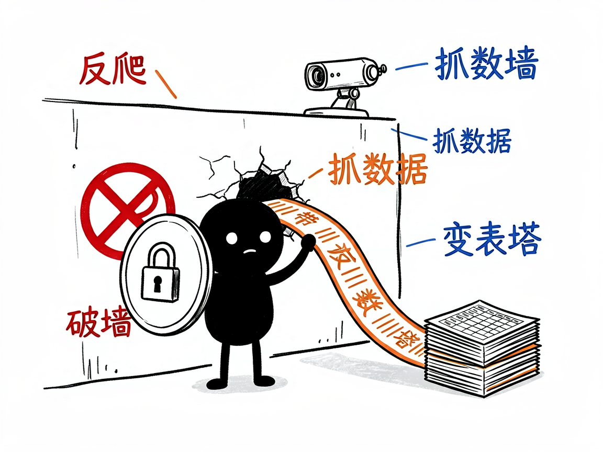

# 想让 AI 帮你抓全网数据做深度调研？—— brightdata-research 介绍

做市场调研最累的是什么？不是分析，是采集。想看看竞品在卖什么、价格怎么定、评论怎么说，结果打开网站就是验证码和反爬墙，一个个手动复制粘贴，一天下来数据没多少，眼睛先瞎了。brightdata-research 就是干这个的：基于 Bright Data MCP，让 AI 带着反爬保护去抓全网数据，你只要说清楚要什么。配图之后你就明白它的工作方式了。

## 它到底能做什么

- **搜索引擎结果抓取**：关键词搜索结果批量采集，做选品调研、舆情收集都行。
- **网页内容提取**：整页正文、表格、评论，直接变成结构化数据。
- **浏览器自动化**：JS 重渲染的动态页面也能抓（很多反爬就挡在这）。
- **反爬虫保护**：Bright Data 的代理网络兜底，被墙了自动换路。
- **调研报告直出**：抓完让 AI 聚合成市场报告（仓库里自带 3D 打印机市场调研样例）。

## 怎么用

**场景 1：竞品价格监控**
你：帮我盯一下 Amazon 上这几款 3D 打印机的价格和评分变化。
AI：逐个抓商品页，整理成表，标出最近涨跌。

**场景 2：市场调研报告**
你：调研一下便携储能电源这个品类，主要品牌、价位段、卖点。
AI：搜索+抓取+聚合，输出一份带数据表的市场报告。

## 谁适合用

- 做选品和市场调研的跨境卖家。
- 需要竞品情报、价格监控的运营。
- 想做数据采集但被反爬墙劝退过的人。

## 一点说明

本技能依赖 Bright Data MCP（需配置 API token）。抓取遵守目标网站条款，商用数据请确认授权。自带 3D 打印机调研报告和便携储能数据集两个完整样例可参考。

## 闲鱼接单文案

> 以下服务展示在闲鱼 / 淘宝服务市场发布，用于承接本 skill 的定制开发订单。

**标题：全网数据抓取调研（Bright Data 反爬）skill 软件开发**

**描述：**

专注 AI Agent 技能（skill）定制开发，已做出基于 Bright Data MCP 的全网数据调研技能，现成作品可先看演示再下单。搜索引擎结果批量抓取、网页正文表格评论结构化提取、动态页面浏览器自动化，自带反爬虫保护，市场调研、竞品分析、价格监控、舆情采集一站搞定，抓完自动聚合成带数据表的调研报告。支持按你的调研需求定制抓取字段与报告模板，交付后装进 codex / workbuddy 等 AI 助手即可使用，全部源码交付、支持二次开发。

**服务内容：**

- 1、需求沟通梳理：先聊清楚你的调研目标（竞品监控、品类调研还是舆情收集）、目标网站清单和数据字段，确认 Bright Data 账号可用，列明功能清单后再动手
- 2、skill交付内容和格式：结构化数据表（CSV/JSON）+ 聚合分析报告样例（含 3D 打印机市场调研完整示范）
- 3、项目功能/系统开发：按你的业务定制抓取字段、监控频率与报告模板，可扩展定时监控、变更预警等功能的开发与联调
- 4、skill源码交付：SKILL.md 技能说明 + 抓取工作流脚本 / 报告模板 / 样例数据组成的完整技能工程，兼容 codex / workbuddy 等 agent。全部源码 + 安装部署说明 + 使用演示，交付后可自行修改维护
