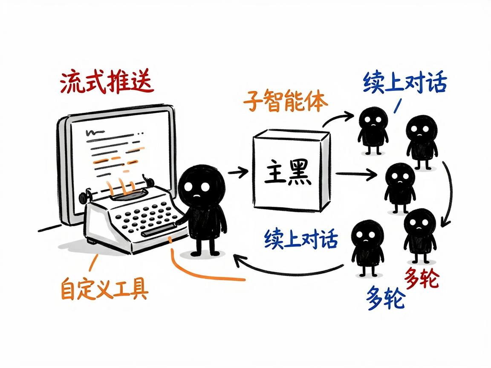

# 想做一个会自己干活的 AI 应用？这个技能把底层都铺好了 —— claude-agent-sdk 介绍

很多人想做一个 AI 应用：不只是聊天，而是能自己读写文件、上网搜资料、调用你的接口、把活干完。但一上手就发现，光是"让 AI 在程序里跑起来、还能中途插话、管理多轮对话、控制它能用哪些工具"这些事，就够折腾好几天。

**claude-agent-sdk 就是来解决这件事的。** 你告诉它想要什么样的 AI 应用，它还你一个能自主干活的 AI 智能体（可以理解为被你程序驱动、会自己调用工具的 AI 助手）。它把"怎么运行 Claude、怎么流式返回结果、怎么管会话、怎么加自定义工具"这些脏活累活全封装好了。

---

## 它到底能做什么

- 在你的程序里启动一个 AI 智能体，直接复用 Claude 的能力：读写文件、联网搜索、调用你的接口、把活自主干完。
- 支持流式返回：AI 思考到哪、调了什么工具、产出什么，都能实时推给你的前端，方便做打字机效果或进度展示。
- 管理多轮对话和会话：能续上之前的聊天（靠会话编号恢复上下文），也支持交互式多轮问答。
- 让你接上自定义工具（用 MCP 协议，可以理解为"给 AI 连上你自己的功能"，比如查天气、读数据库），AI 需要时就自己调用。
- 支持子智能体：让一个主 AI 把任务派给多个专门的 AI 分头做，比如一个负责搜索、一个负责写报告。
- 提供权限控制、钩子（在 AI 调工具前后做拦截校验）、结构化输出（强制返回固定格式）等，方便做生产级应用。

## 怎么用

你不需要记任何命令。在 codex / workbuddy 等 agent 装好 claude-agent-sdk 技能后，直接对 AI 说话就行：

**场景 1：你想做个能读代码库的助手**
你：帮我用 Claude 做一个 AI 应用，能读取我项目里 src 目录的代码、分析一下结构
AI：它借助这套能力启动一个会干活的 AI 智能体，复用 Claude 的能力读写文件，自主把分析跑完，并把进度实时推给你看。

**场景 2：你想要一个能查资料的客服**
你：给我做一个客服机器人，能连上我们的数据库查订单、还能调天气接口
AI：它用 MCP 协议帮你接上自定义工具，AI 需要查订单或天气时自己调用，并支持多轮对话和会话续接。

**场景 3：你想要多 AI 协作**
你：我想让一个主 AI 分派任务，一个去搜索、一个去写报告
AI：它用子智能体机制帮你搭好协作结构，主 AI 派活、专门的 AI 分头完成，再汇总给你。

## 谁适合用

- 想用 Claude 的能力搭建自己的 AI 产品、内部工具或自动化流程的人（让 AI 按这套能力帮你搭）。
- 做聊天机器人、客服系统、研究助手等需要"AI 真去干活"的团队。
- 需要多智能体协作、自定义工具集成、流式交互体验的应用构建者。

## 一点说明

它是装在 codex / workbuddy 这类 AI 助手里的技能，不是普通人双击打开的 App——你得先有能加载技能、连得上模型的 AI 环境，它才帮得上忙。它的定位是"底层能力包"：文档很全（含官方文档全文和二十多条常见坑），但真正把它变成某个产品，还得你把业务逻辑说清楚、让 AI 帮你写。具体 API 与能力以项目引用文档为准。
