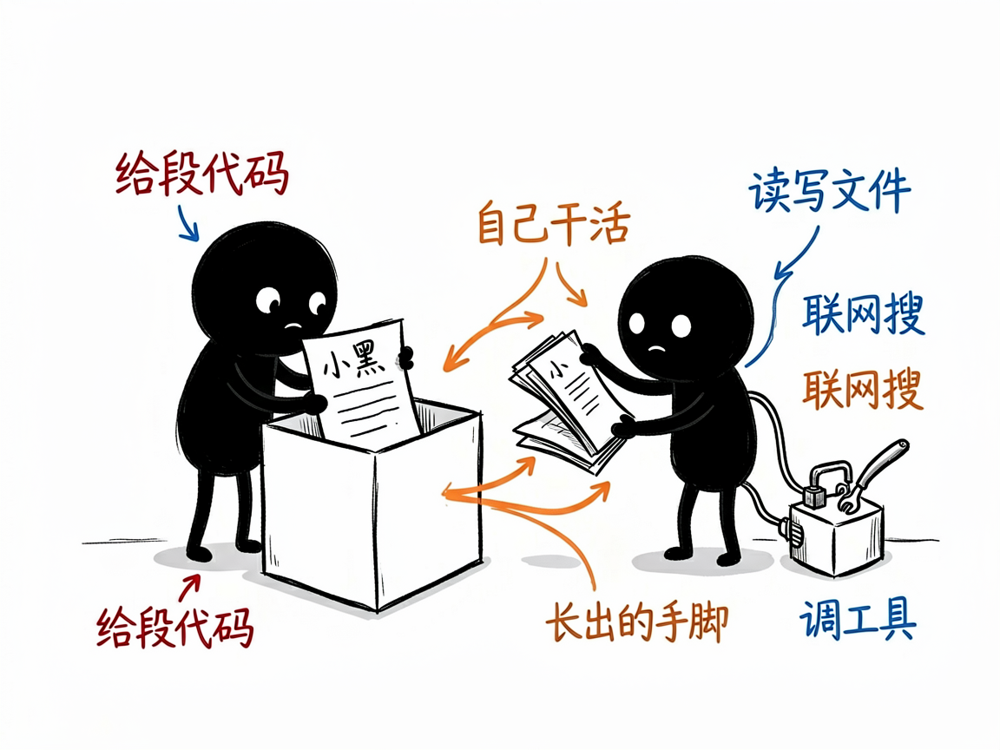

# 想自己做个会"动手干活"的 AI 应用？这个工具包把底层都铺好了 —— claude-agent-sdk 介绍

很多人想做一个 AI 应用：不只是聊天，而是能自己读写文件、上网搜资料、调用你的接口、把活干完。但一上手就发现，光是"让 AI 在程序里跑起来、还能中途插话、管理多轮对话、控制它能用哪些工具"这些事，就够折腾好几天。

**claude-agent-sdk 就是来解决这件事的。**

你给它一段代码（一个提示词 + 配置），它还你一个能自主干活的 AI 智能体（Agent，可以理解为被你程序驱动、会自己调用工具的 AI 助手）。它把"怎么运行 Claude、怎么流式返回结果、怎么管会话、怎么加自定义工具"这些脏活累活全封装好了。



---

## 它到底能做什么

- 在你的程序里启动一个 AI 智能体，直接复用 Claude 的能力：读写文件、联网搜索、执行命令、调用自定义工具，全程自主决策。
- 支持流式返回：AI 思考到哪、调了什么工具、产出什么结果，都能实时推给你的前端，方便做打字机效果或进度展示。
- 管理多轮对话和会话：可以续上之前的聊天（靠 session_id 恢复上下文），也支持交互式多轮问答。
- 让你注册自定义工具（用 MCP 协议，可以理解为"给 AI 接上你自己的功能"，比如查天气、读数据库），AI 需要时就自己调用。
- 支持子智能体（subagent，让一个主 AI 把任务派给多个专门的 AI 分头做，比如一个负责搜索、一个负责写报告）。
- 提供权限控制、钩子（hooks，在 AI 调工具前后做拦截校验）、结构化输出（强制返回固定格式的 JSON）等，方便做生产级应用。

## 一个具体例子

TypeScript 里最简单的用法：

```ts
import { query } from '@anthropic-ai/claude-agent-sdk';

for await (const message of query({
  prompt: 'Analyze the code in src/',
  options: {
    maxTurns: 30,
    model: 'sonnet',
    cwd: process.cwd(),
    allowedTools: ['Read', 'Glob', 'Grep', 'Bash'],
  }
})) {
  // 处理流式返回的消息（文字、工具调用、结果）
}
```

装包很简单：`npm install @anthropic-ai/claude-agent-sdk`（Python 版是 `pip install claude-agent-sdk`），需要配置好 API Key。

## 谁适合用

- 想用 Claude 的能力搭建自己的 AI 产品、内部工具或自动化流程的开发者。
- 做聊天机器人、客服系统、研究助手等需要"AI 真去干活"的团队。
- 需要多智能体协作、自定义工具集成、流式交互体验的应用工程师。

## 一点说明 / 小提示

这是给开发者用的 SDK（软件开发工具包），不是给普通人双击打开的 App——你得会写 TypeScript 或 Python、有自己的运行环境，它才帮得上忙。它的定位是"底层框架"：文档很全（含官方文档全文和二十多条常见坑），但真正把它变成某�