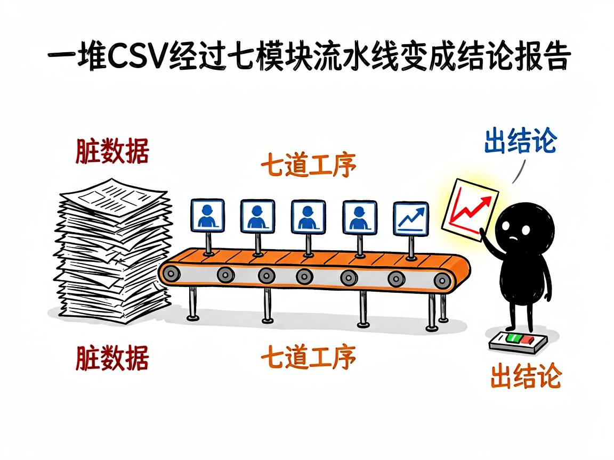

# 拿到一堆订单数据不知道从哪下手？—— claude-data-analysis 介绍

老板丢来一坨 CSV：三个月订单、用户信息、评论打分，让你"分析一下"。Excel 拉半天透视表，写了一堆 VLOOKUP，最后憋出三张图，老板问"所以结论呢"？claude-data-analysis 就是解决这个的：它是互联网数据分析技能集，7 大专业模块加一套通用六阶段流程，把数据从"质量检查"一路带到"结论报告"。

## 它到底能做什么

- **7 大专业模块**：AB 测试、渠道归因、内容情感分析、转化漏斗、增长模型、LTV 预测、探索性可视化。
- **通用 6 阶段流程**：数据质量 → 探索性分析 → 假设生成 → 可视化 → 代码生成 → 综合报告，任何数据集都能套。
- **入口技能统筹**：一句话说明你要什么，它自动路由到对应分析模块。
- **Pandas 优化**：大数据集不卡死，聚合规则正确，不犯"平均数平均"的低级错。

## 怎么用

**场景 1：电商全量分析**
你：对这份 olist 电商数据做个全面分析。
AI：走六阶段流程——先查数据质量，再探索销售趋势，假设验证后输出带图表的分析报告。

**场景 2：单点深挖**
你：帮我分析用户评论的情感倾向。
AI：直接调内容分析模块，分词、打分、聚合出正负面主题。

## 谁适合用

- 电商/互联网运营，手里有数据但不会写代码的人。
- 数据分析师想加速日常取数和报告产出。
- 产品经理要做留存、漏斗、AB 结论的快速验证。

## 一点说明

本技能是入口型集合（互联网分析 7 模块 + 通用 6 阶段），深度分析能力依赖各子技能配合。数据集放入 data_storage 目录即可开始，自带 olist 电商样例数据可试跑。

## 闲鱼接单文案

> 以下服务展示在闲鱼 / 淘宝服务市场发布，用于承接本 skill 的定制开发订单。

**标题：电商订单数据分析（漏斗/留存/LTV）skill 软件开发**

**描述：**

专注 AI Agent 技能（skill）定制开发，已做出互联网数据分析技能集，现成作品可先看演示再下单。7 大专业模块：AB 测试、渠道归因、内容情感、转化漏斗、增长模型、LTV 预测、探索性可视化，外加通用六阶段分析流程，从数据质量检查一路到结论报告，订单、评论、用户行为数据丢进来就能出带图表的分析结论。支持按你的业务指标定制分析模型与报告模板，交付后装进 codex / workbuddy 等 AI 助手即可使用，全部源码交付、支持二次开发。

**服务内容：**

- 1、需求沟通梳理：先聊清楚你的数据类型（订单流水、用户行为还是评论内容）、关心指标（GMV、留存、转化、复购）和报告形式，列明功能清单后再动手
- 2、skill交付内容和格式：完整分析报告样例（数据质量体检 + 趋势图表 + 结论建议）+ 可复跑的分析工程
- 3、项目功能/系统开发：按你的业务定制漏斗节点、留存口径、LTV 模型与报告模板，可扩展定期自动分析等功能的开发与联调
- 4、skill源码交付：SKILL.md 技能说明 + 分析工作流脚本 / 可视化模板 / 样例数据组成的完整技能工程，兼容 codex / workbuddy 等 agent。全部源码 + 安装部署说明 + 使用演示，交付后可自行修改维护
