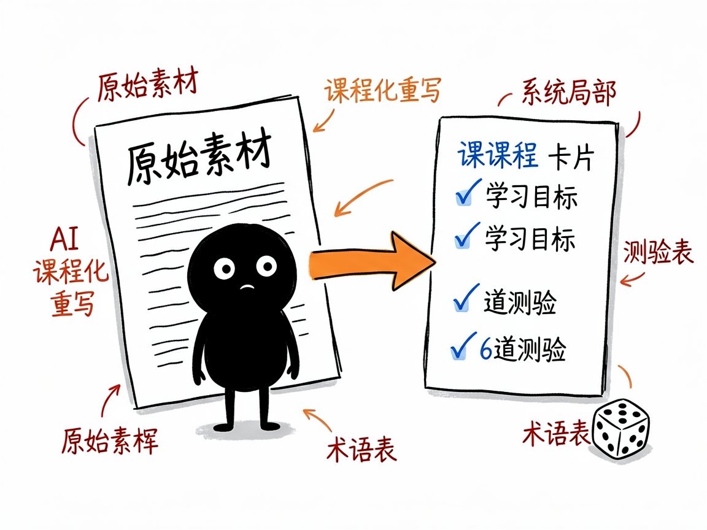

# 攒了一堆课程笔记却没地方展示？把它一键变成能看的课程网站 —— course-site-skill 介绍

你是不是手里有一堆 Markdown 格式的教程、笔记、课程素材，散在一个文件夹里，想分享给别人却只能发文件？别人打开是一堆 .md，根本不像个"网站"，没有目录、没有进度、没有测验，更别提手机上看了。

**course-site-skill 就是来解决这件事的。** 你给它一个装 .md 文件的文件夹，它还你一个完整、能直接用的静态课程网站：有阶段和课程目录、每节课有学习目标和小结、还带测验题和进度追踪，整体是那种清爽的"蓝图风"设计。最关键的是，它不只是搬文件——AI 会把你那些杂乱的原始笔记，逐节"课程化"成规范的中文专业课。

## 它到底能做什么

- 自动理清你的笔记结构：哪些是"阶段"、哪些是"课"，帮你把散文件排成清晰的目录（专业说法叫"结构分析"和"自动归类"）。
- **核心能力是"课程化"**：AI 把抓来的博客式、随笔式原始内容，重写成规范课程格式——标题、学习目标、分章节正文、小结，而不是原样堆上去。
- 给每节课自动生成 6 道真实测验题（1 道预习 + 3 道理解 + 2 道总结），不依赖外部付费接口。
- 提炼全站术语表和"先修关系图"，让读者知道知识点之间的前后依赖。
- 支持换全站视觉风格：你跟 AI 说想要什么配色、标题、logo，全站一次换好。
- 一键构建静态网站、本地预览，并发布到 EdgeOne / Pages / Vercel / GitHub Pages 等任意静态空间。

## 怎么用

你不需要记任何命令。在 codex / workbuddy 等 agent 装好 course-site-skill 技能后，直接对 AI 说话就行：

**场景 1：把一沓笔记变成正经课程站**
你：我电脑里有个文件夹装着我半年来写的机器学习笔记，都是 Markdown，帮我做成一个能看的课程网站。
AI：它会扫描整个文件夹、理清阶段和课的层级，把每篇随笔重写成带学习目标和小结的规范课程，附上测验题，最后给你一个能直接打开的网站和预览地址。

**场景 2：想换个品牌风格**
你：这个课程站整体不错，但配色和 logo 想换成我们公司的，标题也改一下。
AI：它按你说的品牌要求，一次把全站的配色、标题、logo 都换掉，不用你逐个文件改。

**场景 3：发布上线**
你：网站做好了，帮我发到网上让大家能访问。
AI：它构建出静态文件，并帮你发布到 EdgeOne / Pages 等静态空间，给你一个可分享的链接。

## 谁适合用

- 做课、写教程、整理学习资料的人，想有个正经网站展示内容。
- 团队/社区想把内部知识库变成可浏览的课程门户。
- 知识博主，把公众号/博客长文整理成体系化课程。
- 开发者，直接复用它的模板和流程搭课程站。

## 一点说明

它做的是"静态网站"——没有登录、没有评论、没有后台，进度只存在浏览器本地。它**不做多语言切换**，课程统一生成中文（这点要特别注意）。另外，课程质量取决于你给的原始素材，AI 会重写但不凭空编造知识点；它是装在 AI agent 里的一个技能（不是双击即用的傻瓜软件），装好后你直接在对话框里用就行。具体能力以项目说明文档为准。

## 闲鱼接单文案

> 以下服务展示在闲鱼 / 淘宝服务市场发布，用于承接本 skill 的定制开发订单。

**标题：课程网站搭建（笔记课程化）skill软件开发**

**描述：**

专注 AI Agent 技能（skill）定制开发，已做出笔记转课程网站技能，现成作品可先看演示再下单。给它一个装 Markdown 笔记的文件夹，自动理清阶段和课程层级，把随笔式笔记逐节重写成带学习目标、小结的规范课程，每节课自动生成 6 道测验题，附术语表和先修关系图，一键构建静态网站并发布到 EdgeOne / Vercel / GitHub Pages，全站视觉可按你的品牌一次换好。全部源码交付、支持二次开发。

**服务内容：**

- 1、需求沟通梳理：先聊清楚笔记素材的规模和主题、课程定位和发布平台（EdgeOne / Vercel / GitHub Pages 等），列明功能清单后再动手
- 2、skill交付内容和格式：完整静态课程网站：阶段与课程目录、课程化重写的正文（学习目标 / 分章节 / 小结）、每课 6 道测验题、术语表与先修关系图、进度追踪 + 可访问的网站链接
- 3、项目功能/系统开发：按你的品牌定制全站配色、标题、logo 与章节结构，可扩展更多互动题型等功能的开发与联调
- 4、skill源码交付：SKILL.md 技能说明 + 提示词 / 脚本 / 模板 / 网站样例组成的完整技能工程，兼容 codex / workbuddy 等 agent。全部源码 + 安装部署说明 + 使用演示，交付后可自行修改维护
