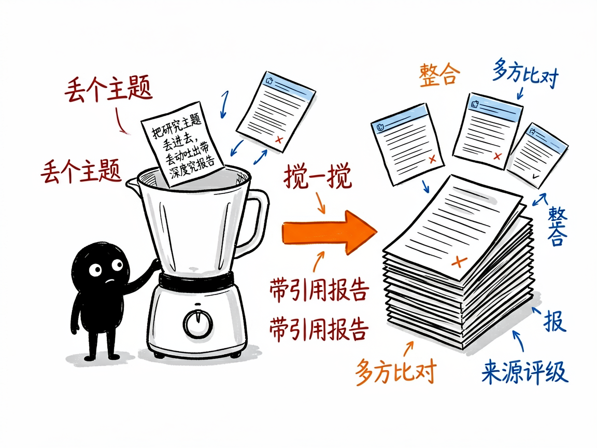
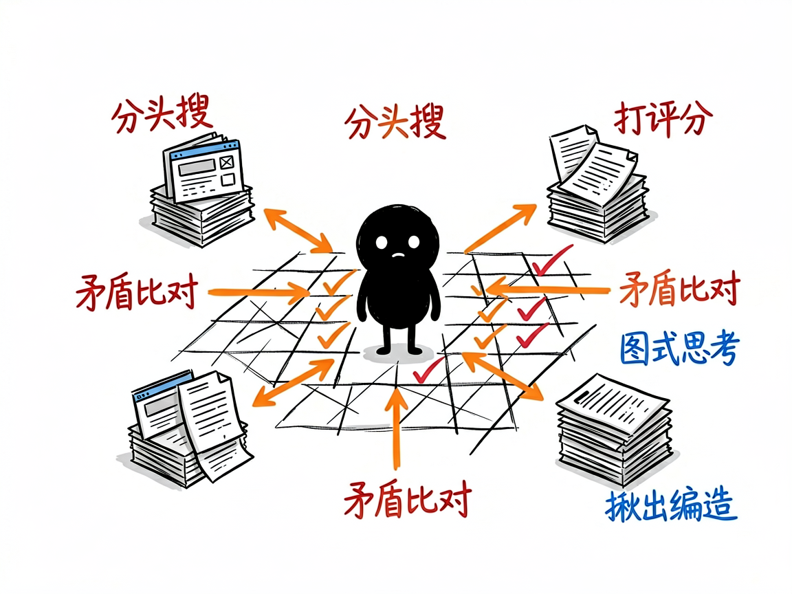

# 丢个主题进去，自动给你吐出一份带引用的完整研究报告 —— deep-research-agent 介绍

你有没有过这种经历：老板甩来一句"研究一下 AI 在医疗行业的现状"，你打开浏览器，搜了三个小时，收藏夹里塞满标签页，最后拼拼凑凑写出来的东西自己都心里没底——到底哪个数据是真的、哪个来源靠谱，全混在一起。

**deep-research-agent 就是来解决这件事的。** 你给它一个研究主题，它还你一份结构化的、带完整引用的深度研究报告。它不像普通聊天机器人那样凭印象答你几句，而是真去网上搜、多方比对、再把结论整理成可以交差的文档。

---

## 它到底能做什么

- 先问清楚你要什么：它会主动确认研究范围、想要什么格式、关注哪段时间、对来源有什么要求，而不是一上来就瞎搜。
- 同时派出多个"研究员"（可以理解为被派出去分头查资料的 AI 助手）并行搜索，比一个人慢慢翻快得多。
- 对复杂话题会用"图式思考"（一种让 AI 像下棋一样规划研究路径、给每条线索打分的策略）来安排先查什么、深挖什么。
- 把所有来源的发现整合成一篇报告，遇到不同来源说法矛盾时，会去分析谁更可信、把共识和分歧都摆出来。
- 每个数据都标出来源，并按权威度做 A 到 E 的评级（A 是年报、政府文件这类一手资料，E 是论坛传闻这类不可靠内容），还会检测有没有编造数据。
- 最后生成一个完整文件夹：执行摘要、全文报告、关键数据、参考文献清单、来源质量表、引用验证报告，拿来就能用。

## 怎么用

你不需要记任何命令。在 codex / workbuddy 等 agent 装好 deep-research-agent 技能后，直接对 AI 说话就行：

**场景 1：老板甩来一个宽泛的研究题**
你：帮我深度研究一下 2025 年 AI Agent 的产业趋势
AI：它先跟你确认研究范围、想要什么格式、关注哪段时间，然后派出多个研究员分头上网搜、交叉比对，最后给你一份带完整引用的深度报告，放进一个研究报告文件夹里。

**场景 2：你想精确一点、不想被追问**
你：研究一下量子计算的产业现状，输出中文报告，30 页左右，重点关注 IBM 和 Google 的技术路线
AI：它跳过提问环节直接开干，按你给的要求搜资料、整理成报告，每个数据都标了来源和权威度评级。

**场景 3：研究完了想复查出处**
你：帮我看看这份报告里的引用靠不靠谱
AI：它逐条核验来源，揪出可能编造的数据，并告诉你哪些来源更可信。

## 谁适合用

- 需要做行业调研、竞品分析、政策研究的职场人。
- 写论文或综述、需要多来源扎实引用的学生和研究员。
- 做商业分析、想快速拿到一份带出处报告的产品或战略团队。

## 一点说明

它是装在 codex / workbuddy 这类 AI 助手里的技能，不是单独打开的 App——你得先有一个能加载技能的 AI 环境，它才会自动工作。研究越具体，效果越好：与其说"研究 AI"，不如说"研究 2025 年 AI 在医疗影像诊断里的应用现状和市场前景"。复杂主题一般要跑 5 到 20 分钟，中途也可以打断、调整方向。具体能力以项目文档为准。

## 闲鱼接单文案

> 以下服务展示在闲鱼 / 淘宝服务市场发布，用于承接本 skill 的定制开发订单。

**标题：深度研究报告生成 skill软件开发**

**描述：**

专注 AI Agent 技能（skill）定制开发，已做出多研究员深度调研技能，现成作品可先看演示再下单。丢一个研究主题进来，先确认范围和格式，再派多个 AI 研究员并行搜索、交叉比对，来源按 A 到 E 权威度评级并做编造数据检测，最后产出一个完整报告文件夹：执行摘要、全文、关键数据、参考文献、来源质量表、引用验证报告，拿来就能交差。可按你的行业定制研究框架，全部源码交付、支持二次开发。

**服务内容：**

- 1、需求沟通梳理：先聊清楚研究主题、范围边界、输出格式、时间范围和来源要求，列明功能清单后再动手
- 2、skill交付内容和格式：研究报告文件夹：执行摘要、全文报告、关键数据、参考文献清单、来源质量表（A–E 评级）、引用验证报告
- 3、项目功能/系统开发：按你的行业定制研究框架、评级标准与报告模板，可扩展定期跟踪等功能的开发与联调
- 4、skill源码交付：SKILL.md 技能说明 + 提示词 / 脚本 / 模板 / 报告样例组成的完整技能工程，兼容 codex / workbuddy 等 agent。全部源码 + 安装部署说明 + 使用演示，交付后可自行修改维护
