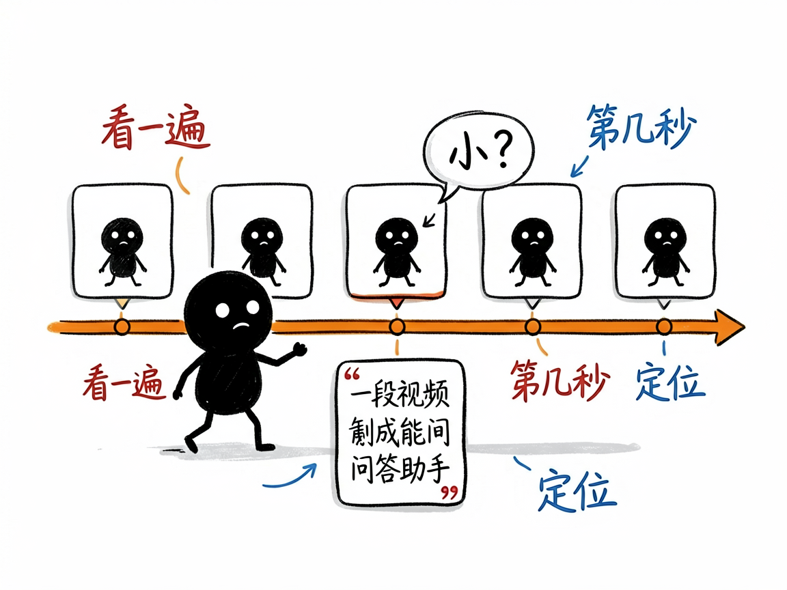
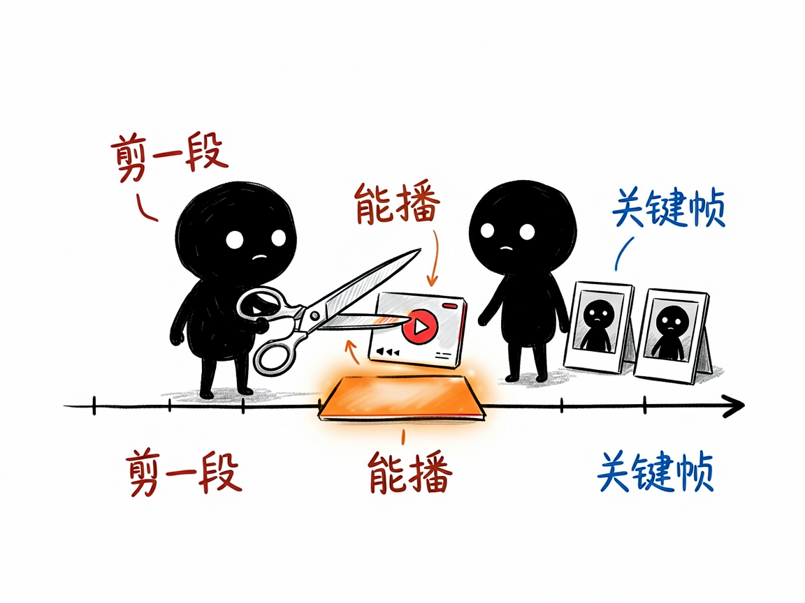

# 一段视频里的事，想问 AI"第几秒发生的"？它让 AI 把视频看完再回答你—— deepseek-v4-flash-vision-video-rag 介绍

你有没有过这种时刻：几个小时的游戏录像想找那次关键团战在第几分几秒；监控视频想确认某个人是什么时候出现的；一部教程视频想定位某个操作步骤；或者就想问"视频里总共出现了几次红色物品"。拖进度条一帧帧找，找到眼花；普通 AI 工具要么只看个封面，要么让你自己截好图再问。你真正想要的是：把视频丢给 AI，它自己看完，然后像看过全片的人那样回答你——还告诉你发生在第几秒。

**deepseek-v4-flash-vision-video-rag 就是来解决这件事的。**

它用 DeepSeek 的视觉大模型，把视频按时间轴抽成一帧帧画面去"看"：先宏观扫一遍建索引（一次性，之后缓存复用），你提问时再对相关片段深读。回答会带着 `[MM:SS]` 时间戳引用，并且自动把引用时刻剪成**可以播放的片段**和关键帧给你——它说 04:12 发生了什么，你点开 04:12 的片段就能亲眼验证。

---

## 它到底能做什么
- 一次性看完，反复提问：建索引阶段自动按视频时长决定抽帧密度（短视频每秒 1 帧，长视频自动降密度），30 秒的视频约 30 秒建完索引，之后每次提问只需 2–3 次模型调用。
- 回答带时间戳引用：每个答案后面跟着 `[MM:SS]`，直接定位到秒。
- 自动剪出可播放片段：引用的时刻会被剪成 mp4 片段，还有该时刻的关键帧图片；全部打包进一个双击即开的网页预览，不用联网。
- 剧情理解与事件时间线：能梳理"先后发生了什么"，也能数次数、找规律。
- OCR 字幕 / HUD 识别：画面里的字幕、游戏界面数字也看得见。
- 动作细节放大：问到"瞄准 / 击杀 / 瞬间"这类动作时，自动对运动最强的时刻做 12fps 逐帧放大分析。
- 想直接看某一秒也行：指定时刻，它给你那一帧的高清图，或指定区间，它剪一段给你。

## 怎么用
你需要在 AI 助手（如 codex / workbuddy 等 agent）里装好这个技能，配好 DeepSeek 的 API Key，电脑上有 ffmpeg。之后全程说人话：
**场景 1：找游戏高光**
你：这局录像，我五杀是在什么时候？
AI：它看完索引后回答"五杀发生在 `[04:12]`"，并附上 04:05–04:15 的可播放片段，你点开就能回看。
**场景 2：查监控**
你：这段监控里，穿红衣服的人第一次出现在第几秒？
AI：它给出带时间戳的答案和对应关键帧截图，人影清清楚楚。
**场景 3：看教程**
你：这个教程里，调色的那一步在第几分钟？
AI：直接给时间戳和片段，不用你从头拖进度条。

## 谁适合用
- 游戏玩家 / 主播：从长录像里快速定位高光、失误、素材点。
- 有监控回看需求的人：小店老板、家长、物业管理。
- 内容创作者：从素材里按"第几秒发生了什么"检索画面，剪片更快。
- 需要让 AI 回答"可验证"的人：每个结论都有片段回放作证，不接受模型瞎猜。

## 一点说明
它是一套 AI 技能（skill），不是双击打开的 App。你需要把它装进支持技能的 AI 助手里使用，并自备 DeepSeek API Key（按调用量付费）。它的理解完全基于画面，**没有音频分析能力**——视频里说了什么话它听不见，但画面里的字幕文字它看得见。时间戳定位有约 ±2 秒误差，精确时机以片段回放为准。

## 闲鱼接单文案

> 以下服务展示在闲鱼 / 淘宝服务市场发布，用于承接本 skill 的定制开发订单。

**标题：视频智能问答skill定制开发（时间戳定位/自动剪片段）**

**描述：**

专注 AI Agent 技能（skill）定制开发，现成作品可先看演示再下单。基于 DeepSeek 视觉大模型的视频理解问答技能：AI 按时间轴把视频抽帧看完建立索引，之后随口提问，答案带 `[MM:SS]` 时间戳引用，并自动剪出可播放片段、关键帧和自包含网页预览。支持剧情理解、事件时间线、字幕 / HUD 识别、动作细节 12fps 放大分析。适合游戏高光定位、监控回看、素材检索等场景，可按业务定制。

**服务内容：**

- 1、需求沟通梳理：先聊清楚你的视频类型（录像 / 监控 / 教程 / 素材）、提问场景和输出格式要求，列明功能清单后再动手
- 2、skill交付内容和格式：抽帧索引 + 三级检索问答（粗筛 / 精排 / 深读）+ 时间戳引用 + 可播放片段 + 关键帧 + 自包含 HTML 预览的完整技能工程
- 3、项目功能/系统开发：按你的业务定制批量视频管理、片段导出规格、时间线报告生成等流程的开发与联调
- 4、skill源码交付：SKILL.md 技能说明 + Python 脚本 + 参考文档 + 使用演示，兼容 codex / workbuddy 等 agent。全部源码 + 安装部署说明，交付后可自行修改维护
