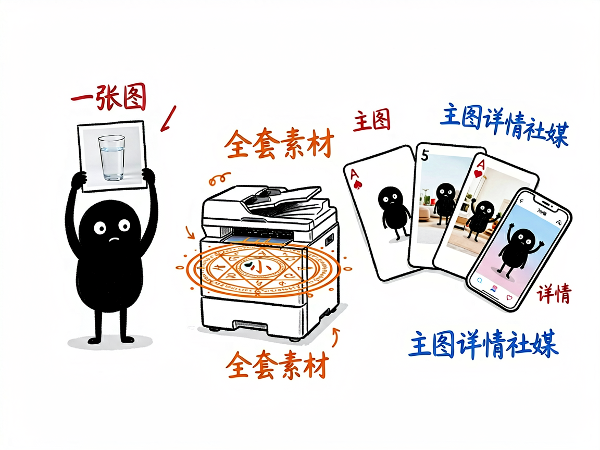

# 电商主图详情页，一套 Prompt 全搞定？—— ecom-details-image 介绍

做电商最烦的素材环节：主图要白底图、详情页要场景图、社媒要推广图、直播要背景图，一个产品几十张图，找设计师排期两周，改稿改到崩溃。ecom-details-image 把这件事变成一句话：输入产品图和需求描述，自动生成全套电商视觉素材——不配 API 时给你可执行的 Prompt，配了 API 直接出图。

## 它到底能做什么

- **25 种场景模板**：白底主图、生活方式、平铺摆拍、细节特写、海报 Banner、社媒 UGC、模特展示、前后对比、爆炸图、虚拟试穿、直播间场景……
- **Campaign Style Lock**：多图自动锁定色板、冷暖调、字体、光线、布局——整套图视觉一致，不会一张一个风格。
- **转化驱动诊断**：自动判断你的产品是视觉驱动、痛点驱动还是情感价值驱动，针对性排图片序列。
- **参考图生成**：传入产品实拍图，生成的产品外观贴近真实商品，不会画歪你的包装。
- **双模式**：只出 Prompt（拿去任何生图工具用）或直连你自己的 OpenAI 兼容 API 出图。

## 怎么用

**场景 1：新品上架全套图**
你：这是我的产品图，帮我生成 Amazon 主图 7 张 + 详情页 6 屏。
AI：诊断转化类型 → 排图片序列 → Style Lock 锁定视觉 → 输出全套 Prompt（配置了 API 则直接出图）。

**场景 2：社媒推广**
你：给我的保温杯出 5 张小红书风格的种草图。
AI：套 UGC 模板，生活场景+近景+手持角度，5 条 Prompt 一次给出。

## 谁适合用

- 跨境电商卖家（Amazon/Shopify/独立站）。
- 国内电商运营（淘宝/拼多多/抖音小店）。
- 需要批量出营销图但设计资源不足的团队。

## 一点说明

本技能提示词模板源自开源项目（buluslan/gpt-image2-ecommerce，致谢 linux.do 社区）。生图脚本纯 Python 标准库实现零依赖；未配置 API 时 Prompt 模式完全可用。

## 闲鱼接单文案

> 以下服务展示在闲鱼 / 淘宝服务市场发布，用于承接本 skill 的定制开发订单。

**标题：电商主图详情页批量生成（25 模板）skill 软件开发**

**描述：**

专注 AI Agent 技能（skill）定制开发，已做出电商视觉素材批量生成技能，现成作品可先看演示再下单。25 种场景模板覆盖白底主图、场景生活图、平铺摆拍、详情页长图、社媒 UGC、直播间背景、模特展示、爆炸图、虚拟试穿，Campaign Style Lock 保证整套图色板字体光线布局一致，自动诊断视觉/痛点/情感驱动并排图片序列，支持只出 Prompt 或直连你自己的 API 出图。支持按你的品类和品牌调性定制模板，交付后装进 codex / workbuddy 等 AI 助手即可使用，全部源码交付、支持二次开发。

**服务内容：**

- 1、需求沟通梳理：先聊清楚你的平台（Amazon/Shopify/淘宝/抖音）、品类和素材规格需求（主图几张、详情页几屏），确认可用的生图 API，列明功能清单后再动手
- 2、skill交付内容和格式：全套视觉简报 + 可执行生图 Prompt 序列（配置 API 则含成图样例）
- 3、项目功能/系统开发：按你的品牌调性定制专属模板与 Style Lock 规则，可扩展批量任务队列、多语言版本等功能的开发与联调
- 4、skill源码交付：SKILL.md 技能说明 + 25 模板库 / 生图脚本 / 诊断逻辑组成的完整技能工程，兼容 codex / workbuddy 等 agent。全部源码 + 安装部署说明 + 使用演示，交付后可自行修改维护
