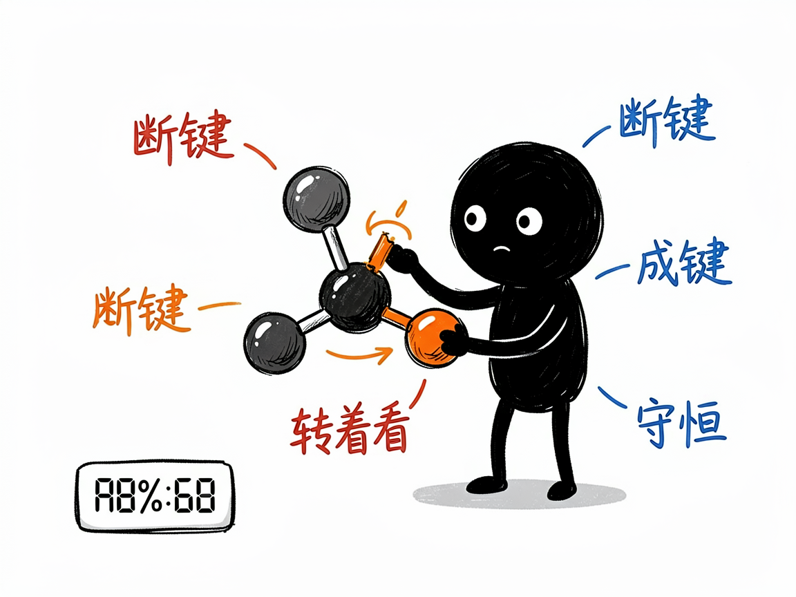
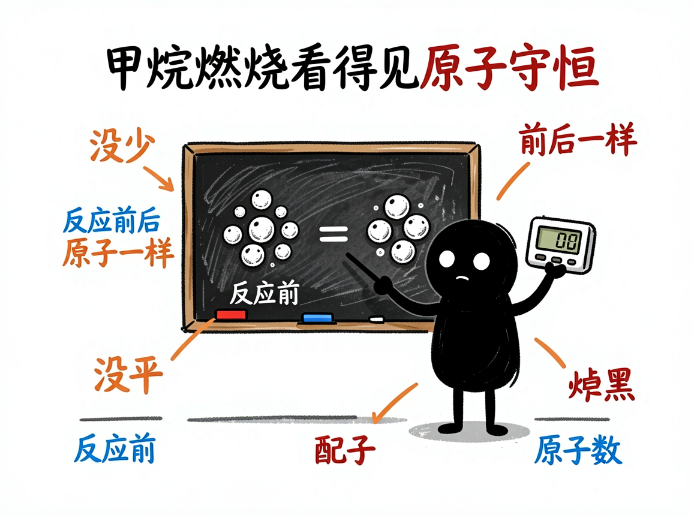

# 化学反应到底怎么断键成键，让它变成能转着看的 3D 动画 —— edu-chem-reaction 介绍

化学课上讲到"甲烷燃烧""酯化反应"这些，课本上大多是一行反应方程式，最多配几根化学键的示意图。可学生真正想看的是：原子到底是怎么断开旧键、连上新键、重新组合的？为什么反应前后原子总数一点没少？纸上的箭头，很难把这个过程演活。

**edu-chem-reaction 就是来解决这件事的。**

你给它一个化学反应（写文字、写方程式、或者拍张图都行），它还你一个能旋转缩放的 3D 网页：一边是分子在三维空间里断键、成键、重新拼装的动画，一边是配平好的方程式、分步讲解和"原子守恒计数器"，让你亲眼看见反应前后每个原子都去哪儿了。

---



## 它到底能做什么
- 把燃烧、化合、分解、置换、复分解等反应做成微观 3D 演示，用 Three.js（一种在网页里画三维图形的技术）让你拖着转、滚轮缩放。
- 用一根"反应进度"滑块，逐帧看化学键的断裂和生成、原子重新组合，关键步骤还会高亮加文字说明。
- 做氧化还原题很实用：能把电子怎么转移清清楚楚地画出来（比如钠和氯气反应）。
- 处理有机机理（如酯化反应）时，会专门展示催化剂和"过渡态"这种关键瞬间。
- 用 sympy（符号数学程序库）自动配平方程式，并校验"原子守恒"——反应前几种原子、几个，反应后还是那几个，不会算错。
- 还能叠加火焰、能量-反应进程曲线等效果，让放热、吸热一目了然。

## 一个具体例子

最省事的方式，就是跟会用这个项目的 AI 说：

```text
把"甲烷燃烧"做成一个能拖滑块看断键成键的 3D 交互网页，
带火焰和能量曲线。
```

AI 会先自动配平 `CH₄ + 2O₂ → CO₂ + 2H₂O`，再生成一个 `reaction-甲烷燃烧.html`。你打开网页，拖动"反应进度"滑块，就能看到甲烷和氧气的分子慢慢拆开、碳原子和氧原子重新拼成二氧化碳、氢原子拼成水，右侧的原子守恒计数器始终不掉数。



## 谁适合用
- 初高中化学老师做"微观世界"演示，把看不见的反应讲给学生看。
- 学生理解配平、守恒、氧化还原这些容易晕的概念。
- 科普作者做化学反应的科普动画。
- 需要分子级机理示意的教学内容制作者。

## 一点说明 / 小提示

这个项目是给"做 AI 工具 / 做课件的人"用的技能（skill），不是普通人直接打开的 App；你通常把反应交给会用它的 AI，它帮你产出网页。它需要电脑里装了 sympy 才能配平（AI 会先确认，缺了会问你要不要装）。另外它默认用自带的分子模型库就能跑；如果你电脑里恰好装了 RDKit（一个化学信息学程序库），它能生成更真实的分子构象，但项目绝不会自作主张帮你装这个库。具体能覆盖哪些反应、生成效果如何，以项目文档和实际产出为准。
