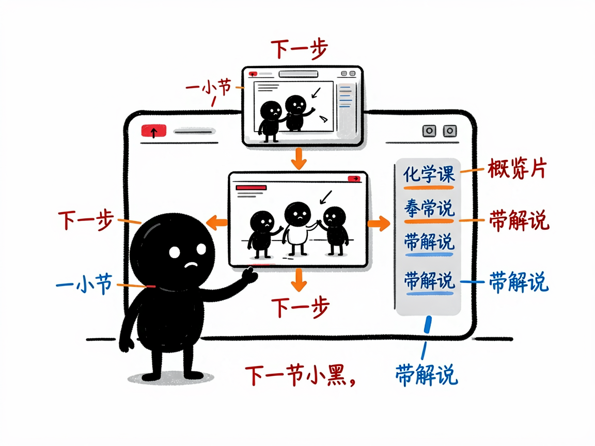
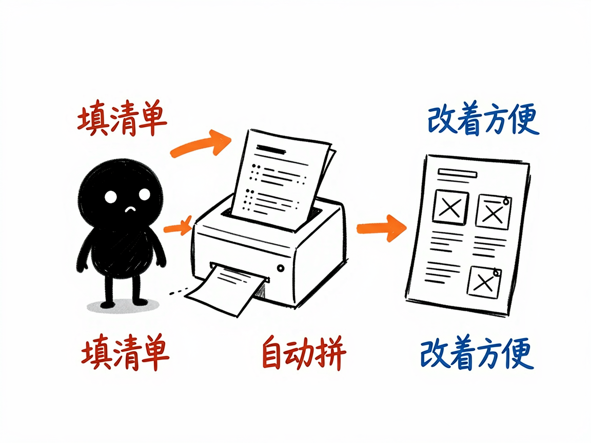

# 一节复杂的化学课，怎么变成能一步步播放的互动网页 —— edu-chem-tutorial 介绍

有些化学内容，不是"一道题"能讲清的，而是一串知识点：比如氧化还原怎么配平、金属活动性顺序怎么排、元素周期律怎么理解。老师在黑板上讲这些，往往要翻好几页、画好几张图。学生想自己复习时，又得把零散的笔记拼起来。

**edu-chem-tutorial 就是来解决这件事的。**

你给它一个化学主题（比如"氧化还原方程式配平"），它还你一个能一步一步播放的网页课程：每走一步，画面上有对应的动画示意，侧边栏同步给出讲解和要点，顶部还有概览卡片，像有个小老师带着你一点点往下学。

---



## 它到底能做什么
- 把一整节化学课做成 5 到 15 步的互动课程页，每一步配一段 Canvas（网页画图技术）动画，而不是干巴巴的文字。
- 顶部放概览信息卡片，侧边栏放富文本讲解和要点列表，方便学生边看边抓重点。
- 自带播放器控制：能播放、暂停、前后步进，也可以自动按顺序播放，像看带解说的幻灯片。
- 内置一套化学常用绘图原语，做反应图示、微观示意、对比卡都很顺手。
- 用"数据驱动"的方式生成：把课程内容填进一个结构化的清单，项目就能自动拼出网页，改起来也方便。
- 适合讲那些"解释型"的复杂主题，比如氧化还原配平、金属活动性、元素周期律、离子共存、速率与平衡等。

## 一个具体例子

做课件的人（或帮你干活的 AI）会先准备一份"课程清单"，大致长这样：

```python
spec = {
    "meta": {"title": "氧化还原方程式配平", "subtitle": "化合价升降法 · 电子守恒"},
    "cards": [{"num": 1, "title": "概念", "body": "化合价升降<br>电子守恒"}],
    "steps": [
        {"tag": "基础", "name": "化合价概念",
         "body": "<p>单质化合价为 0</p>",
         "points": {"title": "化合价规则", "items": ["<strong>单质</strong>：化合价为 0"]},
         "scene": "equation"}
    ]
}
```

填好主题、各步讲解和对应动画类型后，项目会把这份清单注入模板，生成一个 `tutorial-氧化还原配平.html`。打开后点"下一步"，画面和讲解就一页页动起来。



## 谁适合用
- 化学老师把一节课备成可反复播放、学生能自学的课件。
- 学生复习重难点章节，按自己的节奏一步步看。
- 科普作者把化学知识做成系列互动小课。
- 培训机构做线上化学微课。

## 一点说明 / 小提示

这个项目是给"做 AI 工具 / 做课件的人"用的技能（skill），不是普通人直接打开的 App；你一般把主题交给会用它的 AI，它帮你产出网页。它用纯网页技术（HTML + Canvas 画图 + JS）生成，不依赖外部程序库，打开即用。它擅长的是"分步骤讲解型"化学课，单一反应的微观 3D 演示请看同系列的 edu-chem-reaction。具体能做出哪些场景动画，以项目模板实际支持为准。
