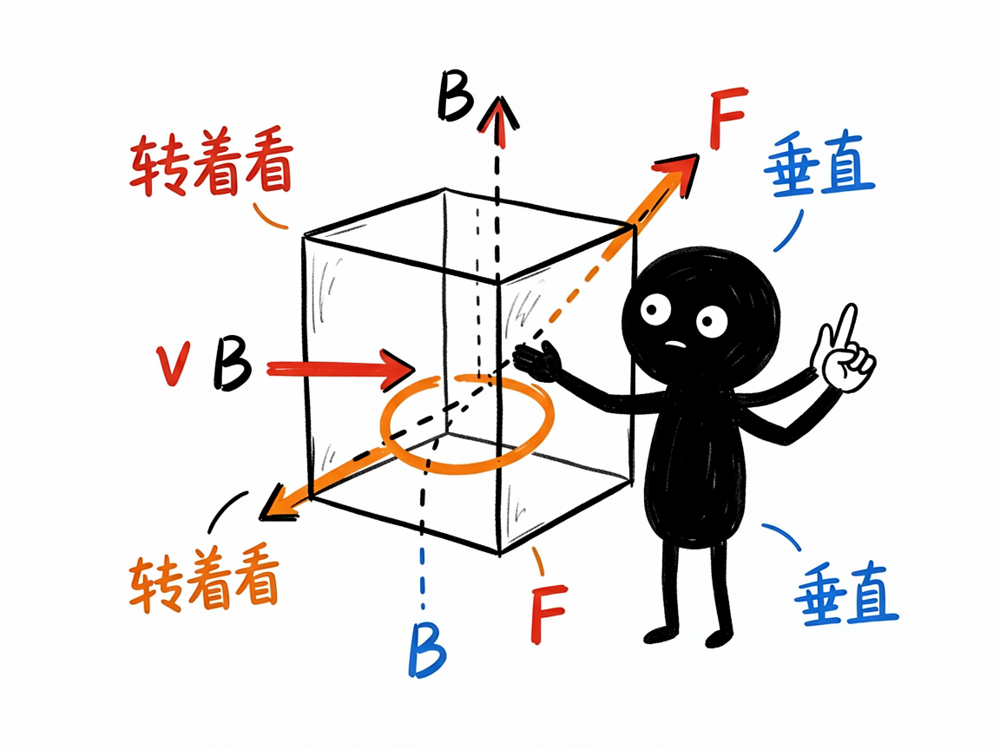
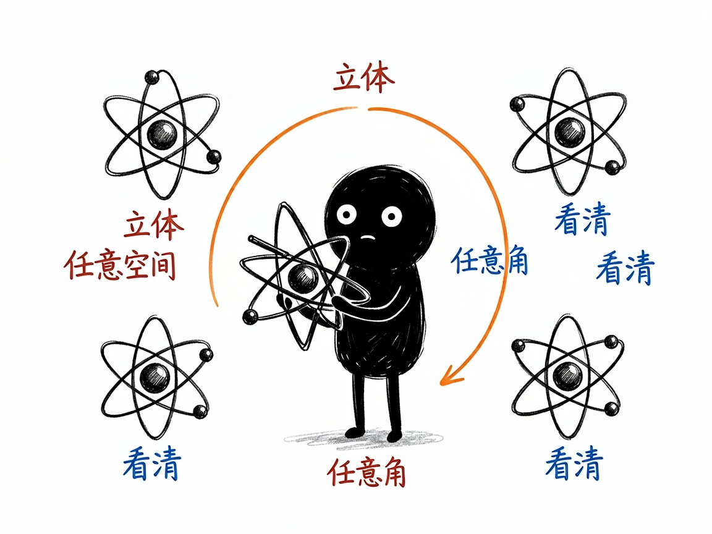

# 那些必须转着看的物理现象，怎么变成能旋转的 3D 网页 —— edu-physics-3d 介绍

有些物理内容，硬塞进一张平面图是讲不明白的。比如洛伦兹力 F=qv×B，力的方向同时垂直于速度和磁场，只能在三维里比划；再比如原子轨道、晶体结构、电磁波的正交传播，本来就是立体空间里的事。课本上画个侧面图，学生常常转到晕。

edu-physics-3d 就是来解决这件事的：你给它一个需要三维展示的物理场景，它帮你在 AI 里产出一个能随意旋转、缩放、平移的网页——左边题面加控制台，中间分步推导，右边是立体画板，粒子、箭头、轨道曲线都在空间里摆着，你拖一拖就能从任意角度看清关系。

## 它到底能做什么
- 把三维物理场景做成三栏交互网页：题面 + 滑块控制台 + 分步解析 + 可旋转的 3D 画板。
- 用一根滑块（角度、时间、速度等）驱动实时重算，3D 里的箭头、球体、轨迹曲线跟着变。
- 画板支持鼠标拖动旋转、滚轮缩放、平移，能从任意角度观察空间关系，比死板的平面图直观得多。
- 擅长这类"必须 3D"的内容：洛伦兹力与叉乘、右手定则、原子轨道形状、晶体/晶格结构、刚体旋转与角动量、三维磁场、电磁波正交传播。
- 同样会显示"守恒定律"指示，比如带电粒子在磁场里运动时速率恒定，网页会一直亮着提示。

## 怎么用

你不需要记任何命令。在 codex / workbuddy 等 agent 装好 edu-physics-3d 技能后，直接对 AI 说话就行：

**场景 1：搞懂洛伦兹力方向**
你：帮我把"洛伦兹力"做成一个能拖动角度滑块、从任意角度看 v、B、F 三个箭头方向的 3D 网页。
AI：AI 生成一个 3D 网页；从同一点伸出的三个箭头分别代表速度 v、磁场 B、洛伦兹力 F，你旋转视角、拖动角度滑块，就能亲手验证"F 永远垂直于 v 和 B 所在平面"这个右手定则。

**场景 2：看晶体结构**
你：把食盐的晶格结构做成能转着看的 3D 模型。
AI：AI 生成可旋转缩放的晶体模型，你从任意角度观察原子怎么排布，比平面图直观得多。

**场景 3：学右手定则**
你：我想用 3D 方式理解电磁学里的右手定则。
AI：AI 做一个带可拖滑块的 3D 演示，把手指方向和磁场、电流的关系在空间里摆清楚。

## 谁适合用
- 高中/大学物理老师讲电磁学、原子物理、固体物理等立体内容。
- 学生攻克"空间想象"这个老大难。
- 科普作者做三维物理互动演示。
- 需要立体示意的教学内容制作者。

## 一点说明
这是个给 AI 用的技能（skill），不是普通人直接打开的 App；你把场景交给装好它的 AI，它帮你产出网页。它和 edu-physics 是分工关系：二维够用的（抛体、振动、波、光学）用 edu-physics，涉及三维空间的非它莫属。打开网页时最好有网络，三维库是在线加载的。具体支持哪些 3D 对象类型，以技能实际能力为准。
