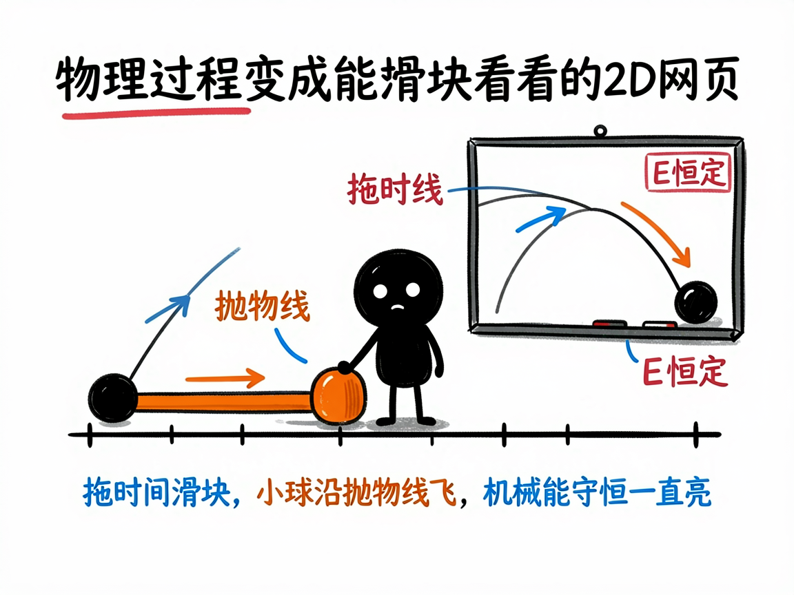
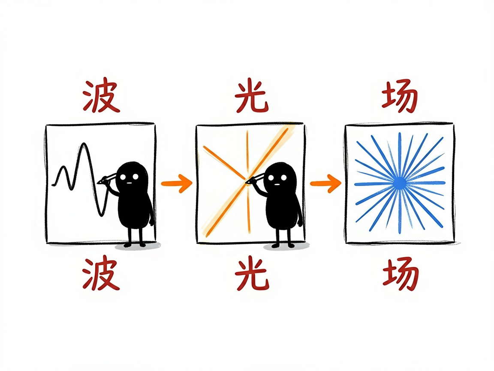

# 物理题里那些"动起来"的过程，怎么变成能拖滑块看的网页 —— edu-physics 介绍

学物理最怕"只看见公式，看不见过程"。比如抛体运动轨迹为什么是抛物线、简谐振动怎么来回摆、机械能为什么守恒，课本上往往是几个静止的图加一串算式。学生脑子里没画面，公式就成了死记硬背。

edu-physics 就是来解决这件事的：你给它一个适合用平面展示的物理场景（力学、热学、电磁、光学、波……），它帮你在 AI 里产出一个能拖滑块的网页——左边题面加控制台，中间分步推导，右边是一块会动的二维画板，粒子怎么飞、波形怎么传、光怎么折射，全都能实时拖着看。

## 它到底能做什么
- 把二维平面就够用的物理场景做成三栏交互网页：题面 + 可拖滑块的控制台 + 分步解析 + 动态画板。
- 用一根滑块（时间、角度、速度、温度等）驱动实时重算：位置、速度、能量、动量这些量跟着变，不用手算。
- 画板上能画轨迹、质点、矢量箭头、波形、光线、电场线，还能用画笔随手标注。
- 特别会显示"守恒定律"：比如机械能守恒，网页会一直亮着"E 恒定"的提示，让你直观确认量真的没变。
- 覆盖很广：抛体运动、碰撞、简谐振动、机械波、电场、磁场、折射反射、干涉衍射、气体状态方程、热力学循环等。

## 怎么用

你不需要记任何命令。在 codex / workbuddy 等 agent 装好 edu-physics 技能后，直接对 AI 说话就行：

**场景 1：学斜抛运动**
你：帮我把"斜抛运动"做成一个能拖时间滑块看轨迹和能量守恒的网页，初始速度 10 米每秒、仰角 45 度。
AI：AI 生成一个交互网页；你拖动"时间"滑块，画板上的小球沿抛物线飞，速度箭头实时转向，读数显示水平和竖直位移、动能和势能，而"机械能 E"一直保持常数——守恒一下就信了。

**场景 2：看波的干涉**
你：把两列水波的干涉做成能拖参数看的动画。
AI：AI 生成画板，你拖动频率、振幅等滑块，就能实时看到干涉条纹怎么随参数变化，波形传播清清楚楚。

**场景 3：复习机械能守恒**
你：我想直观看到机械能守恒，别只给公式。
AI：AI 做一个带"E 恒定"提示的网页，你拖任何参数，画板都实时证明总能量不变。

## 谁适合用
- 初高中物理老师做课堂演示，把抽象过程演给学生看。
- 学生自学时建立"物理图像"，而不是死背公式。
- 家长陪孩子理解运动、波、光这些难点。
- 科普作者做物理互动内容。

## 一点说明
这是个给 AI 用的技能（skill），不是普通人直接打开的 App；你把场景交给装好它的 AI，它帮你产出网页。它只负责"二维平面就够"的物理；如果内容涉及三维空间（比如洛伦兹力叉乘方向、原子轨道、晶体结构、刚体旋转），要看它的兄弟技能 edu-physics-3d。物理量是网页里实时算的，你给的数值要合理，AI 也会自己做正确性检查。具体支持哪些场景，以技能实际能力为准。

## 闲鱼接单文案

> 以下服务展示在闲鱼 / 淘宝服务市场发布，用于承接本 skill 的定制开发订单。

**标题：物理互动课件开发（2D 可拖动画板）skill软件开发**

**描述：**

专注 AI Agent 技能（skill）定制开发，已做出物理互动课件技能，现成作品可先看演示再下单。把抛体运动、简谐振动、机械波、折射干涉这些场景变成"题面 + 滑块控制台 + 分步推导 + 动态画板"的网页，拖滑块实时重算位置、速度、能量、动量，还常亮"机械能 E 恒定"这类守恒提示，覆盖力、热、电磁、光、波各板块。可按你的课程定制，全部源码交付、支持二次开发。

**服务内容：**

- 1、需求沟通梳理：先聊清楚要演示的物理场景、典型参数（初速度、角度、频率等）和教学重点，列明功能清单后再动手
- 2、skill交付内容和格式：可拖滑块的交互网页：题面控制台、分步推导、动态画板（轨迹 / 矢量箭头 / 波形 / 光线 / 电场线）、守恒定律指示
- 3、项目功能/系统开发：按你的课程定制场景库、参数范围与推导风格，可扩展整套章节课件批量生成等功能的开发与联调
- 4、skill源码交付：SKILL.md 技能说明 + 提示词 / 脚本 / 模板 / 网页样例组成的完整技能工程，兼容 codex / workbuddy 等 agent。全部源码 + 安装部署说明 + 使用演示，交付后可自行修改维护
