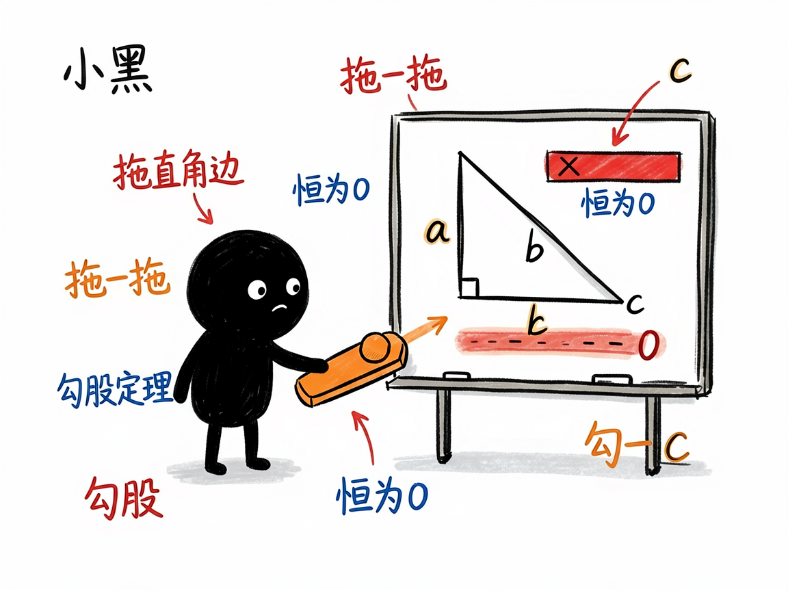
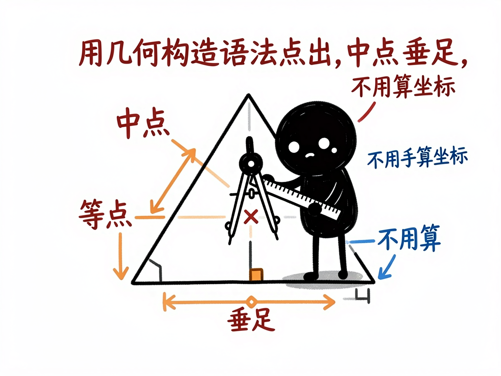

# 三角形、四边形这些平面几何，怎么变成能拖着玩的网页 —— edu-plane-geometry 介绍

平面几何题，最讲究"看图"。勾股定理为什么成立、两个三角形为什么相似、角度和面积怎么变，光看印刷在纸上的固定图形，很难体会到"动起来也成立"。老师想演示"边长变化时面积怎么变"，黑板上重画一遍很费劲。

**edu-plane-geometry 就是来解决这件事的。**

你给它一个平面几何问题或定理（三角形、四边形、梯形、勾股定理、全等相似……），它还你一个能拖滑块的网页：左边题面加控制台，中间分步推导，右边是一块干净的几何画板——没有坐标网格，就是课本里那种纯几何风格，顶点、线段、直角记号、等长标记、角弧一应俱全，拖一拖就看到几何关系活起来。

---



## 它到底能做什么
- 把纯平面几何题/定理做成三栏交互网页：题面 + 滑块控制台 + KaTeX 分步解析 + 浅色几何画板。
- 用滑块控制边长、角度、位置等参数，实时重算边长、面积、角度，不用手算。
- 画板还原课本风格：没有坐标轴网格，专门画三角形、四边形、多边形，并支持直角记号、等长标记（∥）、角弧等标准几何标注。
- 点可以用"几何构造语法"定义，比如中点、垂足、交点、旋转、反射，不用手动算每个坐标。
- 会显示"恒等式指示"或"范围条"：比如拖边长时，始终亮着"a²+b²−c² ≡ 0"，勾股定理一下就信了。
- 不需要额外装程序库，纯网页（Canvas 二维绘图）生成，打开即用。

## 一个具体例子

你跟会用这个项目的 AI 说：

```text
把"勾股定理"做成一个能拖直角边 a、看斜边 c 和
恒等式 a²+b²−c² 始终为 0 的交互网页。
```

AI 会生成一个 `solution-勾股定理.html`。右边画着一个直角三角形，你拖动滑块改变一条直角边长度，三角形跟着变形，读数显示 a、b、c 和面积，而"a²+b²−c²"那条一直显示 0——不管怎么拖都成立。



## 谁适合用
- 初中几何老师做定理演示，把"为什么成立"演给学生看。
- 学生理解全等、相似、面积、角度这些关系。
- 家长帮孩子建立几何直观。
- 写几何科普、做课件的人。

## 一点说明 / 小提示

这个项目是给"做 AI 工具 / 做课件的人"用的技能（skill），不是普通人直接打开的 App；你把题目交给会用它的 AI，它帮你产出网页。它专门处理"纯平面几何"（没有圆锥曲线、没有解析坐标轴），带坐标轴网格的解析几何请看 edu-analytic-geometry。它不依赖 sympy，几何量和恒等式由前端实时算，AI 会做正确性检查。具体支持哪些构造与标注，以项目模板实际能力为准。
