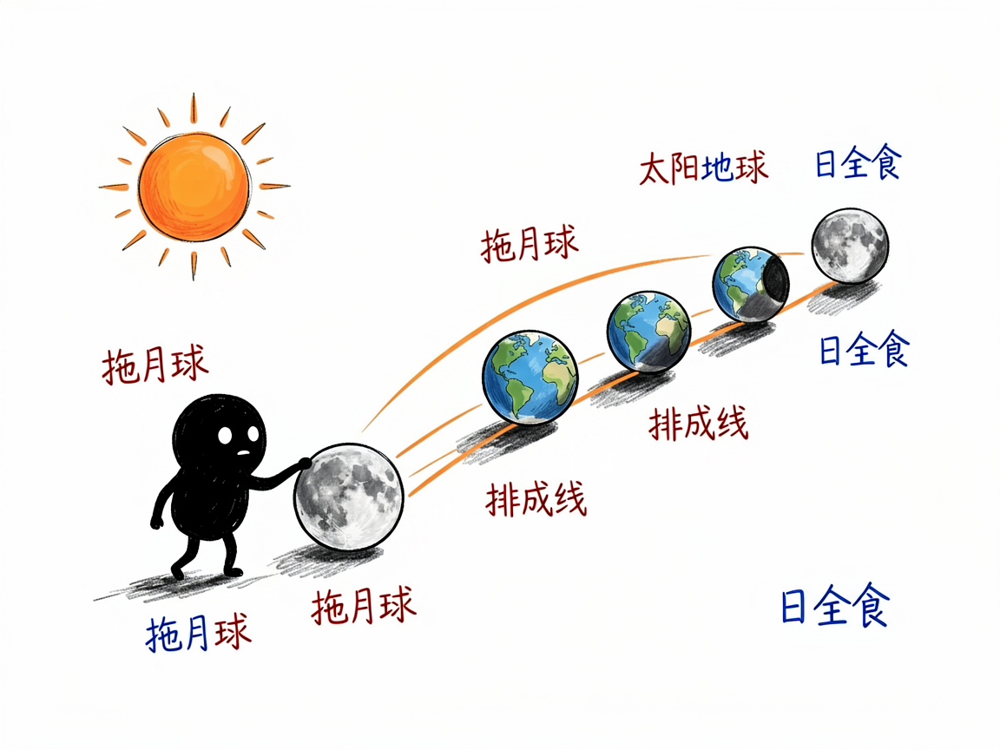
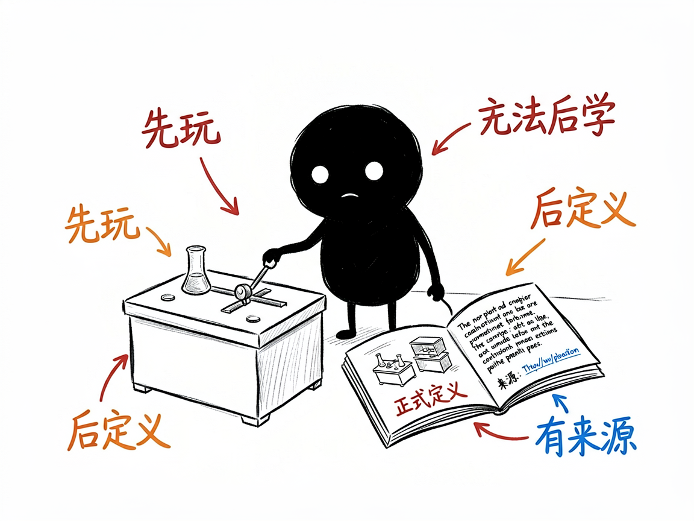

# 一个科学现象，怎么变成手机电脑都能玩的单页互动实验 —— edu-sci-viz 介绍

很多人对科学的好奇，是从一个"为什么"开始的：日食月食怎么回事？四季怎么来的？彩虹为什么是弯的？可科普文章往往一上来就甩定义和公式，没等看到重点，人已经晕了。其实先让人拖拖滑杆、转转模型，直觉建立起来，再讲原理才听得进去。

edu-sci-viz 就是来解决这件事的：你给它一个科学或数学概念（日食、月食、太阳系、四季、月相、潮汐、光的折射、彩虹、时区……），它帮你在 AI 里产出一个单文件网页——电脑手机都能直接打开，一页里既有好看的叙事讲解，又有一个能动手玩的"实验台"，拖滑杆、旋转、缩放，先建立直觉，再看正式定义和来源。

## 它到底能做什么
- 把数学/科学概念做成"单文件互动科普页"，一个网页文件搞定，打开即用。
- 遵循"先直觉、后定义"的叙事：事实核验 → 直觉模型 → 正式定义 → 互动实验 → 边界说明 → 来源追溯，读者先玩再学。
- 互动实验台支持滑杆实时反馈、拖动旋转、滚轮缩放、重置视角、暂停，参数一变模型立刻更新。
- 视觉是"编辑部科学手册风"：暖米白纸底、深海军蓝实验区、红/琥珀强调色、宋体大标题、等宽参数，科学又克制。
- 三维场景用网页三维技术在线加载，二维够用的用网页画图，零网络依赖也能跑 2D。
- 特别强调"不说瞎话"：重要结论都回到官方页面或原始论文，页面末尾列出来源，并单独说明"这个模型简化了什么"。

## 怎么用

你不需要记任何命令。在 codex / workbuddy 等 agent 装好 edu-sci-viz 技能后，直接对 AI 说话就行：

**场景 1：做日食科普页**
你：帮我把"日食"做成一个能拖动月球位置、看地月日怎么排成一线才遮挡太阳的互动科普页。
AI：AI 从模板生成一份网页，替换好标题、叙事和场景，你打开后上方是讲解，下方实验台里拖动滑杆改变月球位置，就能看到影子怎么投到地球上、什么时候变成日全食，末尾还附上权威来源链接。

**场景 2：讲四季成因**
你：我想做一个讲"四季是怎么来的"的互动页，带实验台。
AI：AI 生成单页科普，你拖动地球公转位置的滑杆，就能看到太阳直射点怎么移动、昼夜长短怎么变，先玩再读原理。

**场景 3：做彩虹的科普**
你：把"彩虹为什么是弯的"做成能玩的实验页。
AI：AI 生成带互动实验台的网页，你调整观察角度和光线，直观看到彩虹的形成条件和弯曲形状。

## 谁适合用
- 科普作者、自媒体做互动科学文章。
- 老师做课外拓展、天文/地理社团材料。
- 学生和对世界充满好奇的普通人自学。
- 博物馆、科技馆做轻量线上展项。

## 一点说明
这是个给 AI 用的技能（skill），不是普通人直接打开的 App；你把主题交给装好它的 AI，它帮你产出网页。它做的是"叙事科普"，和同系列那些"题面+分步解析+画板"的课件定位不同，两者不互相替代。它要求先查权威来源再动手，禁止虚构数字和结论，所以请给它真实、可核验的主题。具体能覆盖哪些主题、3D 还是 2D，以技能模板和范例实际能力为准。

## 闲鱼接单文案

> 以下服务展示在闲鱼 / 淘宝服务市场发布，用于承接本 skill 的定制开发订单。

**标题：科学互动科普页开发 skill软件开发**

**描述：**

专注 AI Agent 技能（skill）定制开发，已做出单文件互动科普页技能，现成作品可先看演示再下单。把日食、四季、彩虹、潮汐这类概念做成手机电脑都能打开的单页：叙事讲解 + 能动手玩的实验台（拖滑杆、旋转、缩放），遵循"先直觉、后定义"的阅读顺序，页尾附权威来源和"模型简化了什么"的说明，不虚构数字。适合科普自媒体、老师拓展课、科技馆轻量展项，可按你的主题定制，全部源码交付、支持二次开发。

**服务内容：**

- 1、需求沟通梳理：先聊清楚科普主题、目标读者（公众 / 学生 / 展项访客）和平台（手机 / 电脑 / 线下屏），确认主题真实可核验，列明功能清单后再动手
- 2、skill交付内容和格式：单文件互动科普网页：叙事讲解、互动实验台（滑杆实时反馈 / 旋转缩放）、编辑部科学手册风视觉、来源追溯与边界说明
- 3、项目功能/系统开发：按你的主题定制叙事结构、视觉风格与实验台参数，可扩展系列主题批量生成等功能的开发与联调
- 4、skill源码交付：SKILL.md 技能说明 + 提示词 / 脚本 / 模板 / 网页样例组成的完整技能工程，兼容 codex / workbuddy 等 agent。全部源码 + 安装部署说明 + 使用演示，交付后可自行修改维护
