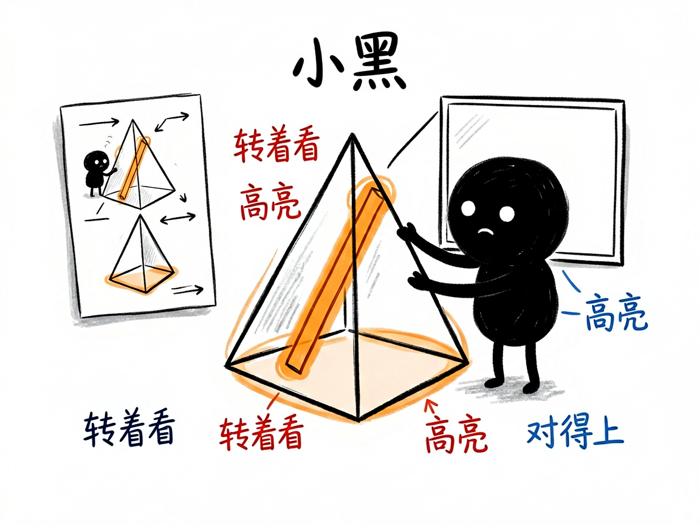
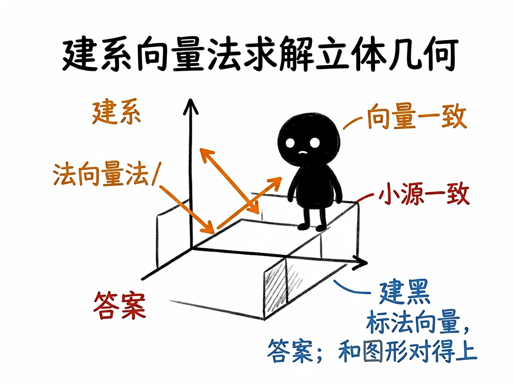

# 立体几何题里那些角和距离，怎么变成能旋转的 3D 模型 —— edu-solid-geometry 介绍

立体几何是很多人的噩梦：线面角、二面角、异面直线夹角、点到平面的距离，光看印刷在纸上的三维透视图，根本转不动、看不清。尤其是"建系用向量法"算出来的答案，学生常常不知道自己算的到底对应图形上哪一块。

**edu-solid-geometry 就是来解决这件事的。**

你给它一道立体几何题（文字、图片、或让它随机出一道都行），它还你一个能旋转缩放的 3D 网页：左边是题面、答案和分步解析（公式用 MathJax 排版），右边是题目对应的立体模型，能转着看，还会分步高亮关键元素、自动切换镜头，把"这一步在讲哪条棱、哪个面"演给你看。

---



## 它到底能做什么
- 把正方体/长方体、棱锥/棱柱、圆柱/圆锥等立体几何题做成单页 3D 交互网页（左解析、右模型）。
- 覆盖线面角、二面角、异面直线夹角、点到平面距离、体积等常见题型，统一用"建系 + 向量法"求解。
- 右侧用 Three.js（网页三维技术）搭出可旋转、缩放的模型，分步高亮正在讲的元素，并切换镜头角度。
- 背后用 sympy（符号数学程序库）精确算坐标、法向量和答案，保证网页上的 3D 坐标、数字和推导过程完全同源、互不矛盾。
- 支持三种入口：直接给文字题、拍题图让它识别确认、或让它随机抽一道练手。
- 题面给了线段长度时，还会在模型上标出长度，方便对照。

## 一个具体例子

你跟会用这个项目的 AI 说：

```text
把这道立体几何题做成能旋转的 3D 交互网页：
正四棱锥 P-ABCD，底面边长 2，侧棱 PA=√6，求 PA 与底面所成角。
```

AI 会先精确算出线面角，再生成一个 `solution-正四棱锥线面角.html`。打开后，模型能转着看，点"下一步"时对应的棱和底面被高亮、镜头自动对准，左侧同步显示建系和向量计算，答案和图形对得上。



## 谁适合用
- 高中数学老师讲立体几何，把抽象的角和距离演给学生看。
- 学生攻克空间想象，理解"向量法"每一步对应图形哪块。
- 家长帮孩子建立三维直观。
- 写教辅、做数学课件的人。

## 一点说明 / 小提示

这个项目是给"做 AI 工具 / 做课件的人"用的技能（skill），不是普通人直接打开的 App；你把题目交给会用它的 AI，它帮你产出网页。它需要电脑里装了 sympy 才能算（AI 会先确认，缺了会问你要不要装）。它专注"立体几何"（三维），纯平面几何请看 edu-plane-geometry，带圆锥曲线的解析几何请看 edu-analytic-geometry。具体题型覆盖以项目文档为准。
