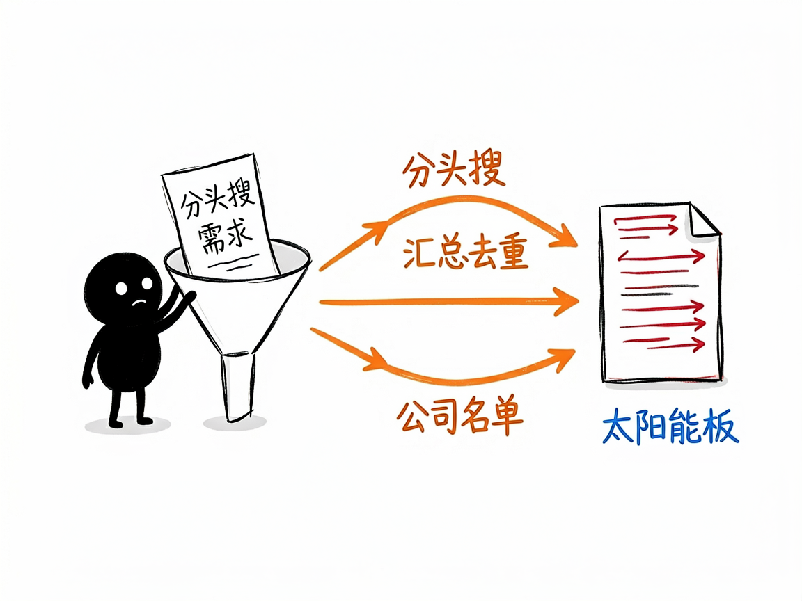

# 想摸清一家公司底细？让它去全网帮你挖 —— exa-company-research 介绍

你有没有过这种时候：谈合作前想先看看对方公司靠不靠谱，找客户时想快速拉出一批目标企业，或者跳槽前想摸清一家公司的规模、融资和口碑？自己一个个去搜，又慢又碎，还容易漏。

**exa-company-research 就是来解决这件事的。**

你给它一个公司名、一类公司、或者一个行业方向，它还你一份整理好的企业情报：从官网信息、新闻动态、社交媒体声量到高管 LinkedIn 资料，都能帮你挖出来。

---


## 它到底能做什么

- 查公司基本信息：用 Exa（一个 AI 搜索引擎）直接抓官网和公开数据库，拿到员工人数、总部地点、融资、营收等元数据。
- 找竞争对手和同行：给定行业或赛道，帮你列出一串相关公司，方便做竞品盘点。
- 搜新闻动态：跟踪一家公司近期的媒体报道、产品发布、财报等公开信息。
- 看社交媒体声量：抓取相关的推文（tweet），了解品牌在社交平台上的存在感。
- 查公开的高管资料：通过 LinkedIn 公开资料，找到关键决策人和团队背景。
- 批量建企业名单：支持按“几家”“全面”等不同深度灵活调整，自动生成公司清单。

## 一个具体例子

它是给 AI 助手用的"技能"，你在对话里用大白话提需求就行，比如：

```
帮我列出做太阳能板的美国主要公司，并查一下每家的规模和官网
```

背后它会自动用 Exa 的不同搜索类别（company / news / tweet / people）分头查，再把结果汇总去重。你也可以说"全面一点"，它就会扩大搜索量、查得更深。



## 谁适合用

- 投资人、BD（商务拓展）和销售人员：找客户、做尽职调查前快速摸底。
- 市场研究员：盘点某个赛道的玩家和竞争格局。
- 求职者：跳槽前了解目标公司的真实体量和口碑。
- 做竞品分析的产品或运营同学。

## 一点说明 / 小提示

这是一个给 AI 助手（Agent）调用的"技能"，不是普通人能直接双击打开的 App——它需要运行环境里接好 Exa 这个搜索工具才能用。它查的是公开网络信息，拿不到需要登录才能看的私密数据；遇到登录墙或动态加载的页面，它可能会改用浏览器方式兜底，但结果不一定完整。把它当成"联网情报搜集助手"就好，重要商业决策前最好再交叉核实一遍。
