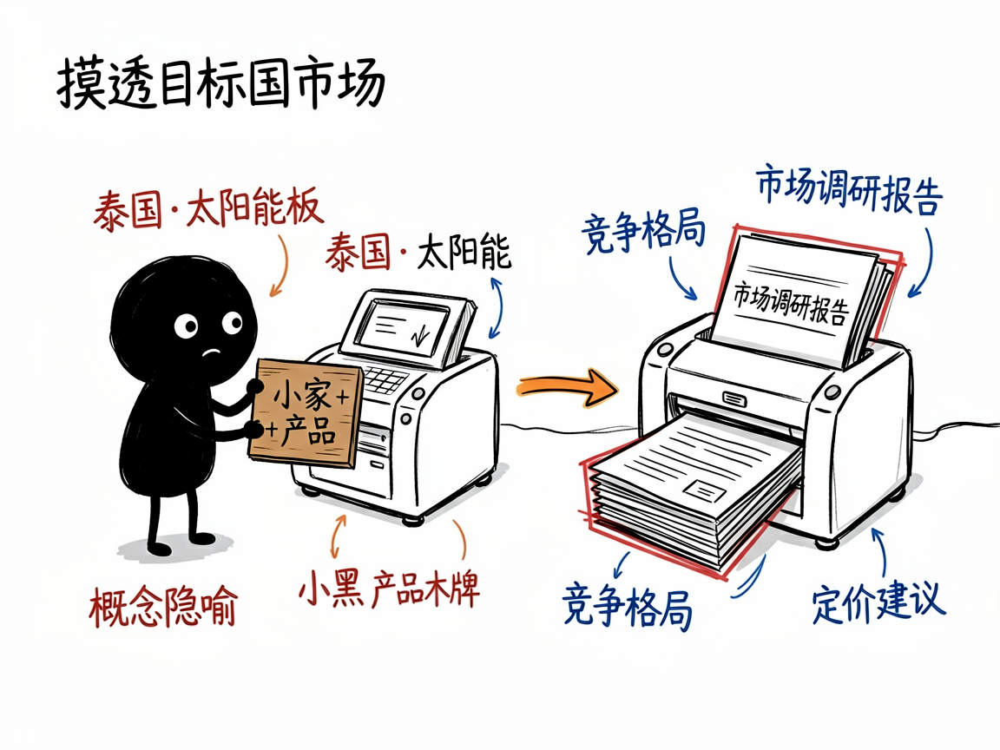
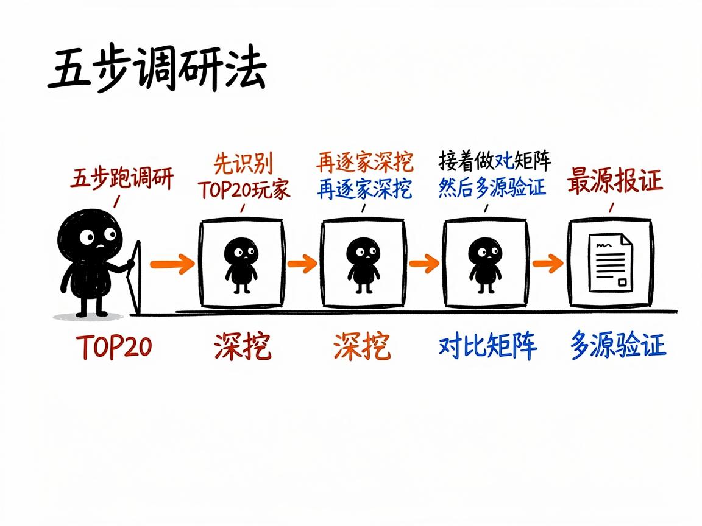

# 想出海卖货？先让它帮你摸透目标国市场 —— exa-foreign-trade-research 介绍

做外贸或想出海的朋友，最怕的就是"脑子一热冲进去，结果发现当地早被几家巨头占了"。你其实想知道：这个国家谁在卖同类产品？价格怎么定？渠道怎么走？中国供应商还有没有空子可钻？靠自己翻网页，十天半个月都未必理得清。

**exa-foreign-trade-research 就是来解决这件事的。**

你给它"目标国家 + 产品领域"，它还你一份完整的市场调研报告——竞争格局、定价策略、渠道分析、进入建议，全帮你理顺。

---



## 它到底能做什么

- 画出竞争格局：自动列出目标市场 TOP20 活跃公司，分成"本土品牌商、制造商、经销商/批发商/进口商"三类，各有来头。
- 逐个拆解竞品：对每家重点公司深挖背景、产品线、定价策略、客户群和优劣势。
- 生成对比矩阵：把所有竞品横向摆在一张表里比，并回答"市场是垄断还是分散""空白点在哪""中国供应商从哪切入"。
- 多源交叉验证：去官网、亚马逊/eBay、LinkedIn、Trustpilot 等平台核价格、销量和用户评价，避免数据一面之词。
- 给出落地建议：报告里专门有一章"中国供应商进入机会与建议"，从切入点、定位、定价到渠道策略都给方向。
- 自动调深浅：你说"快速了解""标准调研"还是"全面深度"，它对应不同的搜索量和耗时。

## 一个具体例子

在对话里这样提就行：

```
帮我调研一下泰国市场的太阳能板，标准深度
```

它会按五步法跑：先识别 TOP20 玩家，再逐家深挖，接着做对比矩阵，然后多源验证，最后产出一份 5000–8000 字的中文报告，文件名类似 `泰国_太阳能板_市场调研报告.md`。需要排除中国公司时也可以加一句"排除中国公司"，它会自动过滤。



## 谁适合用

- 外贸业务员和海外业务负责人：进入新市场前做竞品和定价摸底。
- 想出海的工厂老板：判断自家产品在国外有没有价格和渠道优势。
- 跨境电商卖家：选品、定价、找差异化定位时参考。
- 市场/战略岗：写进入某国市场的可行性分析。

## 一点说明 / 小提示

这同样是一个给 AI 助手用的"技能"，需要接好 Exa 搜索工具，部分验证环节还可能用到浏览器自动化（Playwright），不是普通人直接打开的 App。报告默认中文撰写，英文公司名和技术词会保留原文。它分析的是公开信息，给出的"市场机会"是方向性判断，真要砸钱进去，建议再结合实地走访和样品测试来确认。
