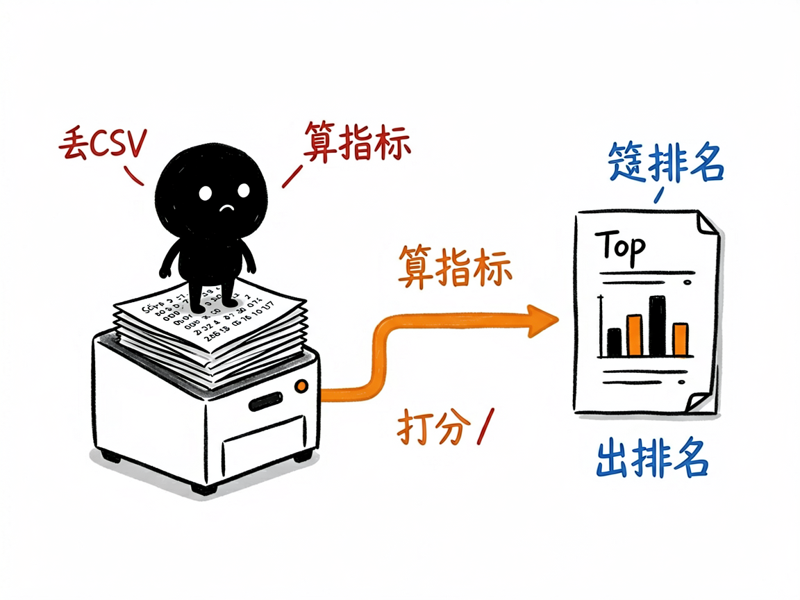
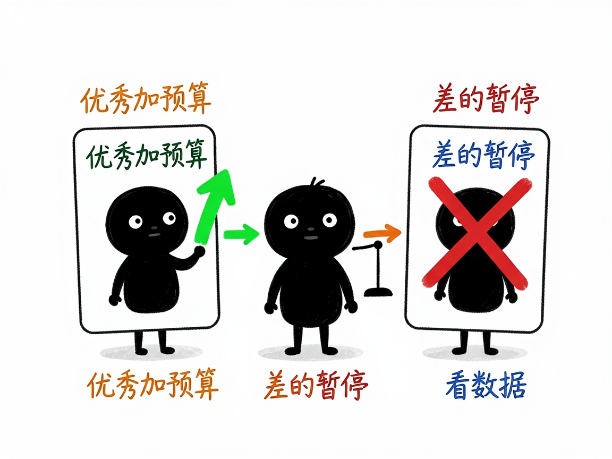

# 投了 Facebook 广告却看不懂数据？它帮你一眼分清好坏 —— facebook-ads-analyzer 介绍

你花真金白银在 Facebook 上投广告，月底从后台导出一张几百行的 CSV 数据表，密密麻麻全是展示量、花费、点击这些数字。哪个广告真正带来订单、哪个广告纯粹在烧钱，光靠肉眼根本看不过来。facebook-ads-analyzer 就是干这个的：你把导出的数据文件交给它，它帮你算出点击率、转化率这些关键指标，给每条广告打分评级，直接告诉你哪些该加预算、哪些该停掉。

**facebook-ads-analyzer 就是来解决这件事的。**

你给它一份 Facebook 广告后台导出的 CSV 文件，它还你一份带评分、带排名、带优化建议的分析报告。

## 它到底能做什么

- 自动读表算指标：读取 Facebook Ads Manager 导出的 CSV（能识别中文列名和特殊编码），算出点击率（CTR）、单次点击费用（CPC）、千次展示费用（CPM）、互动率、转化率等。
- 给每条广告打分评级：用加权公式综合评分，分成"优秀 / 中等 / 差"三档（优秀大概占总量的前 20%）。
- 排出 Top 10 和 Bottom 10：一眼看出表现最好和最差的广告分别是谁。
- 给可执行的优化建议：优秀广告建议加预算，中等的建议做 A/B 测试，差的建议暂停或重做。
- 出投放策略方案：给出保守、平衡、激进三套预算分配思路。
- 支持按地区、时间段对比：比如单独看香港或台湾的数据表现。

## 怎么用

你不需要记任何命令。在 codex / workbuddy 等 agent 装好 facebook-ads-analyzer 技能后，直接对 AI 说话就行：

**场景 1：月底想看哪些广告在烧钱**
你：这是我这个月 Facebook 广告后台导出的数据表，帮我看看哪些广告真赚钱、哪些纯粹在烧钱。
AI：它会算出每条广告的点击率、转化率等指标，打分排级，排出表现最好和最差的各 10 条，并直接告诉你哪些该加预算、哪些该停掉。

**场景 2：不知道钱该往哪投**
你：根据这份数据，给我一个下个月的预算分配思路。
AI：它会给出保守、平衡、激进三套投放方案，你按自己的风险偏好挑一套就行。

**场景 3：想单独看某个地区**
你：把香港和台湾的数据单独拉出来对比一下。
AI：它会按地区和时间段拆分数据，告诉你这两个市场各自的广告表现差异。

## 谁适合用

- 在 Facebook 上投广告、做独立站或品牌投放的电商卖家。
- 帮客户管广告投放的代运营、投手、优化师。
- 市场团队里需要定期复盘广告 ROI（投资回报）的人。
- 想用数据而不是感觉来决定"钱该往哪投"的创业者。

## 一点说明

它不是独立的可视化软件，而是一个给 AI 助手（如 codex / workbuddy）用的"技能包"。它只认 Facebook Ads Manager 导出的、带中文列名的 CSV，别的格式要先整理成对应字段（表格里需要的列包括账户名称、广告系列/组/广告名称、日期、国家、展示次数、花费金额等，越全越好）。具体评分权重和输出细节以项目里的 SKILL.md / REFERENCE.md 为准。

## 闲鱼接单文案

> 以下服务展示在闲鱼 / 淘宝服务市场发布，用于承接本 skill 的定制开发订单。

**标题：Facebook广告数据分析 skill软件开发**

**描述：**

专注 AI Agent 技能（skill）定制开发，已做出 Facebook 广告复盘分析技能，现成作品可先看演示再下单。自动读取 Ads Manager 导出的 CSV，算出点击率、单次点击费用、转化率等关键指标，给每条广告打分评级，输出加预算、做测试、暂停重做的决策建议和三套预算分配方案。支持按你的投放结构做个性化定制，交付后装进 codex / workbuddy 等 AI 助手即可使用，全部源码交付、支持二次开发。

**服务内容：**

- 1、需求沟通梳理：先聊清楚你的投放规模、复盘周期和最想回答的问题（哪些在赚钱、钱往哪投），确认能导出字段齐全的 CSV 数据，列明功能清单后再动手
- 2、skill交付内容和格式：每条广告的指标测算与评分评级、Top10 / Bottom10 排名、分地区分时段对比、可执行的优化建议与保守 / 平衡 / 激进三套预算方案（Markdown 分析报告）
- 3、项目功能/系统开发：按你的账户结构定制评分权重、分组维度和报告模板，可扩展多平台数据接入等功能的开发与联调
- 4、skill源码交付：SKILL.md 技能说明 + 提示词 / 脚本 / 模板 / 报告样例组成的完整技能工程，兼容 codex / workbuddy 等 agent。全部源码 + 安装部署说明 + 使用演示，交付后可自行修改维护
