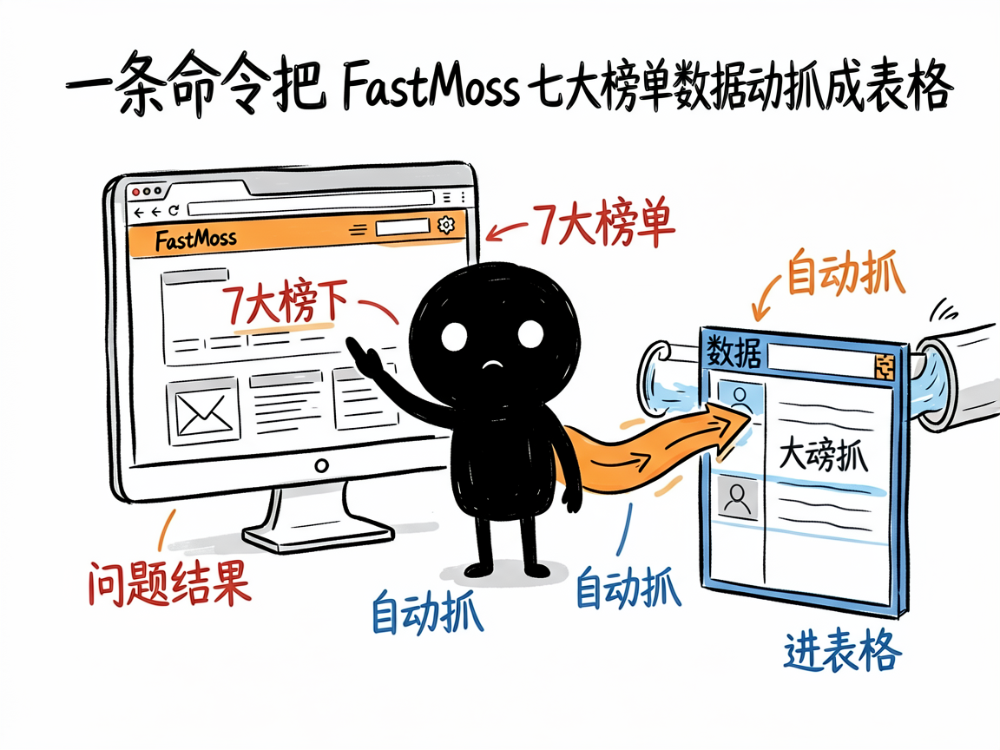
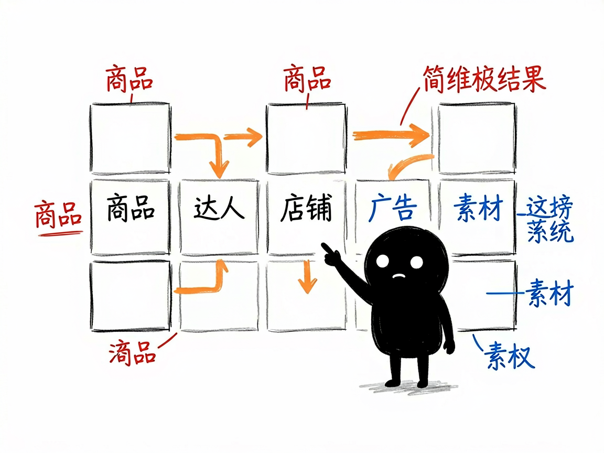

# 做 TikTok 电商想抄爆款、盯达人？它把榜单数据一键搬下来 —— fastmoss-rpa 介绍

你在做 TikTok 小店（TikTok Shop），想知道最近什么商品突然爆了、哪些达人带货最猛、对手在投什么广告关键词。FastMoss 这个网站能看这些数据，但手动一页页翻、一条条抄进表格，几十页下来人都要麻了。fastmoss-rpa 帮你把 FastMoss 上 7 大榜单的数据自动抓成表格，还能顺手生成一份带洞察的分析报告。

**fastmoss-rpa 就是来解决这件事的。**

你给它一个榜单名称加筛选条件（比如"美国站、涨粉榜"），它还你一份 CSV 数据表，以及一份人话版的分析报告。

## 它到底能做什么

- 抓商品榜（products）：看新品、销量、热推商品，比如美国最近上新的爆品。
- 抓达人榜（creators）：看涨粉、带货、蓝V、热门、黑马等各类达人，比如印尼涨粉最快的带货号。
- 抓店铺榜（shops）：看各站点的销量榜、热推店铺。
- 抓广告趋势（ads）：看正在投的标签、关键词、品类。
- 抓素材榜（creatives）：看近期跑量的视频、音乐、标签。
- 抓直播榜（livestreams）：看 TT 直播、直播爆品、直播带货达人。
- 抓品类大盘（market）：看行业格局、市场总览、日销趋势，支持多国对比。
- 按国家 / 品类 / 时间筛选：比如"美国 + 印度尼西亚 + 泰国"一键多市场抓，自动切分。

## 怎么用

你不需要记任何命令。在 codex / workbuddy 等 agent 装好 fastmoss-rpa 技能后，直接对 AI 说话就行：

**场景 1：想找最近爆了的商品**
你：帮我看看美国站 TikTok 最近上了哪些新爆品。
AI：它会自动打开 FastMoss、抓下商品榜里美国站的新品和热推商品，整理成一份表格给你，方便你找潜力款。

**场景 2：想找涨粉最快的达人合作**
你：印尼最近涨粉最快的带货达人是谁？给我列一下。
AI：它会抓取达人榜里印尼站的涨粉榜，排出涨粉最快的一批账号，你挑合适的去谈合作。

**场景 3：想出一份多市场对比报告**
你：把美国、印度尼西亚、泰国三个市场的品类大盘都拉出来，做个对比。
AI：它会按国家分别抓数据再自动切分合并，最后给你一份带洞察的多市场对比分析报告。

## 谁适合用

- 做 TikTok Shop 的卖家、选品人员、直播团队。
- 想找爆款、找达人合作、盯对手广告的跨境运营。
- 需要把多国 TikTok 数据做成对比报告的调研者。

## 一点说明

它不是普通能双击打开的软件，而是一个给 AI 助手（如 codex / workbuddy）用的"技能包"。它靠浏览器自动化工具（RPA，让 AI 自动操作网页的工具）驱动你电脑上已经登录 FastMoss 的真实浏览器去抓数据——所以你先在 agent 里装好对应的浏览器自动化技能、用 Chrome 或 Edge 登录 FastMoss 就行。没登录或没连上浏览器，就抓不到。具体支持的榜单和字段以项目 SKILL.md / references 为准。

## 闲鱼接单文案

> 以下服务展示在闲鱼 / 淘宝服务市场发布，用于承接本 skill 的定制开发订单。

**标题：TikTok电商数据采集（FastMoss）skill软件开发**

**描述：**

专注 AI Agent 技能（skill）定制开发，已做出 FastMoss 榜单自动化采集技能，现成作品可先看演示再下单。一句话抓取商品、达人、店铺、广告、素材、直播、品类大盘 7 大榜单，支持多国多条件筛选，自动整理成表格并生成带洞察的中文报告。支持按你的站点和关注榜单做个性化定制，交付后装进 codex / workbuddy 等 AI 助手即可使用，全部源码交付、支持二次开发。

**服务内容：**

- 1、需求沟通梳理：先聊清楚你关注的站点（美国 / 印尼 / 泰国等）、榜单类型和筛选条件，确认电脑已登录 FastMoss，列明功能清单后再动手
- 2、skill交付内容和格式：商品 / 达人 / 店铺 / 广告 / 素材 / 直播 / 品类大盘 7 类榜单的数据采集成果（CSV 表格 + 带洞察的中文分析报告）
- 3、项目功能/系统开发：按你的选品和达人合作流程定制抓取字段、多市场对比与定期采集等功能的开发与联调
- 4、skill源码交付：SKILL.md 技能说明 + 提示词 / 脚本 / 模板 / 报告样例组成的完整技能工程，兼容 codex / workbuddy 等 agent。全部源码 + 安装部署说明 + 使用演示，交付后可自行修改维护
