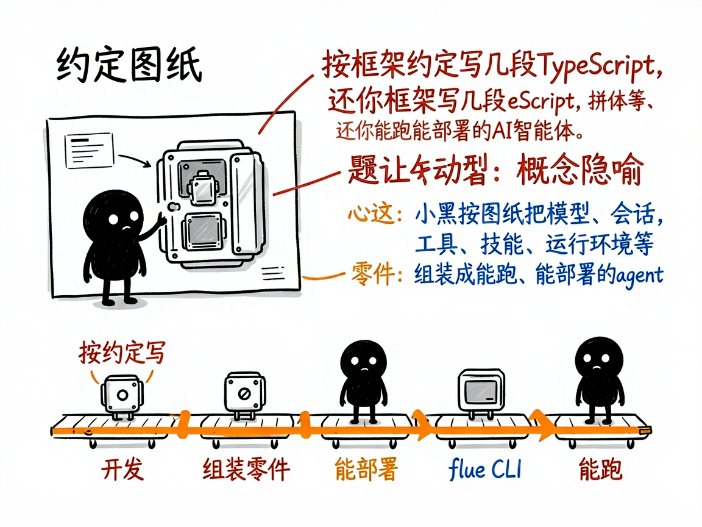
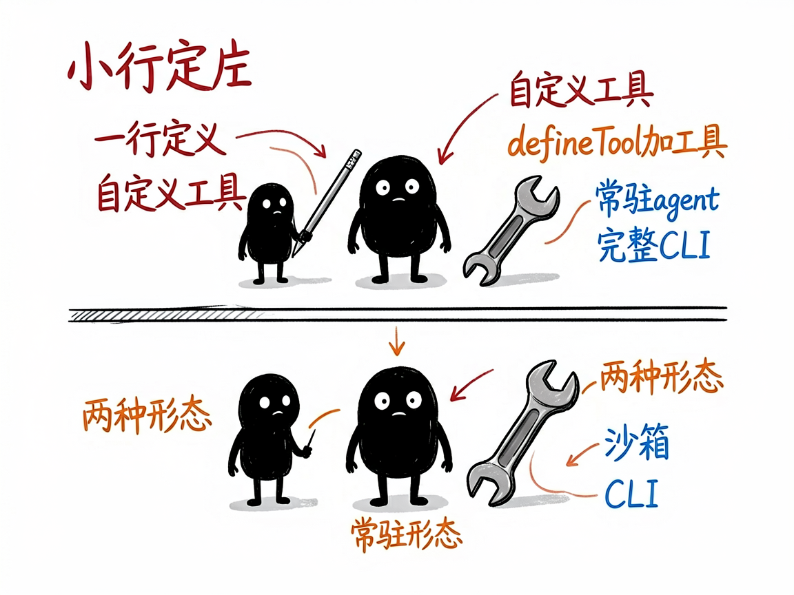

# 用 TypeScript 规规矩矩搭一个 AI 智能体，这套框架把套路都定好了 —— flue-framework 介绍

想用代码写一个 AI 智能体（Agent，会自己调用工具、管理对话的 AI 助手），市面上的框架五花八门，光是"怎么定义 agent、怎么接模型、怎么让它对外提供网页接口、怎么上线部署"就有一堆约定要记，稍不留神就报错。

**flue-framework 就是来解决这件事的。**

你给它按它的约定写几段 TypeScript 代码，它还你一个能跑、能联网提供接口、能部署上线的 AI 智能体。它是一套"harness-driven"（意思是框架负责把模型、会话、工具、技能、运行环境这些零件组装好）的 TypeScript 智能体框架。



---

## 它到底能做什么

- 用 `createAgent()` 一行定义智能体：指定用哪家模型（Anthropic、OpenAI、DeepSeek、OpenRouter 等都内置支持）、给它什么指令。
- 用 `defineTool()` 加自定义工具（让 AI 能发起 HTTP 请求、跑 Node.js 代码等），参数用 TypeBox 描述，执行逻辑直接写 Node.js。
- 支持两种形态：一种是常驻的交互式 agent（对外提供网页聊天、WebSocket、SSE 实时推送）；一种是用 `flue run` 跑一次的"工作流"任务。
- 支持子智能体（subagent，用 `defineAgentProfile()` 定义专门干某件事的 AI，由主 agent 委派）。
- 自带沙箱（sandbox，隔离的运行环境）、会话管理、`session.prompt()` 还能强制返回结构化数据。
- 提供完整 CLI（命令行）：`flue init` 初始化、`flue dev` 开发热更新、`flue build` 打包、`flue run` 跑 agent、`flue connect` 进交互会话，以及生产部署说明。

## 一个具体例子

先装依赖并初始化项目：

```bash
npm install @flue/runtime valibot@^1.0.0
npm install --save-dev @flue/cli typescript
npx flue init --target node
```

写一个最简单的 agent（`src/agents/hello-world.ts`）：

```typescript
import { createAgent } from '@flue/runtime';

export default createAgent(() => ({
  model: 'anthropic/claude-sonnet-4-6',
  instructions: 'Tell a funny hello world engineering joke.',
}));
```

然后运行：

```bash
npx flue connect hello-world --target node --env .env
```



## 谁适合用

- 熟悉 TypeScript、想快速搭 AI 智能体或 AI 产品的开发者。
- 需要把智能体以网页 / API 形式对外提供、并上线部署的团队。
- 想在 DeepSeek 等兼容模型上跑 agent、又想要清晰工程结构的工程师。

## 一点说明 / 小提示

它是给会写 TypeScript 的开发者用的框架，不是给普通人直接打开的 App——你得自己装 Node.js（要求 22.18.0 以上）、写代码、配 API Key。它有两个容易踩的坑：交互式 agent 和工作流 agent 的写�