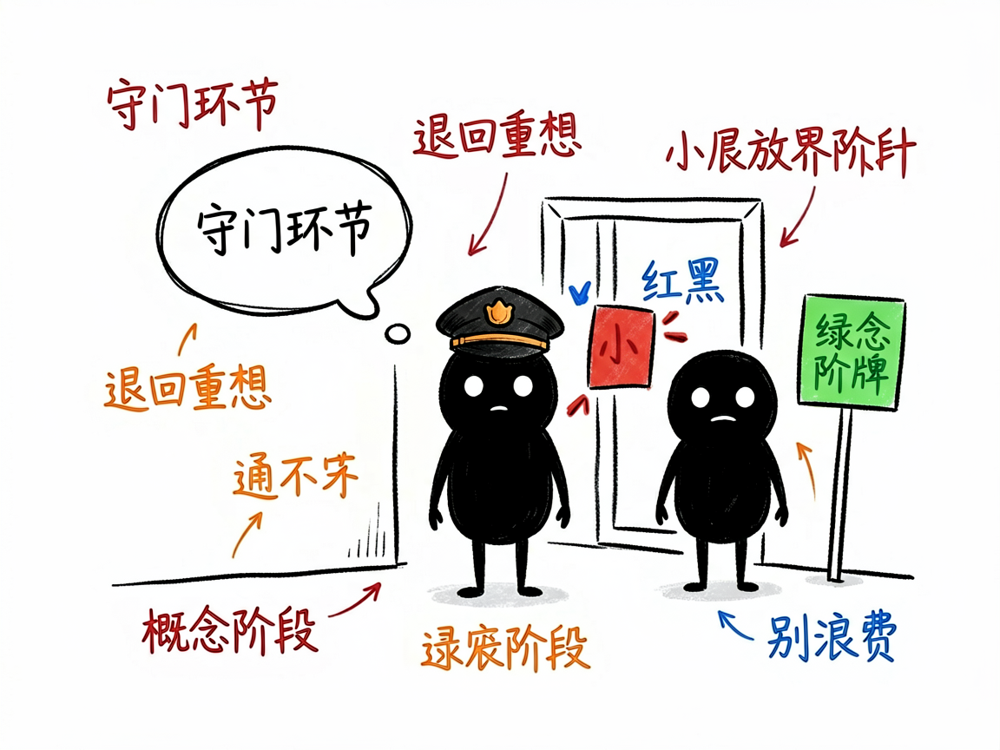
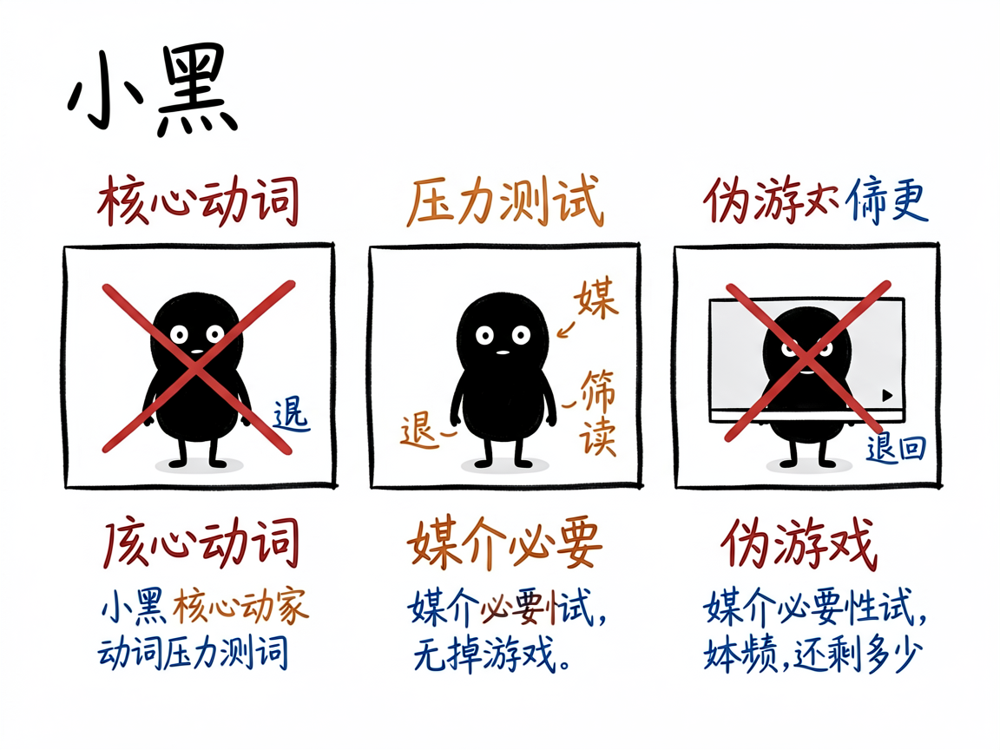

# 你的"游戏创意"真的该做成游戏吗？这个守门员先帮你挡一道 —— game-gameability 介绍

很多人想做一个游戏，脑子里有个很棒的点子：一个感人的故事、一段沉浸的体验。可真做起来才发现，玩家其实只是在"看剧情、点选项"，换成互动小说或动画也差不多——它并没有用到"游戏"这种媒介才有的乐趣。等美术、程序都投进去才发现问题，就晚了。

**game-gameability 就是来解决这件事的。** 你给它一个还没动手做的游戏概念，它还你一份"游戏性验证"结论：这个想法到底配不配做成游戏，通不过就直接退回概念阶段，别浪费后续资源。它在游戏设计流程里是一个独立的"守门"环节，卡在选定概念之后、正式做世界设计之前。

---

## 它到底能做什么

- 提取"核心动词"：逼你想清楚玩家 80% 时间到底在"做"什么动作。硬规矩是——不能是"阅读 / 选择 / 听"这类纯被动动作，必须是主动的操作（比如举证、破解、部署、拼凑）。
- 做"动词压力测试"：拷问这个动作能不能反复玩、熟手和新手有没有差距、做的结果会不会改变游戏世界并影响后续决策，三项里至少两项得过。
- 做"媒介必要性测试"：想象把游戏录成一段不能快进、不能选的视频，观众看视频和你亲自玩，体验差多少？去掉交互还剩 80% 以上，就说明它根本不是游戏。
- 做"原型动词验证"：要求你写出玩家打开游戏 30 秒内做的第一个有意义动作，动作不能需要 60 秒以上教学，且第十个动作要和第一个有本质区别（证明循环有深度）。
- 用"好玩七维"预检：从空间×时间、死亡×经济、成长、任务×收集、合作×对抗、偶然性、机制关联性里，先圈出至少三个能在这概念里落地的维度，说不出怎么落地就不通过。

## 怎么用

你不需要记任何命令。在 codex / workbuddy 等 agent 装好 game-gameability 技能后，直接对 AI 说话就行：

**场景 1：你有个很感人的游戏点子，但拿不准是不是游戏**
你：我想做一个游戏，玩家就是看一段剧情、然后点选项推进故事，这个适合做成游戏吗
AI：它逼你提炼"核心动词"，发现玩家 80% 时间只是在"阅读 / 选择"这种被动动作，通不过核心动词硬规矩，直接建议你退回概念阶段，别浪费后续资源。

**场景 2：你想验证一个解谜概念**
你：我有个游戏，玩家要在现场搜集线索、破解机关，这个配不配做游戏
AI：它做动词压力测试（能不能反复玩、熟手新手有没有差距、动作会不会改变世界），再跑媒介必要性测试，最后给你一份游戏性验证报告，结论是"通过 / 退回概念阶段"。

**场景 3：你想提前筛掉伪游戏**
你：帮我把这个创意过一遍好玩七维，看看哪几个维度真能落地
AI：它从空间时间、死亡经济、成长、任务收集、合作对抗、偶然性、机制关联里，先圈出至少三个能落地且说得清怎么落地的维度，说不出就判不通过。

## 谁适合用

- 用 AI 辅助做游戏设计、跑标准化设计流程的设计者或团队。
- 在概念阶段想提前筛掉"伪游戏"创意、避免资源打水漂的人。
- 需要一套可验证（而非纯主观）的方法论来判断"这个点子好不好玩"的项目。

## 一点说明

它是给"做游戏的人（且用 AI 辅助设计流程）"用的技能，不是给玩家打开来玩的东西，也不是普通人直接用的 App——它得嵌在一套更大的游戏设计工作流里才会生效。它的判断偏"结构可验证"（这个维度有没有真被设计进去），至于"玩起来到底愉不愉快"这种主观感受，它不假装打分，留给真人试玩。具体判定标准以项目文档为准。

## 闲鱼接单文案

> 以下服务展示在闲鱼 / 淘宝服务市场发布，用于承接本 skill 的定制开发订单。

**标题：游戏创意游戏性验证 skill软件开发**

**描述：**

专注 AI Agent 技能（skill）定制开发，已做出游戏性守门验证技能，现成作品可先看演示再下单。给它一个还没动手做的游戏概念，先逼你提炼"核心动词"（玩家 80% 时间在主动做什么，纯"阅读 / 选择"直接不过关），再做动词压力测试、媒介必要性测试（录成视频看完还有 80% 体验就说明不是游戏）、原型动词验证和"好玩七维"预检，最后给出"通过 / 退回概念阶段"的结论，帮你在投美术投程序之前挡住伪游戏。可按你的设计流程定制，全部源码交付、支持二次开发。

**服务内容：**

- 1、需求沟通梳理：先聊清楚游戏概念、目标玩家和平台，确认概念文档写到了什么程度，列明功能清单后再动手
- 2、skill交付内容和格式：游戏性验证报告：核心动词结论、动词压力测试结果、媒介必要性测试、原型动词验证、好玩七维预检与最终"通过 / 退回"结论
- 3、项目功能/系统开发：按你的设计流程定制判定标准、测试维度与报告模板，可扩展多概念批量筛选等功能的开发与联调
- 4、skill源码交付：SKILL.md 技能说明 + 提示词 / 脚本 / 模板 / 报告样例组成的完整技能工程，兼容 codex / workbuddy 等 agent。全部源码 + 安装部署说明 + 使用演示，交付后可自行修改维护
