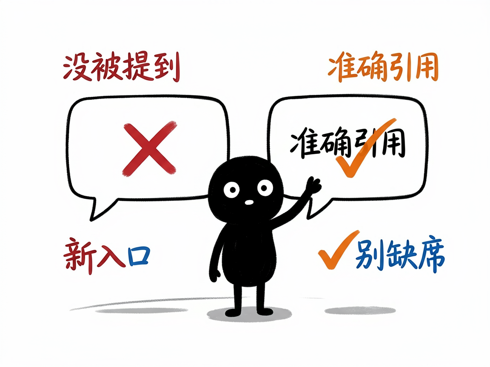
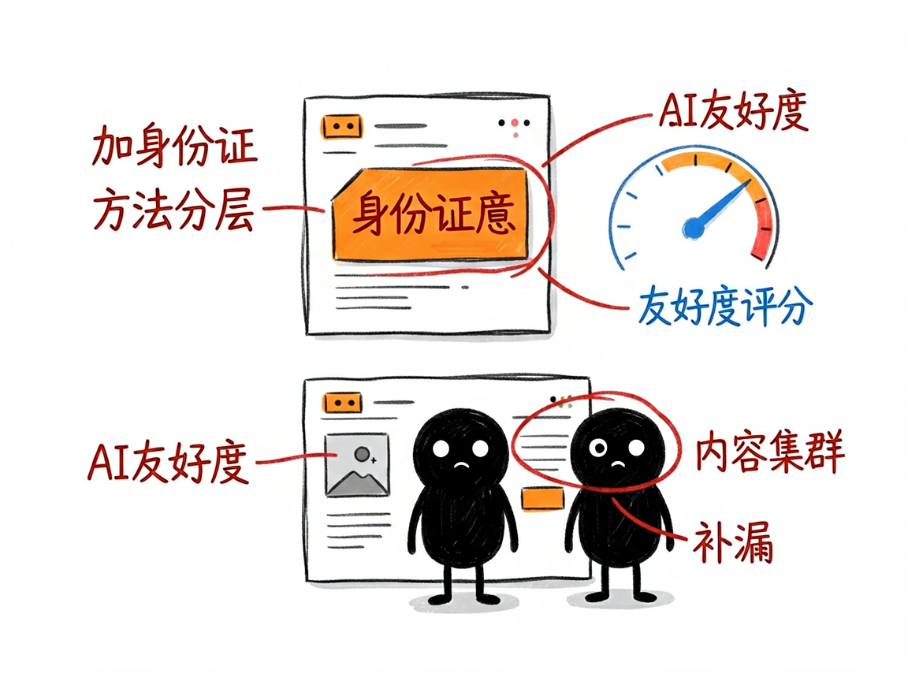

# 想让 AI 搜索（ChatGPT、豆包等）推荐你的品牌？它帮你按"AI 口味"改内容 —— geo-optimizer 介绍

现在大家问问题，越来越习惯直接问 ChatGPT、Perplexity、豆包、Gemini 这些 AI 助手，而不只是百度谷歌了。一个问题问下去，AI 会综合网上的内容给答案——可如果你的品牌、你的产品，在 AI 的答案里根本没被提到，或者提到了却说错，那等于在一种新的"搜索入口"上彻底缺席。

**geo-optimizer 就是来解决这件事的。**

GEO 是"生成式引擎优化"（Generative Engine Optimization）的缩写，简单说就是：让 AI 搜索引擎更愿意、更准确地引用你的内容。你给它你的品牌信息和网页，它还你一套让 AI 更容易"看懂并推荐你"的优化方案。

---

## 它到底能做什么
- 生成结构化数据标记：给网页加一段机器能读的"身份证"，告诉 AI 你是谁、提供什么——比如公司信息、常见问题解答（FAQ）、文章信息。
- 检测内容"AI 友好度"：分析你的文字里营销套话多不多、句子长不长、有没有数据支撑、有没有直接问句，给个可读评分和改善建议。
- 规划内容集群：帮你搭"一个核心主题页 + 多个子主题"的网站结构，让 AI 觉得你在这个领域讲得全、讲得透。
- 测 AI 可见度：看你的品牌名会不会出现在 AI 对相关问题的回答里，并生成季度对比报告。
- 做内容差距分析：你给它一个网址，它会去对比"AI 概览里提到的"和"你页面上说的"差在哪，给出补漏建议。

## 怎么用
你不需要记任何命令。在 codex / workbuddy 等 agent 装好 geo-optimizer 技能后，直接对 AI 说话就行：
**场景 1：给品牌页面加上"AI 身份证"**
你：帮我给"XX 品牌"生成一份公司信息的结构化数据标记，我们是做 XX 领域的，主要产品是 XX。
AI：它会产出一段能直接贴进网站的结构化数据，清楚告诉 AI 你的公司是谁、提供什么、擅长哪些领域。
**场景 2：看看我的文案 AI 友不友好**
你：这段官网文案对 AI 友好吗？帮我打个分，顺便说说哪里要改。
AI：它逐条分析你的文字，指出套话、长句、缺数据等问题，并给一版更好被 AI 引用的改写建议。
**场景 3：查我品牌在 AI 里露不露脸**
你：最近豆包、Perplexity 这些 AI 回答相关问题时会不会提到我们品牌？帮我测一下可见度。
AI：它去问相关 AI 并核对你的品牌是否出现，生成一份季度对比报告，告诉你哪些问题里你"缺席"了。

## 谁适合用
- 做品牌内容、官网运营，想在新一代 AI 搜索里占位置的人。
- 帮客户做 SEO / 内容优化的从业者。
- 做 AI 工具、需要把"让 AI 引用"做成标准化流程的人。

## 一点说明
它是一套面向"做内容优化 / 搭 AI 工具"的技能，不是普通人点一下就完事的 APP。它提高的是"被 AI 引用的概率"，不保证某个平台一定会提你（文档里明确写了这点）。部分功能（比如可见度测试）需要你自家的相关接口密钥（API Key）才能跑，没有的话它会给你手动测试的方法。具体能力以项目文档为准。

## 闲鱼接单文案

> 以下服务展示在闲鱼 / 淘宝服务市场发布，用于承接本 skill 的定制开发订单。

**标题：GEO 生成式引擎优化 skill软件开发**

**描述：**

专注 AI Agent 技能（skill）定制开发，已做出 GEO（让 ChatGPT、豆包这些 AI 搜索愿意引用你）优化技能，现成作品可先看演示再下单。给网页生成结构化数据"AI 身份证"（公司 / FAQ / 文章信息），检测文案的 AI 友好度并给改写建议，规划"核心主题 + 子主题"的内容集群，测试品牌在各大 AI 回答里的可见度并出季度对比报告，还能做内容差距分析。可按你的品牌定制，全部源码交付、支持二次开发。

**服务内容：**

- 1、需求沟通梳理：先聊清楚品牌信息、官网网址和最关心的目标（结构化标记 / 文案友好度 / AI 可见度），确认相关接口密钥情况，列明功能清单后再动手
- 2、skill交付内容和格式：结构化数据标记代码、内容 AI 友好度评分与改写建议、内容集群规划、品牌 AI 可见度对比报告
- 3、项目功能/系统开发：按你的行业定制检测维度、集群结构与可见度问题库，可扩展定期监测等功能的开发与联调
- 4、skill源码交付：SKILL.md 技能说明 + 提示词 / 脚本 / 模板 / 报告样例组成的完整技能工程，兼容 codex / workbuddy 等 agent。全部源码 + 安装部署说明 + 使用演示，交付后可自行修改维护
