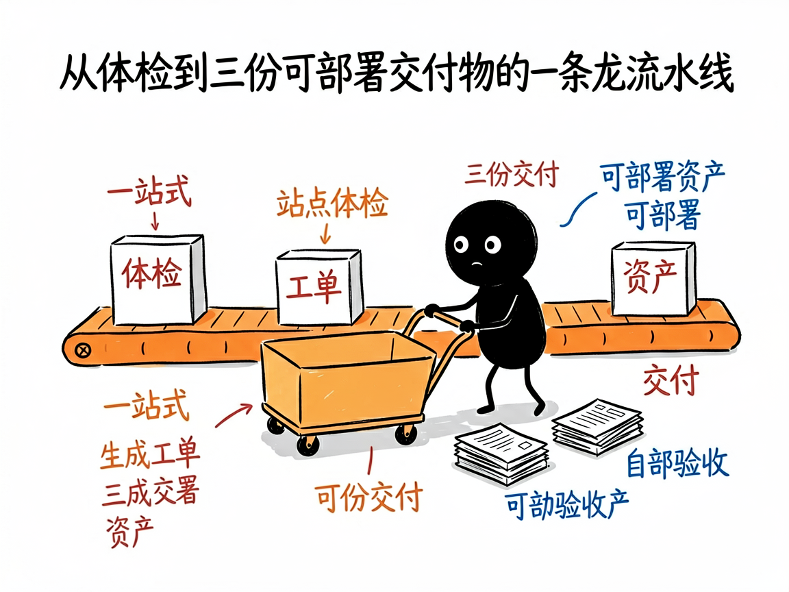

# 做 GEO（让 AI 推荐你的品牌）从诊断到交付，它一条龙包了 —— geolook 介绍

你是个品牌方，或者帮客户做"AI 搜索优化"的服务商。你需要的不是一句"建议你优化一下内容"的空话，而是一套能落地的方案：现在 AI 怎么看你的品牌、差在哪、具体改什么、改完有没有效、最后能打包发给客户的报告。

**geolook 就是来解决这件事的。**

它是一套完整的 GEO（生成式引擎优化，简单说就是让 AI 在回答问题时更愿意、更准确地提到你的品牌）服务流程。你给它一个产品官网网址和一点介绍材料，它还你三份能直接发给客户的交付文档，外加一套能直接用上的优化资料。从"抓官网、做体检、问各家 AI 怎么评价你"，一直做到"告诉你具体改成啥、改完有没有效、打包成正式报告"。

---

pindou 测试视频

## 它到底能做什么

- 站点体检：从可抓取性、长度、结构、能被 AI 抽出来的"事实块"、权威信号等六个方面给官网打分，找出 AI 看不懂的硬伤（比如页面是空的、或者禁止 AI 抓取）。
- AI 答案采样：同时问国内（智谱、豆包、DeepSeek、Kimi、MiniMax）和海外（Gemini、ChatGPT、Claude、Grok、Perplexity）多家 AI，看它们怎么评价你的品牌——国内海外分开算，不混为一谈。
- 生成带验收标准的工单：把问题变成"谁、什么时候、做到什么算完成"的执行清单，而不是泛泛的建议。
- 产出能直接用的资料：直接生成 `llms.txt`（一份专门写给 AI 看的官方事实索引）、结构化数据、常见问题解答等，放进网站就能用。
- 自动验收 + 客户交付：改完会重新检查一遍、自动更新工单状态，并打包成诊断 / 优化 / 执行三份正式交付文档。

## 怎么用

你不需要记任何命令。在 codex / workbuddy 等 agent 装好 geolook 技能后，直接对 AI 说话就行：  
**场景 1：给客户出一整套 GEO 交付物**  
你：帮我把 example.com 这个品牌的 GEO 从头到尾做一遍，国内海外都要，最后给我能发给客户的三份报告。  
AI：它会先抓取你的官网做体检，再同时问国内外多家 AI 怎么评价你，找出差距、生成带验收标准的优化工单，并打包成诊断、优化、执行三份正式交付文档发还给你。  
**场景 2：只想知道 AI 现在怎么看我的品牌**  
你：现在豆包、ChatGPT 这些 AI 提到我们品牌时都说啥？帮我采样一下，再说说差在哪。  
AI：它同时问国内外多家 AI 关于你品牌的回答，整理出一份对比，告诉你哪些地方被夸、哪些地方被说错或根本没提。  
**场景 3：改完想验收效果**  
你：我按你上次给的工单改了官网，帮我重测一下，看 AI 现在对我的评价有没有变好。  
AI：它重新抓取页面、重问各家 AI，对比改前改后的答案，更新工单状态，并告诉你哪些问题已经解决、哪些还得继续改。

## 谁适合用

- 给客户提供"AI 搜索优化"服务的服务商 / 代运营。
- 自家品牌想系统做 GEO、按周期跟进效果的运营团队。
- 做 AI 工具、要把 GEO 服务做成标准化产品的人。

## 一点说明

它主要靠 AI 能力来完成整条流水线，不是普通用户双击即用的 APP。它要调用各家 AI 的接口（API，让不同软件互相取数据的接口），部分没有联网接口的平台会走人工采样。GEO 提高的是被引用的"概率"而非"保证"——给客户写方案时务必原样写明这点；它也不做传统 SEO 排名、不买外链、不替你改网站实际代码。具体能力以项目文档为准。
