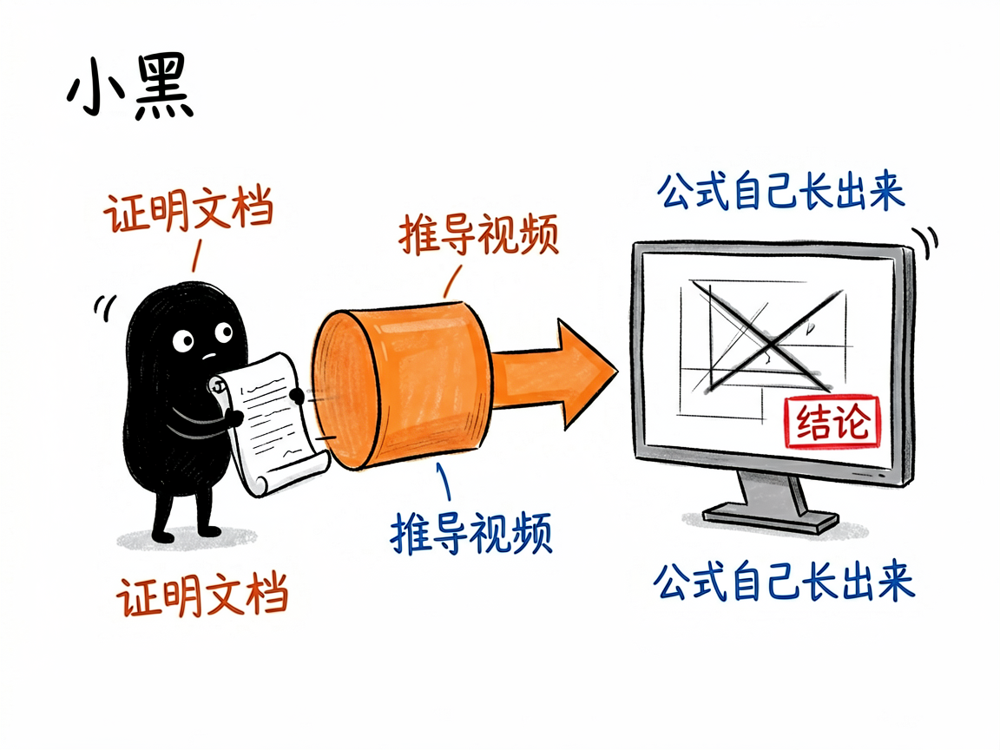
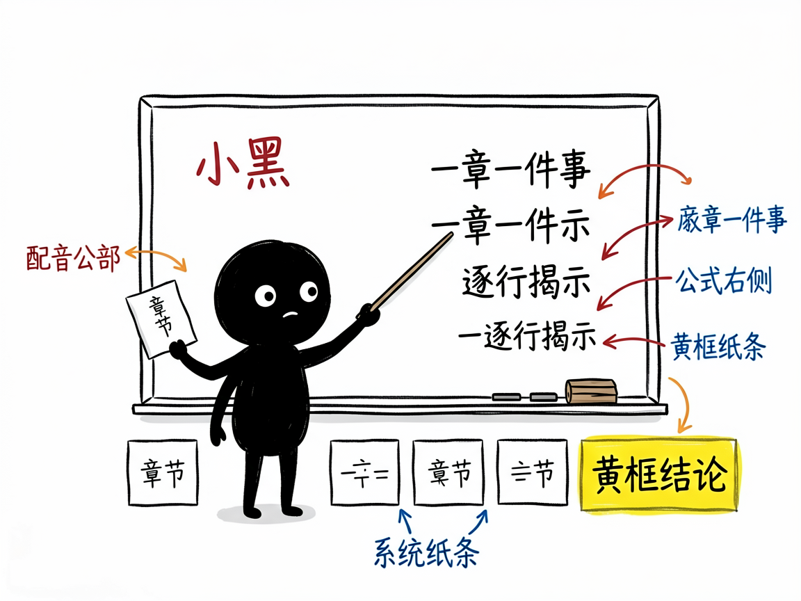

# 把数学证明做成动画视频，让公式自己"长"出来 —— geometry-math-proof-remotion 介绍

你想过把勾股定理、欧拉公式这类证明讲给别人听吗？光靠文字和静态图，听着听着人就走神了；真去学动画软件又门槛太高。很多人卡在"想做但做不出来"这一步。

**geometry-math-proof-remotion 就是来解决这件事的。**

你给它一份数学证明的文档，它还你一段深色背景、精准几何风格的推导视频，像 3Blue1Brown（国外那个有名的数理科普频道）那种感觉。

---



## 它到底能做什么
- 把证明拆成 6~10 个章节，每章只讲一件事，逻辑一步步推进，不会跳步把推导链打断。
- 几何图形全部用代码绘制（SVG，一种矢量图形语言），线条像被"描"出来一样慢慢显现，而不是生硬出现。
- 公式在画面右侧逐行揭示，最后结论用黄框大字标出，观众跟着节奏走。
- 自动生成配音（TTS，也就是文字转语音）和同步字幕，关键词用黄色高亮，像看教学视频一样。
- 输出 1920×1080 横屏成片，深底配红蓝绿黄高饱和色，干净、专业、不花哨。



## 一个具体例子

先写配音台词，再让 AI 生成语音和字幕时间轴：

```bash
python scripts/generate_tts.py
```

脚本会自动选出可用方案（微软 edge 免费配音，或付费的 MiniMax 高质量配音），产出音频和字幕文件，后续再把每章时长回填到视频工程里。

## 谁适合用
- 老师、科普作者，想把抽象数学讲得直观。
- 做教育内容的自媒体，缺一个稳定的证明动画模板。
- 想沉淀"经典证明"系列视频的人。

## 一点说明 / 小提示
它是一个跑在 AI 编程助手（如 Claude Code、CodeBuddy）里的技能，不是你手机上能直接打开的 App。你给文档、它产出一套 Remotion（一个用代码做视频的开源框架）工程，再由助手渲染成片。具体能力以项目文档为准。
