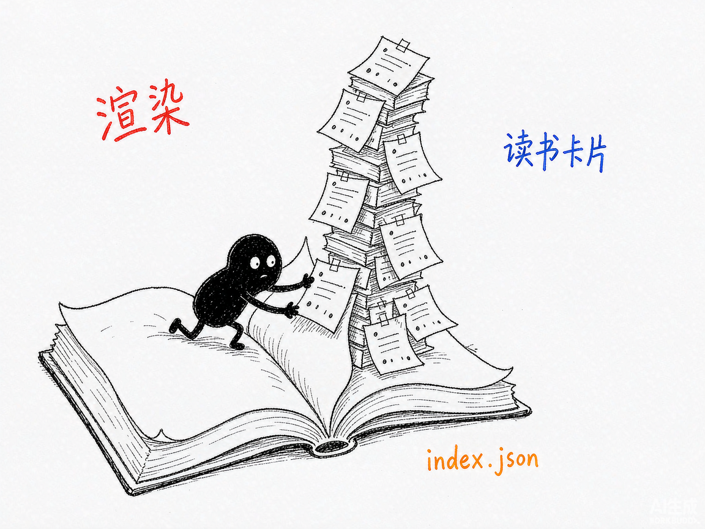

# 让 AI 读完一本几百页的 PDF，还能告诉你答案在第几页？—— glm-5.3-flash-vision-rag 介绍

你手上有一份 120 页的技术手册或扫描版合同，想问它一个具体问题。整本塞给 AI？token 爆炸、慢得要命；用传统文字 RAG？碰到图表、表格、公式、扫描件就瞎了，页码还经常报错。你真正想要的是：问一句话，拿到答案，顺便看到那几页的原图自己核对。

**glm-5.3-flash-vision-rag 就是来解决这件事的。**

你给它一份 PDF 和一个问题，它还你带 `[第N页]` 标注的答案，外加引用页的原图和一份自包含 HTML 预览页。基于智谱视觉大模型 GLM-5.3-Flash。

---

## 它到底能做什么
- 视觉建索引：每页渲染成图，让视觉模型逐页"阅读"并写一张读书卡片（页型、标题、摘要、关键词），一次建完永久复用，重跑直接命中缓存。
- 带页码的答案：每个论点标注 `[第6页]`，页码来自物理事实——图就是第 6 页渲染出来的，不需要模型猜。
- 原图回显：把引用页的高清原图一并给你，自己核对，不用盲信。
- 跨页召回：问"这个概念在哪几页被提到"，能找齐全书所有相关页。
- 章节定位：问"§05 在第几页、讲了什么"，给出起止页码加内容总结。
- 深度对比：问"对比一下 XX 和 YY"，基于相关页做对比分析。
- 指定页渲染：`show.py` 直接高清出第 N 页的图，不用先建索引。
- 扫描版也能用：索引靠视觉阅读，纯图片无文字层的 PDF 照样处理。
- 诚实不编造：只索引前 8 页时追问全书问题，它会明确回答"§03 正文不在提供页面中"。

## 怎么用
你不需要懂 RAG。在 codex / workbuddy 等 agent 装好 skill、配好 GLM key 后，直接对 AI 说话就行：
**场景 1：先让 AI 把书读一遍**
你：帮我读一下这份 120 页的手册。
AI：它逐页视觉阅读建立索引（约 3 分钟，只需一次），之后这本书就"被读过了"，这一步永远不用再做。
**场景 2：问具体问题**
你：审批策略出厂默认是什么？
AI：它本地粗筛出 12 页候选，视觉模型看图确认到 4 页，再深读作答——给出带 `[第6页]` 标注的答案，并把第 6 页原图和 HTML 预览页一起给你。
**场景 3：只要某一页**
你：给我看看第 72 页。
AI：它直接高清渲染那一页的图片，无需先建索引。

## 谁适合用
- 要啃长篇技术文档、论文、教材，又需要精确出处的人。
- 处理扫描版合同、发票、档案等没有文字层材料的法务和财务。
- 做文献综述、需要跨页比对观点的研究者。

## 一点说明
glm-5.3-flash-vision-rag 是一套 AI 技能，装进 codex / workbuddy 等 agent 后对话使用，需要自备 GLM API key（写在 `~/.glm_api_key` 或环境变量）。索引按 PDF 内容哈希缓存，内容改了自动另建。它用的是三层漏斗——本地 TF-IDF 粗筛（免费）→ 视觉精排 → 深读作答，所以每次提问只花 2 次调用、十几秒出答案。局限是单次深读上下文约 12 页，涉及全书统计类问题精度会下降。姊妹版 `deepseek-v4-flash-vision-rag` 用 DeepSeek 引擎，架构同构，可两边对照。

## 闲鱼接单文案

> 以下服务展示在闲鱼 / 淘宝服务市场发布，用于承接本 skill 的定制开发订单。

**标题：PDF视觉问答RAG（带页码引用+原图回显）skill软件开发**

**描述：**

专注 AI Agent 技能（skill）定制开发，已做出"让 AI 真正看懂 PDF 并带页码作答"的成品技能，现成作品可先看演示再下单。支持文字版和扫描版 PDF，能读懂图表、表格、公式，每次回答标注精确到页的引用并把原页图片摊开给你核对，自动生成自包含 HTML 预览页。支持按你的文档类型定制索引粒度与检索策略，交付后装进 codex / workbuddy 等 AI 助手即可使用，全部源码交付、支持二次开发。

**服务内容：**

- 1、需求沟通梳理：先聊清楚你的文档类型（技术书/合同/论文/档案）、体量和关注的问题类型，确认 GLM 账号与额度，列明功能清单后再动手
- 2、skill交付内容和格式：带页码引用的答案 + 引用页高清原图（PNG）+ 自包含 HTML 预览页 + 可复用的索引缓存（index.json）
- 3、项目功能/系统开发：按你的文档特点定制渲染分辨率、卡片字段、粗筛权重与深读页数的开发与联调
- 4、skill源码交付：SKILL.md 技能说明 + 提示词 / 脚本 / 缓存结构 / 生成样例组成的完整技能工程，兼容 codex / workbuddy 等 agent。全部源码 + 安装部署说明 + 使用演示，交付后可自行修改维护
