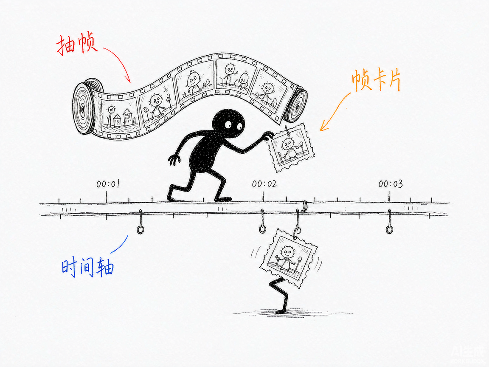
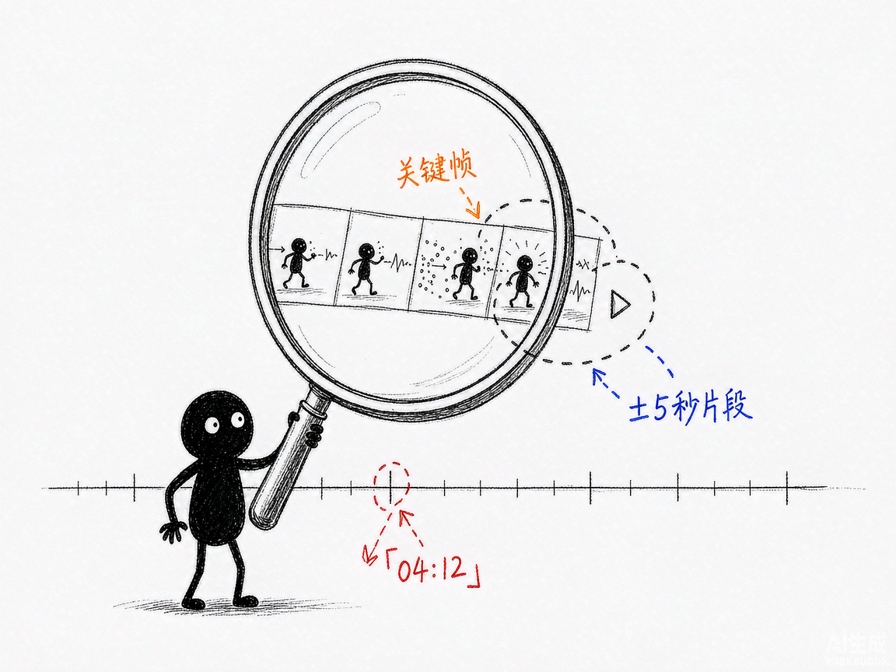

# 想问视频"这段动作到底怎么发生的"？让 AI 按秒给你答案—— glm-5.3-flash-vision-video-rag 介绍

你有一段比赛录像、监控片段或者教学视频，想问"第二次团战是怎么输的""爆炸是几点发生的"。可视觉模型根本没有"视频模态"——实测把视频文件直接丢进去，GIF 只解码首帧。你真正想要的是：问一句话，拿到带 `[MM:SS]` 时间戳的答案，还能把那几秒的片段切出来自己看。

**glm-5.3-flash-vision-video-rag 就是来解决这件事的。**

你给它一段视频和一个问题，它还你带时间码的答案、关键时刻的关键帧、可播放的 ±5 秒片段，外加一份内嵌播放器的 HTML 预览页。基于智谱视觉大模型 GLM-5.3-Flash。

---

## 它到底能做什么
- 时间轴建索引：ffmpeg 按时间顺序抽帧，视觉模型逐帧"观看"并写卡片——场景、画面摘要、关键词、可见文字（OCR）、相对前帧的事件、运动强度。一次建完永久复用。
- 带时间码的答案：每个论点标注 `[MM:SS]`，精确定位事件发生的时刻。
- 可播放片段回显：自动切出关键时刻前后 5 秒的 mp4，直接播放核对。
- 微观层自动升级：问动作细节时（一次甩枪只有 150–250 毫秒），自动对该时刻用 12fps 中心放大逐帧重看，给出逐帧攻防链。
- 帧级 OCR：汇总画面里出现过的招牌、字幕、HUD 文字。
- 剧情总结：按时间顺序还原事件脉络。
- 灵活导出：`show.py` 可单独出某时刻高清帧、可播放片段、高帧率放大序列。
- 长片自适应：≤10 分钟降到 0.5fps、≤30 分钟降到 0.25fps，几小时的监控自动降到 0.1fps 建全局索引。

## 怎么用
你不需要懂抽帧和检索。在 codex / workbuddy 等 agent 装好 skill、配好 GLM key 后，直接对 AI 说话就行：
**场景 1：先让 AI 把视频看一遍**
你：帮我看看这段录像。
AI：它按时间轴抽帧阅读建立索引（15 秒视频约 18 秒完成），同时用场景切换检测标出剪辑点。
**场景 2：问一个具体事件**
你：爆炸是几点发生的？
AI：它本地粗筛候选段、视觉模型看图确认、再深读作答——给出带 `[MM:SS]` 的答案，并切出该时刻前后 5 秒的可播放片段。
**场景 3：抠动作细节**
你：玩家瞄准有什么问题？
AI：它自动升级到 12fps 中心放大逐帧分析，输出逐帧动作分解，并把关键帧和 HTML 预览页（内嵌播放器）一起给你。

## 谁适合用
- 做比赛复盘、需要抠动作细节的教练和电竞选手。
- 要从监控录像里定位事件的安防和运营人员。
- 想从教学视频、录屏里检索"讲过什么"的内容从业者。

## 一点说明
glm-5.3-flash-vision-video-rag 是一套 AI 技能，装进 codex / workbuddy 等 agent 后对话使用，需要自备 GLM API key（写在 `~/.glm_api_key` 或环境变量），依赖 ffmpeg/ffprobe 在 PATH。模型没有音频模态——一切理解基于画面，音轨被忽略，"听到了什么"回答不了，枪声、台词只能靠画面痕迹推断（产出里会注明）。宏观 1fps 引用误差约 ±2 秒，动作类问题会自动升级 12fps 微观（约 0.08 秒粒度）。姊妹版 `deepseek-v4-flash-vision-video-rag` 用 DeepSeek 引擎，架构同构。

## 闲鱼接单文案

> 以下服务展示在闲鱼 / 淘宝服务市场发布，用于承接本 skill 的定制开发订单。

**标题：视频理解问答RAG（时间码定位+片段回显）skill软件开发**

**描述：**

专注 AI Agent 技能（skill）定制开发，已做出"让 AI 看懂视频并按秒作答"的成品技能，现成作品可先看演示再下单。输入一段视频，自动抽帧建时间轴索引，提问后返回带 `[MM:SS]` 时间码的答案，并切出对应时刻的可播放片段与关键帧，动作类问题自动升级高帧率微观逐帧分析，生成内嵌播放器的自包含 HTML 预览页。支持按你的视频类型定制抽帧密度与检索策略，交付后装进 codex / workbuddy 等 AI 助手即可使用，全部源码交付、支持二次开发。

**服务内容：**

- 1、需求沟通梳理：先聊清楚你的视频类型（赛事/监控/教学/录屏）、时长范围和常问的问题类型，确认 GLM 账号与额度，列明功能清单后再动手
- 2、skill交付内容和格式：带时间码的答案 + 关键时刻关键帧（JPEG）+ 可播放片段（mp4）+ 内嵌播放器的自包含 HTML 预览页
- 3、项目功能/系统开发：按你的视频特点定制抽帧密度、帧卡片字段、微观层触发规则与片段裁剪逻辑的开发与联调
- 4、skill源码交付：SKILL.md 技能说明 + 提示词 / 脚本 / 缓存结构 / 生成样例组成的完整技能工程，兼容 codex / workbuddy 等 agent。全部源码 + 安装部署说明 + 使用演示，交付后可自行修改维护
