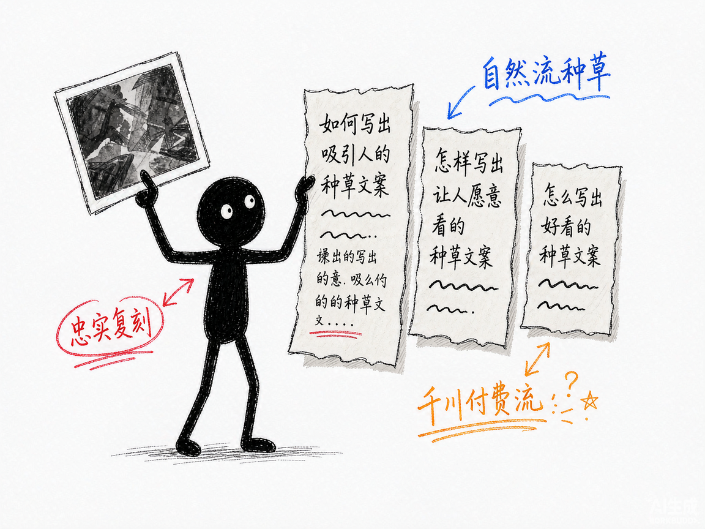

# 同款带货爆款，换个引擎拆会更准吗？—— glm-ecom-video-seedance-prompt 介绍

你刷到一条带货视频卖爆了，想让 AI 照着再来一条。可"拍一个好看的视频"这种提示词只能换回一坨废片，真正能出片的是"主体+动作时序+场景光影+镜头语言+色调情绪"全写齐的分镜级提示词——而把一条视频拆成这个粒度，靠人肉逐帧看要盯半天。

**glm-ecom-video-seedance-prompt 就是来解决这件事的。**

你给它一条带货视频，它还你一套可以直接粘贴进即梦（Seedance）的完整提示词包，每条镜头提示词旁边就摆着原片关键帧，逐镜对照。基于智谱 GLM-5.3-Flash 视觉大模型。

---

## 它到底能做什么
- 整段直传拆解：≤40MB 且 ≤120s 的视频默认整段丢给 GLM 原生视频理解，单次调用出全部分镜表，成本约为抽帧方式的 1/5，动作时序还带真实子时间戳；更长更大的视频自动回落到抽帧管线。
- 镜头级拆解卡：景别、视角、景深、运镜、光影、色彩、主体（人+产品）、动作时序、物理交互、字幕、卖点，一项项拆清楚。
- 全局带货分析：产品品类、人物设定、带货框架、自然流还是付费流、钩子在哪、卖点是什么、节奏怎么排。
- 提示词包一次给全：每镜头 ≤200 字（带时间锚点）+ 完整版 ≤800 字（直接粘贴）+ 中英双语负面词 + @参考图清单 + 差异说明与升级建议。
- 三种风格开关：忠实复刻、自然流种草、千川付费流，同一份分镜表可反复换风格重出。
- 产品信息注入：`--product` 告诉它你卖的到底是什么，卖点和负面词随之定制。
- 单镜头重出：`--shot B` 只重出不满意的镜头，其他不动。
- 逐镜对照 HTML：提示词和原片关键帧并排，肉眼核对拆解得准不准。

## 怎么用
你不需要记复杂流程。在 codex / workbuddy 等 agent 装好 skill、配好 GLM key 后，直接对 AI 说话就行：
**场景 1：拆解一条爆款视频**
你：帮我拆解这条带货视频。
AI：它把视频拆成若干镜头，逐个做 S-A-C-S-C 拆解卡，再给出全局分析（品类、框架、流量类型、钩子、卖点），存成可反复用的分镜表。
**场景 2：照着复刻一版**
你：按忠实复刻给我提示词。
AI：它结合分镜表生成每镜头提示词、完整版、负面词和参考图清单，并附一份与原片的差异说明。
**场景 3：按我的产品改一版投放用的**
你：改成千川付费流，我卖的是 XX 品牌精华液，主打烟酰胺美白，蓝色玻璃瓶身。
AI：它按付费流规则改写——强化钩子、极致特写、硬光侧逆光、加快节奏，并把你的产品信息注入卖点和负面词。

## 谁适合用
- 做电商带货、想批量复刻爆款结构的商家和投手。
- 帮客户做短视频的信息流代理商、编导。
- 已经在用 DeepSeek 版、想换个引擎互相校验效果的人。

## 一点说明
glm-ecom-video-seedance-prompt 是一套 AI 技能，装进 codex / workbuddy 等 agent 后对话使用，需要自备 GLM API key。它产出的是提示词，成片要到即梦里生成。编导方法论知识库与 DeepSeek 版完全共用（S-A-C-S-C 五要素、字数法则、自然流 vs 付费流五维差异、负面词模板）。无音频模态，口播靠画面和字幕推断，准确口播建议自己补（15 秒配约 120 字）。有意思的是双引擎会对同一条片给出不同判断（实测一条广告 DeepSeek 判"自然流"、GLM 判"付费流"），拿不准时两边都跑一下互相校验反而更稳。

## 闲鱼接单文案

> 以下服务展示在闲鱼 / 淘宝服务市场发布，用于承接本 skill 的定制开发订单。

**标题：带货视频AI拆解复刻提示词（GLM视觉引擎）skill软件开发**

**描述：**

专注 AI Agent 技能（skill）定制开发，已做出"整段视频直传视觉模型、一次出全部分镜表"的成品技能，现成作品可先看演示再下单。输入一条带货视频，自动拆解镜头并生成每镜头提示词、完整版提示词、中英负面词和参考图清单，支持忠实复刻/自然流/付费流三种风格切换，产出逐镜对照 HTML。支持按你的品类定制编导规则与负面词库，交付后装进 codex / workbuddy 等 AI 助手即可使用，全部源码交付、支持二次开发。

**服务内容：**

- 1、需求沟通梳理：先聊清楚你的品类、投放渠道（自然流/千川）、常复刻的视频风格，确认 GLM 账号与额度，列明功能清单后再动手
- 2、skill交付内容和格式：镜头拆解分镜表（JSON）+ 每镜头提示词 + 完整版提示词 + 中英负面词 + 参考图清单 + 逐镜对照 HTML
- 3、项目功能/系统开发：按你的品类定制拆解字段、编导规则知识库、风格模板与负面词库的开发与联调
- 4、skill源码交付：SKILL.md 技能说明 + 提示词 / 脚本 / 知识库 / 生成样例组成的完整技能工程，兼容 codex / workbuddy 等 agent。全部源码 + 安装部署说明 + 使用演示，交付后可自行修改维护
