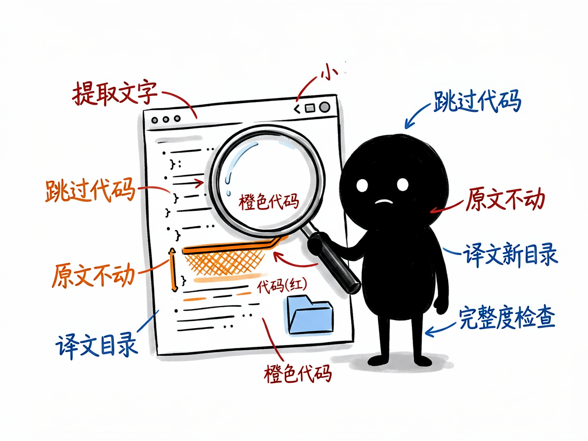

# 想把网站或代码做成多语言？这两个助手一个管网页、一个管源码 —— i18n-helper-skills-main 介绍

你的网站或产品想出海、想做繁体或日文版，可面对一堆 HTML 页面或几千行源码里的"保存成功""欢迎使用"，整个人都麻了：到底哪些要翻、怎么翻、翻完怎么不破版？手动改既慢又容易漏。

**i18n-helper-skills-main 就是来解决这件事的。**

它其实是一套"翻译助手合集"，里面有两个分工明确的 skill：**html-i18n** 管纯静态网页，**i18n-helper** 管编程框架的源码。你给它一个站点或一段代码，它还你一套整理好的多语言版本或翻译文件，而且会跳过代码、URL 这些不该翻的东西。

---


## 它到底能做什么

- **html-i18n（静态网页翻译）**：扫描你的 .html 文件，提取出可翻译的文字，生成各语言的独立目录（如 `en/`、`ja/`、`zh-TW/`）。原中文版一个字都不动，译文输出到新目录，CSS 和图片全站共享，对搜索引擎友好。
- 提取时会自动跳过代码块、链接地址、CSS 类名，避免把"技术零件"也翻成外文。
- 简体转繁体可以直接用自带的 `zhconv.py` 做字形+术语映射，不用逐字手改。
- **i18n-helper（源码国际化）**：扫描 React / Vue / Laravel / WordPress / Python / Java / Go 等源码里的"硬编码"中文，把它们换成翻译函数（如 `t()`、`__()`、`trans()`），并生成对应语言文件（JSON / YAML / PO / XLIFF / PHP 数组等）。
- 配套 Python 脚本只依赖标准库，不用额外装包；翻译那一步由 AI 按术语表统一译法完成。
- 最后做完整性检查，告诉你每种语言翻了多少、漏了哪些。

## 一个具体例子

静态网页翻译（html-i18n）：

```bash
# 1. 提取可翻译文本，生成 locales/zh-CN.json
python skills/html-i18n/scripts/extract.py 你的站点/

# 2. 复制 zh-CN.json 改名成 en-US.json，把值换成英文

# 3. 用译文回填，生成英文站目录
python skills/html-i18n/scripts/apply.py 你的站点/ 你的站点/locales/en-US.json 你的站点/en --lang en

# 4. 检查翻译完整度
python skills/html-i18n/scripts/check.py 你的站点/locales
```

源码国际化（i18n-helper）则多为 AI Agent 在识别项目框架后自动跑扫描、替换和生成语言文件。



## 谁适合用

- 个人站长、文档站/博客作者，想给纯 HTML 站点做多语言版。
- 开发者，要给 React / Vue / Laravel / WordPress 等项目加 i18n 支持。
- 小团队，没有专业本地化流程，想低成本把产品"出海"或做繁体。

## 一点说明 / 小提示

怎么选是关键：项目里**只有 .html/.css/图片、没源码** → 用 html-i18n；**有 .js/.vue/.php 等源码** → 用 i18n-helper，两者互补不重叠，别用错。它不是全自动翻译机——脚本负责提取/回填/检查，真正"翻译"那一步要由 AI 或你来完成，长正文建议逐段精译而非纯机器映射。这是给"会用 AI Agent 或命令行的人"用的 skill 合集，不是图形界面软件；具体支持的语言和框架以项目 README / SKILL.md 为准。
