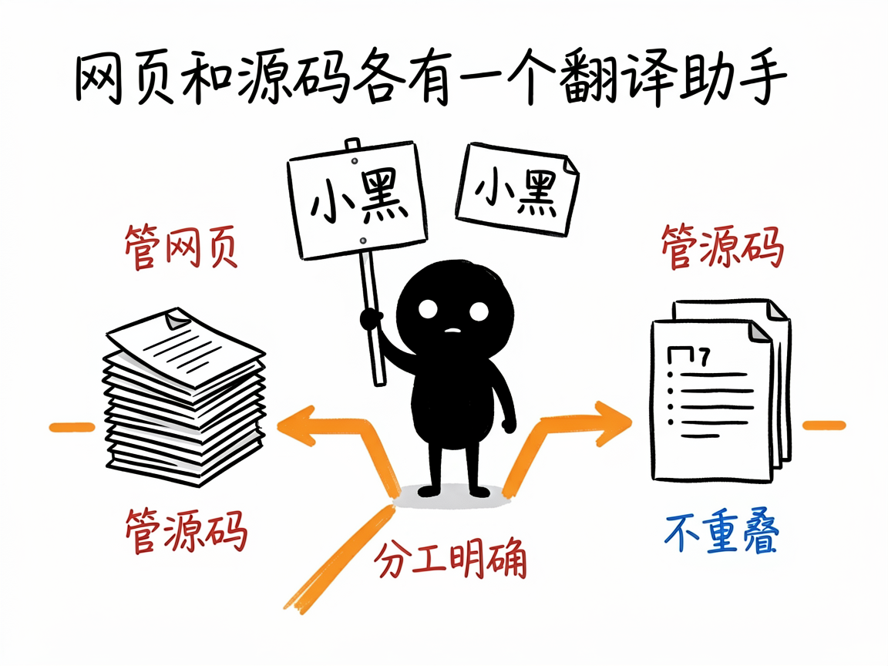

# 想把网站或代码做成多语言？这两个助手一个管网页、一个管源码 —— i18n-helper-skills 介绍

你的网站或产品想出海、想做繁体或日文版，可面对一堆 HTML 页面或几千行源码里的"保存成功""欢迎使用"，整个人都麻了：到底哪些要翻、怎么翻、翻完怎么不破版？手动改既慢又容易漏。

**i18n-helper-skills 就是来解决这件事的。** 它其实是一套"翻译助手合集"，里面有两个分工明确的技能：**html-i18n** 管纯静态网页，**i18n-helper** 管编程框架的源码。你给它一个站点或一段代码，它还你一套整理好的多语言版本或翻译文件，而且会跳过代码、链接这些不该翻的东西。

## 它到底能做什么

- **html-i18n（静态网页翻译）**：扫描你的 .html 文件，提取出可翻译的文字，生成各语言的独立目录（如 `en/`、`ja/`、`zh-TW/`）。原中文版一个字都不动，译文输出到新目录，样式和图片全站共享，对搜索引擎友好。
- 提取时会自动跳过代码块、链接地址、样式类名，避免把"技术零件"也翻成外文。
- 简体转繁体可以直接做字形+术语映射，不用逐字手改。
- **i18n-helper（源码国际化）**：扫描 React / Vue / Laravel / WordPress / Python / Java / Go 等源码里"写死"的中文，把它们换成框架通用的翻译函数调用，并生成对应语言文件（支持 JSON / YAML / PO / XLIFF / PHP 数组等格式）。
- 翻译那一步由 AI 按统一的术语表来译，保证同一词前后译法一致。
- 最后做完整性检查，告诉你每种语言翻了多少、漏了哪些。

## 怎么用

你不需要记任何命令。在 codex / workbuddy 等 agent 装好 i18n-helper-skills 里的对应技能后，直接对 AI 说话就行：

**场景 1：纯 HTML 小站想出英文版**
你：我有个纯 HTML 做的小站，帮我出一份英文版，中文原版一个字都别动。
AI：它扫描所有页面、抽出可翻译文字，自动跳过代码和链接，生成英文目录和译文，原站保持不动，样式图片照常共用。

**场景 2：React 项目要加多语言**
你：我们这个 React 项目里中文都写死在代码里了，帮我改成支持中英文，别破版。
AI：它识别项目框架，把写死的中文换成通用翻译函数调用，生成中英文语言文件，并做完整性检查告诉你漏了哪些。

**场景 3：先看看翻得全不全**
你：刚才翻完一轮，帮我检查一下各语言都翻全了没有，有没有漏的。
AI：它逐语言统计翻译完成度，把没翻到的条目列出来给你补，避免发布后才发现缺字。

## 谁适合用

- 个人站长、文档站/博客作者，想给纯 HTML 站点做多语言版。
- 开发者，要给 React / Vue / Laravel / WordPress 等项目加多语言支持。
- 小团队，没有专业本地化流程，想低成本把产品"出海"或做繁体。

## 一点说明

怎么选是关键：项目里**只有 .html / 样式 / 图片、没源码** → 用 html-i18n；**有 .js / .vue / .php 等源码** → 用 i18n-helper，两者互补不重叠，别用错。它不是全自动翻译机——提取、回填、检查由技能完成，"翻译"那一步要由 AI 或你来定稿，长正文建议逐段精译而非纯机器映射。它是装在 AI agent 里的技能合集（不是图形界面软件）；具体支持的语言和框架以项目说明文档为准。

## 闲鱼接单文案

> 以下服务展示在闲鱼 / 淘宝服务市场发布，用于承接本 skill 的定制开发订单。

**标题：网站多语言国际化（i18n）skill软件开发**

**描述：**

专注 AI Agent 技能（skill）定制开发，已做出网页 + 源码双管的多语言技能合集，现成作品可先看演示再下单。html-i18n 管纯静态网页：生成 en / ja / zh-TW 等独立语言目录，原版一个字不动，自动跳过代码块和链接；i18n-helper 管框架源码：把 React / Vue / Laravel / WordPress / Python / Java / Go 里写死的中文换成通用翻译函数，生成 JSON / YAML / PO 等语言文件，统一术语表保证译法一致，最后出完整性检查报告。全部源码交付、支持二次开发。

**服务内容：**

- 1、需求沟通梳理：先聊清楚项目类型（纯 HTML 站还是带源码的工程）、目标语言和术语要求，确认站点 / 代码可访问，列明功能清单后再动手
- 2、skill交付内容和格式：多语言网站目录或语言文件包（原版不动、代码链接不误翻、术语前后一致）+ 每种语言的翻译完成度检查报告
- 3、项目功能/系统开发：按你的技术栈定制提取规则、术语表与回填流程，可扩展自动化批量翻译等功能的开发与联调
- 4、skill源码交付：SKILL.md 技能说明 + 提示词 / 脚本 / 模板 / 翻译文件样例组成的完整技能工程，兼容 codex / workbuddy 等 agent。全部源码 + 安装部署说明 + 使用演示，交付后可自行修改维护
