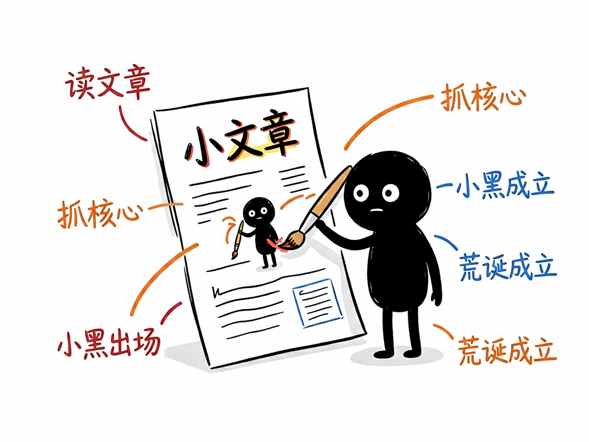
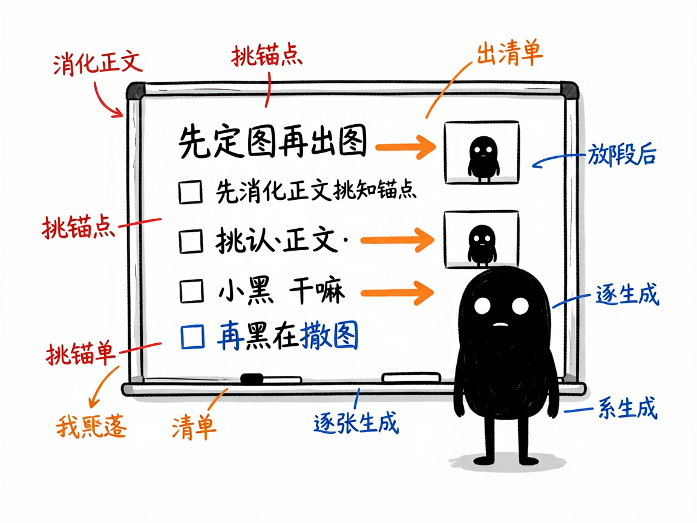

# 文章写好了却愁配图？让"小黑"把你的观点画成清爽怪诞的手绘图 —— ian-xiaohei-illustrations 介绍

写文章最尴尬的环节之一，就是配图：网上扒的图版权说不清，PPT 风的信息图又太死板，找设计师排期又等不起。你真正想要的，是几张"读得懂、不土、和文字严丝合缝"的插图，最好还能批量来。

**ian-xiaohei-illustrations 就是来解决这件事的。** 你给它一篇中文文章，它还你一组 16:9 横版的手绘正文配图——纯白底、黑色线稿、少量红橙蓝中文批注，主角是一个叫"小黑"的怪诞小人和你文章里的核心观点一起"做一件荒诞但成立的事"。它专做"正文配图"，不是商业插画、也不是可爱卡通。

## 它到底能做什么

- 先"消化正文"：读你的文章，挑出最适合用图表达的"认知锚点"——核心判断、前后对比、流程闭环、常见坑、状态变化等，而不是平均撒图。
- 先出配图策略（shot list）：每张图标明放哪段后、讲什么、小黑在干嘛、建议元素和中文标注词，默认 4–8 张，短文 1–3 张。
- 把文章里的判断/流程/结构/隐喻，变成一张清爽、怪诞、可读但不像说明书的手绘解释图。
- 默认视觉 IP 是"小黑"：黑实心、白点眼、细腿、空表情，必须参与画面核心动作，不能只站旁边当装饰。
- 生成后做质量检查：太满、太像 PPT、小黑变装饰、背景不干净等问题会重画或修。
- 支持三种交付方式：直接嵌链接（最省事）、存到本地（适合公众号发稿）、转成内嵌编码（网络不稳时兜底）。

## 怎么用

你不需要记任何命令。在 codex / workbuddy 等 agent 装好 ian-xiaohei-illustrations 技能后，直接对 AI 说话就行：

**场景 1：写完长文要配一套图**
你：这篇讲"拖延症"的文章写好了，帮我配 5 张小黑风格的正文插图，要在关键段落后面。
AI：它先消化全文、挑出 5 个认知锚点，给你一份配图清单（每张放哪、小黑在干嘛、标什么词），确认后逐张出图并插回文章对应位置。

**场景 2：只要几张图不要动文字**
你：我这篇已有文章只想加配图，文字一个字都别改。
AI：它只走配图流程，分析文章的认知锚点产出图清单，生成小黑风格配图插回去，完全不碰你的文字。

**场景 3：先打个样再批量**
你：先帮我出一张样图看看风格对不对，对了再批量出剩下的。
AI：它先出一张小样验证整体效果，你满意后再把整批图一次性生成，避免网络不稳时白忙活。

## 谁适合用

- 公众号/博客作者，给文章配统一风格的插图（它常被写作类技能调用）。
- 做方法论、流程、结构类内容的人，需要把抽象概念画清楚。
- 知识博主、文档整理者，想让长文不再只有字。

## 一点说明

它的定位是"正文配图"，不是封面大图、也不是品牌吉祥物设计。每张图只讲一个核心结构，且要求每次从当前文章重新发明隐喻，不照抄过往案例。它是装在 AI agent 里的一个技能（不是图形界面软件）；出图依赖外部生图接口，连通性和图片托管稳定性会影响最终效果，具体以项目说明文档为准。

## 闲鱼接单文案

> 以下服务展示在闲鱼 / 淘宝服务市场发布，用于承接本 skill 的定制开发订单。

**标题：文章手绘配图生成（小黑风格）skill软件开发**

**描述：**

专注 AI Agent 技能（skill）定制开发，已做出小黑手绘配图技能，现成作品可先看演示再下单（本文整套插图就是它画的）。读你的文章挑出认知锚点，先出配图清单（每张放哪段、小黑在干嘛、标注什么词），再逐张生成 16:9 手绘图：纯白底、黑色线稿、少量红橙蓝中文批注，"小黑"怪诞小人必须参与画面核心动作，出图后自动做质量检查不达标重画。支持批量出图和多种交付格式，全部源码交付、支持二次开发。

**服务内容：**

- 1、需求沟通梳理：先聊清楚文章内容、配图数量（短文 1–3 张、长文 4–8 张）和交付方式（嵌链接 / 本地文件 / 内嵌编码），列明功能清单后再动手
- 2、skill交付内容和格式：配图清单（shot list）+ 16:9 小黑风格手绘配图成图（已插回文章对应位置或独立交付）
- 3、项目功能/系统开发：按你的内容类型定制视觉动作、标注风格与出图数量，可扩展整套账号视觉规范等功能的开发与联调
- 4、skill源码交付：SKILL.md 技能说明 + 提示词 / 脚本 / 模板 / 图片样例组成的完整技能工程，兼容 codex / workbuddy 等 agent。全部源码 + 安装部署说明 + 使用演示，交付后可自行修改维护
