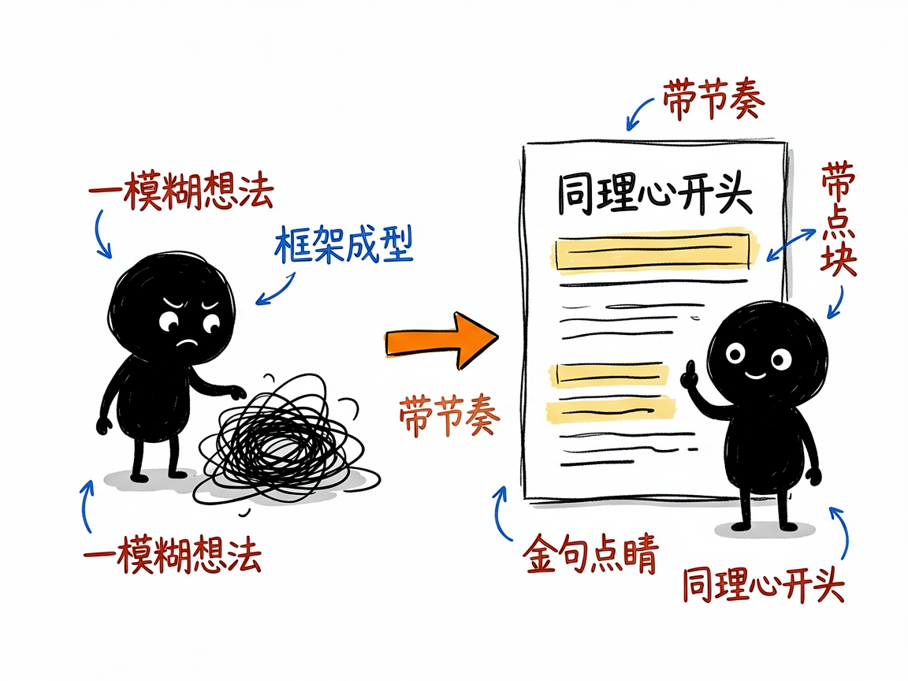
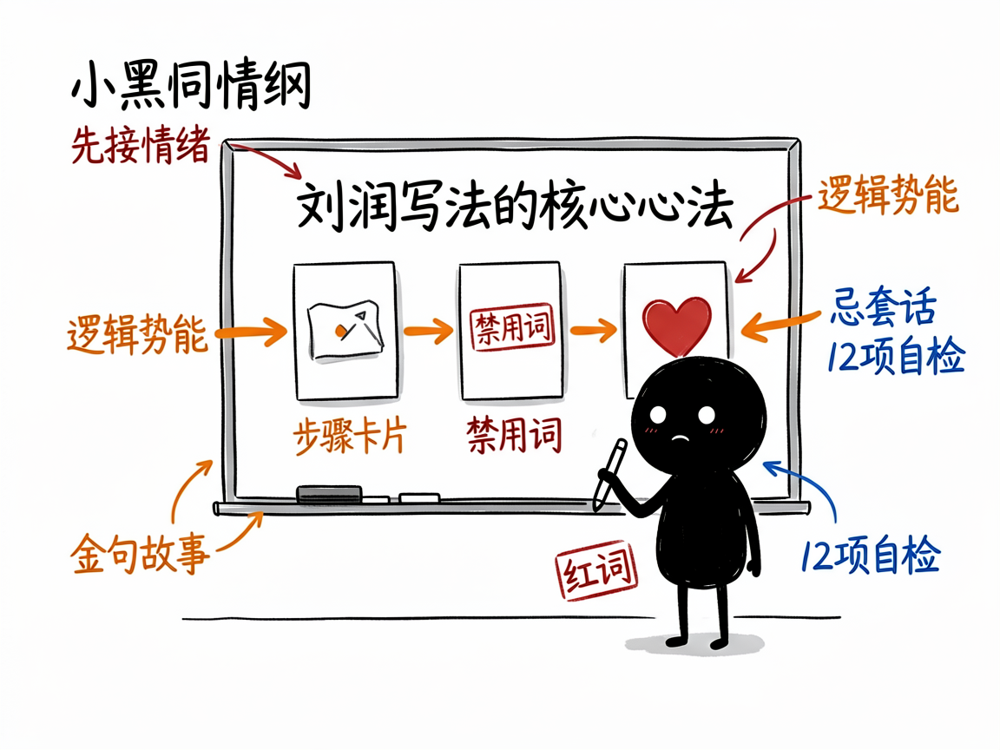

# 想写出"刘润式"有洞察的商业长文？让这个助手替你搭好骨架 —— liurun-bookwriter 介绍

你是不是也遇到过这种情况：脑子里有个商业观点想写下来，可一打开文档就卡住——开头怎么抓人？结构怎么排？金句从哪来？最后写出来的东西要么像流水账，要么满篇"赋能""底层逻辑"这种自己也别扭的词。

**liurun-bookwriter 就是来解决这件事的。** 你给它一个商业选题，它还你一篇有同理心、有逻辑势能、带金句的商业长文，而且通篇是刘润那股"替读者着想"的味儿。它把刘润 28 年商业写作经验（来自《我这28年的写作心法》《5分钟商学院》）提炼成一套可直接用的框架，不是简单套模板，而是真把"怎么写"教给 AI。

## 它到底能做什么

- 用三种成稿结构帮你写：最简单的**3段式**（适合商业评论、方法论）、珍珠项链般的**10点式**（适合案例拆解、企业参访）、克制的**32条**（适合事件评论、热点回应）。
- 自动套用"逻辑势能"。说人话就是：它先想清楚"先抛答案还是先抛冲突"，让文章有节奏地往下冲，而不是平铺直叙。
- 每篇都塞进"金句、故事、比方"这类内容块，让文章有记忆点，不是干巴巴讲道理。
- 帮你把用词拿捏到位：短、准、改。它会主动避开"大家""赋能""综上所述"这些刘润自己都嫌弃的词。
- 带着"同理心"开头——想象读者此刻正在地铁上、在午休、在深夜焦虑，先接住对方的情绪再开讲。
- 写完后做 12 项质量自检（禁用词、句长、人称频率等），不合格会标出来。

## 怎么用

你不需要记任何命令。在 codex / workbuddy 等 agent 装好 liurun-bookwriter 技能后，直接对 AI 说话就行：

**场景 1：热点来了想抢评**
你：用刘润的风格写一篇关于鸿蒙的 32 条评论。
AI：它识别成"32条"结构，选定逻辑势能，调研素材，按心法逐条撰写，每写完一条停下来等你确认，最后做 12 项质量自检再交稿。

**场景 2：企业参访要出案例稿**
你：我刚去一家做储能的公司参访完，帮我用 10 点式写一篇案例拆解，突出它的商业模式。
AI：它按"珍珠项链"结构把参访所得串成 10 个有故事、有金句的点，开头先用同理心接住读者，整篇是刘润那股替读者着想的味儿。

**场景 3：想写篇方法论**
你：帮我用 3 段式写一篇"小公司怎么招到对的人"的方法论文章。
AI：它搭好"问题—分析—行动"的三段骨架，填充金句和比方，避开那些自己也别扭的词，给你一篇干净利落的方法论。

## 谁适合用

- 公众号作者、商业自媒体，想稳定产出有质感的商业评论。
- 企业市场/品牌人员，要写方法论文章、案例拆解、企业家专访。
- 知识博主，想把"观点"讲出结构和说服力。
- 做 AI 写作类产品的团队，可把它当成一个高质量"风格框架"来复用。

## 一点说明

它最擅长的是有商业洞察的长文，但边界也清楚：写不了学术论文、纯小说、朋友圈那种超短文案，也做不了需要复杂图表的财务报告。它帮你把"写法"做到位，但替不了你自己的商业思考和真实调研——涉及数据、案例时它要求标注来源和时效。它是装在 AI agent 里的一个技能（不是独立打开的 App），装好后你直接在对话框里用就行；具体能调到什么程度，以项目的说明文档为准。

## 闲鱼接单文案

> 以下服务展示在闲鱼 / 淘宝服务市场发布，用于承接本 skill 的定制开发订单。

**标题：刘润式商业长文写作 skill软件开发**

**描述：**

专注 AI Agent 技能（skill）定制开发，已做出刘润风格写作技能，现成作品可先看演示再下单。把《我这28年的写作心法》《5分钟商学院》的写法拆成可执行框架：3 段式 / 10 点式 / 32 条三种成稿结构，自动安排逻辑势能和同理心开头，每篇配金句、故事、比方，主动避开"赋能"这类禁用词，写完做 12 项质量自检。适合商业评论、案例拆解、热点回应，可按你的公众号调性定制，全部源码交付、支持二次开发。

**服务内容：**

- 1、需求沟通梳理：先聊清楚商业选题、目标读者和文体（商业评论 / 案例拆解 / 热点回应），确认素材和引用来源，列明功能清单后再动手
- 2、skill交付内容和格式：完整商业长文稿：选定成稿结构、逻辑势能编排、金句故事比方、同理心开头、12 项自检结果（可直接发布的文章稿）
- 3、项目功能/系统开发：按你的公众号调性定制结构模板、禁用词表与自检规则，可扩展系列专栏批量产出等功能的开发与联调
- 4、skill源码交付：SKILL.md 技能说明 + 提示词 / 脚本 / 模板 / 文章样例组成的完整技能工程，兼容 codex / workbuddy 等 agent。全部源码 + 安装部署说明 + 使用演示，交付后可自行修改维护
