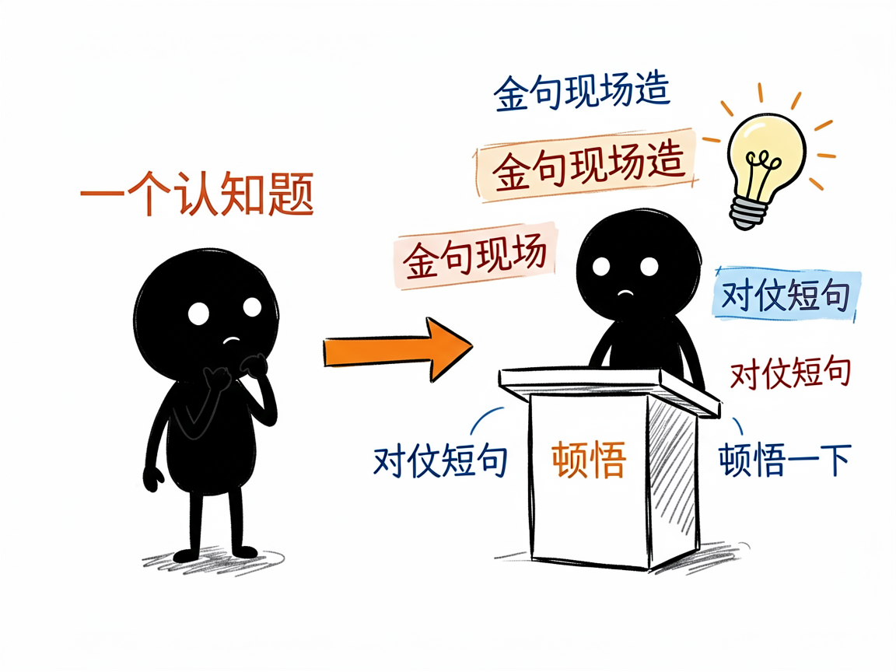
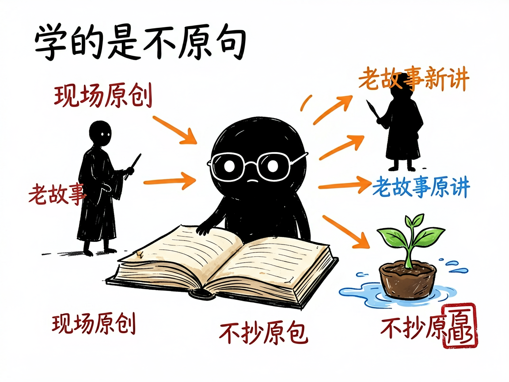

# 想写出"罗振宇式"有启发的好文章？这个助手帮你把金句和故事安排明白 —— luozhenyu-bookwriter 介绍

你有没有过这种感觉：听罗振宇讲东西特别带劲——几句对仗短句就让你"哦"地一下，一个历史人物的故事就把道理说透了。可自己提笔，写出来的全是"我们要相信""加油"这种自己也知道没劲的话。

**luozhenyu-bookwriter 就是来解决这件事的。**

你给它一个认知类选题，它还你一篇有启发、有金句、有故事、带"躬身入局"劲头的文章，语气像罗振宇。它把罗振宇 14 年内容经验（《罗辑思维》、"罗胖60秒"、跨年演讲、《阅读的方法》《启发》等）拆成一套可执行的写法框架。

它和刘润那个是"同门不同味"：刘润偏商业洞察，罗振宇偏认知启发。一个开头常是"你可能正在……"，这个开头常是"我是罗胖……"。

---



## 它到底能做什么

- 支持三种结构：**罗胖60秒**（60-150字超短启发，适合热点快评）、**罗辑思维长文**（2000-4000字，适合认知升级、人物拆解）、**跨年演讲稿**（万字起，适合年度总结、大型演讲）。
- 自动套三种逻辑势能：TQA（触发-问题-答案）、CAA（具体-抽象-行动）、PEI（现象-解释-启发），让文章有起承转合。
- 强制"金句现场原创"：它不照搬罗振宇的原句，而是按公式（对仗式、反常识式、"一X就Y"式等）为你的主题现造金句，每千字至少 3 句。
- 帮你用历史人物讲现代道理（曾国藩、拿破仑、卢梭……），但要求每篇换新故事，不老拿同一批人凑数。
- 用"打比方"把抽象概念翻成生活里摸得着的东西（水、路、容器、种子），降低理解门槛。
- 写完后做 12 项质量自检，比如禁用词（"大家""鸡汤""震撼发布"）、句长上限（比刘润更短，≤40字）。

## 一个具体例子

直接对 AI 说：

```
用罗振宇的风格写一篇关于"AI 时代普通人怎么办"的跨年演讲体
```

AI 会：识别成跨年演讲稿→选 CAA 逻辑→调研素材→按 12 大心法写（金句故事现场原创）→自检→等你确认每个小主题。

它也能顺手导出 PDF：

```bash
python scripts/export_pdf.py article.md -o article.pdf
```



## 谁适合用

- 知识博主、认知类自媒体，想稳定产出有启发的好文。
- 做个人成长、长期主义、读书分享内容的人。
- 需要写演讲稿、年度复盘、热点回应的人。
- 做 AI 写作产品的开发者，把它当"启发式风格框架"复用。

## 一点说明 / 小提示

它最讲究的一条原则是"学风格不抄句子"——金句、故事、比喻都必须为当前主题现场原创，直接套罗振宇代表作里的原句会被判不及格。它同样不擅长学术论文、纯虚构、朋友圈超短文案、财务报告这类。和刘润那个一样，它是给"会调 AI Agent 的人"用的 skill，不是普通人直接打开的软件；具体能力以项目 SKILL.md / README.md 为准。
