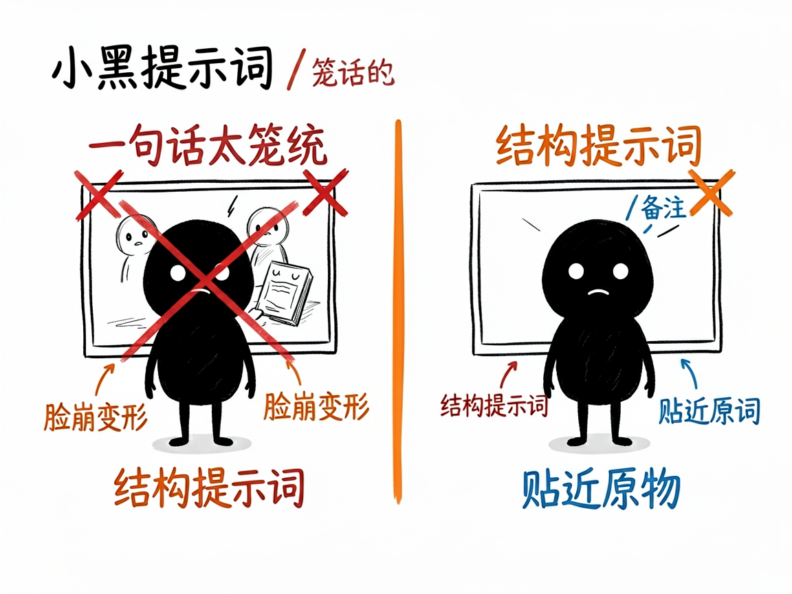
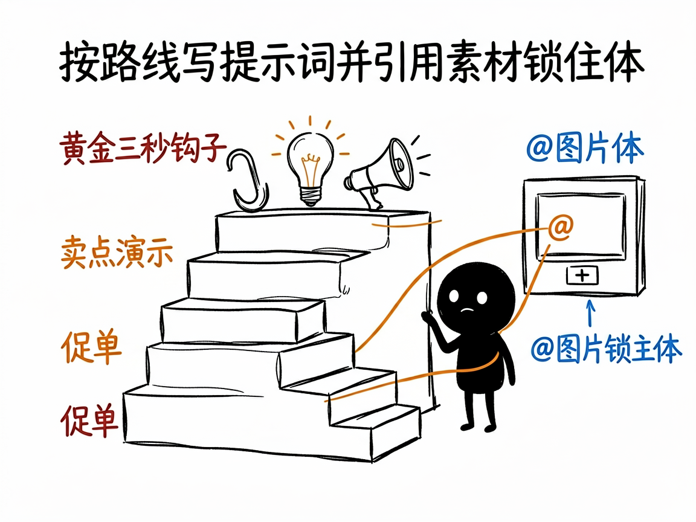

# 想用 AI 生成短视频，但不会写提示词？它帮你写出能用的分镜 —— make-prompt-seedance2 介绍

你听说即梦、豆包这些 AI 能直接把一句话变成视频，兴致冲冲试了，结果生成的不是你想要的：人物脸崩了、产品变形了、镜头乱跳。问题往往不在模型，而在你给的那句提示词太笼统。

**make-prompt-seedance2 就是来解决这件事的。** 你告诉它"我想做个什么视频"，它还你一份可以直接复制到即梦（Seedance 2.0，字节的 AI 视频模型）使用的完整分镜提示词。

## 它到底能做什么

- 先看懂你上传的参考图：产品长什么样、什么颜色材质，直接写进提示词，让 AI 生成更贴近原物。
- 自动判断你该走哪条路线：通用创意、抖音带货、品牌广告片、真人感探店、还是改已有的视频，各有不同写法。
- 带货视频会按"黄金 3 秒钩子 + 卖点演示 + 促单"的结构来写；广告片追求电影级质感；真人感路线专门做出"不像 AI"的手机随手拍效果。
- 支持引用素材语法：`@图片1 作为首帧`、`@视频1 参考运镜`，把你的图/视频喂给模型锁住主体。
- 写好的提示词可直接粘贴到即梦、小云雀、豆包使用。

## 怎么用

你不需要记任何命令。在 codex / workbuddy 等 agent 装好 make-prompt-seedance2 技能后，直接对 AI 说话就行：

**场景 1：给个产品图做带货视频**
你：我发了这张产品白底图，帮我做个抖音带货视频，要抓人、要讲卖点。
AI：它分析图片、诊断卖点痛点，按"基础参数、镜头语言、核心主体、商业场景、强制约束"五大模块产出提示词，并告诉你上传图片的顺序和 `@图片1` 的对应关系。

**场景 2：想拍条不像 AI 的探店**
你：我想做一条探店视频，要像手机随手拍的真人感，别一股 AI 味。
AI：它走"真人感探店"路线，写出带生活化运镜和真实氛围的分镜提示词，专门规避那种一眼假的 AI 质感。

**场景 3：已有视频想改一版**
你：我这条视频大致满意，帮我改一版更广告片的调性。
AI：它识别你走的是"改已有视频"路线，基于原片重写电影级质感的提示词，你拿去即梦生成就行。

## 谁适合用

- 想做 AI 短视频带货、种草、探店的电商人和博主。
- 需要做品牌广告片、产品展示的市场人员。
- 任何想用即梦/豆包生成视频、但被"怎么写提示词"卡住的人。

## 一点说明

它是一个跑在 AI 助手里的"提示词专家"技能，产出的是文字提示词，不是视频本身——视频要你拿去即梦等平台生成。注意它不支持写实的真人脸部素材。它是装在 AI agent 里的一个技能（不是独立软件）；具体能力以项目说明文档为准。

## 闲鱼接单文案

> 以下服务展示在闲鱼 / 淘宝服务市场发布，用于承接本 skill 的定制开发订单。

**标题：AI短视频提示词分镜编写 skill软件开发**

**描述：**

专注 AI Agent 技能（skill）定制开发，已写出即梦（Seedance 2.0）分镜提示词技能，现成作品可先看演示再下单。先看懂你上传的产品参考图（颜色、材质直接写进提示词），自动判断走通用创意、抖音带货、品牌广告片、真人感探店还是改片路线；带货按"黄金 3 秒钩子 + 卖点演示 + 促单"结构写，支持 @图片1 之类素材引用语法锁住主体，写好直接粘贴到即梦、小云雀、豆包就能用。可按你的品类定制，全部源码交付、支持二次开发。

**服务内容：**

- 1、需求沟通梳理：先聊清楚视频用途（带货 / 种草 / 广告 / 探店）、产品图和素材情况、想要的成片感觉，列明功能清单后再动手
- 2、skill交付内容和格式：五大模块完整分镜提示词（基础参数、镜头语言、核心主体、商业场景、强制约束）+ 素材上传顺序与 @引用对应说明（可直接粘贴即梦 / 小云雀 / 豆包使用）
- 3、项目功能/系统开发：按你的品类定制路线写法、钩子结构与强制约束库，可扩展批量出词等功能的开发与联调
- 4、skill源码交付：SKILL.md 技能说明 + 提示词 / 脚本 / 模板 / 提示词样例组成的完整技能工程，兼容 codex / workbuddy 等 agent。全部源码 + 安装部署说明 + 使用演示，交付后可自行修改维护
