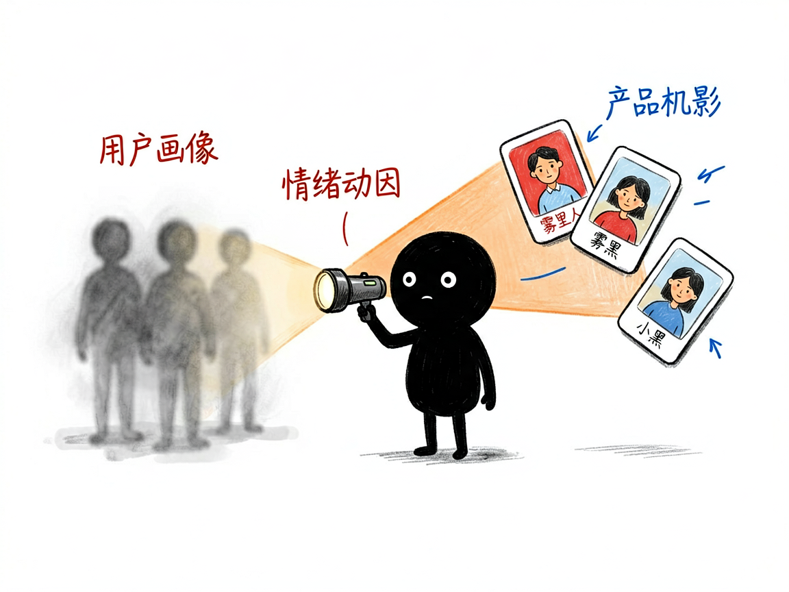
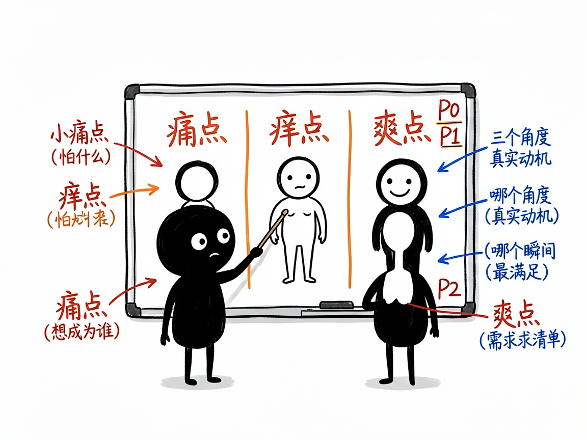

# 搞不清用户到底要啥？让它十分钟帮你把人看透 —— market-insight 介绍

很多人做产品或写文案时，最卡的一步不是"不会做"，而是"不知道用户在想啥"。你以为大家图便宜，其实人家要的是面子；你以为功能越多越好，其实用户只想要一个"啊哈"的爽点。传统做法要么花几万找咨询公司，要么约十几个人深访，又慢又贵。

**market-insight 就是来解决这件事的。** 你给它一个产品方向和一点背景，它还你一套能直接拿去写文案、做设计的用户洞察，十分钟就能有方向感。

## 它到底能做什么

- 画用户画像：避开"男女老少通吃"的陷阱，给你 4 类具象的用户（比如"乡愁味蕾固执派"），并标出谁最值得先抓。
- 拆情绪动因：从"痛点（怕什么）、痒点（想成为谁）、爽点（哪个瞬间最满足）"三个角度，挖出能直接写进广告的真实动机。
- 列产品机会：把情绪洞察转成按优先级排好的需求清单（P0 核心 / P1 重要 / P2 锦上添花），告诉你明天就能先干哪三件。
- 生成创业路线图（可选）：基于《小而美》方法论，把机会变成一人公司/小团队能落地的 6 步计划——社区定位、极简 MVP、前 100 个客户冷启动等。
- 按需选深度：你可以只要用户画像，只要情绪洞察，只要产品机会，或走完整四阶段。

## 怎么用

你不需要记任何命令。在 codex / workbuddy 等 agent 装好 market-insight 技能后，直接对 AI 说话就行：

**场景 1：刚冒出一个产品点子**
你：我想做个胡辣汤外卖，帮我做完整用户洞察。
AI：它先问你产品处于概念、开发还是上市阶段，然后一步步产出用户画像、情绪点、P0 机会，甚至一份 90 天创业手册。你拿到的不是空话，而是"85℃热汤逼出一身汗"这种有画面感的表达，能直接当文案用。

**场景 2：只想要用户画像**
你：我做了个考研笔记 app，先帮我画一下典型用户是谁。
AI：它给你几类具象用户画像，谁最值得先抓、他们分别在怕什么想成为什么，一眼看清。

**场景 3：找功能优先级**
你：我的宠物用品店该先上哪个功能？帮我排个优先级。
AI：它把用户情绪转成 P0/P1/P2 需求清单，告诉你明天就能先干哪三件，不纠结。

## 谁适合用

- 创业者和一人公司、自由职业者：想清楚"卖给谁、凭啥买"。
- 产品经理：找差异化和功能优先级。
- 市场/文案同学：挖情绪点，写出让人共鸣的内容。
- 想做副业、把技能变现的人：用"小而美"路线低成本启动。

## 一点说明

这是一个"思考框架型"技能，靠 AI 和你对话推演，不联网抓数据、也不依赖外部账号，普通人也能在 AI 助手对话里直接用。它给的是"方向感"不是"标准答案"——传统调研要花几万和一个月，它用十分钟换来的结论，最好再拿真实用户快速测一测。已融资、要快速规模化的公司，和重资产传统行业，不太适合它的"小而美"路线。

## 闲鱼接单文案

> 以下服务展示在闲鱼 / 淘宝服务市场发布，用于承接本 skill 的定制开发订单。

**标题：用户洞察与需求分析 skill软件开发**

**描述：**

专注 AI Agent 技能（skill）定制开发，已做出十分钟级用户洞察技能，现成作品可先看演示再下单。产出 4 类具象用户画像并标出优先人群，从痛点 / 痒点 / 爽点挖出能直接写进广告的情绪动因，把洞察转成 P0 / P1 / P2 排序的产品机会清单，还可选《小而美》方法论的 6 步创业路线图。思考框架型技能、不依赖任何外部账号，支持按你的行业做个性化定制，全部源码交付、支持二次开发。

**服务内容：**

- 1、需求沟通梳理：先聊清楚你的产品方向、所处阶段（概念 / 开发 / 上市）和最想要的产出（画像 / 情绪洞察 / 机会清单 / 全套），列明功能清单后再动手
- 2、skill交付内容和格式：4 类用户画像与优先人群、痛点痒点爽点情绪洞察、P0 / P1 / P2 产品机会清单、可选 6 步创业路线图（可直接用于文案和设计的洞察报告）
- 3、项目功能/系统开发：按你的行业定制画像维度、机会评估框架与路线图方法论，可扩展多产品线批量分析等功能的开发与联调
- 4、skill源码交付：SKILL.md 技能说明 + 提示词 / 脚本 / 模板 / 报告样例组成的完整技能工程，兼容 codex / workbuddy 等 agent。全部源码 + 安装部署说明 + 使用演示，交付后可自行修改维护
