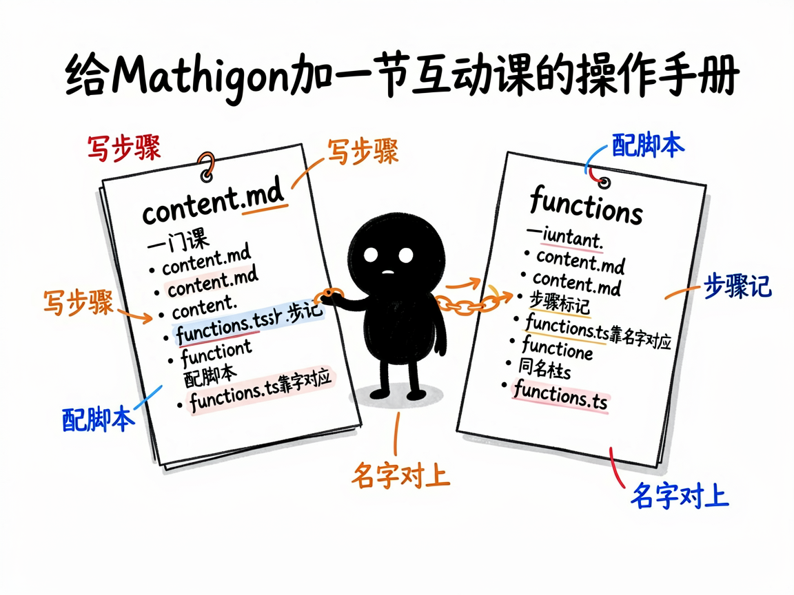

# 想动手做一套会互动的数学课本，该怎么上手 —— mathigon-skill 介绍

你大概听说过 Mathigon——那个把数学讲得特别漂亮的免费互动在线课本网站（圆、图论、数列、概率……点一点就能玩）。如果你想自己给它加一节课、改一段内容、或者把某个互动小元件做得更好，会卡在一个现实问题：它的内容是用一套专门的写作方式写的，格式、玩法、组件都有规矩，新手容易摸不着门。

mathigon-skill 就是来解决这件事的：你给它"我想改/加 Mathigon 的某一节内容"这样的任务，它帮你在 AI 里产出一份能直接照着改的操作指引——每一步该读哪个参考文档、课程内容文件怎么写、互动脚本怎么配、那些带 x-开头的互动组件怎么用，避免你乱改把课本弄坏。

## 它到底能做什么
- 它是一份"如何编写 Mathigon 互动课程"的操作手册，专门服务于 Mathigon 课本仓库里的内容（每门课由内容文件、互动脚本、样式三件套组成）。
- 讲清核心心智模型：一门课是一串"步骤"，每步在内容文件里用标记声明，需要自定义互动时再配一个对应的脚本函数，两者靠名字自动对应。
- 告诉你写不同类型内容该先读哪份参考：写文章用"Markdown 方言"指南，写互动脚本用"函数模型"指南，用几何画板、滑块、方程等组件时该查什么。
- 覆盖怎么调用 Mathigon 自带的工具库（画点、随机、动画、滑动等），怎么在浏览器里本地预览、怎么做代码检查。
- 专门强调中文课程的非显眼规则：每个小节必须显式写英文段落标识，否则后面的小节会打不开。
- 提醒"几何图别凭感觉乱画"：涉及长度、角度、坐标时，必须先实打实算一遍再写，避免图看着对其实错。

## 怎么用

你不需要记任何命令。在 codex / workbuddy 等 agent 装好 mathigon-skill 技能后，直接对 AI 说话就行：

**场景 1：加一节新课后**
你：我想给 Mathigon 加一节讲"斐波那契数列"的互动课，你一步步告诉我怎么做。
AI：AI 调出这份操作手册，告诉你先读哪份参考、课程内容文件怎么写、互动脚本怎么配，并提醒中文段落标识等隐藏规则，相当于有个老师傅带着你改。

**场景 2：修一个互动组件**
你：我这个几何画板组件点不动，帮我看哪里写错了。
AI：AI 对照手册的组件规范，指出脚本函数和内容的对应问题，并告诉你正确的写法，避免你乱改把课本弄坏。

**场景 3：改中文课本**
你：我改了中文课程，但后面小节打不开，怎么回事？
AI：AI 提醒你这条隐藏规则——每个小节必须写英文段落标识，并帮你补上，问题立刻解决。

## 谁适合用
- 想给 Mathigon 贡献/翻译课程的教育者、数学爱好者。
- 老师想把自己擅长的一节数学做成互动课本。
- 需要维护或二次开发 Mathigon 课本的技术协作人员。
- 做互动数学内容、想借鉴其写作体系的人。

## 一点说明
这是个给 AI 用的技能（skill），而且它偏向"操作手册"性质——不是普通人点开就能用的 App，也不是自动帮你生成网页，而是指导懂一点技术的协作者正确地改 Mathigon 课本。它依赖 Mathigon 课本仓库本身的内容结构，改写需要按它给的规范来。仓库本身不含服务器和组件库，相关能力来自外部包；动手前请先读它指定的本地化参考。具体操作步骤和规则以项目内参考文档为准。

## 闲鱼接单文案

> 以下服务展示在闲鱼 / 淘宝服务市场发布，用于承接本 skill 的定制开发订单。

**标题：Mathigon互动数学课程开发 skill软件开发**

**描述：**

专注 AI Agent 技能（skill）定制开发，已做出 Mathigon 互动课程开发手册型技能，现成作品可先看演示再下单。讲清 Mathigon 课程"内容文件 + 互动脚本 + 样式"三件套的写法、步骤化心智模型、Markdown 方言和 x- 互动组件用法，还专门提醒中文课程必须写英文段落标识这类不踩坑不知道的隐藏规则，帮你安全地加课、改课、修互动组件。可按你的课程需求定制，全部源码交付、支持二次开发。

**服务内容：**

- 1、需求沟通梳理：先聊清楚你想新增或修改的课程内容（加一节课 / 改互动组件 / 中文化）和现有技术基础，列明功能清单后再动手
- 2、skill交付内容和格式：步骤化操作指引与规范文档：该读哪份参考、课程内容文件怎么写、互动脚本怎么配、组件用法、中文课隐藏规则、本地预览与检查方法
- 3、项目功能/系统开发：按你的课程定制内容文件、互动脚本与样式，含本地预览联调，避免改坏课本
- 4、skill源码交付：SKILL.md 技能说明 + 提示词 / 脚本 / 模板 / 文档样例组成的完整技能工程，兼容 codex / workbuddy 等 agent。全部源码 + 安装部署说明 + 使用演示，交付后可自行修改维护
