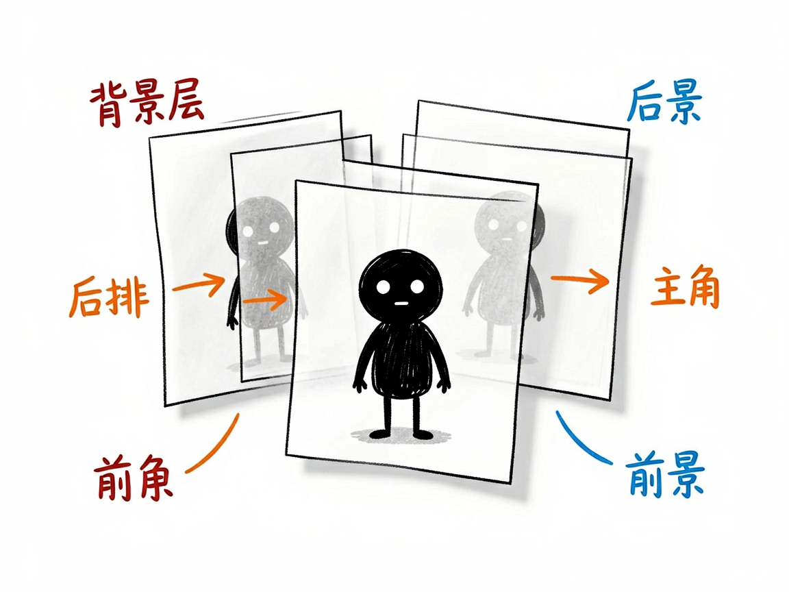
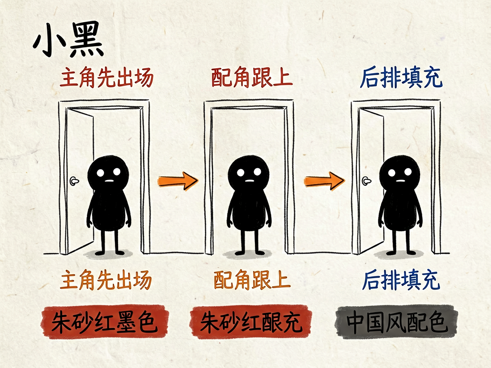

# 想做有层次感的剪纸动画，又不会画画？它帮你把故事拆成会动的四层 —— paper-cutout-remotion 介绍

你想做个讲历史、讲品牌故事的小动画，但平面的图太单薄，真去做 3D 又太难。有没有一种办法，让画面有前后纵深、像纸片一层层叠起来那种味道，还不用你亲手画？

**paper-cutout-remotion 就是来解决这件事的。**

你给它一份分镜脚本，它还你一段纸片分层风格的动画视频，背景、主角、配角、前景各动各的，靠前后遮挡做出立体感。

---

## 它到底能做什么
- 把每个镜头拆成四层：背景、后排、主角、前景，每层是独立的透明图（PNG，带透明背景），分别运动、互不干扰。
- 图片由 AI 生成（绘图接口），角色用绿幕方式生成方便抠成透明图，再分层摆放。
- 主角先出场、配角跟上、后排填充，错峰出现，画面有节奏不乱。
- 配上 AI 配音（MiniMax 高质量或免费的微软 edge 配音）和字幕，宣纸米白的底色调，朱砂红、墨黑这类中国风配色。
- 适合历史叙事、知识科普、商业故事、人物关系这类"能分出主次"的内容。

## 怎么用

你不需要记任何命令。在 codex / workbuddy 等 agent 装好 paper-cutout-remotion 技能后，直接对 AI 说话就行：

**场景 1：讲一段历史小故事**
你：我想做一个讲"唐代长安"的 1 分钟动画，要有宫殿、有街上的人，中国风一点。
AI：它会先把镜头拆成背景、后排、主角、前景四层，用 AI 画出宣纸米白底、朱砂红配色的图，再让各层错峰动起来，配上中文配音和字幕，给你一段有纵深的剪纸风视频。

**场景 2：做品牌故事短片**
你：我们公司想做个品牌起源的小动画，要有主角、有背景氛围。
AI：它会按"能分出主次"的思路分层安排画面，主角先出场、背景慢慢铺满，配上合适的配音，产出一段有质感的商业故事片。

**场景 3：做知识科普**
你：讲一下"活字印刷"是怎么一步步发展起来的。
AI：它会把过程拆成有主次的镜头，用前后遮挡做出层次，帮你把知识点讲得既清楚又有味道。

## 谁适合用
- 做历史、文化、品牌故事类视频的作者。
- 知识科普、商业案例讲解，需要画面有主次和纵深。
- 喜欢剪纸/拼贴质感，但不想自己一张张画图的人。

## 一点说明
它是跑在 AI 助手里的技能，不是开箱即用的 App。核心是"分层"思维：先把镜头定好、再让 AI 画图，否则人物比例和主次容易返工。它依赖 Remotion（一个用代码做视频的开源框架，但你不用写，AI 帮你写）来生成画面。具体能力以项目文档为准。

## 闲鱼接单文案

> 以下服务展示在闲鱼 / 淘宝服务市场发布，用于承接本 skill 的定制开发订单。

**标题：剪纸分层动画视频制作 skill软件开发**

**描述：**

专注 AI Agent 技能（skill）定制开发，已做出剪纸分层动画技能，现成作品可先看演示再下单。给它一份分镜脚本，产出"背景、后排、主角、前景"四层纸片叠出来的动画：AI 生成各层透明图、错峰出场、靠前后遮挡做出立体感，宣纸米白底配朱砂红、墨黑的中国风配色，自动配音和字幕。适合历史叙事、品牌故事、知识科普，可按你的题材定制，全部源码交付、支持二次开发。

**服务内容：**

- 1、需求沟通梳理：先聊清楚故事 / 分镜内容、想要的风格（中国风 / 品牌质感）和时长，确认分镜脚本草稿，列明功能清单后再动手
- 2、skill交付内容和格式：纸片分层风格动画成片：四层遮挡立体画面、错峰出场节奏、中国风配色、AI 配音与字幕（MP4 文件）
- 3、项目功能/系统开发：按你的题材定制分层模板、配色与配音方案，可扩展系列短片批量出片等功能的开发与联调
- 4、skill源码交付：SKILL.md 技能说明 + 提示词 / 脚本 / 模板 / 视频样例组成的完整技能工程，兼容 codex / workbuddy 等 agent。全部源码 + 安装部署说明 + 使用演示，交付后可自行修改维护
