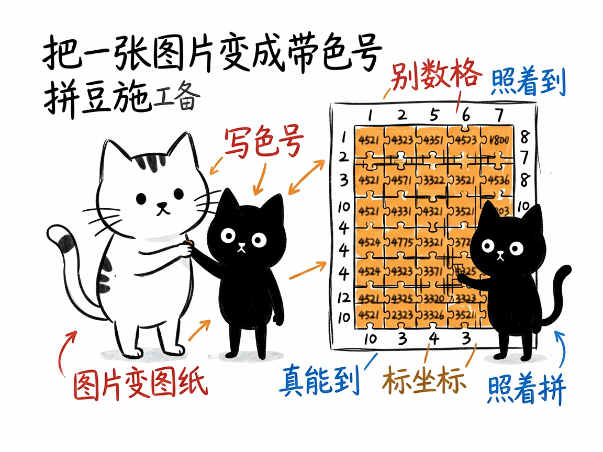
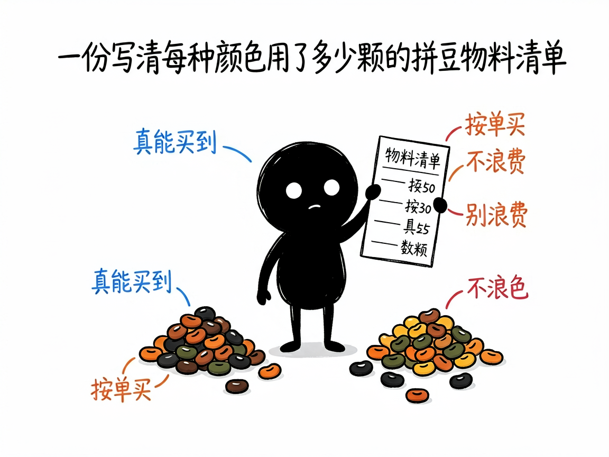

# 把任意图片变成"照着拼"的拼豆图纸 —— pindou-pattern 介绍

你有没有过这种经历：看到一张可爱的卡通头像，想用拼豆（Perler Bead）把它做出来，可一想到要一格一格去数颜色、算坐标，就头大？

**pindou-pattern 就是来解决这件事的。**

它把一个图片（或像素数据）自动变成一张可以直接照着拼的"拼豆施工图"——深色标题栏、四周标着行列坐标、每个小格子里写着对应的品牌色号、每 10 格加重一条线，最后还附上一份"每种颜色用了多少颗"的物料清单。

一句话总结：**你给它一张图，它还你一张能直接上手拼的图纸。**

---

## 它到底能做什么
- 图片变图纸：上传一张 PNG / JPG / WebP 等格式的图片，指定网格大小（比如 32×32），它就自动量化成拼豆格子，输出一张带色号、坐标、网格线的图。
- 五大品牌色号：内置 MARD、COCO、漫漫、盼盼、咪小窝共 205 种颜色，生成的色号都是你真能买到的豆子，不会出现"图上有、店里没有"的尴尬。
- 物料清单：除了图纸，还能导出"每种颜色用了多少颗、总共多少颗"，方便你按单买料，不浪费。
- AI 优化：如果你对图纸效果不满意（太乱、太杂、细节糊了），它会先用 AI 把原图改绘成干净的像素风，再重新生成图纸。
- 白底处理：卡通角色这类白底图，可以设置"近白色当作空格"，不把豆子浪费在背景上。

---

## 怎么用
你不需要记任何命令。在 codex / workbuddy 等 agent 装好 pindou-pattern 技能后，直接对 AI 说话就行：
**场景 1：把照片变成拼豆图纸**
你：帮我把这张卡通猫的照片变成拼豆图纸，用 32×32 的格子，MARD 品牌的色号。
AI：它生成一张带行列坐标、每格写着品牌色号的施工图，并告诉你画布多大、用了几种颜色、总共多少颗豆。
**场景 2：想要更精细、换品牌**
你：这张图我想要更大更精细，用 48×48，颜色换成盼盼品牌的。
AI：它按新尺寸和品牌重新量化，输出更细的图纸和对应的色号清单。
**场景 3：先 AI 优化再出图**
你：这张照片直接量化太乱了，你先把它改绘成干净的像素风，再给我出图纸。
AI：它先用 AI 把原图处理成清爽的像素画，再量化生成图纸，出来的效果会干净很多。

## 谁适合用
- 拼豆爱好者，想把自己喜欢的图变成可拼的图纸；
- 想做礼物、摆件、钥匙扣，但懒得手动数格子的手作党；
- 需要批量出图（比如一整套角色）的创作者。

---

## 一点说明
图纸是确定性生成的，规格（尺寸、颜色数、用豆量）都以技能生成时给出的数字为准，不需要靠"肉眼判断好不好看"——好不好拼，你自己看图纸就能判断。

另外，它只负责"出图"，不替你做视觉审美判断：图纸对不对、颜色分布合不合适，最终还是你的眼睛说了算。
