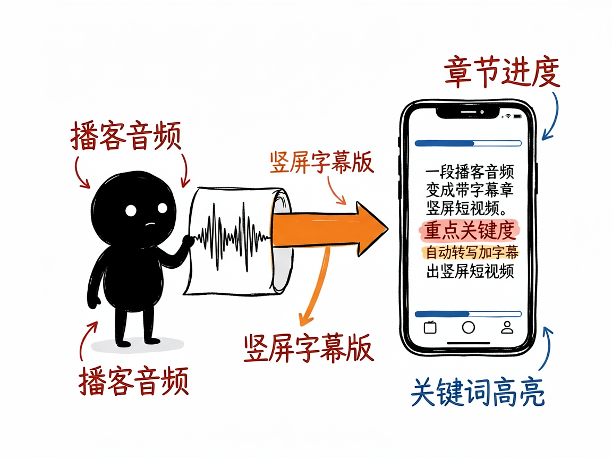
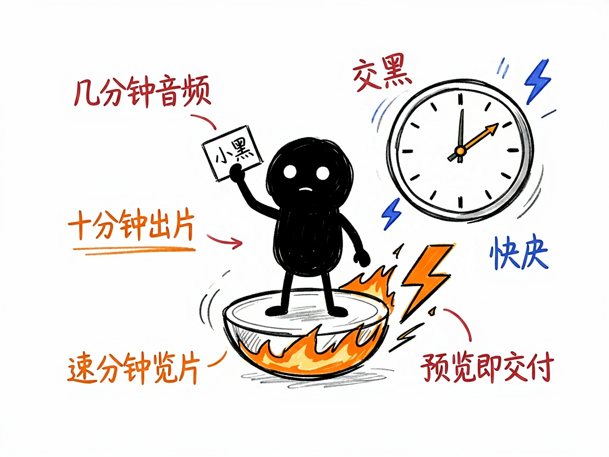

# 有一段播客音频，想快速变成竖屏短视频？它帮你秒出字幕版 —— podcast-shorts-remotion 介绍

你录了一期播客，或者攒了一段口播，觉得内容不错想发短视频平台，但一想到要加字幕、配章节、调颜色、渲染导出，就懒得动了。其实这活儿可以非常快。

**podcast-shorts-remotion 就是来解决这件事的。**

你给它一段音频（最好再给个逐字稿），它还你一条 1080×1920 的竖屏短视频，带字幕、章节标签、进度条和主题配色。

---



## 它到底能做什么
- 把音频当作时间轴唯一基准，自动转写（Whisper，一种语音识别）出字幕，并帮你校正识别错误。
- 按内容切成章节，顶部有进度条，底部有居中字幕，关键词高亮，像刷知识类短视频那样。
- 围绕主题自动配一套配色（红金、翠绿、靛蓝等几套现成方案挑），不用你自己调。
- 主打一个"快"：并行转写、一次写对、跳过冗余检查，直接出预览片，几分钟音频约十分钟量级渲染完。
- 预览片（540×960 半高清）就是默认交付物，确认满意再决定是否要 1080p 高清版。



## 一个具体例子

一条命令搭好工程骨架：

```bash
python3 ./skills/podcast-shorts-remotion/scripts/scaffold_podcast_shorts_project.py \
  --project-dir "./hf" --audio "音频.mp3" --script "播客脚本.md" --title "视频标题"
```

接着并行跑转写，填好字幕和章节，最后 `npm run render:preview` 出预览片。

## 谁适合用
- 播客主、口播博主，想把手头音频快速变成可发的短视频。
- 做知识分享、行业解读，需要稳定出字幕版竖屏视频的人。
- 追求效率、不想在渲染校验上耗时间的内容生产者。

## 一点说明 / 小提示
它是跑在 AI 助手里的技能，产出一套 Remotion 工程，不是独立 App。渲染靠本机 Chrome，长音频会比较吃时间（这是硬件地板，不是卡住）。具体能力以项目文档为准。
