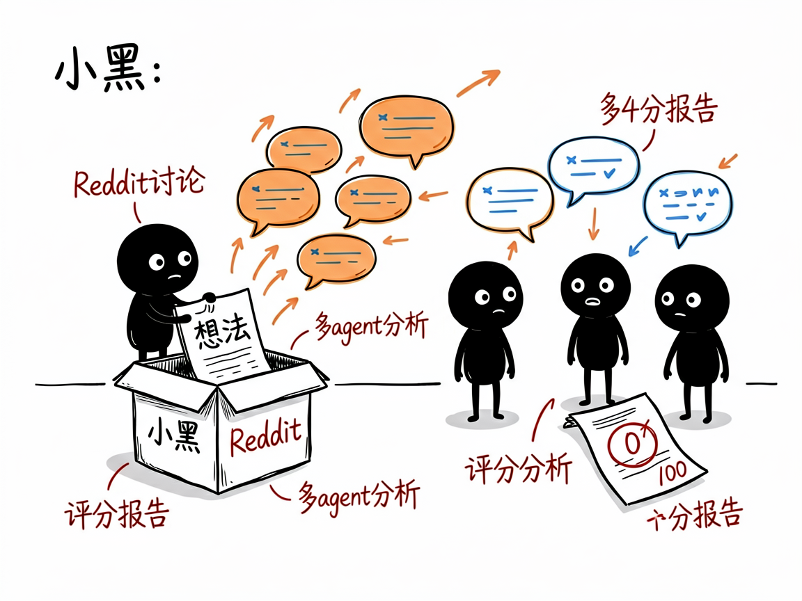
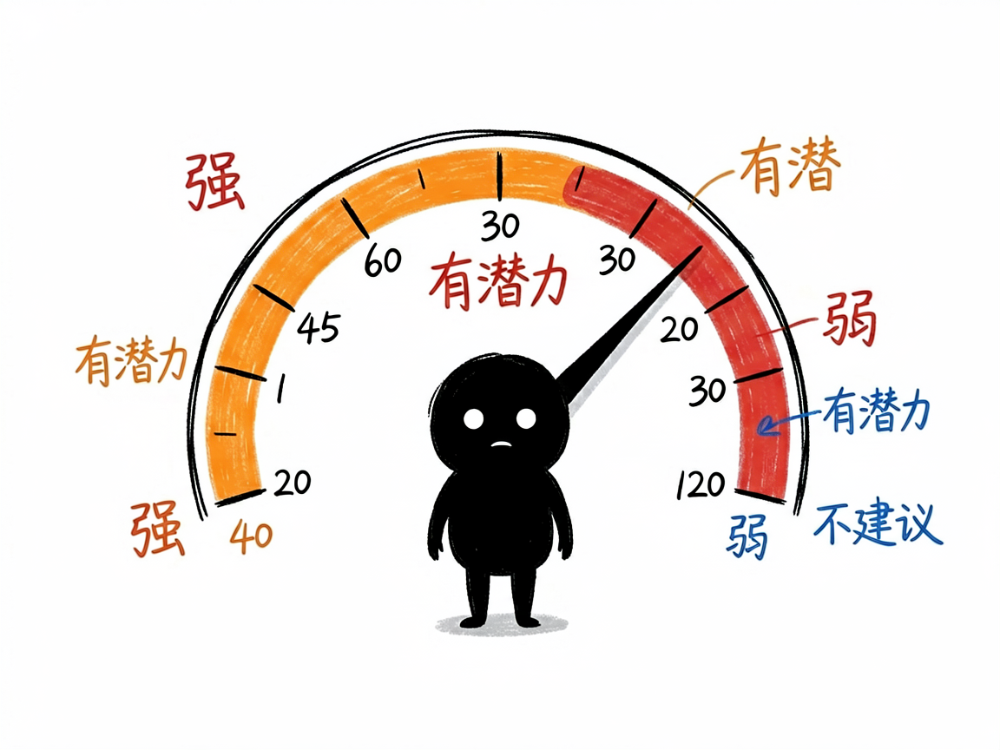

# 想做个生意但怕没人买单？让 Reddit 上的真人帮你投票 —— reddit-business-idea-validator 介绍

你想做个产品，比如"给独居老人做智能药盒"，但心里没底：美国人真有这需求吗？大家都在抱怨啥？现在有没有人已经在做了？你当然可以去 Reddit 翻，但几百万帖子里找信号，等于大海捞针，还容易只看得到自己想看的。

**reddit-business-idea-validator 就是来解决这件事的。** 你给它一个想法，它自动去 Reddit 抓相关帖子和评论，让多个 AI 一起分析，最后还你一份带 0–100 评分的报告，直说这个方向值不值得做。

## 它到底能做什么

- 验证想法：把你的创意当关键词，去 Reddit 找真人讨论，看有没有人关心。
- 挖痛点：从帖子和评论里提炼用户真正在抱怨什么、需要什么。
- 看竞品：现在大家都在用什么替代方案，市场饱不饱和。
- 找机会：哪些需求没被满足，你可以做差异化。
- 打分定性：给出 0–100 综合分（≥75 强、50–74 有潜力、30–49 弱、<30 不建议），一眼看懂。
- 出报告：报告含数据统计、核心痛点、现有方案、市场机会、行动建议、四象限评论标签分析和用户画像。

## 怎么用

你不需要记任何命令。在 codex / workbuddy 等 agent 装好 reddit-business-idea-validator 技能后，直接对 AI 说话就行：

**场景 1：验证一个海外点子**
你：我想做个给独居老人用的智能药盒，帮我在 Reddit 上看看美国人有没有这需求。
AI：它去 Reddit 抓相关帖子和评论，让多个 AI 分头分析痛点和竞品，最后给你一份带 0–100 评分的报告，直说这个方向值不值得做，还附上核心痛点和行动建议。

**场景 2：重要决定前深查**
你：这个SaaS点子我要认真评估，帮我深度查一下。
AI：它用更深的档位（耗时会更长）多抓多分析，把市场饱和度、现有替代方案、没被满足的需求都摸透，再给一个更稳妥的分数和判断。

**场景 3：先看个热闹试水**
你：我有个小想法，先随便看看有没有人讨论。
AI：它用轻量档位快速扫一遍，几分钟就告诉你"有没有人在聊、大概什么态度"，帮你低成本试水温。

## 谁适合用

- 想做海外/英文市场生意的人：Reddit 用户以欧美为主，最适合验证英文市场需求。
- 独立开发者和内容创业者：低成本验证"这个点子有没有人买单"。
- 做跨境电商、SaaS 的人：先看海外真实声音再决定投不投入。

## 一点说明

这是给 AI 助手用的技能，装好、接好 Reddit 的数据接口和兼容 OpenAI 的 AI 模型密钥后就能用（配置一次即可，你不用自己写代码）。另外，Reddit 在中国大陆访问受限，需要能正常访问 Reddit 的网络环境才能抓数据。它只覆盖 Reddit 这一个数据源、主要面向英文市场，不擅长小红书/抖音类国内数据，也不做纯关键词 SEO 那种事。分数是 AI 基于真实讨论打的，低分也是有用的负面信号，别只盯着高分看。

## 闲鱼接单文案

> 以下服务展示在闲鱼 / 淘宝服务市场发布，用于承接本 skill 的定制开发订单。

**标题：海外生意点子验证（Reddit 需求调研）skill软件开发**

**描述：**

专注 AI Agent 技能（skill）定制开发，已做出 Reddit 真人需求验证技能，现成作品可先看演示再下单。把你的生意点子自动拿到 Reddit 上抓相关帖子和评论，多个 AI 分头分析痛点、竞品和市场机会，最后给出 0–100 评分（≥75 强、50–74 有潜力、<30 不建议）和直说值不值得做的验证报告。轻量 / 深度档位可选，支持按你的行业做个性化定制，全部源码交付、支持二次开发。

**服务内容：**

- 1、需求沟通梳理：先聊清楚你的生意点子和验证深度（轻量试水 / 认真评估），确认 Reddit 数据接口、AI 模型密钥和可访问 Reddit 的网络环境，列明功能清单后再动手
- 2、skill交付内容和格式：0–100 评分与结论、核心痛点、现有替代方案、市场机会、行动建议、四象限评论标签分析、用户画像（数据统计 + 验证报告）
- 3、项目功能/系统开发：按你的行业定制分析维度、评分权重与报告模板，可扩展多平台数据源接入等功能的开发与联调
- 4、skill源码交付：SKILL.md 技能说明 + 提示词 / 脚本 / 模板 / 报告样例组成的完整技能工程，兼容 codex / workbuddy 等 agent。全部源码 + 安装部署说明 + 使用演示，交付后可自行修改维护
