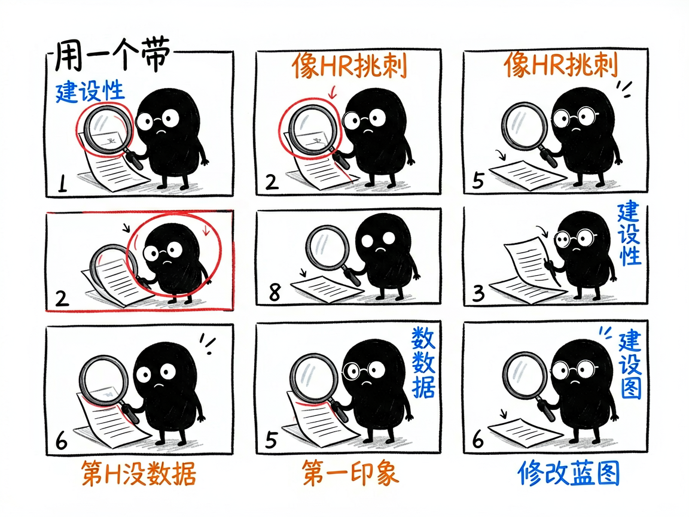
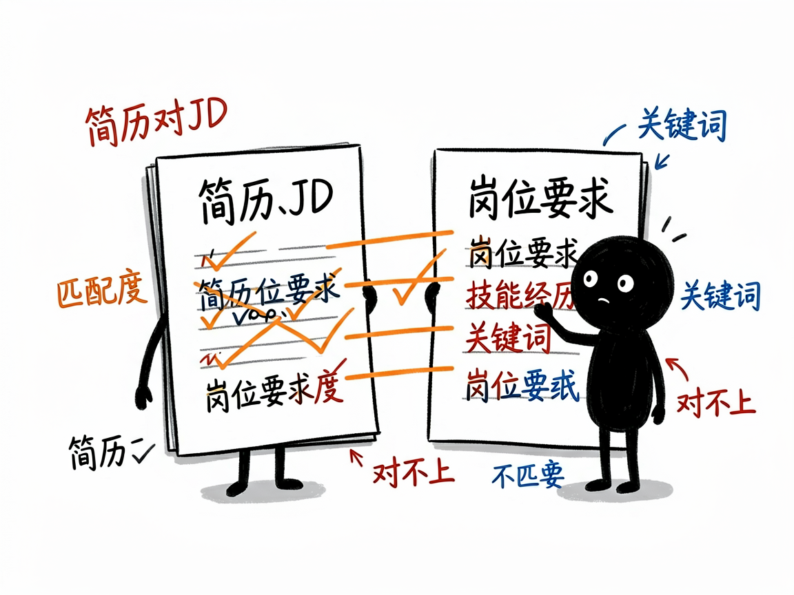

# 不知道简历行不行、跟岗位匹不匹配？它像一个严格的 HR 帮你挑刺重写 —— resume-matcher 介绍

你投了 N 份简历石沉大海，心里犯嘀咕：是我的简历写得不好，还是本来就不对口？自己看自己的简历，怎么看都还行；可你缺一个"招聘方视角"——到底哪里啰嗦、哪里没数据、哪里跟岗位要求对不上。

**resume-matcher 就是来解决这件事的。**

它用资深 HR（HRBP）+ 技术主管的视角，给你的简历做一次深度"挑刺"审计，并把它和目标岗位的招聘要求（JD）逐条比对匹配度，最后还帮你把简历改好、导出成能直接看的版本。你给它简历加岗位要求，它还你一份"问题清单 + 修改蓝图 + 优化后简历"。

---

## 它到底能做什么
- 解析简历 / 岗位要求：直接把 PDF 或 Word 文件发给它，也能粘贴纯文本，它会自动提取内容（注意加密的或图片扫描件读不了）。
- 结构化对比：把简历和岗位要求各自拆成"技能、经历、关键词"，让你一眼看清匹配和不匹配的地方。
- HRBP 五步审计：从"第一印象"到"地毯式挑刺"再到"修改蓝图"，像面试你的 HR 一样具体、有建设性地指出问题。
- 重写简历：不是只给建议，而是直接产出一版优化后的简历全文，量化指标处用占位符提醒你补数字。
- 可视化导出：内置一个中文简历编辑器，把优化后的简历导进去就能排版、调样式、导出 PDF。

## 怎么用
你不需要记任何命令。在 codex / workbuddy 等 agent 装好 resume-matcher 技能后，直接对 AI 说话就行：
**场景 1：让严格 HR 给简历挑刺**
你：帮我看看这份简历，对照我发的这个岗位要求，逐条说我哪里不行、怎么改。
AI：它先用招聘方视角审计你的简历，再和岗位要求逐条比对，给出一份"问题清单 + 修改蓝图"，并直接产出一版优化后的简历全文。
**场景 2：只想知道匹不匹配**
你：我这份经历跟这个岗位对不对口？先别重写，先告诉我匹配度。
AI：它把你的技能和经历拆开，和岗位要求的关键词对照，清楚标出哪些匹配、哪些缺，让你心里有数。
**场景 3：导出能打印的 PDF**
你：改好的简历帮我导进简历编辑器，排版漂亮点，我要导出 PDF 投出去。
AI：它把优化后的简历送进中文简历编辑器，帮你调样式、排版，并导出成可直接打印的 PDF。

## 谁适合用
- 正在找工作、想提升简历通过率的求职者。
- 不确定自己的经历跟某岗位"对不对口"、想先看匹配度的人。
- 帮别人改简历、或做 AI 工具想内置简历分析能力的人。

## 一点说明
它是一套 AI 技能，最舒服的用法是在带它的 AI 助手对话框里发"帮我看看这份简历 + 这个岗位要求"，它来帮你做解析、审计、给改稿。它靠 AI 推理做审计，不依赖外部大模型接口；图片扫描件、加密 PDF 提取不了文字，需要你给文本版。它给的是修改方向和一版草稿，最终投递前关键信息（数字、事实）还得你自己核实补齐。具体能力以项目文档为准。
