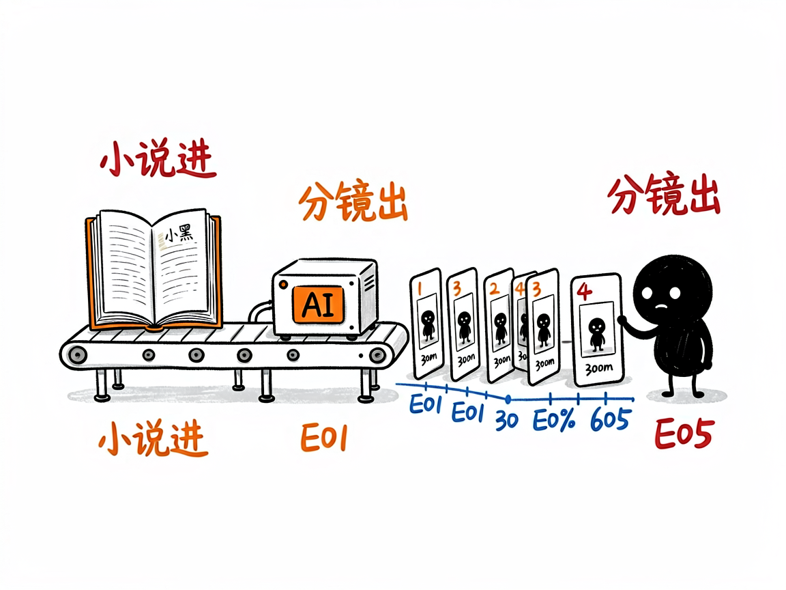

# 想把小说做成多集 AI 短剧？—— seedance2-storyboard 介绍

看到别人用 AI 把《林教头风雪山神庙》做成十集水墨短剧，自己也想试试，结果卡在第一步：剧本怎么拆集？角色提示词怎么写才能每集长得一样？分镜提示词是什么格式？seedance2-storyboard 把这整套流程做成了技能：小说、文章、故事大纲丢进去，产出从剧本到分镜的全套制作文件。

## 它到底能做什么

- **完整四幕剧本**：起承转合结构，标准脚本格式——镜头描述、对白、OS/VO 旁白、闪回、字幕齐全。
- **多集分解**：自动把故事拆成多集系列，每集时长可控。
- **素材资产规划**：编号的角色（C）、场景（S）、道具（P）生成提示词，适配 GPT-Image-2、Seedream、Nano Banana Pro 等生图模型——编号管理保证每集角色长相一致。
- **Seedance 2.0 分镜脚本**：时间轴格式提示词，直接贴进 Seedance 出视频，配合视频延长功能实现集间无缝衔接。
- **文-资-视-剪工作流**：剧本创作 → 资产构建 → 视频生成 → 后期剪辑，外加声音设计指导。

## 怎么用

**场景 1：名著改编**
你：把《武松打虎》做成 5 集短视频系列。
AI：四幕剧本 → 拆 5 集 → 输出武松/老虎/景阳冈的编号素材提示词 → 每集 Seedance 分镜脚本。

**场景 2：自有故事**
你：这是我写的短篇《项链》改编剧本大纲，帮我规划成视频系列。
AI：补全剧本 → 规划资产 → 生成分镜，附声音设计建议。

## 谁适合用

- 想做 AI 短剧、故事类短视频的创作者。
- 有小说/网文 IP 想视频化的作者。
- 研究 AI 视频工作流的玩家。

## 一点说明

本技能专注于"文→资→视→剪"中文-资-视三环的脚本生产；实际生图与视频生成在各平台完成。仓库自带林冲、武松、草船借箭、司马光、崖山海战、项链等完整示例项目可对照学习。与 smy-seedance-storyboard（上美影水墨风格专用版）同源，本版为通用 Seedance 2.0 工作流。

## 闲鱼接单文案

> 以下服务展示在闲鱼 / 淘宝服务市场发布，用于承接本 skill 的定制开发订单。

**标题：小说转多集 AI 短剧（剧本+分镜）skill 软件开发**

**描述：**

专注 AI Agent 技能（skill）定制开发，已做出 Seedance 2.0 分镜脚本生成技能，现成作品可先看演示再下单。小说、文章、故事大纲丢进去，产出四幕完整剧本、多集分解、编号的角色场景道具生图提示词、Seedance 2.0 时间轴分镜脚本，文-资-视-剪全流程指导，自带林冲、武松、崖山海战等多个完整示例。支持按你的故事题材和画风定制模板，交付后装进 codex / workbuddy 等 AI 助手即可使用，全部源码交付、支持二次开发。

**服务内容：**

- 1、需求沟通梳理：先聊清楚你的源材料（小说、剧本大纲还是完整剧本）、目标集数时长和画风（水墨、写实、动漫），列明功能清单后再动手
- 2、skill交付内容和格式：完整剧本 + 素材清单提示词 + 每集分镜脚本的成套制作文件（含示例项目可对照）
- 3、项目功能/系统开发：按你的题材定制剧本结构、资产编号规则与分镜节奏，可扩展特定画风模板、声音设计规范等功能的开发与联调
- 4、skill源码交付：SKILL.md 技能说明 + 工作流文档 / 提示词手册 / 完整示例项目组成的技能工程，兼容 codex / workbuddy 等 agent。全部源码 + 安装部署说明 + 使用演示，交付后可自行修改维护
