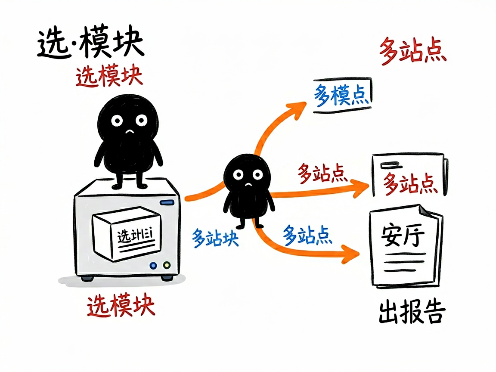

# 想挖亚马逊选品数据、查竞品，又嫌手动点太累？它一条命令全搞定 —— sellersprite-rpa 介绍

你在用卖家精灵（sellersprite.com）做亚马逊选品和分析，网站功能很全，但跨站点、跨模块手动点一遍要花半个多小时，还容易看花眼。sellersprite-rpa 把卖家精灵 5 个核心数据分析模块打包成一个命令入口：选产品、关键词选品、选市场、ABA 搜索频率、查竞品，一条命令抓数据，再一条命令出多站点对比报告，半个钟的活儿变成几十秒。

**sellersprite-rpa 就是来解决这件事的。**

你给它一个模块名加站点（比如"美国站、查竞品 yoga mat"），它还你一份 CSV 数据表，以及一份中文多站点对比报告。

---


## 它到底能做什么

- 选产品（products）：抓各站点、各类目下的热销 ASIN（商品编号），帮你找潜力款。
- 关键词选品（keywords）：抓各站点的关键词搜索量、点击量、PPC（广告出价）数据。
- 选市场（markets）：看细分市场的规模和集中度，判断类目值不值得进。
- ABA 数据选品（aba）：调出亚马逊 Brand Analytics 的关键词搜索频率排行（这是亚马逊官方品牌分析数据）。
- 查竞品（competitors）：按关键词、品牌、卖家或 ASIN 反查竞品是谁。
- 多站点对比：一次跑美国、日本、英国等多个站点，自动按站点拆成不同表格并合并。
- 自动出报告：把抓到的 CSV 喂回去，生成中文 Markdown 分析报告。

## 一个具体例子

在技能目录的 scripts 下运行，命令统一用 `--section` 选模块：

```bash
# 抓美国站热销产品 Top100（5 页）
python sellersprite_rpa.py fetch --section products --station US --pages 5 --out data/us_top100.csv

# 查竞品：按关键词反查（美国站）
python sellersprite_rpa.py fetch --section competitors --station US --keyword "yoga mat" --out data/comp.csv

# 把 CSV 变成报告
python sellersprite_rpa.py analyze --section aba --input data/aba.csv --out-md reports/aba.md
```

`--station` 后面可以跟多个站点，用英文逗号隔开（如 `US,JP,GB`）。



## 谁适合用

- 用卖家精灵做亚马逊选品、竞品调研的卖家和运营。
- 需要跨多站点批量拉数据、做对比分析的研究人员。
- 想把手工点击变成可复用脚本、定期跑数据的团队。

## 一点说明

它不是双击即用的 App，而是给 AI 助手用的"技能包"加 Python 脚本，靠 BrowserSkill 驱动你已登录卖家精灵的真实浏览器去抓数据（无需配密钥、无需 Selenium）。所以你得先装好 BrowserSkill、登录卖家精灵，并确认 `bsk status` 已连接。免费会员会有部分数据被遮蔽（比如某些排名只显示前 50），这是卖家精灵本身的限制，不是脚本问题。具体支持的站点和字段以项目 SKILL.md / references 为准。
